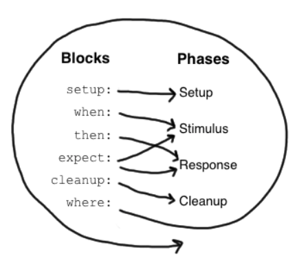

 # Spock 文档

 ## 说明

 本文档为 Spock 官方文档的大致翻译，很多地方没有直接对应，官方文档参考：
 http://spockframework.org/spock/docs/1.1-rc-1/all_in_one.html

 ## Groovy 语言基础

 Spock 是基于 Groovy 的测试框架。Groovy 是运行在 JVM 上的脚本语言，语法和 Java 兼容，可以理解为脚本化的 Java。Groovy 教程参考：
 https://www.w3cschool.cn/groovy

 ### Groovy 和 Java 的一些区别
 
 1. public 修饰符在 Groovy 中不是必须的。

 2. Groovy 支持范围类型，比如 `1..3` 相当于 Java 中的数组 `{ 1, 2, 3 }`；`1.2..3` 相当于 Java 中的数组 `{ 1.2, 2.2 }`；`1..<3` 相当于数组 `{ 1, 2 }`；`'a'..'z'` 相当于所有小写字母的字符集合。范围类型是可迭代的。

 3. Groovy 中的数组（列表）表示为 `[ v1, v2 ]`，用中括号括起。

 4. Groovy 中的字典可表示为 `[ k1: v1, k2: v2 ]`，键和值的类型都可以随意，可以迭代键值对。空字典 `[: ]`。

 5. Groovy 支持类型自动推断，使用关键字 `def`，比如 `def var = value;`。

 6. Groovy 的方法的返回值可以指定为某一类型，也可以指定为 `def`。

 7. Groovy 的方法支持默认参数。

 8. 一个 Groovy 脚本就是一个类，定义在脚本中的类可以理解为内部类，直接定义在脚本中的方法（或者说是函数）可以当成脚本类的成员方法。

 9. 字符串中 `$xxx` 可以直接引用变量。

 10. 字符串中 `${xxx.xxx()}` 可以直接引用方法的返回值。

 11. Groovy 支持范围下标，负数下标。

 12. Groovy 可以使用 Java I/O 的所有类，除此之外还有 I/O 操作的快捷方式：

  * 对文件进行逐行处理：

    ```
    // java.io.File
    new File(filepath).eachLine {
        line -> processLine(line)
    };
    ```

  * 获取文件的整个文本：

    ```    
    // java.io.File
    new File(filepath).text
    ```

  * 写入文件：

    ```
    new File(filepath).withWriter("UTF-8") {
        writer -> writer.write(str)
    };
    ```

  * 获取文件大小（单位：字节）：
    
    ```
    new File(filepath).length()
    ```

  * 判断路径是文件还是目录：
    
    ```
    file.isDirectory()
    file.isFile()
    ```

  * 文件内容复制：
    
    ```
    fileCopy << file.text // 不能 file.text >> fileCopy
    ```

13. `def regex = ～"reg"` 创建正则表达式对象。`strValue ==~ "regPattern"` 判断字符串整体是否匹配右侧的正则表达式，返回布尔值。`strValue =~ "regPattern"` 创建 Matcher 对象。

14. Groovy 中的除法默认是小数除法，不是整数除法。

15. Groovy 中的闭包可以表示为

    ```
    {
      函数体
    }
    ```

    或

    ```
    {
      (param1, param2, ... ) -> 函数体
    }
    ```

    闭包是一种对象，通过 `closure.call(..)` 调用闭包，闭包中可以调用闭包外的变量。所有闭包都有一个名为 it 的隐式参数。

16. Groovy 中支持类似于 python 中的字典传参，比如 `func(k1: v1, k2: v2, ...)`，传入的参数就是一个字典 `[k1: v1, k2: v2, ...]`。

17. Groovy 中形参可以不用指定类型。

18. Java 中通过 `.class` 获取类对象，在 Groovy 中可以省略。

19. Groovy 支持 `?.` 语法，比如 `foo?.bar()`，当 `foo` 为 `null` 时，整个表达式返回 `null`，否则就调用 `bar()`。

20. Groovy 中 `return` 可以省略。

## Spock

### maven

```
<dependency>
    <groupId>org.spockframework</groupId>
    <artifactId>spock-core</artifactId>
    <version>1.1-groovy-2.4</version>
    <scope>test</scope>
</dependency>
```

### 导入

导入 Spock 框架基础包 `import spock.lang.*`。

### 声明测试类

```
class MyFirstSpec extends Specification {
  // 字段
  // 固定方法
  // 测试方法
  // 辅助方法
}
```

测试类是一个 Groovy 类，必须继承 spock.lang.Specification，规范的测试类名称一般是XxxSpec。

### 字段

```
def obj = new ClassUnderSpecification()
def coll = new Collaborator()
```

非静态字段可以在固定方法中使用，推荐在声明时同时初始化（**在 setup() 方法中初始化也是一样的**）。但是不能在测试方法之间共享，每个测试方法都有一个隔离的副本，每个测试方法开始前都会初始化一遍。

```
@Shared res = new VeryExpensiveResource()
```

但是有时候又需要在测试方法之间共享字段，比如这个字段的初始化的开销很大，或者需要在测试方法间通信。通过将字段标记为 `@Shared`，可以使字段成为共享字段。还是推荐在声明时初始化（**在 setupSpec() 方法中初始化也是一样的**）。

```
static final PI = 3.141592654
```

静态字段**只应该**用作常量。共享字段完全可以取代静态变量的作用，且共享字段在语义上更明确。

### 固定方法

```
def setup() {}          // 每个测试方法开始前都会执行一遍
def cleanup() {}        // 每个测试方法后都会执行一遍
def setupSpec() {}     // 在第一个测试方法开始前执行一遍
def cleanupSpec() {}   // 最后一个测试方法后执行
```

固定方法负责测试方法和测试类的环境初始化和资源清理工作。固定方法可以有也可以没有，但是建议要有 `setup()` 和 `cleanup()`。注意 `setupSpec()` 和 `cleanupSpec()` 中不可以引用非共享字段。

这四个固定方法其实是重写自 spock.lang.Specification，`setup()` 和 `setupSpec()` 的执行顺序是先父类后子类，`cleanup()` 和 `cleanupSpec()` 的执行顺序是先子类后父类。不需要显式调用父类的对应方法。

### 测试方法

```
def "pushing an element on the stack"() {
  // 测试方法
}
```

测试方法是测试类的核心。测试方法名是一个字符串常量，也是对测试方法的描述。一个测试方法应该由4部分组成：

1. Setup：环境初始化（可选）
2. Stimulus：调用待测试代码
3. Response：描述预期行为
4. Cleanup：清理资源（可选）

Spock 对这四个概念上的阶段提供了内建的支持，也就是“块”（block）。一个块从一个标签开始直至另一个标签或方法结尾。有6个块：`setup`，`when`，`then`，`expect`，`cleanup`，`where`。从方法的开头到第一个标签之间的所有语句都属于隐式的 `setup` 块。

一个测试方法至少要有一个显式声明的块，**一个测试方法之所以是一个测试方法就是因为它有显式块**。块把测试方法划分成不同的区域，且块不可以嵌套。

下图展示了具体的块和测试方法的4个概念阶段的对应关系：



其中，`where` 块比较特殊，后面会再提，先看其他5个块。

#### setup 块

```
setup:
def stack = new Stack()
def elem = "push me"
```

在 `setup` 块中应对当前测试方法的环境进行初始化。该块是一定是第一个执行的，且不会由于其他测试方法的存在而反复执行（和 `setup()` 的区别）。`setup:` 标签可以省略。`given:` 标签是 `setup:` 标签的别名。

#### when 和 then 块

```
when:   // 调用待测代码
then:   // 描述期望的行为
```

`when` 和 `then` 块是绑定在一块使用的，这两个块组合在一块使用可以调用待测代码并指定期望的行为。`when` 块可以是任意代码，但是 `then` 中的语句仅限于布尔表达式（省略了 `assert`），异常情况判断语句（`thrown()` 和 `notThrown()`）和变量定义语句。一个测试方法中可以有多个 `when-then` 块。注意 `then` 块不宜过于庞大，尽量在5个语句之内。

##### 关于 `thrown()` 和 `notThrown()`

这两个方法用于描述 `when` 块中是否应该抛出异常，参数传入异常类型。比如从一个空栈中弹栈应该抛出 `EmptyStackException`，为了描述这一行为，应该这样写：

```
when:
stack.pop()

then:
thrown(EmptyStackException)
stack.empty
```

`thrown()` 后可以跟其他条件和其他块。特别地，`thrown()` 返回抛出的异常：

```
when:
stack.pop()

then:
def e = thrown(EmptyStackException)
e.cause == null
```

或者另一种写法：

```
when:
stack.pop()

then:
EmptyStackException e = thrown()
e.cause == null
```

推荐第二种写法，因为可读性更强，且变量 `e` 的类型明确指定，方便 IDE 提供代码补全。

有时候我们期望的行为是没有任何异常出现，比如 `HashMap` 可以接受一个 `null` 键：

```
def "HashMap accepts null key"() {
  setup:
  def map = new HashMap()
  map.put(null, "elem")
}
```

这样写是可以的但是不好，因为没有明确地指出期望的行为，即没有异常出现。这样写更好：

```
def "HashMap accepts null key"() {
  setup:
  def map = new HashMap()

  when:
  map.put(null, "elem")

  then:
  notThrown(NullPointerException)
}
```

通过 `notThrown()` 可以更明确地指出 `when` 块不期望抛出 `NullPointerException` 异常。如果抛出了其他类型的异常，测试依然会不通过。

#### expect 块

`expect` 块可以看成是 `then` 块的一种简化版，只能包含布尔表达式和变量定义。当调用待测代码和描述期望行为都很简单，在一个表达式中就能搞定时，用 `expect` 块更简单。举个栗子，测试  `Math.max()` 方法：

```
when:
def x = Math.max(1, 2)

then:
x == 2
```

```
expect:
Math.max(1, 2) == 2
```

两种方式都是一样的，但是明显第二种更简洁。

#### cleanup 块

```
setup:
def file = new File("/some/path")
file.createNewFile()

// ...

cleanup:
file.delete()
```

`cleanup` 块后面只能跟 `where` 块，或放在测试方法最后，且不会因为其他测试方法的存在而被反复调用（和 `cleanup()` 的区别），用于清理当前测试方法使用的资源。即使测试没有通过，该块也会执行（类似 Java 中的 `finally`）。`cleanup` 块用到较少，一般是在关闭流，关闭数据库连接或关闭网络服务的时候才会用到。

如果所有测试方法清理资源的逻辑都是一样的，就用 `cleanup()`，否则就用 `cleanup` 块。`setup()` 和 `setup` 块也是同理。

#### where 块

`where` 块一定是放在方法的最后，如果有的话，用于写数据驱动的测试方法。举个栗子：

```
def "computing the maximum of two numbers"() {
  expect:
  Math.max(a, b) == c

  where:
  a << [5, 3]
  b << [1, 9]
  c << [5, 9]
}
```

`where` 块为当前的测试方法创建了两个测试用例，很简洁，一个 a 是 5，b 是 1，c 是 5；另一个 a 是 3，b 是 9，c 是 9。

虽然 `where` 块放在最后，但却是第一个执行的。`where` 块在数据驱动测试一章会有更详细的说明。

### 辅助方法

一些情况下，测试方法很庞大或包含大量冗余代码，需要辅助方法抽离代码，比如：

```
def "offered PC matches preferred configuration"() {
  when:
  def pc = shop.buyPc()

  then:
  pc.vendor == "Sunny"
  pc.clockRate >= 2333
  pc.ram >= 4096
  pc.os == "Linux"
}
```

将大量条件抽离：

```
def "offered PC matches preferred configuration"() {
  when:
  def pc = shop.buyPc()

  then:
  matchesPreferredConfiguration(pc)
}

def matchesPreferredConfiguration(pc) {
  pc.vendor == "Sunny"
  && pc.clockRate >= 2333
  && pc.ram >= 4096
  && pc.os == "Linux"
}
```

辅助方法 `matchesPreferredConfiguration()` 中只有一个布尔表达式，且将该表达式的值返回（省略了 `return`）。这种写法有个严重的问题，如果有一个条件不满足，没法知道具体是哪一个。改进：

```
void matchesPreferredConfiguration(pc) {
  assert pc.vendor == "Sunny"
  assert pc.clockRate >= 2333
  assert pc.ram >= 4096
  assert pc.os == "Linux"
}
```

注意两点：

1. `assert` 不能省略。
2. 返回类型必须是 `void`。

一些建议：代码重用是好事，但不要过度。使用固定方法和辅助方法会增加测试方法之间的耦合度。如果代码重用过多，你会发现测试方法难以维护。

### `with()` 方法

作为辅助方法的替代方案，可以调用 `with(target, closure)` 来验证对象，仅在 `expect` 或 `then` 块中才能调用：

```
def "offered PC matches preferred configuration"() {
  when:
  def pc = shop.buyPc()

  then:
  with(pc) {
    vendor == "Sunny"
    clockRate >= 2333
    ram >= 406
    os == "Linux"
  }
}
```

不需要像辅助方法中那样写很多 `assert` 了。

### 文档化

一份编写规范的测试代码应该具有很强的可读性，尤其是当这些测试代码需要被开发者之外的很多人阅读的时候，比如产品经理，架构师，客户等。Spock 不仅可以通过方法名描述测试方法，还能描述测试方法中的各个块：

```
setup: "open a database connection"
// code goes here
```

使用 `and:` 标签分割一个块，并对各个部分分别描述：

```
setup: "open a database connection"
// code goes here

and: "seed the customer table"
// code goes here

and: "seed the product table"
// code goes here
```

`and:` 标签可以插入到测试方法的任意位置，不影响语义。可以理解为它的作用就是描述一段代码，类似注释。

块描述不仅在源码中呈现，在运行时也能呈现（和注释的区别），可作为调试信息。

### 扩展

Spock 还提供了一套扩展的注解:

* `@Timeout`：标记测试方法，设置其执行的超时时间，超时就测试不通过。
* `@Ignore`：忽略标记的测试方法。
* `@IgnoreRest`：忽略其他没有该注解的测试方法。需要快速运行其中一个测试方法而不需要运行整个测试类时，这注解就很有用。
* `@FailsWith`：