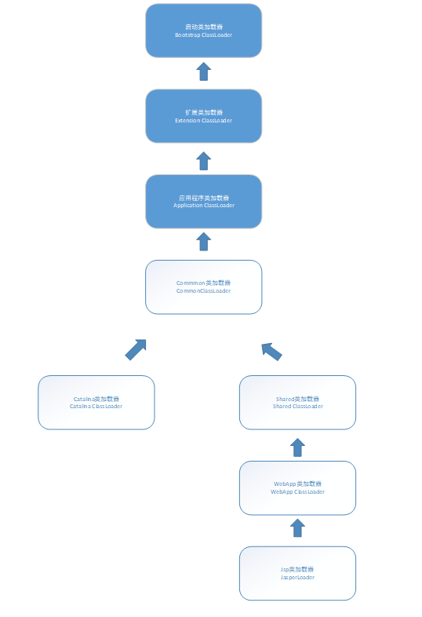
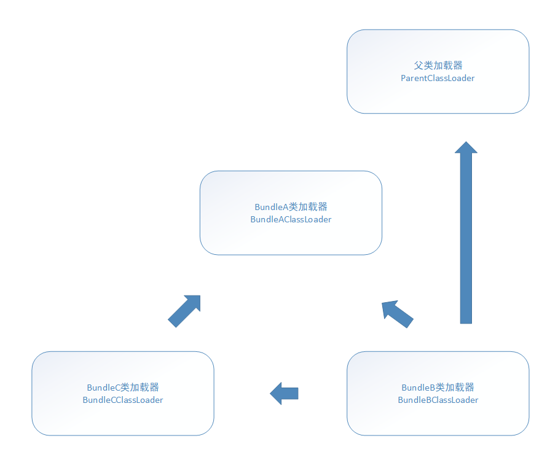

## 第9章 类加载及执行子系统的案例与实战

本章我们讨论几个类加载机制的应用实例。

### 9.2 案例分析

#### 9.2.1 Tomcat 正统的类加载器架构

主流的Java Web服务器都实现了自己定义的类加载器（一般都不止一个），都需要解决如下问题：

1. 部署在同一服务器上的两个Web应用程序所使用的Java类库可以实现相互隔离。这是最基本的需求，两个不同的应用程序可能会依赖同一个第三方类库的不同版本，不能要求一个类库在一个服务器中只有一份，服务器应当保证两个应用程序的类库可以相互独立。
2. 部署在同一服务器上的两个Web应用程序所使用的Java类库可以互相共享。如果类库不能共享，虚拟机的方法区就会很容易出现过度膨胀的风险。
3. 服务器需要尽可能地保证自身的安全不受部署的Web应用程序影响。目前有许多主流的Java Web服务器自身也是使用Java语言来实现的。因此，服务器本身也有类库依赖的问题，基于安全考虑，服务器所使用的类库应该与应用程序类库相独立。
4. 支持JSP应用的Web服务器，大多都需要支持HotSwap功能。

由于存在上述问题，在部署Web应用时，单独的一个ClassPath就无法满足需求了，所以各种Web服务器都“不约而同”地提供了好几个ClassPath路径共应用存放第三方类库。被放置到不同路径的类库，具备不同的访问范围和服务对象，通常，每一个目录都会有一个相应的自定义类加载器取加载放置在里面的Java类库。

下面以Tomcat为例：

Tomcat的目录结构中，有3组目录（“/common/*”，“/server/*”，“/shared/*”）可以存放Java类库，另外还可以加上Web应用程序自身的目录“/WEB-INF/*”，一共四组，把Java类库放置在这些目录中的含义分别如下：

- 放置在/common目录中：类库可被Tomcat和所有的Web应用程序共同使用。
- 放置在/server目录中：类库可被Tomcat使用，对所有的Web应用程序都不可见。
- 放置在/shared目录中：类库可被所有的Web应用程序共同使用，但对Tomcat自己不可见。
- 放置在/WebApp/WEB-INF目录中：类库仅仅可以被此Web应用程序所使用，对Tomcat和其他Web应用程序都不可见。

为实现上述结构，Tomcat自定义了多个类加载器，双亲委派模型如下：

CommonClassLoader、CatalinaClassLoader、SharedClassLoader和WebAppClassLoader时Tomcat自定义的类加载器，它们分别加载/common/*，/server/*，/shared/*和/WebApp/WEB-INF/*中的Java类库。其中WebApp类加载器和Jsp类加载器通常会存在多个实例，每一个Web应用程序对应一个WebApp类加载器，每一个JSP文件对应一个Jsp类加载器。

CommonClassLoader能加在的类都可以被CatalinaClassLoader和SharedClassLoader使用，而CatalinaClassLoader和SharedClassLoader自己能加在的类则与对方相互隔离。WebAppClassLoader可以使用SharedClassLoader加载到的类，但各个WebAppClassLoader实例之间相互隔离。而JasperLoader的加载范围仅仅是这个JSP文件所编译出来的那一个Class，它出现的目的就是为了被丢弃；当服务器检测到JSP文件被修改时，会替换掉目前的JasperLoader的实例，并通过再建立一个新的Jsp类加载器来实现JSP文件的HotSwap功能。

对于Tomcat的6.x版本，只有指定了tomcat/conf/catalina.properties配置文件的server.loader和share.loader项后才会真正建立CatalinaClassLoader和SharedClassLoader的实例，否则会用到这两个类加载器的地方都会采用CommonClassLoader的实例代替，而默认的配置文件没有设置这两个loader项，所以Tomcat 6.x顺理成章地把/common、/server和/shared三个目录默认合并到了一起变成了一个/lib目录。这个目录的作用相当于以前/common目录中类库的作用。

#### 9.2.2 OSGi 灵活的类加载器架构

OSGi是OSGi联盟制定的一个基于Java语言的动态模块化规范。

OSGi中的每个模块（Bundle）与普通的Java类库区别并不太大，两者一般都以JAR格式进行封装，并且内部存储的都是Java Package和Class.但是一个Bundle可以声明它所依赖的Java Package（通过Export-Package描述）。在OSGi里面，Bundle之间的依赖关系从传统的上层模块依赖底层模块转变为评级模块之间的依赖，而且类库的可见性得到了精确的控制，一个模块里只有被Export过的Package才可能由外界访问，其他的Package和Class会隐藏起来。

基于OSGi的程序很可能可以实现模块级别的热拔插功能，当程序升级更新或调试除错时，可以只停用、重新安装然后启用程序的一部分。

OSGi的Bundle类加载器之间只有规则，没有固定的委派关系。某个Bundle声明了一个它依赖的Package，如果有其他Bundle生命发布了这个Package，那么所有对这个Package的类加载动作都会委派给发布它的Bundle类加载器取完成。不涉及某个具体的Package时，各个Bundle加载器都是平级关系，只有具体使用某个Package和Class的时候，才会根据Package导入导出定义来构造Bundle间的委派和依赖。

一个Bundle类加载器为其他Bundle提供服务时，会根据Export-Package列表严格控制访问范围。如果一个类存在于Bundle的类库中但是没有被Export，那么这个Bundle的类加载器能找到这个类，但不会提供给其他Bundle使用，而且OSGi平台也不会吧其他Bundle的类加载请求分配给这个Bundle来处理。

具体例子如下：

假设存在Bundle A、Bundle B、Bundle C三个模块，依赖关系如下：

- Bundle A: 声明发布了package A，一来了java.*的包；
- Bundel B：声明依赖了package A和package C，同时也依赖了java.*包。
- Bundle C：声明发布了package C，依赖了pacakge A。

其类加载器架构如图：

然而OSGi的架构也存在问题，例如Bundle A和Bundle B产生了相互依赖，那么就很容易产生死锁。这个问题在JDK 1.7中可以启动单线程串行化的方式避免这个问题。

#### 9.2.3 字节码生成技术与动态代理的实现

动态代理中所谓的“动态”，是针对Java代码实际编写了代理类的“静态”代理而言的。它的优势在于实现了可以在原始类和接口还未知的时候，就确定代理类的代理行为，当代理类与原始类脱离直接联系后，就可以很灵活地重用于不同的应用场景。

下面给出一个例子：

    public class DynamicProxyTest{

        interface IHello{
            void sayHello();
        }

        static class Hello implements IHello{
            @Override
            public void sayHello(){
                System.out.println("Hello world");
            }
        }

        static class DynamicProxy implements InvocationHandler{

            Object originalObj;

            Object bind(Object originalObj){
                this.originalObj = originalObj;
                return Proxy.newProxyInstance(originalObj.getClass().getClassLoader(),originalObj.getClass().getInterfaces(),this);
            }

            @Override
            public Object invoke(Object proxy,Method method,Object[] args) throws Throwable{
                System.out.println("welcome");
                return method.invoke(originalObj,args);
            }
        }

        public static void main(String[] args){
            IHello hello = (IHello)new DynamicProxy().bind(new Hello());
            hello.sayHello();
        }
    }

可以在main方法中设置下面这句以打印出生成的代理类：

    System.getProperties().put("sun.misc.ProxyGenerator.saveGeneratedFiles","true");

反编译后的代码如下：

    public final class $Proxy0 extends Proxy implements DynamicProxyTest.IHello{
        private static Method m3;
        private static Method m1;
        private static Method m0;
        private static Method m2;

        public $Proxy0(InvocationHandler paramInvocationHandler){
            super(paramInvocationHandler);
        }

        public final void sayHello(){
            try{

                this.h.invoke(this,m3,null);
            }catch(...){
                ...
            }
        }
        static{
            try{
                m3 = Class.forName("org.fenixsoft.bytecode.DynamicProxyTest$IHello").getMethod("sayHello",new Class[0]);
                m1 = Class.forName("java.lang.Object").getMethod("equals",new Class[]{Class.forName("java.lang.Object")});
                m0 = Class.forName("java.lang.Object").getMethod("hashcode",new Class[]{Class.forName("java.lang.Object")});
                m2 = Class.forName("java.lang.Object").getMethod("toString",new Class[]{Class.forName("java.lang.Object")});
                return;
            }
            ...//catch就省略了。
        }
    }

其中的this.h就是父类Proxy中保存的InvocationHandler实例变量。

#### 9.2.4 Retrotranslator 跨越JDK版本

Retrotranslator是一种”Java逆向移植“的工具，用于将JDK高版本代码移植到低版本运行。要了解逆向移植，需要知道JDK升级之时新增的功能，这功能大致分为4类：

- 在编译器层面做的改进。
- 对Java API的代码加强。
- 对字节码中进行支持的改动
- 虚拟机内部改动

逆向移植工具只能模拟前两类，对于后面两类直接在虚拟机内部实现的改进。而模拟采用的方式也大概就是使用其余的java类库以及在编译阶段修改字节码。

### 9.3 实现远程执行功能

需求：上传class字节码文件，远程编译执行，并返回结果。

代码见本目录。

