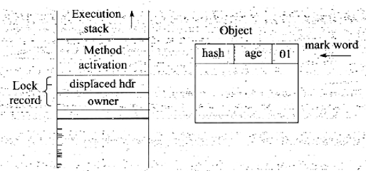
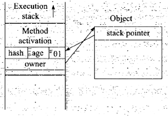
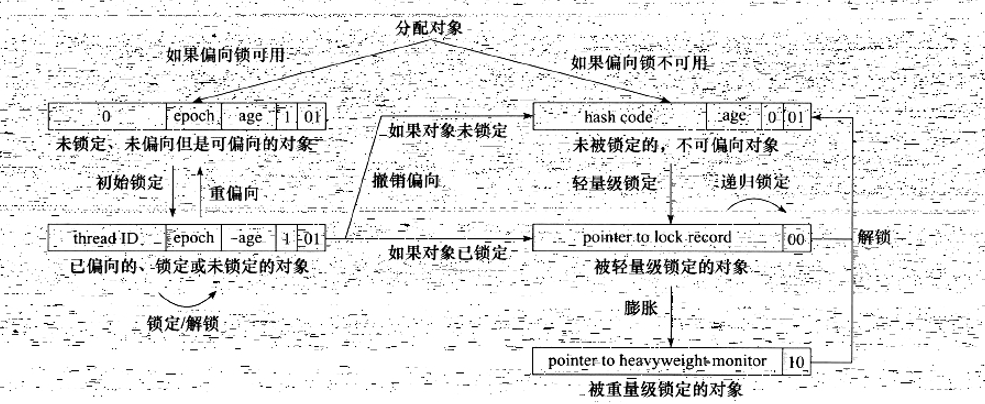

# 第13章 线程安全和锁优化

## 13.2 线程安全

《Java Concurrenty In Practice》的作者Brian Goetz 对“线程安全”有一个比较恰当的定义：“当多个线程访问一个对象时，如果不用考虑这些线程在运行时环境下的调度额交替执行，也不需要进行额外的同步，或者在调用方进行任何其他的协调操作，调用这个对象的行为都可以获得正确的结果，那这个对象是线程安全的”。

它要求线程安全的代码都具备一个特征：代码本身封装了所有必要的正确性保障手段（如互斥同步等），令调用者无锡关心多线程的问题，更无需自己采用任何措施来保证多线程的正确调用。这实际并不容易做到，在大多数场景中，我们会将这个定义弱化一些，如果把“调用这个对象的行为”限定为“单次调用”，这个定义的其他描述也能够成立的话，我们就可以称它是线程安全了。

### 13.2.1 Java语言中的线程安全

为了更加深入地理解线程安全，在这里我们可以不把线程安全当作一个非真即假地二次元排他选项来看待，按照线程安全的“安全程度”由强到弱来排序，我们可以将Java语音中各种操作共享的数据分为如下5类：不可变、绝对线程安全、想对线程安全、线程兼容和线程对立。

#### 1. 不可变

在Java语言中，不可变的对象一定是线程安全的，无论是对象的方法实现还是方法的调用者，都不需要在采取任何的线程安全保障措施。final关键字具有可见性，只要一个不可变的对象呗成功地构建出来（没有发生this引用逃逸的情况），那其外部的可见状态永远也不会改变，永远也不会看到它在多个线程之中处于不一致的状态。“不可变”带来的安全性是最简单和纯粹的。

Java语言中，如果共享数据是一个基本数据类型，那么只要在定义时使用final关键字修饰它就可以保证它是不可变的。如果共享数据是一个对象，那就需要保证对象的行为不会对其状态产生任何影响才行，例如java.lang.String类的对象。

保证对象行为不影响自己状态的途径有很多种，其中最简单的就是把对象中带有状态的变量都声明为final。

Java API中符合不可变要求的类型，除了java.lang.String，还有枚举类型以及java.lang.Number的部分子类，如Long和Double等数值包装类型，BigInteger和BigDeimal等大数据类型；但是AtomicInteger和AtomLong这类原子类并非不可变的。

#### 2. 绝对线程安全

绝对线程安全完全满足Brian Goetz给出的线程安全的定义，达到“不管运行时环境如何，调用者都不需要任何额外的同步措施”，通常需要付出很大的，甚至有时候是不切实际的代价。在Java API中标注自己是线程安全的类，大多数都不是绝对的线程安全。例如：

    private static Vector<Integer> vector = new Vector<>(Integer);

    public static void main(String[] args){
        while(true){
            for(int i = 0;i < 10;i ++){
                vector.add(i);
            }

            Thread removeThread = new Thread(new Runnable(){
                @Override
                public void run(){
                    for(int i = 0;i < vector.size();i ++){
                        vector.remove(i);
                    }
                }
            });

            Thread printThread = new Thread(new Runnable(){
                @Override
                public void run(){
                    for(int i = 0;i < vector.size();i ++){
                        System.out.println(vector.get(i));
                    }
                }
            });
        }
    }

众所周知，Java的java.util.Vector是一个线程安全的容器，它的add()、get()和size()方法都是被synchroized修饰的。但是上述代码仍然会抛出异常，原因就是使用size方法获取长度数据时，是线程安全的，但是可能另一个线程会在错误的时间删除了一个元素，导致i的值不可用，因此会抛出异常。

#### 3. 相对线程安全

相对的线程安全就是我们通常意义上所讲的线程安全，他需要保证这个对象单独的操作是线程安全的。

在Java语言中，大部分的线程安全类都属于这种类型，例如Vector、HashTable、Collections的synchronizedCollection()方法包装的集合等。

#### 4. 线程兼容

线程兼容是指容器本身并不是线程安全的，但是可以通过在调用端正确地使用同步手段来保证对象在并发环境中可以安全地使用，我们通常说一个类不是线程安全的，绝大多数时候指的是这一种情况。

#### 5. 线程对立

线程对立是指无论调用端是否采取了同步措施，都无法再多线程环境中并发使用的代码，由于Java语言天生就具备多线程特性，线程对立这种排斥对线程的代码是很少出现的，而且通常都是有害的，应当尽量避免。

一个线程对立的例子是Thread类的suspend()和resume()方法。

### 13.2.2 线程安全的实现方法

#### 1. 互斥同步

互斥同步是一种常见的并发正确性保障手段。同步是指在多个线程并发访问共享数据时，保证共享数据在同一个时候只被一个（或者是一些，使用信号量的时候）线程使用。而互斥是实现同步的一些手段，临界区、互斥量、信号量都是主要的互斥实现方式。因此，在这4个字里面，互斥是因，同步是果；互斥是方法，同步是目的。

在Java中，最基本的互斥同步手段就是synchronized关键字，synchronized关键字经过编仪之后，会在同步块的前后分别形成monitorenter和monitorexit两个字节码指令，这两个字节码都需要一个reference类型的参数来指明要锁定和解锁的对象。如果Java程序中的synchronized明确指定了对象参数，那就是这个对象的reference：如果没有明确指定，那就根据synchronized修饰的是实例方法还是类方法，去取对应的对象实例或Class对象来作为锁对象。

根据虚拟机规范的要求，在执行monitorenter指令时，首先要尝试获取对象的锁。如果这个对象没被锁定，或者当前线程已经拥有了那个对象的锁，把锁的计数器加1，相应的，在执行monitorexit指令时会将锁计数器减1，当计数器为0时，锁就被释放。如果获取对象失败，那当前线程就要阻塞等待，知道对象锁被另外一个线程释放为止。

synchronized同步块对同一条线程来说是可重入的，不会出现自己把自己锁死的问题。其次，同步块在已进入的线程执行完之前，会阻塞后面的线程进入。synchronized是Java语言中的一个重量级的操作。我们要在确实必要的情况下才使用这种操作。而虚拟机也会做一些优化，例如再通知操作系统阻塞县城之前加入一段自旋等待操作。

除了synchronized之外，我们还可以使用java.util.concurrent包中的重入锁（ReetrantLock）实现同步，在基本用法上，ReentrantLock与synchronized很相似，但是增加了一些高级功能：等待可中断、可实现公平锁、锁可以绑定多个条件：

- 等待可中断是指当持有锁的线程长期不是放锁的时候，正在等待的线程可以选择放弃等待，改为处理其他事情，可中断特性对处理执行时间非常长的同步块很有帮助。
- 公平锁是是指多个线程在等待同一个锁时，必须按照申请锁的时间顺序来依次获得锁：而非公平锁则不保证这一点，在锁被释放时，任何一个等待锁的线程都有机会获得锁。synchronized中的锁是非公平的，ReentrantLock默认情况下也是非公平的，但可以通过带布尔值的构造函数要求使用公平锁。
- 锁绑定多个条件是指一个ReentrantLock对象可以同时绑定多个Condition对象，而在synchronized中，锁对象的wait()和notify()或notifyAll()方法可以是实现一个隐含的条件，如果要和多于一个的条件关联的时候，就不得不额外地添加一个锁，而ReentrantLock则无须这样做，只需要多从调用newCondition()方法即可。

多线程环境下synchronized地吞吐量下降得非常严重，而ReentrantLock则能基本保持在一个比较稳定的水平上。与其说ReentrantLock性能好，还不如说synchronized还有非常大的优化余地。JDK 1.6 发布之后，人们就发现synchronized与ReentrantLock的基本性能基本上是完全持平的了。 
#### 2. 非阻塞同步

互斥同步的最主要问题就是进行线程阻塞和唤醒所带来的性能问题，因此这种同步也称为阻塞同步。阻塞同步悲观的认为所有的操作都会产生竞争，因此都需要并发处理。

随着硬件指令集的发展，我们有了另一个选择：基于冲突检测的乐观并发策略，通俗的说，就是先进行操作，如果没有其他线程征用共享数据，那操作就成功了；如果共享数据有争用，产生了冲突，那就再采取其他的补偿措施（最常见的补偿措施就是不断重试，知道成功为止），这种乐观的并发策略的许多实现都不需要把线程挂起，这种同步操作称为非阻塞同步。

这种方式需要硬件指令集的发展，因为我们需要操作和冲突检测这两个操作具备原子性，而完成这件事只能靠硬件完成。硬件保证一个从语义上看起来需要多次操作的行为只通过一条处理器指令就能完成，这类指令常用的有：

- 测试并设置（Test-and-Set）
- 获取并增加（Fetch-and-Increase）
- 交换（Swap）
- 比较并交换（Compare-and-Swap，下文称CAS）
- 加载链接/条件存储（Load-Linked/Store-Conditional，下文称LL/SC）

在IA64、X86指令集中有cmpxchg指令完成CAS功能，在sparc-TSO也有casa指令实现，而在ARM和PowerPC架构下，则需要使用一对ldrex/strex指令来完成LL/SC功能。

CAS指令需要有3个操作数，非别是内存位置（在Java中可以简单理解为变量的内存地址，用V表示）、旧的预期值（用A表示）、新值（用B表示）。CAS指令执行时，当且仅当V符合旧预期值A时，处理器用新值B更新V的值，否则就不执行更新，但是无论是否更新了V的值，就返回V的旧值，上述的处理过程时一个原子操作。

Java程序中才可以使用CAS操作，该操作由sun.misc.Unsafe类里面的compareAndSwapInt()和compareAndSwapLong()等几个方法包装提供，虚拟机在内部对这些方法做了特殊处理，编译出来的结果就是一条平台相关的处理器CAS指令，没有方法调用的过程，或者可以认为是无条件的内敛进去了。

由于Unsafe类不是提供给用户程序调用的类（Unsafe.getUnsafe()的代码中限制了只有启动类加载器（Bootstrap ClassLoader）加载的Class才能访问它），因此，如果不采用反射手段，我们只能通过其他的API来间接使用它，如J.U.C包里面的原子类，其中的compareAndSet()和getAndIncrement()等方法都使用了Unsafe类的CAS操作。

尽管Unsafe操作看起来很美，但显然这种操作无法涵盖互斥同步的所有使用场景，并且CAS从语义上来说并不完美，存在这样一个逻辑漏洞：如果一个变量V初次读取的时候时A值，并且在准备复制的时候检测到它仍是A值，那我们就能说它的值没有被其他线程改变过了么？如果在这段期间它的值曾经被改成了B，后来又被改回了A，那CAS操作就会误认为这个值从来没有改变过。J.U.C包为了解决这个问题提供了一个带有标记的原子引用类“AtomicStampedReference”。

#### 3. 无同步方案

可重入代码：也称纯代码，可以在代码执行的任何时刻中断它，转而去执行另外一段代码（包括递归调用它本身），而在控制权返回之后，原来的程序不会出现任何错误。相对线程安全来说，可重入性时更基本的特性，它可以保证线程安全。

可重入代码有一些共同特征，例如不依赖存储在堆上的数据和公共的系统资源、用到状态两都由参数中传入、不调用非可重入的方法等。如果一个方法，它的返回值时可以预测的，只要输入了相同的数据，就能返回相同的结果，那它就满足可重入性的要求，当然也是线程安全的。

线程本地存储：如果一段代码中所需要的数据必须和其他代码共享，那就看看这些共享数据的代码是否能在同一个线程中执行？如果能保证，我们就可以把共享数据的可见范围限制在一个线程之内，这样，无需同步也能保证线程之间不出现数据征用问题。

如果一个变量要被某个线程独享，Java可以通过java.lang.ThreadLocal类来实现线程本地存储功能。每一个线程的Thread对象中都有一个ThreadLocalMap对象，这个对象存储了一组以ThreadLocal.threadLocalHashCode为键，以本地线程变量为值的K-V值对，ThreadLocal对象就是当前线程的ThreadLocalMap的访问入口，每一个ThreadLocal对象都包含了一个独一无二的threadLocalHashCode值，使用这个值就可以在K-V值对中找回对应的本地线程变量。

## 13.3 锁优化

### 13.3.1 自旋锁与自适应自选

有些情况下，共享数据的锁定状态只会持续很短一段时间，为了这段时间去挂起和恢复线程并不值得。如果物理机器有一个以上的处理器，能让两个或以上的线程同时并行执行，我们可以让后面请求锁的那个线程“稍等一下”，但不放弃处理器的执行时间，看看持有锁的线程是否很快就会释放锁。为了让线程等待，我们只需让线程执行一个忙循环（自旋），这项技术就是所谓的自旋锁。

自旋锁在JDK 1.4.2 中就已经引入，只不过是默认关闭的，可以使用-XX:+UseSpinning参数来开启，在JDK 1.6中变为默认开启。自旋等待不能代替阻塞，先不说对处理器数量的要求，自旋等待本身虽然避免了线程切换的开销，但是他要占用处理器时间，因此，如果锁被占用的时间很短，自选等待的效果会比较好，如果锁占用时间比较长，那么自选的线程就会白白占用资源。因此，自旋等待的时间必须要有一定的限度，如果自旋超过了限定的次数仍然没有成功获得锁，就应当使用传统的方式挂起线程。

### 13.3.2 锁消除

锁消除是指虚拟机即时编译器在运行时，对一些代码上要求同步，但是被检测到不可能存在共享数据竞争的锁进行消除。锁消除的主要判定依据来源于逃逸分析的数据支持，如果判断在一段代码中，对上的所有数据都不会逃逸出去从而被其他线程访问到，那么就可以把他们当做栈上的数据对待，认为其是线程私有的，同步加锁无需进行。

### 13.3.3 锁粗化

原则上，在编写代码的时候，总是推荐将同步块的作用范围限制到最小，只在共享数据的实际作用域进行同步，但是如果一系列连续的操作都对同一个对象反复加锁和解锁，甚至加锁操作出现在循环体中，那即使没有线程竞争，频繁地进行互斥同步操作也会导致不必要的性能损耗。薰妮基探测到有这样一串零碎的操作都对同一对象加锁，将会把锁同步的范围扩展（粗化）到整个操作序列的外部。

### 13.3.4 轻量级锁

轻量级锁是JDK 1.6之中加入的新型锁机制，它名字中的“轻量级”是相对于使用操作系统互斥量来实现的传统锁而言的，因此传统的锁机制就称为“重量级”锁。轻量级锁并不是用来代替重量级锁的，仅仅是咋没有多线程竞争的前提下，减少传统的重量级锁使用操作系统互斥量产生的性能消耗。

轻量级锁的实现使用了对象头部分进行完成，HotSpot对象头（Object Header）分为两部分信息，第一部分用于存储对象自身的运行时数据，如哈希码、GC分代年龄等，这部分数据的长度在32位和64位虚拟机中分别为32bit和64bit，被称为“Mark Word”，它们是实现轻量级锁和偏向锁的关键。另一部分用于存储指向方法区对象类型数据的指针，如果是数组对象的话，还有一个额外的部分用于存储数组长度。

对象头信息是与对象自身定义的数据无关的额外数据成本，考虑到空间效率，Mark Word被设计成一个非固定的数据结构以便在极小的空间内存储尽量多的信息。例如在32位的HotSpot虚拟机中对象为被锁定状态下，Mark Word的32bit空间中的25bit用于存储对象hash码，4bit用于存储对象分代年龄，2bit用于存储锁标志位，1bit固定为0，在其他状态下对象存储内容如下：

存储内容|标志位|状态
---|---|---
对象哈希码、对象分代年龄|01|未锁定
指向锁记录的指针|00|轻量级锁定
只想重量级锁的指针|10|膨胀（重量级锁定）
空，不需要记录信息|11|GC标记
偏向线程ID、偏向时间戳、对象分代年龄|01|可偏向

在代码进入同步快的时候，如果此同步对象没有被锁定（锁标志位为“01”状态），虚拟机首先将在当前线程的栈帧中建立一个名为锁记录的空间，用于存储对象目前的Mark Word拷贝（官方为其添加了一个Displaced前缀，即Displaced Mark Word），如下图：

然后，虚拟机将使用CAS操作尝试将对象的Mark Word更新为指向Lock Record的指针。如果这个更新动作成功了，那么线程就拥有了该对象的锁，并且对象Mark Word的锁标志位将转变为“00”，即表示此对象处于轻量级锁定状态。如下图：

如果这个更新操作失败了，虚拟机首先会检查对象的Mark Word是否指向当前线程的栈帧，如果当前线程已经拥有了这个对象的锁，那就可以直接进入同步块继续执行，否则说明这个锁对象已经被其他线程抢占了。如果有两条以上的线程争用同一个锁，那轻量级锁就不再有效，要膨胀为重量级锁，锁标志的状态值变为“10”，Mark Word中存储的就是指向重量级锁（互斥量）的指针，后面的等待锁的线程也要进入阻塞状态。

轻量级锁的解锁过程是如果对象的Mark Word仍然指向着线程的锁记录，那就用CAS操作把对象当前的Mark Word和线程中复制的Displaced Mark Word替换回来，如果替换成功，整个同步过程就完成了。如果替换失败，说明有其他线程尝试过获取该锁，那就要在释放锁的同时，唤醒被挂起的线程。

轻量级锁能提升同步性能的依据是：对于大部分锁，在整个同步周期内都是不存在竞争的。但是如果存在锁竞争，就会效率更低，因为不仅付出了互斥量的开销，还有CAS的开销。

### 13.3.5 偏向锁

偏向锁是JDK 1.6中引入的一项锁优化，目的是消除数据在无竞争情况下的同步原句，进一步提高程序的运行性能。轻量级锁是在无竞争的情况下使用CAS操作去消除同步使用的互斥量，偏向锁是在无竞争的情况下把整个同步都消除掉。

偏向锁的加锁过程如下：当锁对象第一次被线程获取的时候，虚拟机将会把对象头的标志位设为“01”，即偏向模式，同时使用CAS擦做把获取到这个锁的线程的ID记录在对象的Mark Word之中，如果CAS操作成功，持有偏向锁的线程以后每次进入这个锁相关的同步块时，虚拟机都可以不再进行任何同步操作。

当有另外一个线程去尝试获取这个锁时，偏向模式宣告结束，根据锁对象目前是否处于被锁定的状态，撤销偏向后恢复到未锁定（标志位为“01”）或轻量级锁定（标志位为“00”）的状态，后续的同步操作就如上面介绍的轻量级锁那样执行。偏向锁、轻量级锁的状态转化及对象Mark Word的关系如下：

偏向锁可以提高带有同步但无竞争的程序性能，同样是一个带有效益性质的优化，也就是说，它并不一定总是对程序运行有利，如果程序中大多数的锁总是被多个不同的线程访问，那偏向模式就是多余的。-XX:-UseBiasedLocking来禁止偏向锁优化反而可以提升性能。