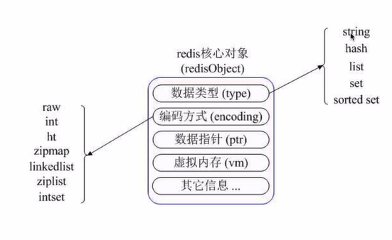

# 12-4 Redis

远程非关系型内存数据库，可以存储键值对以及5种不同类型值之间的映射，可以将存储到内存的数据持久化到硬盘，可以使用复制特性来扩展读性能，可以使用客户端分片来扩展写性能。

Redis内部是通过redisObject对象来标识所有的key-value数据。如图：

特点：
1. 支持数据持久化
2. 支持特殊类型数据
3. 支持数据备份
4. 性能极高
5. 丰富的数据类型
6. 原子性
7. 对几个操作合并后的原子执行
8. 支持publish,subcribe,通知key过期等特性

适用场景：
1. 取最新n个数据
2. 排行版
3. 需要精准设定过期时间
4. 计数器
5. 做唯一性检查
6. 实时系统、垃圾系统
7. 基本的缓存功能