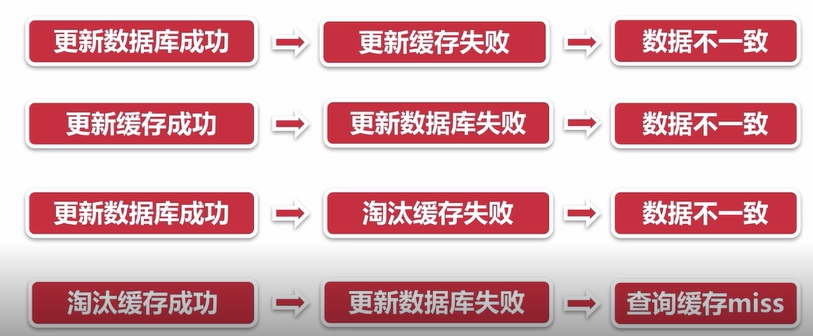

# 12-5 常见问题

## 缓存一致性

数据时效要求很高时，要求缓存和数据库一致。数据更改主动更改缓存。但是可能出现如下情况：

## 缓存并发问题

缓存在失效后，会从数据库种重新获取数据填充缓存，但是当多个请求同时发送时，会产生并发问题，我们可以采用锁的方式解决该问题，示意图如下：

在缓存更新或者过期的情况下，先尝试获取到锁，在缓存更新或者从数据库获取完成后再释放锁，其他请求只需牺牲一些等待时间。

## 缓存穿透问题

缓存穿透问题是指，当请求发送到服务器，服务器无法通过缓存命中数据，由于要正常保持业务成功，我们会查询数据库获取数据，然而对于请求的数据的key为空的情况下，所有请求都会查询数据库，导致数据库压力增大的问题。

解决方案：

1. 缓存空对象
2. 单独过滤处理，对所有可能数据为空的数据进行统一的存放。并在请求前做拦截（命中不高，更新不频繁）

## 缓存的颠簸问题

通过一致性哈希算法解决

## 缓存的雪崩现象

由于缓存的原因，导致大量的请求到达后端数据库，请求到达后端数据库，从而使数据库发生灾难。

设置不同的过期时间，避免缓存集中失效。或者通过限流、熔断、多级缓存解决问题，多加强压力测试，尽早暴露问题。