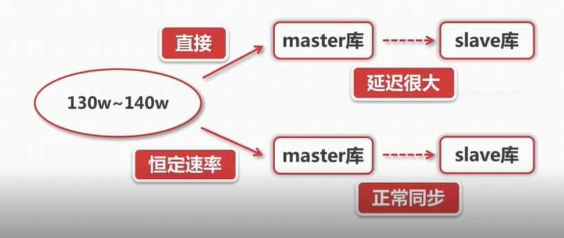

# 15 应用限流

考虑一种情况，当缓存中有大量数据缓存时，在该缓存数据使用结束后，我们要将其插入到数据库作为历史数据进行保存，然而由于数据数量较大，如果我们一下直接插入数据库，则会导致数据库压力过大，影响系统其他模块正常运行，主库和从库的同步延迟也会很大，所以这种情况下，我们最好进行应用限流。下图描述了上述情况：

限流包括：

1. 限制总并发数
2. 限制瞬时并发数
3. 限制时间窗口内的平均速率

限流算法：

1. 计数器法

例如我们要对一个接口要求1分钟内只允许100次访问，我们设置一个counter，然后对每一分钟进行统计，当到达一分钟的时候就进行counter的重置。但是该方法容易出现问题，如果一个接口在本次统计的第59秒时被访问了99次，但是在最后一秒一下子接到了100个请求，这样我们的系统就出现了危险。

2. 滑动窗口
3. 漏桶算法
4. 令牌桶算法

计数器算法VS滑动窗口：计数器算法是特殊的滑动窗口算法，但是滑动窗口算法需要更多的空间

漏桶算法VS令牌桶算法：漏桶算法保证了数据处理时间都是相同的，令牌桶算法则允许瞬时突变的情况