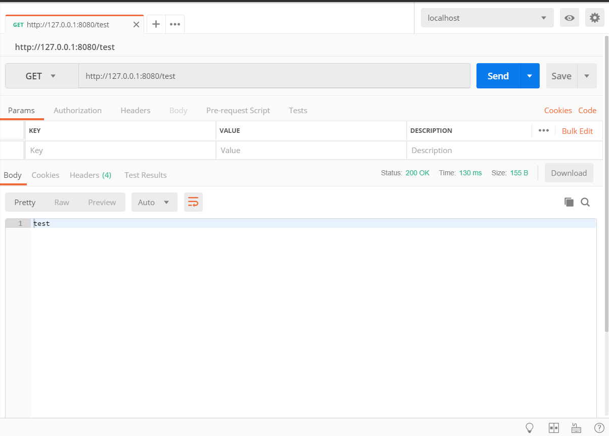
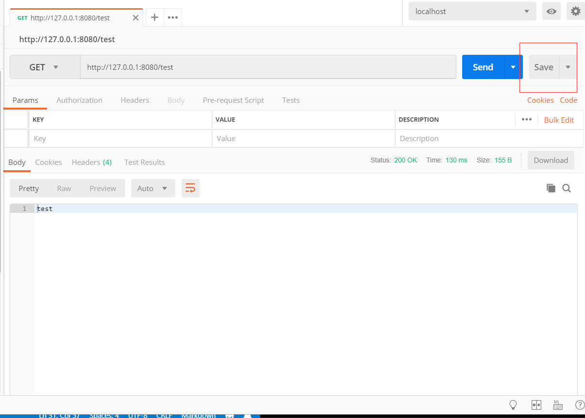
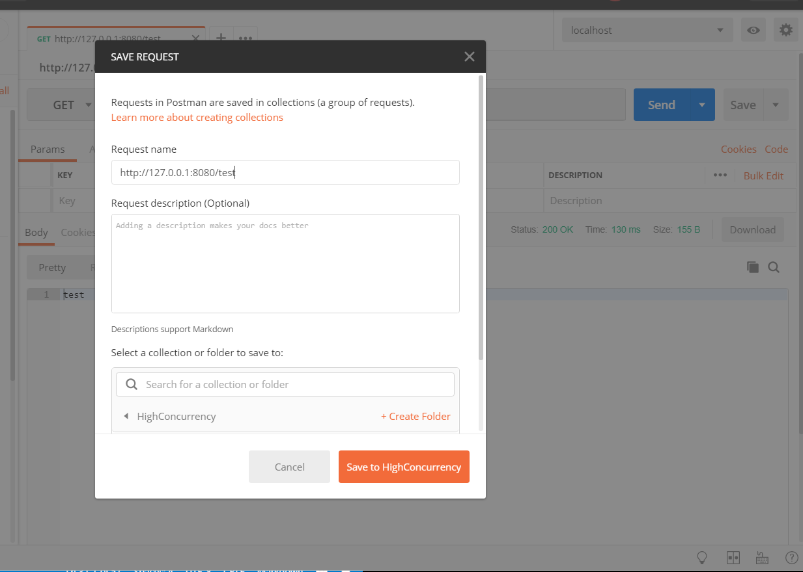
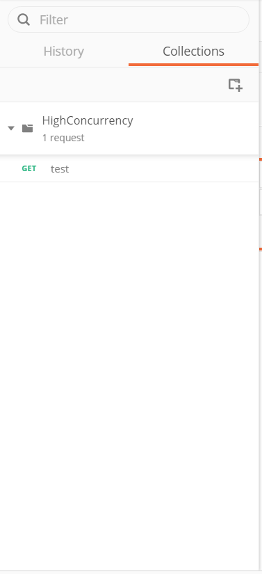
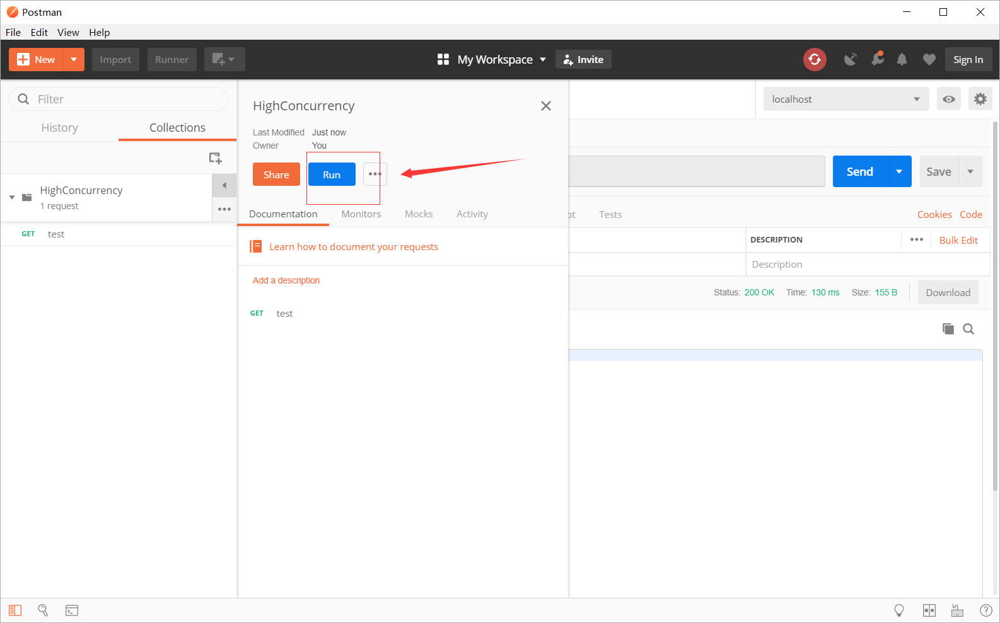
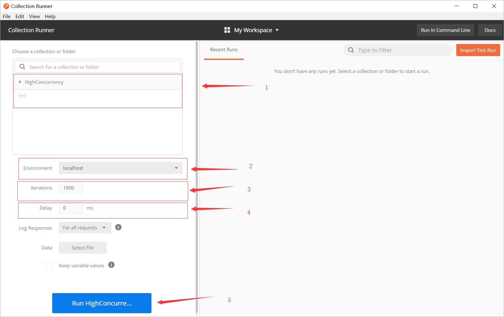
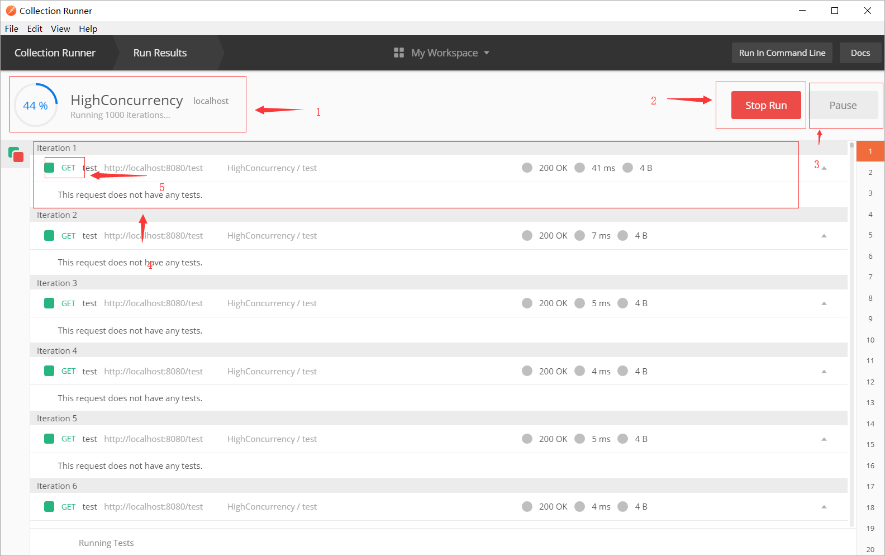

# 3-1-1 使用postMan做并发测试

## PostMan并发测试具体步骤

PostMan工具可以用于简单的接口测试，同样也可使用于并发测试，下面我们给出例子：

首先使用Spring boot写一个控制器用于测试：

    package cn.edu.ynu;

    import lombok.extern.slf4j.Slf4j;
    import org.springframework.stereotype.Controller;
    import org.springframework.web.bind.annotation.RequestMapping;
    import org.springframework.web.bind.annotation.ResponseBody;

    @Controller
    @Slf4j
    public class TestController {

        @ResponseBody
        @RequestMapping(value = "/test")
        public String test(){
            return "test";
        }
    }

这段代码定义了一个/test的路径，使用GET方法访问它会返回一个"test"字符串。

下面我们使用postMan进行简单测试：

这只是正常测试，为了能使用并发测试，我们先将其保存下来，过程如下：

得到上面的结果就证明保存完毕了，现在我们来进行并发测试，选择你要测试的接口集合，点击下面的按钮：

结果如下：

其中：
1. 该接口集合的所有接口名称
2. 测试接口所选择的环境（环境的配置我们稍后会提到）
3. 接口测试的总次数
4. 每次测试之间的时间间隔
5. 运行本次测试
   
我们上述的配置就是用来测试test接口的，当我们点击了下面的运行测试按钮，结果如下：

其中:

1. 测试进度
2. 停止测试
3. 暂停测试
4. 每个测试用例的具体信息
5. 红色为测试失败，绿色为测试成功
   
本例中没有对PostMan设置了测试用例，所以没有成功也没有失败。

## PostMan 环境设置

[大佬的环境变量设置笔记](https://www.jianshu.com/p/bffbc79b43f6)

## API 测试

[大佬的API 测试笔记](https://www.jianshu.com/p/13c8017bb5c8)