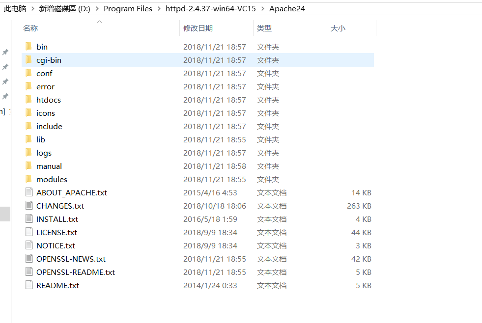

# 3-1-2 使用ab进行并发测试

## Apache Bench简介

ApacheBench 是 Apache 服务器自带的一个web压力测试工具，简称ab。ab又是一个命令行工具，对发起负载的本机要求很低，根据ab命令可以创建很多的并发访问线程，模拟多个访问者同时对某一URL地址进行访问，因此可以用来测试目标服务器的负载压力。总的来说ab工具小巧简单，上手学习较快，可以提供需要的基本性能指标，但是没有图形化结果，不能监控。

## 安装

首先需要安装Apache服务器，下载地址：[https://www.apachelounge.com/download/](https://www.apachelounge.com/download/)

下载完成后解压下载压缩包如下：

我们可以将该目录下的bin目录添加到path环境变量中，方便使用。

## 使用

参数说明：

    格式：ab [options] [http://]hostname[:port]/path

    -n requests Number of requests to perform     //本次测试发起的总请求数
    -c concurrency Number of multiple requests to make　　 //一次产生的请求数（或并发数）
    -t timelimit Seconds to max. wait for responses　　　　//测试所进行的最大秒数，默认没有时间限制。
    -r Don't exit on socket receive errors.     // 抛出异常继续执行测试任务 
    -p postfile File containing data to POST　　//包含了需要POST的数据的文件，文件格式如“p1=1&p2=2”.使用方法是 -p 111.txt

    -T content-type Content-type header for POSTing
    //POST数据所使用的Content-type头信息，如 -T “application/x-www-form-urlencoded” 。 （配合-p）
    -v verbosity How much troubleshooting info to print
    //设置显示信息的详细程度 – 4或更大值会显示头信息， 3或更大值可以显示响应代码(404, 200等), 2或更大值可以显示警告和其他信息。 -V 显示版本号并退出。
    -C attribute Add cookie, eg. -C “c1=1234,c2=2,c3=3” (repeatable)
    //-C cookie-name=value 对请求附加一个Cookie:行。 其典型形式是name=value的一个参数对。此参数可以重复，用逗号分割。
    提示：可以借助session实现原理传递 JSESSIONID参数， 实现保持会话的功能，如-C ” c1=1234,c2=2,c3=3, JSESSIONID=FF056CD16DA9D71CB131C1D56F0319F8″ 。
    -w Print out results in HTML tables　　//以HTML表的格式输出结果。默认时，它是白色背景的两列宽度的一张表。
    -i Use HEAD instead of GET
    -x attributes String to insert as table attributes
    -y attributes String to insert as tr attributes
    -z attributes String to insert as td or th attributes
    -H attribute Add Arbitrary header line, eg. ‘Accept-Encoding: gzip’ Inserted after all normal header lines. (repeatable)
    -A attribute Add Basic WWW Authentication, the attributes
    are a colon separated username and password.
    -P attribute Add Basic Proxy Authentication, the attributes are a colon separated username and password.
    -X proxy:port Proxyserver and port number to use
    -V Print version number and exit
    -k Use HTTP KeepAlive feature
    -d Do not show percentiles served table.
    -S Do not show confidence estimators and warnings.
    -g filename Output collected data to gnuplot format file.
    -e filename Output CSV file with percentages served
    -h Display usage information (this message)

## 实践

首先使用Spring boot写一个控制器用于测试：

    package cn.edu.ynu;

    import lombok.extern.slf4j.Slf4j;
    import org.springframework.stereotype.Controller;
    import org.springframework.web.bind.annotation.RequestMapping;
    import org.springframework.web.bind.annotation.ResponseBody;

    @Controller
    @Slf4j
    public class TestController {

        @ResponseBody
        @RequestMapping(value = "/test")
        public String test(){
            return "test";
        }
    }

这段代码定义了一个/test的路径，使用GET方法访问它会返回一个"test"字符串。

然后使用ab进行并发测试：

    C:\Users\ShaoYanli>ab -n 1000 -c 50 http://localhost:8080/test

    This is ApacheBench, Version 2.3 <$Revision: 1843412 $>
    Copyright 1996 Adam Twiss, Zeus Technology Ltd, http://www.zeustech.net/
    Licensed to The Apache Software Foundation, http://www.apache.org/

    Benchmarking localhost (be patient)
    Completed 100 requests
    Completed 200 requests
    Completed 300 requests
    Completed 400 requests
    Completed 500 requests
    Completed 600 requests
    Completed 700 requests
    Completed 800 requests
    Completed 900 requests
    Completed 1000 requests
    Finished 1000 requests

    Server Software:
    Server Hostname:        localhost
    Server Port:            8080

    Document Path:          /test
    Document Length:        4 bytes

    Concurrency Level:      50
    Time taken for tests:   0.690 seconds
    Complete requests:      1000
    Failed requests:        0
    Total transferred:      172000 bytes
    HTML transferred:       4000 bytes
    Requests per second:    1449.24 [#/sec] (mean)
    Time per request:       34.501 [ms] (mean)
    Time per request:       0.690 [ms] (mean, across all concurrent requests)
    Transfer rate:          243.43 [Kbytes/sec] received

    Connection Times (ms)
                min  mean[+/-sd] median   max
    Connect:        0    0   1.1      0      10
    Processing:     0   30  49.8     10     270
    Waiting:        0   17  23.5     10     270
    Total:          0   30  49.8     10     270

    Percentage of the requests served within a certain time (ms)
    50%     10
    66%     20
    75%     20
    80%     30
    90%     80
    95%    160
    98%    220
    99%    220
    100%    270 (longest request)

其中：

    Server Hostname:        localhost（主机名）
    Server Port:            8080（端口号）

    Document Path:          /test（路径）
    Document Length:        4 bytes

    Concurrency Level:      50（并发量）
    Time taken for tests:   0.690 seconds（测试总耗时）
    Complete requests:      1000（完成的请求总数）
    Failed requests:        0（失败请求数）
    Total transferred:      172000 bytes（所有请求的响应数据的长度总和，包括头信息和正文数据长度，仅包括应用层数据长度）
    HTML transferred:       4000 bytes（所有请求的响应数据的响应体中数据的总和）
    Requests per second:    1449.24 [#/sec] (mean)（吞吐率，Complete requests/Time taken for tests）
    Time per request:       34.501 [ms] (mean)（用户平均请求等待时间）
    Time per request:       0.690 [ms] (mean, across all concurrent requests)（服务器平均请求等待时间）
    Transfer rate:          243.43 [Kbytes/sec] received（单位时间内从服务器获取的数据长度）