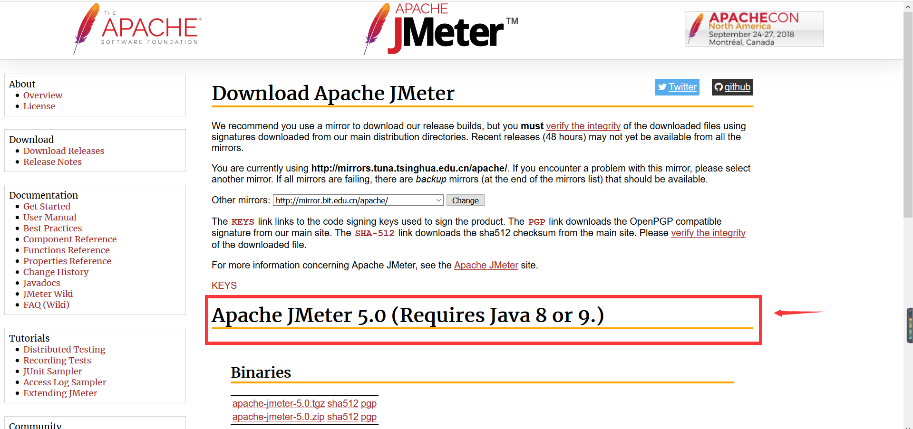
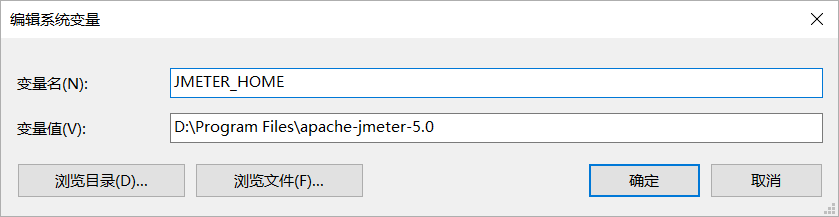
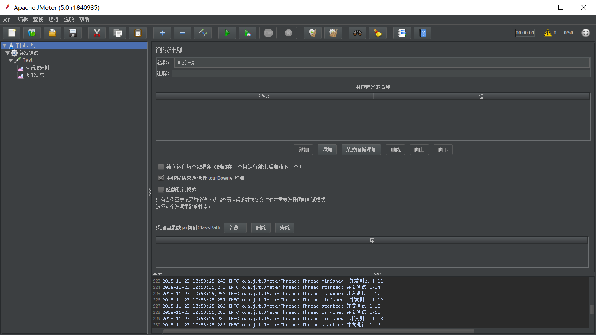
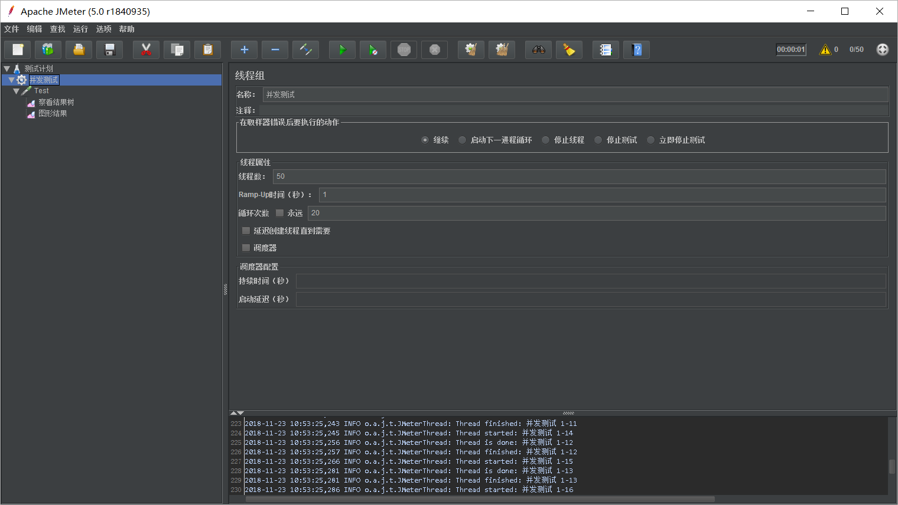
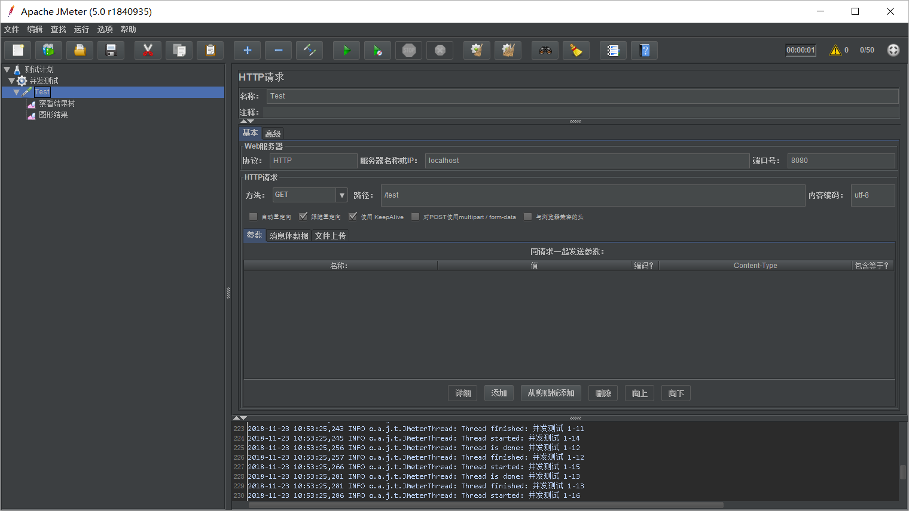
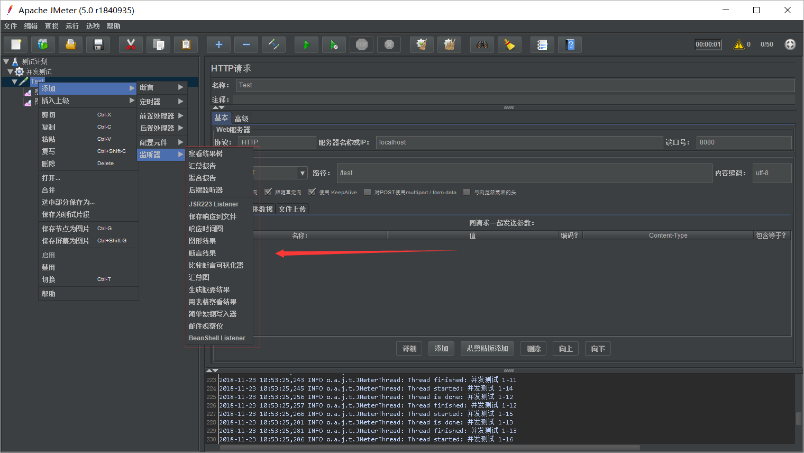

# 3-1-3 使用JMeter进行并发测试

## JMeter安装

下载地址：[http://jmeter.apache.org/download_jmeter.cgi](http://jmeter.apache.org/download_jmeter.cgi)

下载网站类似下图所示：

上述箭头所指位置标记了JMeter的版本号和所需要的JDK版本。注意你的电脑上必须要安装对应版本的JDK，并且正确配置了JAVA_HOME环境变量。

接下来我们需要配置JMETER_HOME环境变量，笔者将其安装在D:\Program Files\apache-jmeter-5.0，因此环境变量配置为：

然后Windows系统秩序执行其bin目录中的JMeter.bat即可。运行成功如图：

## 使用

首先使用Spring boot写一个控制器用于测试：

    package cn.edu.ynu;

    import lombok.extern.slf4j.Slf4j;
    import org.springframework.stereotype.Controller;
    import org.springframework.web.bind.annotation.RequestMapping;
    import org.springframework.web.bind.annotation.ResponseBody;

    @Controller
    @Slf4j
    public class TestController {

        @ResponseBody
        @RequestMapping(value = "/test")
        public String test(){
            return "test";
        }
    }

这段代码定义了一个/test的路径，使用GET方法访问它会返回一个"test"字符串。

使用JMeter进行并发测试：

首先我们需要创建一个线程组用于并发测试，如图：

然后创建一个测试接口：

最后创建两个监听器来显示执行结果：

箭头指向了我们所有能使用到的监听器，这里我们选择查看结果树和图形结果两个监听器。

最后点击上面的运行按钮就可以执行测试了，测试结果可以通过监听器来查看。