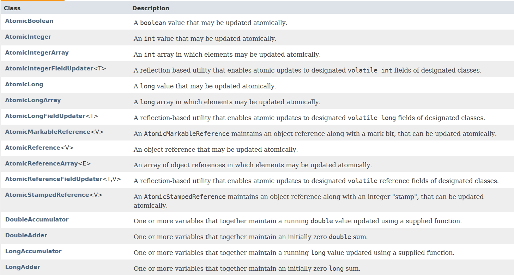
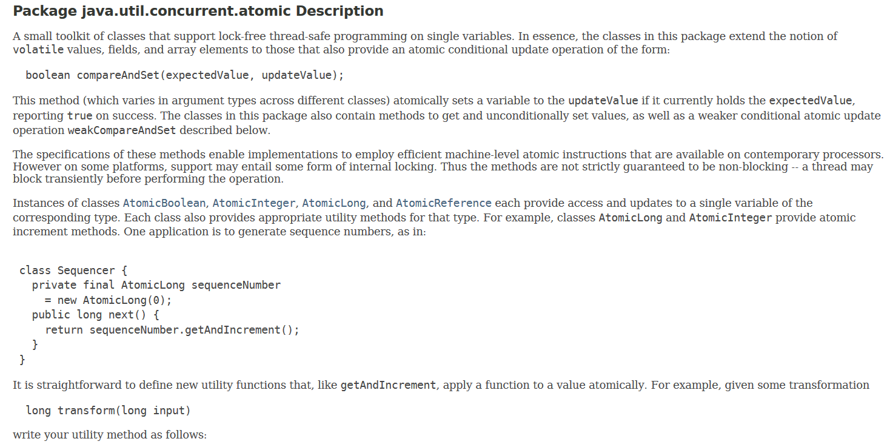
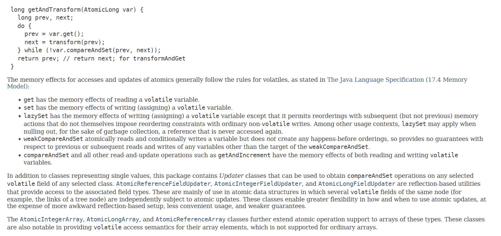
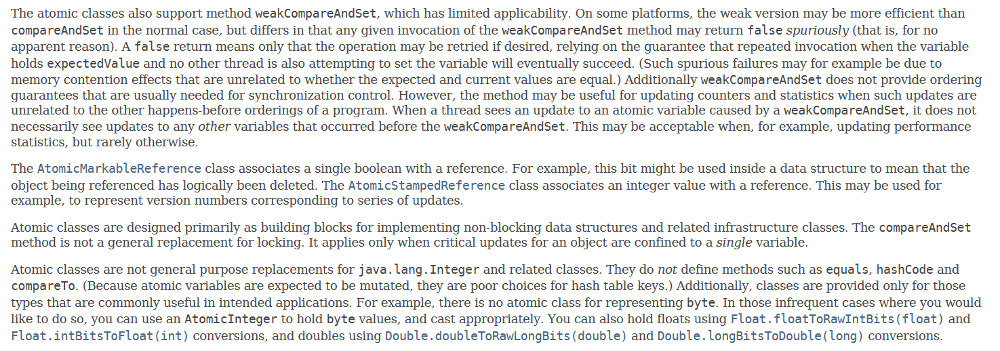

# 4-1 Atomic包

Atomic包是java.util.concurrent.atomic包，这个包的包描述如下：

意思为：这个包是一个工具包，它提供了对于单一变量的解除锁的线程安全编程的支持。

它包含如下的类：

大部分类的描述都是可以原子地进行更新的Integer/Long等等。

包的详细描述如下：

类描述告诉我们：

事实上，这个包中的类通过如下格式将使用volatile修饰的值、域和数组元素的概念扩展成为它们也能提供额外的原子更新操作：

    boolean compareAndSet(expectedValue, updateValue);

这个方法的作用是如果主存中保存的值和expectedValue提供的值相同，那么就将其设置为updateValue，设置成功后返回true。