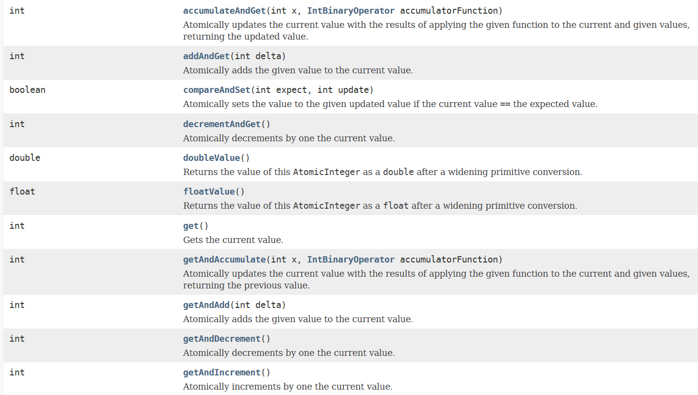
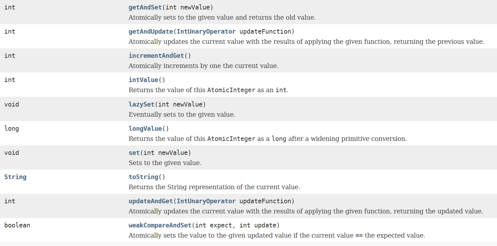

# 4-2 AtomicInteger

方法：

考察AtomicInteger源码我们发现，大部分操作都离不开

     public final int getAndAddInt(Object var1, long var2, int var4) {
        int var5;
        do {
            var5 = this.getIntVolatile(var1, var2);
        } while(!this.compareAndSwapInt(var1, var2, var5, var5 + var4));

        return var5;
    }

这个函数。通过查看上述代码我们看到，Java实现数字的更新是不断通过getIntVolatile(var1,var2)获取主存中的var5值，如果该值和compareAndSwapInt中传入的var5相同，那么就将该值更新为var5+var4，如果不相同就无限循环，直到相同为止。