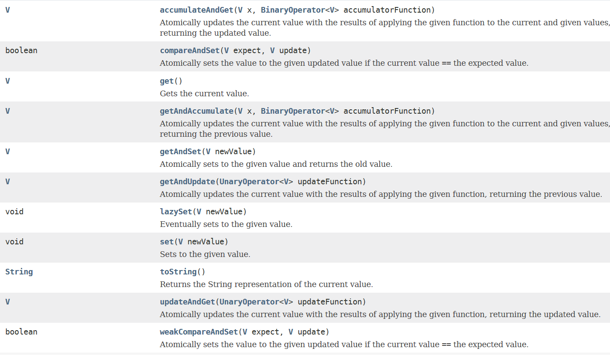

# 4-4 AtmoicReference

## 介绍

以原子方式更新对象引用。

## 方法

## 使用

使用compareAndSet()方法以及get()方法：

    @Slf4j
    @ThreadSafe
    public class AtomicExample3 {

        private static AtomicReference<Integer> atomicReference = new AtomicReference<>(0);

        public static void main(String[] args){

            atomicReference.compareAndSet(0,1);
            atomicReference.compareAndSet(0,2);
            atomicReference.compareAndSet(1,4);
            atomicReference.compareAndSet(4,5);
            log.info("int-{}",atomicReference.get());
        }

    }

结果：

    22:24:30.621 [main] INFO cn.edu.ynu.atomic.AtomicExample3 - int-5

使用accumulateAndGet()方法：

    public class AtomicExample3 {

        private static AtomicReference<Integer> atomicReference = new AtomicReference<>(0);

        public static void main(String[] args){

            atomicReference.compareAndSet(0,1);
            atomicReference.compareAndSet(0,2);
            atomicReference.compareAndSet(1,4);
            atomicReference.compareAndSet(4,5);
            atomicReference.accumulateAndGet(6, (integer,integer2)-> {
                return integer+integer2;
            });
            log.info("int-{}",atomicReference.get());
        }

}

执行结果：

    22:40:03.107 [main] INFO cn.edu.ynu.atomic.AtomicExample3 - int-11

