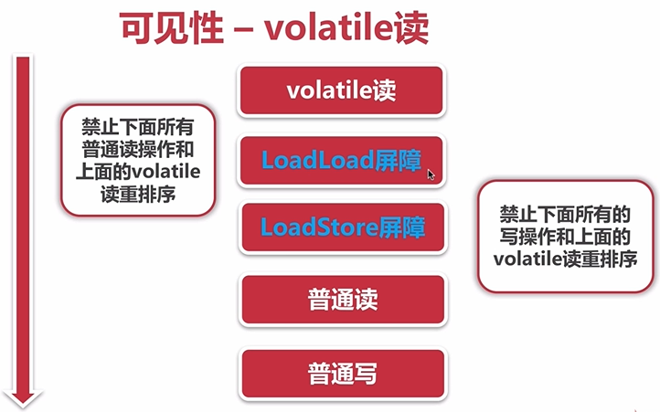

# 可见性

Java的synchronized、锁和volatile关键字保证可见性。

导致共享变量在线程间不可见的原因：

1. 线程交叉执行
2. 重排序结合线程交叉执行
3. 共享变量更新后的值没有在工作内存和主存间及时更新。

## 1.通过synchronized实现可见性的原理

1. 现车给解锁前，必须把共享变量的最新值刷新到主内存
2. 线程加锁时，将清空工作内存中共享变量的值，从而使用共享变量时需要从主内存中读取最新的值。

## 2.通过volatile实现可见性的原理

通过加入内存屏障和禁止重排序优化来实现。

当执行volatile变量的写操作时：

1. 对volatile变量写操作时，会在写操作后加入一条store屏障指令，将本地内存中的共享变量值刷新到主内存。
2. 对volatile变量读操作时，会在读操作前加入一条load屏障指令，从主内存中读取共享变量。

PS:需要注意的是volatile关键字虽然提供了可见性，但并不提供原子性。

