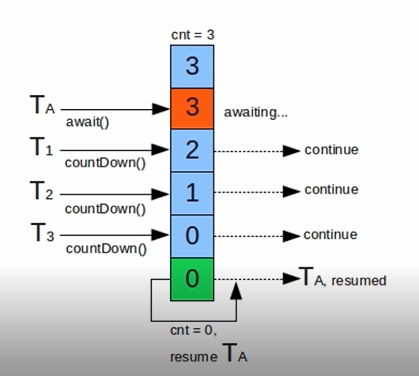

# 7-2 CountDownLatch

## 运行流程

当TA线程要线运行一部分，然后在T1、T2、T3线程运行完成之后继续运行，我们就可以使用CountDownLatch。上图中，定义了一个传入参数为3的CountDownLatch。然后使用TA先行调用countDownLatch.await()。每当T1、T2、T3完成一个之后就调用一次countDownLatch.countDown()，将CountDownLatch中的计数器减一，当该计数器为0时，TA线程就会继续执行。注意这里的计数器只能使用一次，不能被重置。

## 代码示例

    //本例子中main线程即上述描述中的TA线程，T1、T2、T3线程均在主线程中创建
    public class CountDownLatchExample {

        public static void main(String[] args) throws InterruptedException {
            
            //创建线程池用于执行T1、T2、T3
            ExecutorService executorService = Executors.newCachedThreadPool();
            
            //创建一个CountDownLatch，用于限制3个线程
            CountDownLatch countDownLatch = new CountDownLatch(3);

            //主线程开始运行
            System.out.println("Main running");
            System.out.println("Main waiting");

            //创建T1、T2、T3线程，并交给线程池运行
            for(int i = 0;i < 3;i ++){
                final int count = i;
                executorService.execute(()->{
                    
                    //进入线程
                    System.out.println("Thread-"+(count+1)+" running");
                    try
                    {

                        //线程等待1秒
                        Thread.sleep(1000);
                    } catch (InterruptedException e)
                    {
                        e.printStackTrace();
                    }

                    //线程执行countDown();
                    System.out.println("Thread-"+(count+1)+" count down");
                    countDownLatch.countDown();

                    //线程工作完成
                    System.out.println("Thread-"+(count+1)+" complete");
                });
            }

            //主线程进行等待
            countDownLatch.await();

            //主线程继续完成剩下的工作
            System.out.println("Main running continue");
            System.out.println("Main complete");

            //清理线程池
            executorService.shutdown();
        }

    }

结果：

    Main running
    Main waiting
    Thread-1 running
    Thread-2 running
    Thread-3 running
    Thread-2 count down
    Thread-3 count down
    Thread-1 count down
    Thread-1 complete
    Thread-3 complete
    Thread-2 complete
    Main running continue
    Main complete

需要注意的是，这里的countDownLatch.await()必须在线程池运行T1、T2、T3线程之后调用，否则主线程会等待，无法执行到运行3个线程的代码。

CountDownLatch类还提供了await(long timeout, TimeUnit unit),用于规定在timeout之前完成需要等待的方法，如果没有完成就返回false，否则返回true，修改上述代码进行测试：

    //本例子中main线程即上述描述中的TA线程，T1、T2、T3线程均在主线程中创建
    public class CountDownLatchExample {

        public static void main(String[] args) throws InterruptedException {

            //创建线程池用于执行T1、T2、T3
            ExecutorService executorService = Executors.newCachedThreadPool();

            //创建一个CountDownLatch，用于限制3个线程
            CountDownLatch countDownLatch = new CountDownLatch(3);

            //主线程开始运行
            System.out.println("Main running");
            System.out.println("Main waiting");

            //创建T1、T2、T3线程，并交给线程池运行
            for(int i = 0;i < 3;i ++){
                final int count = i;
                executorService.execute(()->{

                    //进入线程
                    System.out.println("Thread-"+(count+1)+" running");
                    try
                    {

                        //线程等待3秒
                        Thread.sleep(3000);
                    } catch (InterruptedException e)
                    {
                        e.printStackTrace();
                    }

                    //线程执行countDown();
                    System.out.println("Thread-"+(count+1)+" count down");
                    countDownLatch.countDown();

                    //线程工作完成
                    System.out.println("Thread-"+(count+1)+" complete");
                });
            }

            //主线程进行等待
            if(countDownLatch.await(5,TimeUnit.SECONDS)){

                //主线程继续完成剩下的工作
                System.out.println("Main running continue");
                System.out.println("Main complete");
            }
            else {

                //主线程执行失败
                System.out.println("Main fail");
            }

            //清理线程池
            executorService.shutdown();
        }

    }

结果：

    Main running
    Main waiting
    Thread-1 running
    Thread-2 running
    Thread-3 running
    Thread-2 count down
    Thread-3 count down
    Thread-1 count down
    Thread-1 complete
    Thread-3 complete
    Thread-2 complete
    Main running continue
    Main complete

将T1、T2、T3线程等待时间边长为8秒后测试：

    //本例子中main线程即上述描述中的TA线程，T1、T2、T3线程均在主线程中创建
    public class CountDownLatchExample {

        public static void main(String[] args) throws InterruptedException {

            //创建线程池用于执行T1、T2、T3
            ExecutorService executorService = Executors.newCachedThreadPool();

            //创建一个CountDownLatch，用于限制3个线程
            CountDownLatch countDownLatch = new CountDownLatch(3);

            //主线程开始运行
            System.out.println("Main running");
            System.out.println("Main waiting");

            //创建T1、T2、T3线程，并交给线程池运行
            for(int i = 0;i < 3;i ++){
                final int count = i;
                executorService.execute(()->{

                    //进入线程
                    System.out.println("Thread-"+(count+1)+" running");
                    try
                    {

                        //线程等待8秒
                        Thread.sleep(8000);
                    } catch (InterruptedException e)
                    {
                        e.printStackTrace();
                    }

                    //线程执行countDown();
                    System.out.println("Thread-"+(count+1)+" count down");
                    countDownLatch.countDown();

                    //线程工作完成
                    System.out.println("Thread-"+(count+1)+" complete");
                });
            }

            //主线程进行等待
            if(countDownLatch.await(5,TimeUnit.SECONDS)){

                //主线程继续完成剩下的工作
                System.out.println("Main running continue");
                System.out.println("Main complete");
            }
            else {

                //主线程执行失败
                System.out.println("Main fail");
            }

            //清理线程池
            executorService.shutdown();
        }

    }

结果：

    Main running
    Main waiting
    Thread-1 running
    Thread-3 running
    Thread-2 running
    Main fail
    Thread-3 count down
    Thread-1 count down
    Thread-1 complete
    Thread-2 count down
    Thread-2 complete
    Thread-3 complete