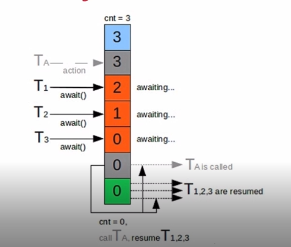

# 7-4 CyclicBarrier

## 运行流程

CyclicBarrier相当于一个屏障，我们希望T1、T2、T3都到达一个位置，然后同时执行，可以使用该方法。

## 代码示例

    public class CyclicBarrierExample {

        private static CyclicBarrier cyclicBarrier = new CyclicBarrier(3);

        public static void main(String[] args) throws InterruptedException {

            ExecutorService executorService = Executors.newCachedThreadPool();
            for(int i = 0;i < 6;i ++){
                final int count = i;
                Thread.sleep(1000);
                executorService.execute(()->{

                    try
                    {
                        Thread.sleep(2000);
                    } catch (InterruptedException e)
                    {
                        e.printStackTrace();
                    }
                    System.out.println("Thread - "+(count+1)+" running");
                    try
                    {
                        cyclicBarrier.await();
                    } catch (InterruptedException e)
                    {
                        e.printStackTrace();
                    } catch (BrokenBarrierException e)
                    {
                        e.printStackTrace();
                    }
                    System.out.println("Thread - "+(count+1)+" complete");

                });
            }

            System.out.println("Thread - main complete");
            executorService.shutdown();
        }

    }
结果：

    Thread - 1 running
    Thread - 2 running
    Thread - 3 running
    Thread - 1 complete
    Thread - 3 complete
    Thread - 2 complete
    Thread - 4 running
    Thread - main complete
    Thread - 5 running
    Thread - 6 running
    Thread - 6 complete
    Thread - 4 complete
    Thread - 5 complete