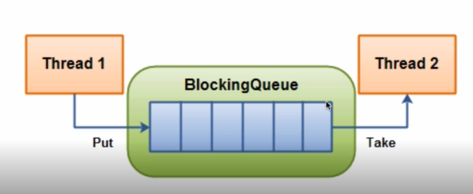

# 8-3 BlockingQueue

阻塞队列，当一个线程在BlockingQueue满的情况下入队列会阻塞，当BlockingQueue空的情况下出队列会阻塞。

## 示意图

## 方法即错误处理

BlockingQueue提供了4套方法执行插入删除检查操作，当出现问题时有不同的方式进行处理，如下表：

操作|Throws Exception|Special Value|Blocks|Times out|
---|---|---|---|---|
Insert|add(o)|offer(o)|put(o)|offer(o,timeout,timeunit)
Remove|remove(o)|poll()|take()|poll(timeout,timeunit)
Examine|element()|peek

## ArrayBlockingQueue

内部实现使用数组，有界阻塞队列，容量有限，初始化时指定容量大小。

## DelayQueue

阻塞内部元素，插入队列的元素必须实现Delay接口（继承了Comparable接口），需要进行排序（按照元素过期时间排序）。

## LinkedBlockingQueue

内部实现链表。

## PriorityBlockingQueue

带优先级的阻塞队列，无边界，带优先级的队列，允许插入null，所有插入的对象必须实现Comparable接口。

## SynchronousQueue

队列只有一个元素，插入元素被阻塞，直到被消费，无界非缓存。