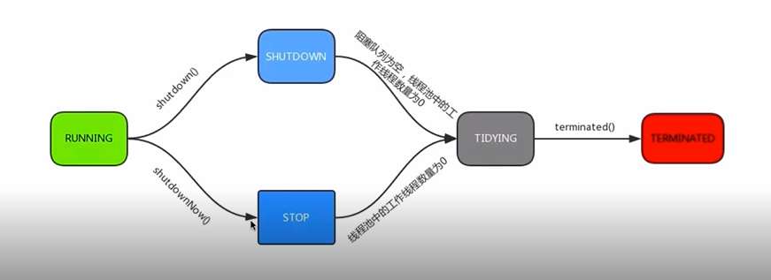
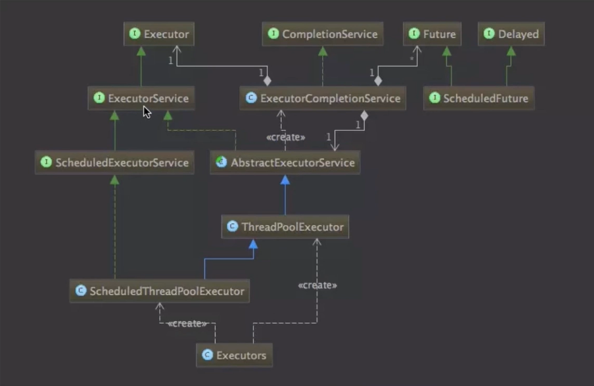

# 9-1 线程池

## 线程池的好处

1. 重用存在的线程，减少对象创建，消亡的开销，性能佳
2. 可有效控制最大并发线程数，提高系统资源利用率，同时可以避免过多资源竞争，避免阻塞。
3. 提供定时执行、定期执行、单线程、并发数控制等功能。

## ThreadPoolExecutor

初始化参数

参数名称|解释
---|---
corePoolSize|核心线程数量
maximumPoolSize|线程最大线程数
workQueue|阻塞队列，存储等待执行的任务，很重要，回对线程池运行过程产生重大影响
keepAliveTime|线程没有任务执行时最多保持多久时间终止
unit|keepAliveTime的单位时间
threadFactory|线程工厂，用来创建线程（存在默认线程工厂，其创建的线程优先级相同，并且是非守护的线程，设置了线程的名称）
rejectHandler|当拒绝处理任务时的策略（直接抛出异常（AbortPolicy）；用调用者所在的线程执行任务（CallerRunsPolicy）；丢弃队列中最靠前的任务，并执行当前任务（DiscardOldestPolicy）；直接丢弃这个任务（DiscardPolicy））

线程池当前线程数少于corePoolSize，直接创建新线程处理，尽管线程池有空闲线程，当线程数大于等于corePoolSize，小于maximumPoolSize，当workQueue阻塞时才创建新线程。如果corePoolSize大小和maximumPoolSize大小相等，则创建的线程池大小固定。如果有线程提交，则放入workQueue，等待空闲线程处理。如果运行线程数大于maximumPoolSize，并且workQueue已满，则根据拒绝策略参数处理。

workQueue是保存等待线程的队列，当我们提交一个线程到线程池，线程池会根据当前线程池中正在运行的线程的数量选取处理方式，处理方式总共有3种，直接切换，使用无界队列，使用有界队列。直接切换使用SynchronousQueue。使用无界队列，一般使用LinkedBlockingQueue，创建线程最大数为corePoolSize,maximumPoolSize参数无效，当线程池满时，新提交一个线程到线程池，则会将该线程放入workQueue，使用有界队列，使用ArrayBlockingQueue，可以使用maximumPoolSize，降低资源消耗，线程调度较为困难，因为资源有限。

如果降低系统资源的消耗，包括CPU使用率，操作系统资源的消耗，上下文环境切换的开销等等，可以设置一个较大的队列容量和较小的线程池容量，降低线程池吞吐量。如果线程池经常发生阻塞，可以考虑重新设置线程最大数。线程池容量过大，可能导致并发数过大。

当线程池中线程大于corePoolSize，小于maximumPoolSize时，线程池中的线程多余的线程不会立刻销毁，等待keepAliveTime然后销毁。

## 线程池实例的状态

Running状态下，可以接受新提交的任务。并且也能处理阻塞队列中的任务。

SHUTDOWN状态可以经由线程池调用shutdown()方法转换，不可以接受新提交的任务，但是可以处理阻塞队列中的任务。

STOP状态不能接受新的任务，不处理阻塞队列中的任务。中断正在处理任务的线程。线程池调用shutdownNow()方法时进入该状态。

TIDYING状态，即所有任务都已经终止了，有效线程数为0。

TIERMINATED状态，调用terminated()方法进入该状态。

## ThreadPoolExecutor

方法|解释
---|---
execute()|提交任务，交给线程池执行
submit()|提交任务，能够返回执行结果execute+Future
shutdown()|关闭线程池，等待任务都执行完
shutdownNow()|关闭线程池，不等待任务执行完
getTaskCount()|线程池一致性和未执行的任务总数
getCompletedTaskCount()|已完成的任务总量
getPoolSize()|线程池当前的线程数量
getActiveCount()|当前线程池中正在执行任务的线程数量

## ThreadPool 类图

## ScheduledExecutorService

支持schedule(Runnable,int,TimeUnit)方法，保证在多少秒后执行任务，scheduleAtFixedRate方法支持以指定速率完成任务，scheduleWithFixedDelay方法支持以指定延迟完成任务

## Timer

Timer类也提供了schedule和scheduleAtFixedRate方法

## 线程池的合理配置

1. CPU密集型任务，尽量压榨CPU，参考值可以设置为NCPU+1
2. IO密集型，参考值可以设置为2*NCPU