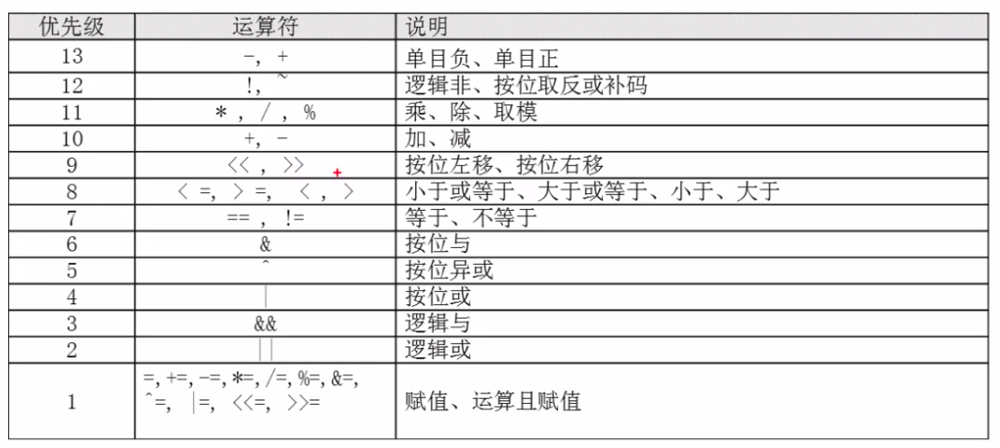

# shell 基础

* 查看当前系统的 shell 版本

    `echo $SHELL`

* 查看当前系统支持的 shell 版本

    `vi /etc/shells`

* 输出指定内容

    `echo [选项] [输出内容]`

    选项：

    * -e 支持 \n 之类的转义字符，支持颜色输出
    * 开启颜色输出：`\e[1;颜色编码`，颜色编码是 数字 + m 的形式
    * 关闭颜色输出：`\e[0m`

* 单行注释

    `# commit`

    但是 `#!/bin/bash` 不是注释，shell 脚本必须以此开头

* 脚本执行

    * `bash filename`，不需要脚本文件有执行权限
    * 直接写脚本文件的路径（相对和绝对都可以），但需要该脚本文件有执行权限

* 标准输出重定向

    * `command > file`，将命令的**正确**执行结果重定向输入到文件中，文件不存在则会自动创建，文件原有的内容会被覆盖

    * `command >> file`，将命令的**正确**执行结果重定向**追加**输入到文件中，文件不存在则会自动创建

* 错误输出重定向

    * `command 2> file`，将命令的**错误**执行结果重定向输入到文件中，文件不存在则会自动创建，文件原有的内容会被覆盖

    * `command 2>> file`，将命令的**错误**执行结果重定向**追加**输入到文件中，文件不存在则会自动创建

    `2>>` 是一个整体，不能写成 `2 >>`

* 输出重定向

    * `command &>`，将命令的执行结果（无论正确或错误）重定向输入到文件中，文件不存在则会自动创建，文件原有的内容会被覆盖

    * `command &>>`，将命令的执行结果（无论正确或错误）重定向**追加**输入到文件中，文件不存在则会自动创建

    * `command &> /dev/null`，将命令的执行结果（无论正确或错误）丢弃

    * `command >> success.log 2>> error.log`，将命令的正确输出保存在 success.log 中，错误输出保存在 error.log 中

* 输入重定向

    * `command < file`，将文件内容重定向输入给命令

    * `command << mark`，使用标准输入向命令输入内容，遇到指定标记时，输入终止

* 多命令顺序执行

    * `command1; command2` 先执行命令1，再执行命令2，没有逻辑联系

        典型应用：`date; command; date`，通过时间差计算命令执行时间

    * `command1 && command2`，命令1正确执行时，命令2才会执行

    * `command1 || command2`，命令1执行错误时，命令2才会执行
        
        典型应用：`command && commandAfterSuccess || commandAfterFailure`，若 command 正确执行，则执行 commandAfterSuccess，若 command 执行错误，则执行 commandAfterSuccess，通过这种方法可以判断 command 是否执行正确

    * `command1 | command2`，也就是管道符，命令1的**正确**输出作为命令2的输入，命令2必须是能够接受输入的命令（比如 echo 就不行），若命令1执行错误，则命令2不会执行

* 通配符

    通配符一般用于文件或目录的匹配

    * `?`，匹配一个任意字符

    * `*`，匹配0个或任意多个的任意字符

    * `[]`，同正则中的中括号

* 其他特殊符号

    * `''`，也就是单引号，引号中的所有特殊符号都**没有**特殊含义
    
    * `""`，也就是双引号，引号中的所有特殊符号都**没有**特殊含义，除了 `$`（引用变量），反撇号（引用命令），`\`（转义字符） 外
    
    * 反撇号，用反撇号将命令括起，将返回命令的执行结果（不推荐）

    * `$(command)`，作用同反撇号，返回命令的执行结果（推荐）

# bash 变量

命名规则是`[a-zA-Z_][0-9a-zA-Z_]{0, 254}`，默认类型为**字符串**。

## 用户自定义变量

### 定义

`变量名=值`

注意等号两边**不能有空格**，值中有空格要用引号括起。若变量已存在就覆盖原有的值。赋空值就`变量名=""`。

### 引用

`$变量名`

### 叠加

`x="$x"123`，在变量 x 的值（字符串类型）后续上字符串 "123"。

### 查看

* `set` 命令可以查看当前作用域下的所有变量及其值

* 执行 `set -u` 命令后，引用未定义的变量将出现错误（默认情况下将引用到空值），主要用于调试

### 删除定义

`unset 变量名`

## 环境变量

环境变量是全局变量，作用域为当前 shell 及其子 shell，用户自定义变量是局部变量，仅在当前 shell 中生效。执行一个 bash 脚本就是在当前 shell 中启用了一个子 shell。环境变量名称一般为全大写。

### 定义

#### 定义一个新的环境变量

`export 变量名=值`

#### 将一个现有的变量声明为环境变量

`export 变量名`

export 命令是 declare -x 的简化命令。

### 查看

`env` 命令查看当前作用域下的所有环境变量（只有环境变量，没有其他）

### 引用

同用户自定义变量

### 删除定义

同用户自定义变量，注意父 shell 中定义的环境变量在子 shell 中虽然可以使用，但不能删除定义，**只能在定义的 shell 中删除**。

### 系统环境变量

系统环境变量能够影响操作系统行为，其名称和作用一般是固定的。

#### 常用环境变量

* PATH：表示系统的命令搜索路径，值是由一系列冒号分隔的目录，可通过变量叠加方式增加目录

* PS1：指定当前 shell 起始符的模式，比如该变量的值为`[\u@\h \W]\$`，则对应的起始符可以是`[root@phr27 /etc]$`

    转义字符

    * \d 当前日期

    * \H 完整主机名

    * \t 二十四小时制时间，格式为 HH:MM:SS

    * \A 二十四小时制时间，格式为 HH:MM

    * \u 当前用户名

    * \w 完整 pwd

    * \W pwd 的最后一个目录

    * \\$ 起始提示符，普通用户对应 $，root 用户对应 #

* PS2：对于多行命令，指定第二行以后的起始符

* HOSTNAME：主机名

* USER：当前登录用户

* HOME：当前用户家目录

* LANG：当前语言

* SHELL：当前 shell 版本

* HISTSIZE：历史命令记录条数，上限 1000

#### 语系变量

* `locale` 查询当前系统使用的语系，包括当前语言，日期时间格式，非货币的数字显示格式，字符串的排序比较规则等等。

* `locale -a` 查看当前系统支持的所有语系。

注意纯字符界面（运行级别 3）不支持中文语系，默认为英语语系。可以通过 zhcon 等插件使之支持中文。

## 位置参数变量

位置参数变量是预定义变量中的一种。位置参数变量的作用是从 bash 脚本外向脚本内**传递参数**。

### $n

$0 是命令字符串本身，$n（n > 0）表示命令后的第 n 个参数，当 n > 9 时，要用 ${n} 引用。

### $#

表示参数个数。

### $*

表示所有参数拼接成的字符串。注意引用该值时必须用 "" 括起。

### $@

表示参数列表。注意引用该值时必须用 "" 括起。

比如：`bash add.sh a b`

* $0 是 `add.sh`
* $1 是 `a`
* $2 是 `b`
* $# 的值是 "2"
* $* 的值是 "a b"
* $@ 的值是 `[a, b]`，直接输出也是 "a b"

### 接收键盘输入

`read [选项] [变量名]`

选项：

* -p 提示信息：等待键盘输入时输出提示信息，提示用户输入。

* -t 秒数：设置超时时间，超过指定秒数就不再等待。

* -n 字符数：最多接收指定数量的字符，输入字符数达到最大数量时，脚本就自动继续执行，不再等待接收。

* -s：不回显

## 预定义变量

### $?

表示在当前 shell 中，上一条命令的返回代码，"0" 表示成功执行，非 "0" 表示执行失败，具体值取决于出错原因。`&&`，`||` 以及分支条件判断就是利用该变量实现功能。

### $$

返回当前进程的 PID。

### $!

返回最近运行的后台进程的 PID。

# bash 运算符

## declare 命令

declare 命令可以用来显式指定变量的类型，不指定则默认为**字符串**。

`declare [+/-][类型][选项] [变量名][=value]`

* -：给变量设定类型

* \+：取消变量的类型

类型（默认字符串）：

* a：列表型

    * 向列表中写入一个值：`列表名[index]=value`，其中 index >= 0。

    * 引用列表中的一个值：`${列表名[index]}`，大括号不可省略。

    * 引用整个列表：`${列表名[*]}`，注意 `$列表名` 和 `${列表名}` 会引用下标为 0 的值。

* i：整数型

选项

* x：环境变量

* r：只读，只读变量不能删除，且不能通过 + 取消，慎用

`declare -p [变量名]` 可以查看指定变量的类型

## 数值运算

* 方法一：用 declare 命令将变量类型声明为整数型

* 方法二：用 expr 数值运算命令，比如求 a 和 b 的和赋值给 c，就是`c=$(expr $a + $b)`，运算符两边必须要有空格。

* 方法三（推荐）：`c=$(($a + $b))`，运算符两边加不加空格都可以。若表达式不需要返回值，则 `((expr))` 即可。

### 运算符



# bash 环境变量配置文件

通过 `source 环境变量配置文件` 或 `. 环境变量配置文件` 能让修改后的配置文件立即生效。`.` 命令就是 `source` 命令。

环境变量配置文件中主要是定义对系统操作环境生效的系统默认环境变量，比如 PATH。

## 种类

* 对所有用户生效的配置文件，分别是 /etc/profile 和 /etc/profile.d/*.sh

* 对当前用户生效的配置文件，~/.bashrc

## 配置文件加载顺序

1. /etc/profile
2. /etc/profile.d/*.sh
3. ~/.bashrc

# bash 字符处理

## 正则表达式和通配符的区别

* 通配符主要用于匹配文件名目录名，正则表达式主要用于匹配文本文件或输出流中的文本。所以 ls, cp, find 等操作文件的命令只支持通配符，不支持正则。

* 通配符需要目标字符串整体完全匹配，正则表达式不需要。

## egrep

`egrep [选项] [reg] [文件名]` 或 `command | egrep [选项] [reg]`，用正则表达式 reg 在目标文件或 command 的执行结果中匹配，返回命中的行。

选项：

* -v：取反，返回没有命中的行

## 字符截取命令

### cut

`cut [选项] [文件名]` 或 `command | cut [选项]`，以指定的单个字符（缺陷）为分隔符，截取指定的列。

选项：

* -f col1[, col2]...：指定第几列，从第一列开始

* -d 分隔符：指定分隔符，默认 TAB

### printf

`printf [格式化模式] [参数]`，和 java 中的 String.format 类似功能。注意格式化模式必须要用 '' 括起。当参数个数很多时，会反复应用格式化模式。printf 不支持流操作，不能使用管道符。

格式化模式：

* `%s`：对应字符串

* `%i`：对应整数

* `%m.nf`：对应浮点数，长度 m 位，小数部分 n 位

### sed

`sed [选项] '动作' [文件名]` 或 ` command | sed [选项] '动作'`，用来增删改查文件或流中的字符串，默认将处理后的文本标准输出，不修改文件。动作用 '' 和 "" 括起都可以。

选项：

* -n：不加此选项，整个文本都会输出；加上该选项后，只会输出操作的行

* -e：允许多个动作，用 ; 分隔

* -i：输出重定向到文件，覆盖原有内容

动作：

* N[,M]p：打印第 N 行（包括）至第 M 行（包括），不加 -n 选项还是会输出整个文本，一般该动作会和 -n 选项一起使用

* N[,M]d：删除指定行

* Na [文本]：在第 N 行后追加(append)一行指定的文本

* Ni [文本]：在第 N 行前插入(insert)一行指定的文本

* N[,M]c [文本]：将第 N 行（包括）到第 M 行（包括）的内容替换为指定文本

* [N[,M]]s/[old]/[new]/[[L]g]：s 前指定行范围，不指定就是整个文本，在行范围内替换字符串。末尾没有 g 就替换每行第一个匹配；有 g 没有 L 就替换所有匹配；Lg 就替换每行的第 L 个匹配。1g 和 g 是一样的

## 字符处理命令

### sort

`sort [选项] 文件名`，以行为单位，根据指定的列对文件内容排序，标准输出，不影响原有内容。

选项：

* -r：反向排序，默认升序，加了该选项就是降序

* -t：指定分割列的分割符

* -n：将列值看成数值进行比较，默认是当成字符串比较

* -k N：以第 N 列为依据进行排序

### wc

`wc [选项] 文件名`，统计文件的行数、单词数和字符数。不加选项，输出结果的格式就是`行数 单词数 字符数 文件名`。

选项：

* -l：只统计行数

* -w：只统计单词数

* -m：只统计字符数

# bash 条件判断与流程控制

## 条件判断

格式：`[ condition ]`，空格不可省略，可以用`[ condition ] && echo true || echo false` 或 `$?` 直接测试，条件为真，`$?` 的值就是 0。

### 文件类型判断

* -b 文件：文件存在且是块设备文件，就为真

* -c 文件：文件存在且是字符设备文件，就为真

* **-d 文件：文件存在且是目录文件，就为真**

* **-e 文件：只要文件存在就为真，不管类型**

* **-f 文件：文件存在且是普通文件，就为真**

* -L 文件：文件存在且是软链接文件，就为真

* -S 文件：文件存在且是套接字文件(.sock)，就为真

### 文件权限判断

* -r 文件：文件存在且当前用户有读权限，就为真

* -w 文件：文件存在且当前用户有写权限，就为真

* -x 文件：文件存在且当前用户有执行权限，就为真

### 文件比较

* 文件1 -nt 文件2：文件1 newer than 文件2，文件1的最近修改时间比文件2的更晚，就为真

* 文件1 -ot 文件2：文件1 older than 文件2，文件1的最近修改时间比文件2的更早，就为真

* 文件1 -ef 文件2：文件1 和 文件2 inode 相同，就为真，可用于判断两个文件是否互为硬链接

### 整数比较

* n1 -eq n2：n1 和 n2 相等，就为真

* n1 -ne n2：n1 和 n2 不相等，就为真

* n1 -gt n2：n1 大于 n2，就为真

* n1 -lt n2：n1 小于 n2，就为真

* n1 -ge n2：n1 大于等于 n2，就为真

* n1 -le n2：n1 小于等于 n2，就为真

n1 和 n2 由于是数值比较操作符的两个操作数，所以会默认当成数值类型，不是字符串型，不需要转换。

### 字符串比较

* -z 字符串：字符串为空("")，就为真

* -n 字符串：字符串不为空，就为真

* s1 == s2：字符串相等，就为真

* s1 != s2：字符串不相等，就为真

字符串比较时，操作数全部都要加上双引号。

### 逻辑运算符

* `[ condition1 -a condition2 ]`：逻辑与

* `[ condition1 -o condition2 ]`：逻辑或

* `[ ! condition ]`：逻辑非

## 流程控制

### 单分支 if

```
if [ condition ];then
    # block
fi
```

### 双分支 if

```
if [ condition ];then
    # ifBlock
else
    # elseBlock
fi
```

### 多分支 if

```
if [ condition ];then
    # block1
elif [ condition ];then
    # block2
...
else
    # elseBlock
fi
```

### case 语句

```
case $var in
    "v1")
        # case1
        ;;
    "v2")
        # case2
        ;;
    ...
    *)
        # defaultCase
        ;;
esac
```

### for 循环

```
for 循环变量 in v1 v2 v3 ... ;do
    # block
done
```

```
for ((初始值;循环结束条件;变量变化));do
    # block
done
```

### while 循环

```
while [ condition ];do
    # block
done
```

### until 循环

```
until [ condition ];do # 条件满足，终止循环
    # block
done
```
