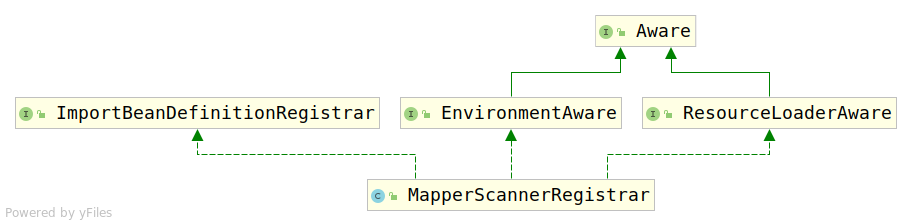

# 2. MapperScannerRegistrar

Mybatis相关的Bean均在该类进行注册，考察该类。该类类图如下：



根据ImportBeanDefinitionRegistrar可以知道，具体的注册逻辑交由

```java
public void registerBeanDefinitions(AnnotationMetadata importingClassMetadata, BeanDefinitionRegistry registry )
```

进行处理。ImportBeanDefinitionRegistrar类一会儿再仔细讲解。首先考虑注册方法，代码如下：

```java
public void registerBeanDefinitions(AnnotationMetadata importingClassMetadata, BeanDefinitionRegistry registry) {

        AnnotationAttributes annoAttrs = AnnotationAttributes.fromMap(importingClassMetadata.getAnnotationAttributes(MapperScan.class.getName()));
        ClassPathMapperScanner scanner = new ClassPathMapperScanner(registry);
        // this check is needed in Spring 3.1
        if (resourceLoader != null) {
            scanner.setResourceLoader(resourceLoader);
        }

        Class<? extends Annotation> annotationClass = annoAttrs.getClass("annotationClass");
        if (!Annotation.class.equals(annotationClass)) {
            scanner.setAnnotationClass(annotationClass);
        }

        Class<?> markerInterface = annoAttrs.getClass("markerInterface");
        if (!Class.class.equals(markerInterface)) {
            scanner.setMarkerInterface(markerInterface);
        }

        Class<? extends BeanNameGenerator> generatorClass = annoAttrs.getClass("nameGenerator");
        if (!BeanNameGenerator.class.equals(generatorClass)) {
            scanner.setBeanNameGenerator(BeanUtils.instantiateClass(generatorClass));
        }

        Class<? extends MapperFactoryBean> mapperFactoryBeanClass = annoAttrs.getClass("factoryBean");
        if (!MapperFactoryBean.class.equals(mapperFactoryBeanClass)) {
            scanner.setMapperFactoryBean(BeanUtils.instantiateClass(mapperFactoryBeanClass));
        }

        scanner.setSqlSessionTemplateBeanName(annoAttrs.getString("sqlSessionTemplateRef"));
        scanner.setSqlSessionFactoryBeanName(annoAttrs.getString("sqlSessionFactoryRef"));

        List<String> basePackages = new ArrayList<String>();
        for (String pkg : annoAttrs.getStringArray("value")) {
            if (StringUtils.hasText(pkg)) {
                basePackages.add(pkg);
            }
        }
        for (String pkg : annoAttrs.getStringArray("basePackages")) {
            if (StringUtils.hasText(pkg)) {
                basePackages.add(pkg);
            }
        }
        for (Class<?> clazz : annoAttrs.getClassArray("basePackageClasses")) {
            basePackages.add(ClassUtils.getPackageName(clazz));
        }
        //优先级 mapperHelperRef > properties > springboot
        String mapperHelperRef = annoAttrs.getString("mapperHelperRef");
        String[] properties = annoAttrs.getStringArray("properties");
        if (StringUtils.hasText(mapperHelperRef)) {
            scanner.setMapperHelperBeanName(mapperHelperRef);
        } else if (properties != null && properties.length > 0) {
            scanner.setMapperProperties(properties);
        } else {
            try {
                scanner.setMapperProperties(this.environment);
            } catch (Exception e) {
                LOGGER.warn("只有 Spring Boot 环境中可以通过 Environment(配置文件,环境变量,运行参数等方式) 配置通用 Mapper，" +
                        "其他环境请通过 @MapperScan 注解中的 mapperHelperRef 或 properties 参数进行配置!" +
                        "如果你使用 tk.mybatis.mapper.session.Configuration 配置的通用 Mapper，你可以忽略该错误!", e);
            }
        }
        scanner.registerFilters();
        scanner.doScan(StringUtils.toStringArray(basePackages));
    }
```

方法逻辑如下：

首先，获取MapperScan注解中所有属性的取值:

```java
AnnotationAttributes annoAttrs = AnnotationAttributes.fromMap(importingClassMetadata.getAnnotationAttributes(MapperScan.class.getName()));
```

其次，创建Scanner，该Scanner用于根据MapperScan配置进行扫描

```java
ClassPathMapperScanner scanner = new ClassPathMapperScanner(registry);
```

然后，解析MapperScan中的属性，对Sanner进行配置：

```java
if (resourceLoader != null) {
            scanner.setResourceLoader(resourceLoader);
        }

        Class<? extends Annotation> annotationClass = annoAttrs.getClass("annotationClass");
        if (!Annotation.class.equals(annotationClass)) {
            scanner.setAnnotationClass(annotationClass);
        }

        Class<?> markerInterface = annoAttrs.getClass("markerInterface");
        if (!Class.class.equals(markerInterface)) {
            scanner.setMarkerInterface(markerInterface);
        }

        Class<? extends BeanNameGenerator> generatorClass = annoAttrs.getClass("nameGenerator");
        if (!BeanNameGenerator.class.equals(generatorClass)) {
            scanner.setBeanNameGenerator(BeanUtils.instantiateClass(generatorClass));
        }

        Class<? extends MapperFactoryBean> mapperFactoryBeanClass = annoAttrs.getClass("factoryBean");
        if (!MapperFactoryBean.class.equals(mapperFactoryBeanClass)) {
            scanner.setMapperFactoryBean(BeanUtils.instantiateClass(mapperFactoryBeanClass));
        }

        scanner.setSqlSessionTemplateBeanName(annoAttrs.getString("sqlSessionTemplateRef"));
        scanner.setSqlSessionFactoryBeanName(annoAttrs.getString("sqlSessionFactoryRef"));

        List<String> basePackages = new ArrayList<String>();
        for (String pkg : annoAttrs.getStringArray("value")) {
            if (StringUtils.hasText(pkg)) {
                basePackages.add(pkg);
            }
        }
        for (String pkg : annoAttrs.getStringArray("basePackages")) {
            if (StringUtils.hasText(pkg)) {
                basePackages.add(pkg);
            }
        }
        for (Class<?> clazz : annoAttrs.getClassArray("basePackageClasses")) {
            basePackages.add(ClassUtils.getPackageName(clazz));
        }
        //优先级 mapperHelperRef > properties > springboot
        String mapperHelperRef = annoAttrs.getString("mapperHelperRef");
        String[] properties = annoAttrs.getStringArray("properties");
        if (StringUtils.hasText(mapperHelperRef)) {
            scanner.setMapperHelperBeanName(mapperHelperRef);
        } else if (properties != null && properties.length > 0) {
            scanner.setMapperProperties(properties);
        } else {
            try {
                scanner.setMapperProperties(this.environment);
            } catch (Exception e) {
                LOGGER.warn("只有 Spring Boot 环境中可以通过 Environment(配置文件,环境变量,运行参数等方式) 配置通用 Mapper，" +
                        "其他环境请通过 @MapperScan 注解中的 mapperHelperRef 或 properties 参数进行配置!" +
                        "如果你使用 tk.mybatis.mapper.session.Configuration 配置的通用 Mapper，你可以忽略该错误!", e);
            }
        }

```

最后，对Scanner进行过滤器配置，然后进行扫描：

```java
scanner.registerFilters();
scanner.doScan(StringUtils.toStringArray(basePackages));
```

接下来考虑ClassPathMapperScanner类。
