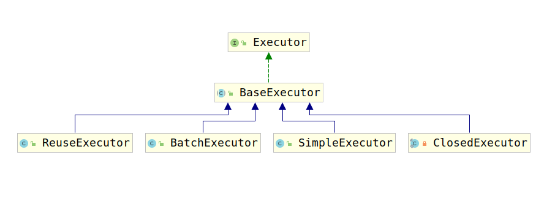
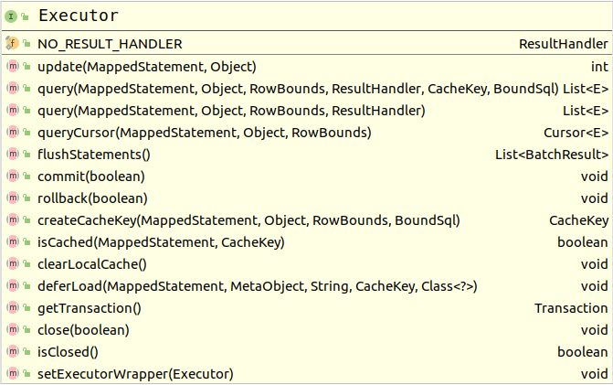

# 5-4 Executor家族

Mybatis中的Executor用来根据MappedStatement和parameter进行sql操作，其家族常见成员类图如下：



Executor接口声明了众多方法，用来处理update、query、flush、commit、rollback和缓存多种操作。接口类图如下：



根据方法名可以看出基本的处理逻辑，下面我们根据其实现类BaseExecutor对各个方法进行分析。

## BaseExecutor

首先考察该类的属性：

```java
  // log
  private static final Log log = LogFactory.getLog(BaseExecutor.class);
  // 事务
  protected Transaction transaction;
  // Executor包装器
  protected Executor wrapper;
  
  protected ConcurrentLinkedQueue<DeferredLoad> deferredLoads;
  protected PerpetualCache localCache;
  protected PerpetualCache localOutputParameterCache;
  // 配置
  protected Configuration configuration;
  // 查询堆栈
  protected int queryStack;
  // 是否关闭
  private boolean closed;
```

1. log：容易知道，该属性用于打印log。
2. transaction: 事务
3. wrapper：由于Mybatis的Executor采用的是装饰器模式，因此这里名为wrapper。
4. deferredLoads:
5. localCache： Mybatis一级缓存（存储结果）
6. localOutputParameterCache：Mybatis一级缓存（存储入参）
7. configuration：Mybatis全局配置
8. queryStack: 查询堆栈
9. closed: 标志，Executor是否关闭。

该类方法主要分为三类：

1. 基本配置的Getter、Setter方法
2. 操作模板方法（模板模式）
3. 子类继承实现的方法。

## 5-4.1 基本配置的Getter、Setter方法

该部分方法主要暴露出Executor的基本数据，例如事务、是否关闭。具体包含如下方法：

1. getTransation()方法，该方法只是简单暴露事务：

    ```java
    @Override
    public Transaction getTransaction() {
      if (closed) {
        throw new ExecutorException("Executor was closed.");
      }
      return transaction;
    }
    ```

2. isClosed()方法，该方法只是返回Executor是否关闭：

    ```java
    @Override
    public boolean isClosed() {
      return closed;
    }
    ```

3. clearLocalCache()，该方法用于清除Mybatis的一级缓存：

  ```java
  @Override
  public void clearLocalCache() {
    if (!closed) {
      localCache.clear();
      localOutputParameterCache.clear();
    }
  }
  ```

  对于一级缓存与二级缓存的更多信息，请查看[一级缓存和二级缓存](5-5.一级缓存和二级缓存.md)

## 5-4.2 操作模板方法

1. close()方法，该方法用于关闭Executor

    ```java
    @Override
    public void close(boolean forceRollback) {
      try {
        try {
          rollback(forceRollback);
        } finally {
          if (transaction != null) {
            transaction.close();
          }
        }
      } catch (SQLException e) {
        // Ignore.  There's nothing that can be done at this point.
        log.warn("Unexpected exception on closing transaction.  Cause: " + e);
      } finally {
        transaction = null;
        deferredLoads = null;
        localCache = null;
        localOutputParameterCache = null;
        closed = true;
      }
    }
    ```

    根据逻辑可知，该方法只是在未关闭时调用rollback(boolean)方法，然后关闭事务，清空缓存数据，并将closed标志设置为true。

2. rollback(boolean)方法

    ```java
    @Override
    public void rollback(boolean required) throws SQLException {
      if (!closed) {
        try {
          clearLocalCache();
          flushStatements(true);
        } finally {
          if (required) {
            transaction.rollback();
          }
        }
      }
    }
    ```

    rollback方法需要参数required，如果required为true，则使用事务进行rollback，否则仅仅在未关闭Executor的情况下，清空本地缓存，并刷新Statement。

3. flushStatements(boolean)方法

    由于Mybatis的最终调用也是根据Statement进行方法调用，同一个Executor可能执行多条Sql，因此会对Statement进行复用或者缓存，所以需要对其进行flush。该方法有两个版本，分别如下：

    ```java
    public List<BatchResult> flushStatements() throws SQLException {
      return flushStatements(false);
    }
    ```

    ```java
    public List<BatchResult> flushStatements(boolean isRollBack) throws SQLException {
      if (closed) {
        throw new ExecutorException("Executor was closed.");
      }
      return doFlushStatements(isRollBack);
    }
    ```

    根据代码可以看出两者均是调用doFlushStatement(boolean)方法。考察该方法：

    ```java
    protected abstract List<BatchResult> doFlushStatements(boolean isRollback)
      throws SQLException;
    ```

    该方法由子类实现，也因此说，此类方法为模板方法。

4. update(MappedStatement,Object)方法

    Mapper的所有insert、delete、update方法均由该方法进行处理，考虑该方法：

    ```java
    @Override
    public int update(MappedStatement ms, Object parameter) throws SQLException {
      ErrorContext.instance().resource(ms.getResource()).activity("executing an update").object(ms.getId());
      if (closed) {
        throw new ExecutorException("Executor was closed.");
      }
      // 清除本地缓存
      clearLocalCache();
      // 真正调用更新方法
      return doUpdate(ms, parameter);
    }
    ```

    真正的更新逻辑交给了doUpdate(MappedSatement，Object)方法，然而方法以do开头，猜想它要交给子类实现，考察该方法，可见确实：

    ```java
    protected abstract List<BatchResult> doFlushStatements(boolean isRollback)
      throws SQLException;
    ```

5. query()方法

    该方法有两种形式：

    ```java
    List<E> query(MappedStatement ms, Object parameter, RowBounds rowBounds, ResultHandler resultHandler) throws SQLException；

    List<E> query(MappedStatement ms, Object parameter, RowBounds rowBounds, ResultHandler resultHandler, CacheKey key, BoundSql boundSql) throws SQLException；
    ```

    首先考察第一个query方法：

    ```java
    public <E> List<E> query(MappedStatement ms, Object parameter, RowBounds rowBounds, ResultHandler resultHandler) throws SQLException {
      // 获取sql
      BoundSql boundSql = ms.getBoundSql(parameter);
      // 根据sql、参数等一系列信息获取缓存的key
      CacheKey key = createCacheKey(ms, parameter, rowBounds, boundSql);
      // 进行查询操作
      return query(ms, parameter, rowBounds, resultHandler, key, boundSql);
    }
    ```

    下面我们考察被调用的第二个查询操作：

    ```java
    @Override
    public <E> List<E> query(MappedStatement ms, Object parameter, RowBounds rowBounds, ResultHandler resultHandler, CacheKey key, BoundSql boundSql) throws SQLException {
      ErrorContext.instance().resource(ms.getResource()).activity("executing a query").object(ms.getId());
      // 如果Executor被关闭，则退出
      if (closed) {
        throw new ExecutorException("Executor was closed.");
      }
      // 如果查询堆栈层数为0，或者缓存需要刷新，则刷新缓存。
      if (queryStack == 0 && ms.isFlushCacheRequired()) {
        clearLocalCache();
      }
      List<E> list;
      try {
        // 首先查询堆栈层数递增
        queryStack++;
        // 尝试从本地缓存中获取结果
        list = resultHandler == null ? (List<E>) localCache.getObject(key) : null;
        if (list != null) {
          // 获取结果不为null，缓存存储过程中的输出参数如果Statement类型为CALLABLE的话（即调用的是存储过程）
          handleLocallyCachedOutputParameters(ms, key, parameter, boundSql);
        } else {
          // 从数据库中查询结果
          list = queryFromDatabase(ms, parameter, rowBounds, resultHandler, key, boundSql);
        }
      } finally {
        // 查询完成后queryStack --
        queryStack--;
      }
      if (queryStack == 0) {
        // 延迟加载
        for (DeferredLoad deferredLoad : deferredLoads) {
          deferredLoad.load();
        }
        // issue #601
        deferredLoads.clear();
        if (configuration.getLocalCacheScope() == LocalCacheScope.STATEMENT) {
          // issue #482
          // 如果缓存级别是STATEMENT级别的，那么清除缓存
          clearLocalCache();
        }
      }
      return list;
    }
    ```

    考察`handleLocallyCachedOutputParameters(MappedStatement, CacheKey, Object, BoundSql)`方法：

    ```java
    private void handleLocallyCachedOutputParameters(MappedStatement ms, CacheKey key, Object parameter, BoundSql boundSql) {
        if (ms.getStatementType() == StatementType.CALLABLE) {
          final Object cachedParameter = localOutputParameterCache.getObject(key);
          if (cachedParameter != null && parameter != null) {
            final MetaObject metaCachedParameter = configuration.newMetaObject(cachedParameter);
            final MetaObject metaParameter = configuration.newMetaObject(parameter);
            for (ParameterMapping parameterMapping : boundSql.getParameterMappings()) {
              if (parameterMapping.getMode() != ParameterMode.IN) {
                final String parameterName = parameterMapping.getProperty();
                final Object cachedValue = metaCachedParameter.getValue(parameterName);
                metaParameter.setValue(parameterName, cachedValue);
              }
            }
          }
        }
      }
    ```

    由于这里使用的是存储过程，这一技术基本已经被淘汰，存储过程的缺点请查看[]()，这里我们不详细说明。继续考察真正的查询逻辑，考察queryFromDataBase()方法。

    ```java
    private <E> List<E> queryFromDatabase(MappedStatement ms, Object parameter, RowBounds rowBounds, ResultHandler resultHandler, CacheKey key, BoundSql boundSql) throws SQLException {
      List<E> list;
      // 先在本地缓存中放入占位符号
      localCache.putObject(key, EXECUTION_PLACEHOLDER);
      try {
        // 进行真正的查询操作
        list = doQuery(ms, parameter, rowBounds, resultHandler, boundSql);
      } finally {
        // 移除占位符
        localCache.removeObject(key);
      }
      // 将数据放入到缓存中
      localCache.putObject(key, list);
      // 存储过程处理
      if (ms.getStatementType() == StatementType.CALLABLE) {
        localOutputParameterCache.putObject(key, parameter);
      }
      return list;
    }
    ```
