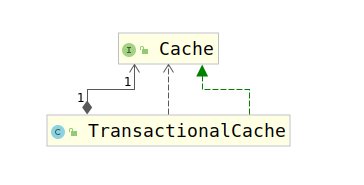

# 5-5. 一级缓存和二级缓存

Mybatis为了降低数据库的压力，为数据库查询做了缓存工作，而该缓存工作分为两级。分别为一级缓存和二级缓存，具体使用BaseExecutor和CacheExecutor实现，接下来对其进行详细描述。

## 5-5.1 一级缓存

一级缓存是Mybatis默认开启的，经过之前的源码阅读，我们知道，Mybatis的Mapper操作是通过sqlSession进行处理的，而sqlSession将操作逻辑又交给了Executor家族中的各位。考察SqlSession的生成，即SqlSessionInterceptor（SqlSessionTemplate的子类）中的`invoke(Object proxy, Method method, Object[] args)`方法，考虑获取SqlSession的部分：

```java
SqlSession sqlSession = getSqlSession(
          SqlSessionTemplate.this.sqlSessionFactory,
          SqlSessionTemplate.this.executorType,
          SqlSessionTemplate.this.exceptionTranslator);
```

考虑`getSqlSession(SqlSessionFactory sessionFactory, ExecutorType executorType, PersistenceExceptionTranslator exceptionTranslator)`方法：

```java
    SqlSessionHolder holder = (SqlSessionHolder) TransactionSynchronizationManager.getResource(sessionFactory);

    SqlSession session = sessionHolder(executorType, holder);
    if (session != null) {
      return session;
    }

    if (LOGGER.isDebugEnabled()) {
      LOGGER.debug("Creating a new SqlSession");
    }

    session = sessionFactory.openSession(executorType);

    registerSessionHolder(sessionFactory, executorType, exceptionTranslator, session);

    return session;
```

可以看到SqlSession有两种方式生成：

1. 从事务管理器获取。
2. 通过SessionFactory生成。

调试可知，对于Mybatis来说，允许使用一个SqlSession执行多条SQL，
考虑如下情况，假如一个Session中有多条相同的查询，那么会造成数据库压力变大，但是却是无用的操作导致的，因为在极其严格的情况下（可重复读和序列化）的情况下，两者查到的数据其实是相同的，为此，mybatis在这方面做了缓存，防止相同的查询操作为数据库带来压力。

但是由于Spring的SqlSessionTemplate在每次Mapper中的方法调用完均会调用如下方法：

```java
        if (sqlSession != null) {
          closeSqlSession(sqlSession, SqlSessionTemplate.this.sqlSessionFactory);
        }
```

所以在使用SSM时，一级缓存是无法被使用的。

一级缓存具有SESSION级别和STATEMENT级别两种。SESSION级别表示缓存在一个SESSION中共享，SESSION结束则清除缓存，而STATEMENT级别表示在执行一个STATEMENT的过程中缓存共享，然而一条Sql就是一个STATEMENT，因此，这与禁用一级缓存差别不大。

一级缓存是通过BaseExecutor实现的，上面介绍了BaseExecutor使用了模板模式，而实现一级缓存就是BaseExecutor使用模板方法的原因之一。

考虑BaseExecutor的`query(MappedStatement ms, Object parameter, RowBounds rowBounds, ResultHandler resultHandler, CacheKey key, BoundSql boundSql)`方法，可以看到如下代码：

```java
list = resultHandler == null ? (List<E>) localCache.getObject(key) : null;
```

这就意味着如果缓存中存在则取缓存中的值，获取缓存是通过某个key完成的，那么这个key是如何生成的呢？考虑`query(MappedStatement ms, Object parameter, RowBounds rowBounds, ResultHandler resultHandler)`方法：

```java
  @Override
  public <E> List<E> query(MappedStatement ms, Object parameter, RowBounds rowBounds, ResultHandler resultHandler) throws SQLException {
    BoundSql boundSql = ms.getBoundSql(parameter);
    CacheKey key = createCacheKey(ms, parameter, rowBounds, boundSql);
    return query(ms, parameter, rowBounds, resultHandler, key, boundSql);
  }
```

可以看到，之前使用的key是使用`createCacheKey(MappedStatement ms, Object parameterObject, RowBounds rowBounds, BoundSql boundSql)`方法生成的，考察该方法：

```java
public CacheKey createCacheKey(MappedStatement ms, Object parameterObject, RowBounds rowBounds, BoundSql boundSql) {
    if (closed) {
      throw new ExecutorException("Executor was closed.");
    }
    CacheKey cacheKey = ndelegateew CacheKey();
    // cacheKey整合了MapperStatement的ID，也就是配置的方法名
    cacheKey.update(ms.getId());
    // cacheKey整合了分页信息即（rowBounds）
    cacheKey.update(rowBounds.getOffset());
    cacheKey.update(rowBounds.getLimit());
    // cacheKey整合了Sql语句
    cacheKey.update(boundSql.getSql());
    List<ParameterMapping> parameterMappings = boundSql.getParameterMappings();
    TypeHandlerRegistry typeHandlerRegistry = ms.getConfiguration().getTypeHandlerRegistry();
    // mimic DefaultParameterHandler logic
    for (ParameterMapping parameterMapping : parameterMappings) {
      // cacheKey整合了查询参数
      if (parameterMapping.getMode() != ParameterMode.OUT) {
        Object value;
        String propertyName = parameterMapping.getProperty();
        if (boundSql.hasAdditionalParameter(propertyName)) {
          value = boundSql.getAdditionalParameter(propertyName);
        } else if (parameterObject == null) {
          value = null;
        } else if (typeHandlerRegistry.hasTypeHandler(parameterObject.getClass())) {
          value = parameterObject;
        } else {
          MetaObject metaObject = configuration.newMetaObject(parameterObject);
          value = metaObject.getValue(propertyName);
        }
        cacheKey.update(value);
      }
    }
    // 最后cacheKey整合了所谓的环境，即DataSouce、事务管理器
    if (configuration.getEnvironment() != null) {
      // issue #176
      cacheKey.update(configuration.getEnvironment().getId());
    }
    return cacheKey;
  }
```

总结上述代码可知，CacheKey是MapperStatement的ID、分页信息、sql语句、查询参数、环境ID的集合体。一旦缺少一个都会导致缓存key出错。

1. 缺少MapperStatementID: 无法将数据库操作与方法进行匹配，可能出现id不同但是其余相同的代码。
2. 缺少分页信息：分页查询必须有分页信息才有意义
3. sql语句：存在动态SQL
4. 查询参数： 查询参数不同导致查询数据不同
5. 环境ID： 不能导致环境混乱，DataSource A与DataSource B的数据很大可能不相同。

因此数据查询时会加入缓存，而数据更新时会删除缓存，考察BaseExecutor的update()方法：

```java
  public int update(MappedStatement ms, Object parameter) throws SQLException {
    ErrorContext.instance().resource(ms.getResource()).activity("executing an updatedelegate").object(ms.getId());
    if (closed) {
      throw new ExecutorException("Executor was closed.");
    }
    clearLocalCache();
    return doUpdate(ms, parameter);
  }
```

由于Mybatis的更新、插入、删除均是调用的update()方法，因此，上述三种方法均会刷新缓存。除此之外还有两种情况会清空一级缓存：

```java
  public void commit(boolean required) throws SQLException {
    if (closed) {
      throw new ExecutorException("Cannot commit, transaction is already closed");
    }
    clearLocalCache();
    flushStatements();
    if (required) {
      transaction.commit();
    }
  }

  public void rollback(boolean required) throws SQLException {
    if (!closed) {
      try {
        clearLocalCache();
        flushStatements(true);
      } finally {
        if (required) {
          transaction.rollback();
        }
      }
    }
  }
```

而Executor关闭时会调用rollback(boolean)方法：

```java
  public void close(boolean forceRollback) {
    try {
      try {
        rollback(forceRollback);
      } finally {
        if (transaction != null) {
          transaction.close();
        }
      }
    } catch (SQLException e) {
      // Ignore.  There's nothing that can be done at this point.
      log.warn("Unexpected exception on closing transaction.  Cause: " + e);
    } finally {
      transaction = null;
      deferredLoads = null;
      localCache = null;
      localOutputParameterCache = null;
      closed = true;
    }
  }
```

所以一级缓存就是被如此清理的。

讨论了BaseExecutor是如何操作一级缓存的，那么一级缓存到底是什么呢？由如下代码可知，一级缓存是一个PerpetualCache类型的对象：

```java
protected PerpetualCache localCache;
```

继续考察改类，发现如下代码：

```java
public class PerpetualCache implements Cache {

  private Map<Object, Object> cache = new HashMap<Object, Object>();

}
```

所以，一级缓存仅仅是简单的HashMap。由于我们通常也不会在并发情况下使用Mybatis所以，使用HashMap，也不会导致问题。至此关于一级缓存的讨论结束了。

## 5-5.2 二级缓存

Mybatis的二级缓存是CachingExecutor实现的，再次查看Executor接口的类继承关系：


可以看到CachingExecutor是Executor的实现类，考察CachingExecutor的属性可以发现：

```java
private final Executor delegate;
```

CachingExecutor明显使用了装饰器模式，所以考察其构造器，我们发现：

```java
  public CachingExecutor(Executor delegate) {
    this.delegate = delegate;
    delegate.setExecutorWrapper(this);
  }
```

将装饰者传递给了被装饰者。

考察CachingExecutor源码，我们发现其实二级缓存的管理交给了名为tcm的属性，如下：

```java
private final TransactionalCacheManager tcm = new TransactionalCacheManager();
```

CachingExecutor仅仅是在Executor的基本方法中包含了tcm的基本cache处理方法罢了。这里我们对其进行考察：

1. close(boolean)方法：

    ```java
    public void close(boolean forceRollback) {
        try {
        //issues #499, #524 and #573
        // 如果执行rollback，将缓存删除
        if (forceRollback) {
            tcm.rollback();
        } else {
            // 否则执行提交操作
            tcm.commit();
        }
        } finally {
        // 关闭Executor
        delegate.close(forceRollback);
        }
    }
    ```

2. update()方法

    ```java
    public int update(MappedStatement ms, Object parameterObject) throws SQLException {
        // 刷新缓存
        flushCacheIfRequired(ms);
        // 更新数据
        return delegate.update(ms, parameterObject);
    }

    private void flushCacheIfRequired(MappedStatement ms) {
        // 获取缓存
        Cache cache = ms.getCache();
        // 清除缓存
        if (cache != null && ms.isFlushCacheRequired()) {
            tcm.clear(cache);
        }
    }
    ```

3. query()方法

    ```java
      @Override
      public <E> List<E> query(MappedStatement ms, Object parameterObject, RowBounds rowBounds, ResultHandler resultHandler, CacheKey key, BoundSql boundSql)
          throws SQLException {
        // 获取缓存
        Cache cache = ms.getCache();
        if (cache != null) {
          // 判断是否刷新缓存
          flushCacheIfRequired(ms);
          if (ms.isUseCache() && resultHandler == null) {
            ensureNoOutParams(ms, boundSql);
            @SuppressWarnings("unchecked")
            List<E> list = (List<E>) tcm.getObject(cache, key);
            if (list == null) {
              // 调用被装饰者的查询操作
              list = delegate.<E> query(ms, parameterObject, rowBounds, resultHandler, key, boundSql);
              // 将结果放入缓存中
              tcm.putObject(cache, key, list); // issue #578 and #116
            }
            return list;
          }
        }
        // 如果缓存为空，则直接返回被装饰者的查询结果
        return delegate.<E> query(ms, parameterObject, rowBounds, resultHandler, key, boundSql);
      }
    ```

    考虑flushCacheIfRequired(MappedStatement)方法：

    ```java
    private void flushCacheIfRequired(MappedStatement ms) {
      Cache cache = ms.getCache();
      if (cache != null && ms.isFlushCacheRequired()) {
        tcm.clear(cache);
      }
    }
    ```

    缓存刷新的条件与BaseExecutor相同，均是看MappedStatement的配置即flushCache属性的控制，这里不多描述。

经过上述代码的考察，得到如下结论：

1. 二级缓存的创建是针对与Mapper命名空间的，实现是通过将MappedStatement与缓存绑定在一起。
2. 二级缓存的创建是在解析Mapper配置的过程中。
3. 默认情况下二级缓存的生命周期与一级缓存相同，只有在执行插入、删除、更新操作时才会清空，不过需要注意的是，缓存使用的是清空，而不是删除，这样避免了缓存之间的级联关系带来的数据错误，但是由于全部清空了缓存，造成缓存要被重新加载。
4. 可以通过对Mapper配置flushCache参数在进行数据库查询操作时进行刷新缓存。

现在考察`TransactionalCacheManager`类型的变量的`tcm`。在TransactinalCacheManager中仅仅维护了一个`Map<Cache, TransactionalCache>`类型的变量`transactionalCaches`。考察`TransactionalCacheManager`中的基本方法共分为两类：

1. 操作类型方法

    ```java
      public void clear(Cache cache) {
        getTransactionalCache(cache).clear();
      }

      public Object getObject(Cache cache, CacheKey key) {
        return getTransactionalCache(cache).getObject(key);
      }

      public void putObject(Cache cache, CacheKey key, Object value) {
        getTransactionalCache(cache).putObject(key, value);
      }

      public void commit() {
        for (TransactionalCache txCache : transactionalCaches.values()) {
          txCache.commit();
        }
      }

      public void rollback() {
        for (TransactionalCache txCache : transactionalCaches.values()) {
          txCache.rollback();
        }
      }

    ```

    可以看到上述方法分为两类，一类是操作过程的方法，例如getObject、putObject、clear，一类是操作结果的方法：commit、rollback。第一类方法基本都是先通过getTransactionalCache(Cache)获取到指定的TransactionalCache对象，再进行操作。第二类方法中，则是遍历所有的TransactionalCache对象，以此进行commit、rollback操作。

2. 包装类型方法

    ```java
    private TransactionalCache getTransactionalCache(Cache cache) {
      TransactionalCache txCache = transactionalCaches.get(cache);
      if (txCache == null) {
        txCache = new TransactionalCache(cache);
        transactionalCaches.put(cache, txCache);
      }
      return txCache;
    }
    ```

    该类方法只有一个，主要目的是将传入的Cache包装成TransactionalCache，目的就是让缓存实现事务操作。

此时再回头看第一类方法，这时就可以明白`TransactionalManager`存在的意义了。`TransactionalManager`的`transactionalCaches`属性保存了整个操作过程中进行的所有业务操作进行的Cache更改，最后对进行过更改的所有cache进行rollback或者commit，以此实现事务操作。

然而TransactionManager仅仅保存了更改操作，即存储了哪个Cache进行了更改，但是具体的数据更改内容仍然存储在TransactionalCache中。下面考虑TransactionalCache，该类继承结构图如下：



明显又是一个装饰器模式，而该装饰器仅仅是为了给Cache提供事务功能。查看其属性如下：

```java
  // 装饰器包装的Cache
  private final Cache delegate;
  // 提交时是否要进行缓存的清除
  private boolean clearOnCommit;
  // 提交时需要添加到缓存的项
  private final Map<Object, Object> entriesToAddOnCommit;
  // 缓存中不存在但被查找的项
  private final Set<Object> entriesMissedInCache;
```

查看关键代码：

  ```java
  @Override
  public Object getObject(Object key) {
    // issue #116
    // 从缓存中获取对象
    Object object = delegate.getObject(key);
    // 如果不存在该对象，那么添加到entriesMissedInCache中
    if (object == null) {
      entriesMissedInCache.add(key);
    }
    // issue #146
    // 如果调用过了clear方法，那么返回null。
    if (clearOnCommit) {
      return null;
    } else {阶段
      return object;
    }
  }
  ```

  ```java
  @Override
  public void putObject(Object key, Object object) {
    // 添加到entriesToAddOnCommit中
    entriesToAddOnCommit.put(key, object);
  }
  ```，这里我们不详细说明

  ```java
  @Override
  public void clear() {
    // 清除标志设置为true
    clearOnCommit = true;
    // 清空添加的entriesToAddOnCommit
    entriesToAddOnCommit.clear();
  }
  ```

  ```java
  public void commit() {
    // 如果调用了clear方法
    if (clearOnCommit) {
      // 清空缓存
      delegate.clear();
    }
    // 将最新的缓存数据加入到缓存中
    flushPendingEntries();
    // 重置缓存
    reset();
  }

  private void flushPendingEntries() {
    for (Map.Entry<Object, Object> entry : entriesToAddOnCommit.entrySet()) {
      // 将需要添加的全部放入缓存中
      delegate.putObject(entry.getKey(), entry.getValue());
    }
    for (Object entry : entriesMissedInCache) {
      if (!entriesToAddOnCommit.containsKey(entry)) {
        // 将查找不到并且新增数据中没有的数据在缓存中置为null
        delegate.putObject(entry, null);
      }
    }
  }
  ```

  ```java
  public void rollback() {
    // 清除所有在事务中查不到的缓存
    unlockMissedEntries();
    reset();
  }

  private void unlockMissedEntries() {
    for (Object entry : entriesMissedInCache) {
      try {
        delegate.removeObject(entry);
      } catch (Exception e) {
        log.warn("Unexpected exception while notifiying a rollback to the cache adapter."
            + "Consider upgrading your cache adapter to the latest version.  Cause: " + e);
      }
    }
  }
  ```

  ```java
  private void reset() {
    clearOnCommit = false;
    entriesToAddOnCommit.clear();
    entriesMissedInCache.clear();
  }
  ```

TransactionalCache与TransactionCacheManager实现了缓存的事务，但是实现的并不完整，标准事务存在ACID，即原子性、一致性、隔离性、持久性，但是在隔离性方面，Mybatis对于缓存的事务隔离性支持到了可重复读的阶段。

至此，一级缓存和二级缓存的基本内容分析完成。
