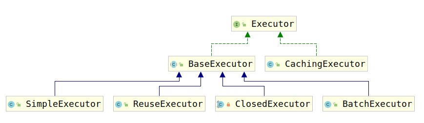

# 5-5. 一级缓存和二级缓存

Mybatis为了降低数据库的压力，为数据库查询做了缓存工作，而该缓存工作分为两级。分别为一级缓存和二级缓存，具体使用BaseExecutor和CacheExecutor实现，接下来对其进行详细描述。

## 5-5.1 一级缓存

一级缓存是Mybatis默认开启的，经过之前的源码阅读，我们知道，Mybatis的Mapper操作是通过sqlSession进行处理的，而sqlSession将操作逻辑又交给了Executor家族中的各位。考察SqlSession的生成，即SqlSessionInterceptor（SqlSessionTemplate的子类）中的`invoke(Object proxy, Method method, Object[] args)`方法，考虑获取SqlSession的部分：

```java
SqlSession sqlSession = getSqlSession(
          SqlSessionTemplate.this.sqlSessionFactory,
          SqlSessionTemplate.this.executorType,
          SqlSessionTemplate.this.exceptionTranslator);
```

考虑`getSqlSession(SqlSessionFactory sessionFactory, ExecutorType executorType, PersistenceExceptionTranslator exceptionTranslator)`方法：

```java
    SqlSessionHolder holder = (SqlSessionHolder) TransactionSynchronizationManager.getResource(sessionFactory);

    SqlSession session = sessionHolder(executorType, holder);
    if (session != null) {
      return session;
    }

    if (LOGGER.isDebugEnabled()) {
      LOGGER.debug("Creating a new SqlSession");
    }

    session = sessionFactory.openSession(executorType);

    registerSessionHolder(sessionFactory, executorType, exceptionTranslator, session);

    return session;
```

可以看到SqlSession有两种方式生成：

1. 从事务管理器获取。
2. 通过SessionFactory生成。

调试可知，对于Mybatis来说，一条事务中的Sql执行均使用一个SqlSession，而未使用事务的则使用SessionFactory创建新的SqlSession来执行。

考虑如下情况，假如一个Session中有多条相同的查询，那么会造成数据库压力变大，但是却是无用的操作导致的，因为在极其严格的情况下（可重复读和序列化）的情况下，两者查到的数据其实是相同的，为此，mybatis在这方面做了缓存，防止相同的查询操作为数据库带来压力。

但是由于SqlSessionTemplate在每次Mapper中的方法调用完均会调用如下方法：

```java
        if (sqlSession != null) {
          closeSqlSession(sqlSession, SqlSessionTemplate.this.sqlSessionFactory);
        }
```

所以在使用SSM时，一级缓存是无法被使用的。

一级缓存具有SESSION级别和STATEMENT级别两种。SESSION级别表示缓存在一个SESSION中共享，SESSION结束则清除缓存，而STATEMENT级别表示在执行一个STATEMENT的过程中缓存共享，然而一条Sql就是一个STATEMENT，因此，这与禁用一级缓存差别不大。

一级缓存是通过BaseExecutor实现的，上面介绍了BaseExecutor使用了模板模式，而实现一级缓存就是BaseExecutor使用模板方法的原因之一。

考虑BaseExecutor的`query(MappedStatement ms, Object parameter, RowBounds rowBounds, ResultHandler resultHandler, CacheKey key, BoundSql boundSql)`方法，可以看到如下代码：

```java
list = resultHandler == null ? (List<E>) localCache.getObject(key) : null;
```

这就意味着如果缓存中存在则取缓存中的值，获取缓存是通过某个key完成的，那么这个key是如何生成的呢？考虑`query(MappedStatement ms, Object parameter, RowBounds rowBounds, ResultHandler resultHandler)`方法：

```java
  @Override
  public <E> List<E> query(MappedStatement ms, Object parameter, RowBounds rowBounds, ResultHandler resultHandler) throws SQLException {
    BoundSql boundSql = ms.getBoundSql(parameter);
    CacheKey key = createCacheKey(ms, parameter, rowBounds, boundSql);
    return query(ms, parameter, rowBounds, resultHandler, key, boundSql);
  }
```

可以看到，之前使用的key是使用`createCacheKey(MappedStatement ms, Object parameterObject, RowBounds rowBounds, BoundSql boundSql)`方法生成的，考察该方法：

```java
public CacheKey createCacheKey(MappedStatement ms, Object parameterObject, RowBounds rowBounds, BoundSql boundSql) {
    if (closed) {
      throw new ExecutorException("Executor was closed.");
    }
    CacheKey cacheKey = ndelegateew CacheKey();
    // cacheKey整合了MapperStatement的ID，也就是配置的方法名
    cacheKey.update(ms.getId());
    // cacheKey整合了分页信息即（rowBounds）
    cacheKey.update(rowBounds.getOffset());
    cacheKey.update(rowBounds.getLimit());
    // cacheKey整合了Sql语句
    cacheKey.update(boundSql.getSql());
    List<ParameterMapping> parameterMappings = boundSql.getParameterMappings();
    TypeHandlerRegistry typeHandlerRegistry = ms.getConfiguration().getTypeHandlerRegistry();
    // mimic DefaultParameterHandler logic
    for (ParameterMapping parameterMapping : parameterMappings) {
      // cacheKey整合了查询参数
      if (parameterMapping.getMode() != ParameterMode.OUT) {
        Object value;
        String propertyName = parameterMapping.getProperty();
        if (boundSql.hasAdditionalParameter(propertyName)) {
          value = boundSql.getAdditionalParameter(propertyName);
        } else if (parameterObject == null) {
          value = null;
        } else if (typeHandlerRegistry.hasTypeHandler(parameterObject.getClass())) {
          value = parameterObject;
        } else {
          MetaObject metaObject = configuration.newMetaObject(parameterObject);
          value = metaObject.getValue(propertyName);
        }
        cacheKey.update(value);
      }
    }
    // 最后cacheKey整合了所谓的环境，即DataSouce、事务管理器
    if (configuration.getEnvironment() != null) {
      // issue #176
      cacheKey.update(configuration.getEnvironment().getId());
    }
    return cacheKey;
  }
```

总结上述代码可知，CacheKey是MapperStatement的ID、分页信息、sql语句、查询参数、环境ID的集合体。一旦缺少一个都会导致缓存key出错。

1. 缺少MapperStatementID: 无法将数据库操作与方法进行匹配，可能出现id不同但是其余相同的代码。
2. 缺少分页信息：分页查询必须有分页信息才有意义
3. sql语句：存在动态SQL
4. 查询参数： 查询参数不同导致查询数据不同
5. 环境ID： 不能导致环境混乱，DataSource A与DataSource B的数据很大可能不相同。

因此数据查询时会加入缓存，而数据更新时会删除缓存，考察BaseExecutor的update()方法：

```java
  public int update(MappedStatement ms, Object parameter) throws SQLException {
    ErrorContext.instance().resource(ms.getResource()).activity("executing an updatedelegate").object(ms.getId());
    if (closed) {
      throw new ExecutorException("Executor was closed.");
    }
    clearLocalCache();
    return doUpdate(ms, parameter);
  }
```

由于Mybatis的更新、插入、删除均是调用的update()方法，因此，上述三种方法均会刷新缓存。除此之外还有两种情况会清空一级缓存：

```java
  public void commit(boolean required) throws SQLException {
    if (closed) {
      throw new ExecutorException("Cannot commit, transaction is already closed");
    }
    clearLocalCache();
    flushStatements();
    if (required) {
      transaction.commit();
    }
  }

  public void rollback(boolean required) throws SQLException {
    if (!closed) {
      try {
        clearLocalCache();
        flushStatements(true);
      } finally {
        if (required) {
          transaction.rollback();
        }
      }
    }
  }
```

而Executor关闭时会调用rollback(boolean)方法：

```java
  public void close(boolean forceRollback) {
    try {
      try {
        rollback(forceRollback);
      } finally {
        if (transaction != null) {
          transaction.close();
        }
      }
    } catch (SQLException e) {
      // Ignore.  There's nothing that can be done at this point.
      log.warn("Unexpected exception on closing transaction.  Cause: " + e);
    } finally {
      transaction = null;
      deferredLoads = null;
      localCache = null;
      localOutputParameterCache = null;
      closed = true;
    }
  }
```

所以一级缓存就是被如此清理的。

讨论了BaseExecutor是如何操作一级缓存的，那么一级缓存到底是什么呢？由如下代码可知，一级缓存是一个PerpetualCache类型的对象：

```java
protected PerpetualCache localCache;
```

继续考察改类，发现如下代码：

```java
public class PerpetualCache implements Cache {

  private Map<Object, Object> cache = new HashMap<Object, Object>();

}
```

所以，一级缓存仅仅是简单的HashMap。由于我们通常也不会在并发情况下使用Mybatis所以，使用HashMap，也不会导致问题。至此关于一级缓存的讨论结束了。

## 5-5.2 二级缓存

Mybatis的二级缓存是CachingExecutor实现的，再次查看Executor接口的类继承关系：



可以看到CachingExecutor是Executor的实现类，考察CachingExecutor的属性可以发现：

```java
private final Executor delegate;
```

CachingExecutor明显使用了装饰器模式，所以考察其构造器，我们发现：

```java
  public CachingExecutor(Executor delegate) {
    this.delegate = delegate;
    delegate.setExecutorWrapper(this);
  }
```

将装饰者传递给了被装饰者。

考察CachingExecutor源码，我们发现其实二级缓存的管理交给了名为tcm的属性，如下：

```java
private final TransactionalCacheManager tcm = new TransactionalCacheManager();
```

CachingExecutor仅仅是在Executor的基本方法中包含了tcm的基本cache处理方法罢了。这里我们对其进行考察：

1. close(boolean)方法：

    ```java
    public void close(boolean forceRollback) {
        try {
        //issues #499, #524 and #573
        // 如果执行rollback，将缓存删除
        if (forceRollback) {
            tcm.rollback();
        } else {
            // 否则执行提交操作
            tcm.commit();
        }
        } finally {
        // 关闭Executor
        delegate.close(forceRollback);
        }
    }
    ```

2. update()方法

    ```java
    public int update(MappedStatement ms, Object parameterObject) throws SQLException {
        // 刷新缓存
        flushCacheIfRequired(ms);
        // 更新数据
        return delegate.update(ms, parameterObject);
    }

    private void flushCacheIfRequired(MappedStatement ms) {
        // 获取缓存
        Cache cache = ms.getCache();
        // 清除缓存
        if (cache != null && ms.isFlushCacheRequired()) {
            tcm.clear(cache);
        }
    }
    ```