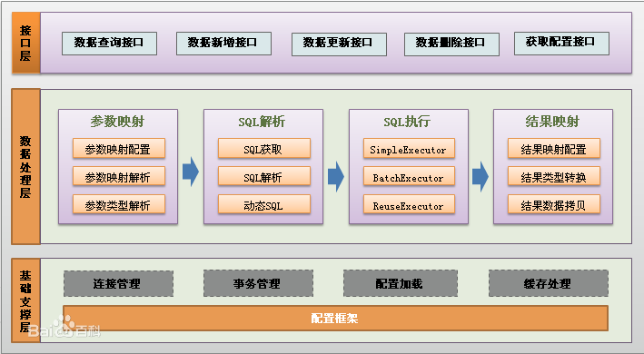
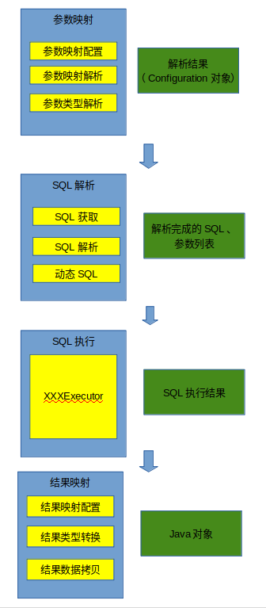

# Mybatis功能

Mybatis是一款优秀的持久化框架。尽管这是Mybatis官网自己说的，但是他确实说对了，现在几乎所有的Java Web应用都在使用SSM，其中的M就是指的是Mybatis框架。本部分博客旨在介绍Mybatis源码，引导读者对其进行分析。然而这最重要的就是要先了解Mybatis的功能。

Mybatis最主要的功能就是通过XML文件与接口联合，将真正的数据库操作，映射到对应的接口方法，进而进行数据库的持久化操作。这里我们以Mybatis文档中的教程为例，来对该功能进行解释。

该教程地址如下：[地址](https://mybatis.org/mybatis-3/zh/getting-started.html)

我们可以看一下使用Mybatis的几个步骤：

1. 创建一个Mybatis的配置文件，即文档中的`org/mybatis/example/mybatis-config.xml`
2. 根据配置文件构建`SqlSessionFactory`
3. 从`SqlSessionFactory`中获取SqlSession
4. 创建BlogMapper.xml声明需要进行的数据库操作，并创建BlogMapper接口
5. 通过SqlSession获取BlogMapper对象，进行真正的数据库操作。

当然，Mybatis的功能完全不止这一点，如果想了解更多的功能也可以详细阅读Mybatis文档：

Mybatis文档地址如下:[Mybatis文档](https://mybatis.org/mybatis-3/zh/index.html)

借用百度百科中Mybatis的架构图：

Mybatis的运行流程正如数据处理层中描述的一样，共分为四个步骤：

1. 参数映射：对于Mybatis来说，我们输入的是两类配置文件：mybatis-config.xml以及mapper的映射文件。如何将对应的配置文件映射到对应的接口呢？这就是本部分做的事情。本部分输入的是上述两种配置文件，输出的就是一个Configuration类型的对象。该对象包含了上述两种配置文件的所有配置
2. SQL解析：Mybatis提供了动态SQL功能，因此SQL解析的步骤是必须要在了解了传入参数是怎样的情况下才能进行，因此具体的SQL解析并没有放在参数映射中。事实上，第一部分参数映射已经解析了一部分SQL了，可以把参数映射部分的解析看做从XML文件到Java对象中存储的解析，而这里的解析是真正的业务解析。
3. SQL执行：在动态SQL解析完毕之后，务必要执行SQL了，执行SQL则是交给了一系列的执行器完成，这些执行器拿着SQL和输入的参数，调用JDBC进行mysql持久化操作。在这里，我们就可以拿到真正的SQL了，就是我们使用jdbc时最常见到的`select * from A where b = ?`这种的SQL。输入就是这样的SQL以及他们要传入的参数，输出就是SQL的执行结果。
4. 结果映射：最后在执行完SQL，要将执行结果返回给调用者。这部分输入的是数据库返回的结果，输出的则是转换后的Java对象。此时，ObjectFactory、TypeHandler就可以发挥他们的作用了。

所以我们可以把上图的数据处理层细化成下图：

基础支持层的连接管理、事务管理，事实上，这些都被SqlSession以及各个Executor隐藏了。缓存处理方面，Mybatis拥有两两级缓存，这两级缓存在对应的Excutor中处理。

接下来让我们从参数映射出发，实际上我更喜欢叫他配置解析，来探究Mybatis源码。
