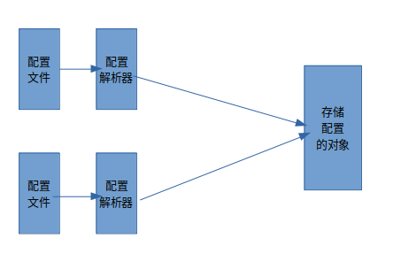

# Mybatis运行主要流程

根据上一节我们知道，使用Mybatis时，操作过程如下：

1. 根据配置文件使用`SqlSessionFactoryBuilder`创建`SqlSessionFactory`
2. 使用`SqlSessionFactory`获取一个`SqlSession`
3. 通过`SqlSession`获取`XXXMapper`对象
4. 最后通过获取到的`XXXMapper`对象调用我们在配置文件中声明的方法。

在Mybatis的例子中，我们知道进行第一步操作的代码如下：

```java
// 指定配置文件位置
String resource = "org/mybatis/example/mybatis-config.xml";
// 获取配置文件文件流
InputStream inputStream = Resources.getResourceAsStream(resource);
// 通过SqlSessionFactoryBuilder使用配置文件创建一个`SqlSessionFactory`
SqlSessionFactory sqlSessionFactory = new SqlSessionFactoryBuilder().build(inputStream);
```

经过了这一步 `SqlSessionFactory`就创建完成了，那么我们可以先首先考察一下创建完成的`SqlSessionFactory`到底是什么样子的？我们考察一下`SqlSessionFactory`在Mybatis中的具体实现，该接口的实现有两个，分别是`SqlSessionManager`和`DefaultSqlSessionFactory`，这里笔者先剧透一下，这里我们考察`DefaultSqlSessionFactory`类，先不管`SqlSessionManager`。

考察`DefaultSqlSessionFactory`可以看到该类只有一个属性：

```java
private final Configuration configuration;
```

属性名为`configuration`（配置），这就是我们在配置文件中写的配置，全部都存储在这一个对象中。所以`SqlSessionFactoryBuilder`就解析了一个配置？

实际上是的，`SqlSessionFactoryBuilder`就解析了一个配置，它将配置文件中所有的配置都存储到了`Configuration`对象中。

其实这种操作并不罕见，拿离我们最近的Java来说，我想正在读这篇文章的你一定使用过Java，我们写的代码都是`.java`文件，这些文件会编译成`字节码文件`，这些字节码文件都会加载到内存中，最后成为一个个Class对象。Spring 中的Bean配置的xml文件也是同理。所以这是一个基本操作。每种配置文件都有一种解析方式，正是如此，使得配置文件与配置对象通过配置解析器解耦。

如下图：



每个配置解析器都只做一件事，就是将配置文件解析成存储配置的Configuration对象，这也符合了单一职责原则。这也算是一个工厂模式的实现吧，将具体的配置实现与配置对象解耦。不过这个工厂模式不限于只在代码处实现，因为配置文件也是它的一部分。

所以，Mybatis、Spring等一系列框架既有Xml文件配置、也有Java配置，甚至有的有yaml文件配置，都是因为这个原因。
