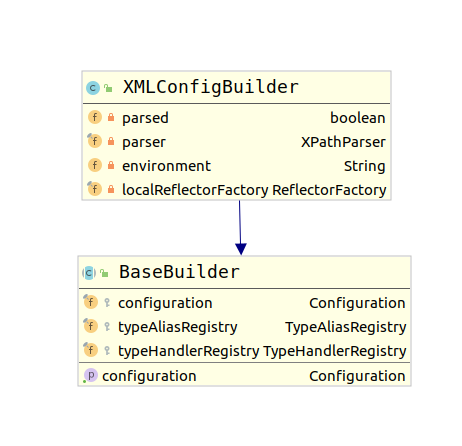
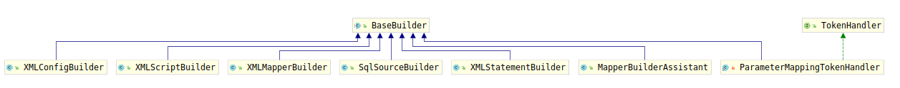

# XMLConfigBuilder

根据上一节内容我们已经知道了，XML配置文件的解析全部是通过XMLConfigBuilder进行完成的，该类的类继承结构如下：

其中BaseBuilder提供了一个配置解析器所需要的大部分工具方法，以及通用的变量、操作这些通用变量的方法。通用的变量分别如下：

1. Configuration：configuration，用于存储解析过程中用于担当解析结果的Configuration对象
2. TypeAliasRegistry: typeAliasRegistry，用于存储类型别名的注册表
3. TypeHandlerRegistry: typeHandlerRegistry，用于存储类型处理器的注册表

对于一个配置解析器来说，保存结果的对象肯定是必须的，剩下两个注册表分别是别名和类型处理器，这到底是谁通用的呢。我们考察`BaseBuilder`的子类，类图如下：

可以看到，`BaseBuilder`有7个子类，分别是：

1. XMLConfigBuilder：Mybatis xml配置解析器
2. XMLScriptBuilder：Mybatis 动态SQL标签解析器
3. XMLMapperBuilder：Mybatis mapper标签配置解析器
4. SqlSourceBuilder：Mybatis ParameterMap标签解析器
5. XMLStatementBuiler： Mybatis SQL语句解析器，解析insert、update、select标签
6. MapperBuilderAssistant：Mapper解析时的辅助缓存
7. ParameterMappingTokenHandler：parameterMapping的解析工具

由于别名注册表和类型处理器是除了配置文件外每个Mapper文件都要用的，因此，就把它放在了BaseBuilder中。处理XMLConfigBuilder以外所有的其他Builder都是为`<mapper>`服务的。

所以我们可以根据配置文件来对代码进行分析，首先分析Mybatis的基本配置解析，然后再分析`<mapper>`标签的配置解析。
