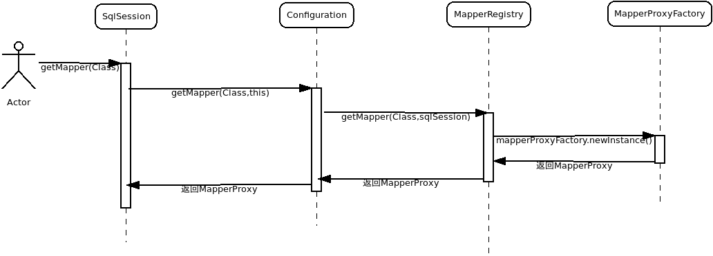

# Mapper对象的映射

上一节中提到，使用Mybatis的SqlSession进行数据持久化操作有两种方式：

1. 直接调用SqlSession
2. 通过XXXMapper对象进行数据库持久化操作。

上一节我们讲解了第一种方式的执行流程，本节主要讲解我们定义的Mapper接口是如何被创建成对象的，并如何利用SqlSession进行持久化操作。

## Mapper接口如何被创建成对象的

通过上一章我们知道，在Configuration对象关于Mapper映射的配置被保存在两个地方：

1. mappedStatements属性中：该属性是一个Map，key为mapper中各个持久化语句的id，value是持久化语句的内容以及相关信息，例如使用哪个parameterMap，使用哪个resultMap等。
2. mapperRegistry属性中：该属性中存储了一个knownMappers属性，该属性是一个HashMap，其中key是mapper的命名空间id，value是MapperProxyFactory对象，用于创建MapperProxy。事实上我们使用的XXXMapper接口被实例化后就是一个个的MapperProxy对象。

事实上，我们使用的XXXMapper接口被实例化后的对象就是通过mapperRegistry属性获得的。那么让我们首先查看一下`Configuration.mapperRegistry`属性：

```java
protected final MapperRegistry mapperRegistry = new MapperRegistry(this);
```

可以看到，该属性是一个`MapperRegistry`类型的对象，考察`MapperRegistry`类的属性可以看到：

```java
private final Configuration config;
private final Map<Class<?>, MapperProxyFactory<?>> knownMappers = new HashMap<>();
```

该类仅仅包含了一个HashMap对象作为属性，其中key是Class类型的对象，表示用户声明的Mapper接口，value是一个`MapperProxyFactory`对象，是该Mapper接口对应的`MapperProxy`的工厂。

可以看到，当我们使用`MapperProxy`对象进行持久化操作时步骤是这样的：

```java
try (SqlSession session = sqlSessionFactory.openSession()) {
  BlogMapper mapper = session.getMapper(BlogMapper.class);
  Blog blog = mapper.selectBlog(101);
}
```

可以看到，BlogMapper对象是通过SqlSession的`getMapper(Class)`获取到的，通过上一节我们知道，原生Mybatis默认使用的`SqlSession`都是`DefaultSqlSession`，那么这里考察其`getMapper(Class)`方法的实现：

```java
public <T> T getMapper(Class<T> type) {
    return configuration.getMapper(type, this);
}
```

可以看到，`DefaultSqlSession`方法的默认实现是调用的Configuration对象的`getMapper(Class,SqlSession)`方法。然而实际上`Configuration对象的getMapper(Class<T> type, SqlSession sqlSession)`方法调用的是MapperRegistry的`getMapper(Class<T> type, SqlSession sqlSession)`方法。关系如下：



因此这里我们重点查看`MapperRegistry`的`getMapper(Class<T> type, SqlSession sqlSession)`方法：

```java
  public <T> T getMapper(Class<T> type, SqlSession sqlSession) {
    final MapperProxyFactory<T> mapperProxyFactory = (MapperProxyFactory<T>) knownMappers.get(type);
    if (mapperProxyFactory == null) {
      throw new BindingException("Type " + type + " is not known to the MapperRegistry.");
    }
    try {
      return mapperProxyFactory.newInstance(sqlSession);
    } catch (Exception e) {
      throw new BindingException("Error getting mapper instance. Cause: " + e, e);
    }
  }
```

可以看到，该方法仅仅做了一件事，就是使用工厂模式创建了一个传入Class类型的对象，通过工厂名可知，创建的对象是一个`MapperProxy`类型的对象。这里我们查看一下`MapperProxyFactory`的`newInstance(SqlSession)`方法：

```java
public T newInstance(SqlSession sqlSession) {
    final MapperProxy<T> mapperProxy = new MapperProxy<>(sqlSession, mapperInterface, methodCache);
    return newInstance(mapperProxy);
}
protected T newInstance(MapperProxy<T> mapperProxy) {
    return (T) Proxy.newProxyInstance(mapperInterface.getClassLoader(), new Class[] { mapperInterface }, mapperProxy);
}
```

该方法使用JDK的动态代理将`XXXMapper`接口的所有方法进行了代理，具体处理这些方法的对象是`MapperProxy`对象。这个代理对象就是Mapper接口所代表的对象。不过这里有一件事情需要注意：在SqlSession通过getMapper(Class)获取Mapper对象时，每获取一次就会创建一个新的对象，这里并不是使用的单例。

需要注意，`getMapper(Class,SqlSession)`方法中传入了一个`SqlSession`对象，具体的持久化方法的执行就是通过这个`SqlSession`对象完成的。接下来让我们考虑`MapperProxy`对象执行持久化方法的流程。

## Mapper对象执行持久化方法的流程

通过上一部分我们知道，Mybatis使用了`MapperProxy`代理了`XXXMapper`接口的所有方法，并且使用的是JDK动态代理，因此在考虑`Mapper`对象执行逻辑时就需要考察`MapperProxy`的`invoke(Object proxy, Method method, Object[] args)`方法，在考察该方法之前，我们先了解一下`MapperProxy`类中声明的属性，MapperProxy声明了如下属性：

```java
// 该Mapper使用的SqlSession
private final SqlSession sqlSession;
// 该Mapper代理的接口类
private final Class<T> mapperInterface;
// 用于缓存Method与MappedStatement的对应关系
private final Map<Method, MapperMethod> methodCache;
```

上面三个属性中最需要注意的是第三个属性，即`methodCache`，由于XML文件中每个持久化语句对应下来都是Mapper接口中的一个方法，这个对应过程如果每次执行持久化方法时都进行一次，效率就太低了，因此使用了methodCache进行了缓存。

接下来我们考察`MapperProxy`最为重要的`invoke(Object proxy, Method method, Object[] args)`方法，源码如下：

```java
public Object invoke(Object proxy, Method method, Object[] args) throws Throwable {
    try {
      // 如果调用的方法是覆盖Object.class的方法的话
      // 直接执行
      if (Object.class.equals(method.getDeclaringClass())) {
        return method.invoke(this, args);
      // 如果是默认方法
      // 则按照默认方法的方式执行
      } else if (isDefaultMethod(method)) {
        return invokeDefaultMethod(proxy, method, args);
      }
    } catch (Throwable t) {
      throw ExceptionUtil.unwrapThrowable(t);
    }
    // 如果都不是，证明是调用的方法是Mapper接口中声明的非default方法
    // 这类方法要转化为MapperMethod对象，并缓存下来
    // 然后进行执行
    final MapperMethod mapperMethod = cachedMapperMethod(method);
    return mapperMethod.execute(sqlSession, args);
}
```
