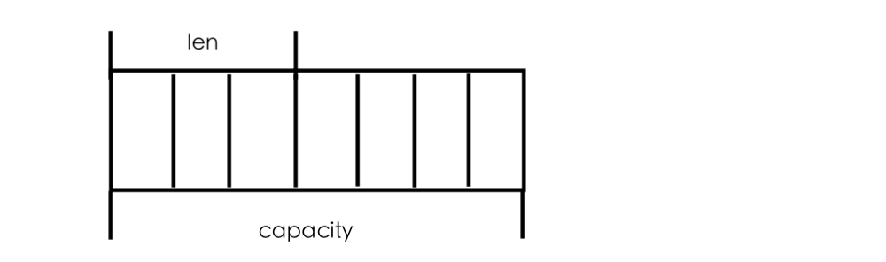

# 第一章 基础与应用

## 1.1 Redis可以做什么

1. 记录帖子的点赞数、评论数、点击数（Hash）
2. 记录用户帖子ID列表（排序），便于快速显示用户的帖子列表（zset）
3. 记录帖子的标题、摘要、作者和封面信息，用于列表页的展示（Hash）
4. 记录帖子的点赞用户ID列表、评论ID列表，用于显示和去重计数（zset）
5. 缓存近期热帖内容（帖子内容的空间占用比较大），减少数据库压力（Hash）
6. 记录帖子的相关文章ID，根据内容推荐相关帖子（list）
7. 如果帖子ID是整数自增的，可以使用Redis来分配帖子ID（计数器）
8. 收藏集和帖子之间的关系（zset）
9. 记录热榜帖子ID列表、总热榜和分类热榜（zset）
10. 缓存用户行为历史，过滤恶意行为（zset、hash）

## 1.2 Redis的基础数据结构

Redis五种基本数据结构，分别为string（字符串）、list（列表）、hash（字典）、set（集合）、zset（有序集合）。

1. string（字符串）

	Redis字符串内部结构是一个字符数组，是一个动态字符串，可以修改的字符串，内部结构实现类似于Java的ArrayList，采用与分配冗余空间的方式来减少内存的频繁分配，内部为当前字符串分配的实际空间capacity一般要高于实际字符串长度len。当字符串长度小于1MB，扩容都是加倍现有的空间。如果字符串长度超过1MB，扩容时一次只会多扩1MB的空间。需要注意的是字符串最大长度为512MB。

	

	常见命令：

	命令|作用|事例|返回结果
	---|---|---|---
	set|添加key-value|set name codehole|是否添加成功
	get|根据key获取value|get name|key为name的value值
	mget|读取多个key的value|mget name1 name2 name3|三个key的值的列表
	mset|设置多个key-value值|mset name1 boy name2 value2 |设置结果
	expire|为key设置超时时间|expire name 5|设置结果（将key为name的键值对的超时时间设置为5s）
	setnx|添加键值对并同时设置超时时间|setnx name 5 codehole|设置简直对name-codehole并将其超时时间设置为5s
	incr|如果字符串是数值则自增1|incr age|age+1
	decr|如果字符串是数值则自减1|decr age|age-1
	incrby|如果字符串是数值则自增指定数值|incrby age 3|age+3
	decrby|如果字符串是数值则自减指定数值|decrby age 3|age-3

	字符串由多个字节组成，每个字节又由8个bit组成，如果可以将一个字符堪称很多个bit的组合，即位图。

2. list（列表）

	Redis的列表相当于Java的LinkedList，它是链表不是数组。这意味着list的插入和删除操作非常快，时间复杂度为O(1)，但是索引定位很慢，时间复杂度为O(n)，列表中的每个元素都使用双向指针顺序，串起来可以同时支持前向后向遍历。当列表被弹出了最后一个元素之后，该数据结构被自动删除，内存被回收。

		 ---     ---     ---     ---     ---
		|   |<->|   |<->|   |<->|   |<->|   |
		 ---     ---     ---     ---     ---

	Redis的列表结构常用来做异步队列使用。将需要延后处理的任务结构体序列化为字符串，塞进Redis队列，另一个线程从这个列表中轮询数据进行处理。
	常见命令：
	命令|作用|事例|返回结果
	---|---|---|---
	rpush|从右压入数据|rpush books python java golang|队列中数据的长度
	llen|列表长度|llen books|列表长度
	lpop|从左弹出数据|lpop books|python（最左元素）
	rpop|从右弹出数据|rpop books|golang（最右元素)
	lpush|从最左压入数据|lpush books python java golang| 队列的长度
	lindex|获取指定索引的值|lindex books 1|返回books中索引值为1处的value
	ltrim|保留指定区间内的值，其余的统统删除|ltrim start_index end_index|保留start_index 到end_index之间的所有数据

	Redis列表的底层存储结构不是一个简单的linkedList，而是一种称之为快速列表的结构。首先在列表元素较少的情况下，会使用一块连续的内存存储，这个结构是ziplist，即压缩列表。它将所有的元素彼此紧挨着一起存储，分配的是一块连续的内存。当数据量比较多的时候才会改成quicklist。因为普通的链表需要的附加指针空间太大，会浪费空间，还会加重内存的碎片化。所以Redis将链表和ziplist结合起来组成了quicklist，也就是将多个ziplist使用双向指针连接起来，既满足了快速的插入删除性能，又不会出现太大的空间冗余。

		 -------     -------     -------     -------     -------
		|ziplist|<->|ziplist|<->|ziplist|<->|ziplist|<->|ziplist|
		 -------     -------     -------     -------     -------

3. hash（字典）

	Redis的字典相当于Java语言里的HashMap，它是无序字典，内部存储了许多键值对，结构上和Java的HashMap是一样的，都是数组+链表的结构。

			  --- key --- value
			 |
		hash- --- key --- value
		     |
			  --- key --- value

	与HashMap不同的是Redis的字典的值只能是字符串，并且它们的rehash方式不同。HashMap的rehash是一次性的完全rehash，Redis为了追求高性能，不能阻塞服务，采用了渐进式rehash策略。
	渐进式rehash会在rehash的同时，保留新旧两个hash结构，如下图

		 ----- -----                        ----- -----
		|ht[0]|ht[1]|                      |ht[0]|ht[1]|
		 ----- -----                        ----- -----
		   |                                  |     |
		   |             ---->      old    --       --     new  
		   *                               *           *
		 ---------                  ---------        ---------
		|hashtable|                |hashtable|      |hashtable|
		 ---------                  ---------        ---------

	查询时会同时查询两个hash结构，然后在后续的定时任务以及hash操作指令中，循序渐进地将旧hash内容一点点地迁移到新的hash结构中。当搬迁完成后，就会使用心得hash结构取而代之。

	当hash结构移除了最后一个元素后，该数据结构会被自动删除，内存被回收。hash结构也可以用来存储信息，而且相比于字符串来说，hash结构可以对单个字段进行存储，如果需要查找单个字段可以减少网络流量对开销。但是hash结构的存储消耗要高于单个字符串。

	常用命令：
	命令|介绍|事例|返回结果
	---|---|---|---

4. set（集合）

	Redis集合相当于Java里面的HashSet，它内部的键值对是无序的、唯一的。它的内部实现相当于一个特殊的字典，字典中所有的value都是一个值NULL。
	当集合中最后一个元素被移除之后，数据结构被自动删除，内存被回收。
	
	常用命令：
	命令|介绍|事例|返回结果
	---|---|---|---

5. zset（有序列表）

	zset类似于Java中的SortedSet和HashMap的结合体，一方面它是一个set，保证了内部value的唯一性，另一方面它可以给每个value赋予一个score，代表这个value的排序权重。它的内部实现用的是一种叫做跳跃列表的数据结构。
	zset中最有一个value被移除后，数据结构会被自动删除，内存会被回收。
	zset的适用情况：
	1. 存储粉丝列表，value值是粉丝的用户ID，score是关注时间，这样可以对粉丝列表按关注时间排序。
	2. 存储学生成绩，value是学生ID，score是他的考试成绩，对成绩排序可以看到名次。
	
	命令|作用|事例|返回结果
	---|---|---|---

	zset内部的排序功能是通过“跳跃队列”数据结构来实现的。因为zset不支持随机的插入和删除，所以不宜使用数组来表示，考虑一个普通链表结构，如下：

		 -----     -----     -----     -----     -----
		|value|<->|value|<->|value|<->|value|<->|value|
		|score|   |score|   |score|   |score|   |score|
		 -----     -----     -----     -----     -----

	如果按照上述数据结构，每次有新数据插入都要定位插入位置，这样才能保证数据是有序的，但是链表无法进行二分查找，因为无法对链表进行随机访问，所以定义了跳表：

                  -----    -----    -----    -----
                 |value|  |value|  |value|  |value|
                 |score|  |score|  |score|  |score|
		 -----    -----    -----    -----    -----
		|L0   |->|L0   |->|L0   |->|L0   |->|L0   |
		 -----    -----    -----    -----    -----
		|L1   |---------->|L1   |---------->|L1   |     
		 -----             -----             -----
		|L2   |---------------------------->|L2   |
		 -----                               -----

	跳跃列表就类似于层级制，最下面一层所有的元素都会串起来，然后每几个元素挑选出一个代表，再将这几个代表使用另外一级指针串起来。然后在这些代表里挑选出二级代表，再串起来，最终就形成了金字塔结构。定位插入点时，先在顶层进行定位，然后下潜到下一级定位，一直下潜到最后一层找到合适位置，新元素插入进去。

list、set、hash、zset这四种数据结构是容器型数据结构，它们共享如下两条规则：

1. 如果容器不存在，那就创建一个，再进行操作。
2. 如果容器里的元素没有了，那么立即删除容器。

Redis所有的数据结构都可以设置过期时间，时间到了，Redis会自动删除相应的对象，需要注意的是，过期是以对象为单位的，比如一个hash结构的过期是整个hash对象的过期，而不是其中某个子key的过期。还有一个需要特别注意的地方，如果一个字符串已经设置了过期时间，然后你用set方法修改了它，它的过期时间会消失。

### 1.2 作业

1. 请定义一个用户信息结构体，使用fastjson对用户信息对象进行序列化和反序列化，再使用Jedis对Redis缓存的用户信息进行存和取。
2. 如果改用hash结构缓存用户信息，该如何封装比较合适？

## 1.3 分布式锁

一个操作要修改用户的状态。修改状态需要先读出用户的状态，在内存里进行修改，改完了再存回去。如果这样的操作同时进行，即多个线程同时修改，就会出现并发问题，因为读取和保存这两个操作不是原子操作。

分布式锁本质上要实现的目标就是在Redis里占一个“坑”，当别的进程也来占坑的时候，发现哪里已经有一个“大萝卜”了，只好放弃或稍后再试。占坑一般使用setnx指令，只允许被一个客户端占坑，先来先占用，用完了，再调用del指令释放“坑”。

但是如果逻辑执行到中间出现异常了，可能会导致del指令没有被调用，这样就会陷入死锁，锁永远得不到释放。即下图所示：

	 -------   竞争    -------    过期或者出现异常（无法调用del）         -------
	|  set  | ------> | setnx | ----------------|----------------> |  del   |
	 -------           -------                                       -------

上述情况就会导致永远无法解锁。解决方案就是在加锁的时候，给锁加上一个过期时间，这样即使出现异常也可以保证到指定时间后锁会被自动释放。逻辑如下：

	 -------   竞争    --------------    过期或者出现异常（无法调用del）         -------
	|  set  | ------> | setnx expire | ----------------|----------------> |   del  |
	 -------           --------------                                       -------
	
但是setnx与expire这两条指令不是原子指令，所以可能会出现问题。解决方案可以有3种：
1. 使用redis的分布式锁的library。
2. 使用set指令的扩展参数，使setnx和expire同时执行
3. 采用LUA脚本。

Redis的分布式锁不能解决超时问题，如果在加锁和释放锁之间的逻辑执行的太长，以至于超出了锁的超时限制，就会出现问题，为了解决这个问题，Redis分布式锁不要用于较长时间的任务。

稍微安全点的做法是将set指定的value参数设置为一个随机数，释放锁时先匹配随机数是否一致，然后再删除key，这是为了确保当前线程占有的锁不会被其他线程释放，除非这个锁是因为过期了自动释放的，但是匹配value和删除key不是一个原子操作，这时候就需要使用LUA脚本处理。但这也不是一个完美的方案，它只是相对安全一点，因为如果真的超时了，当前线程的逻辑还没有执行完，其他线程也会趁虚而入。（毕竟Java没有办法停止线程）

Redis锁也可以支持可重入锁，需要对客户端的set方法进行包装，使用线程的ThreadLocal变量存储当前持有锁的计数。
