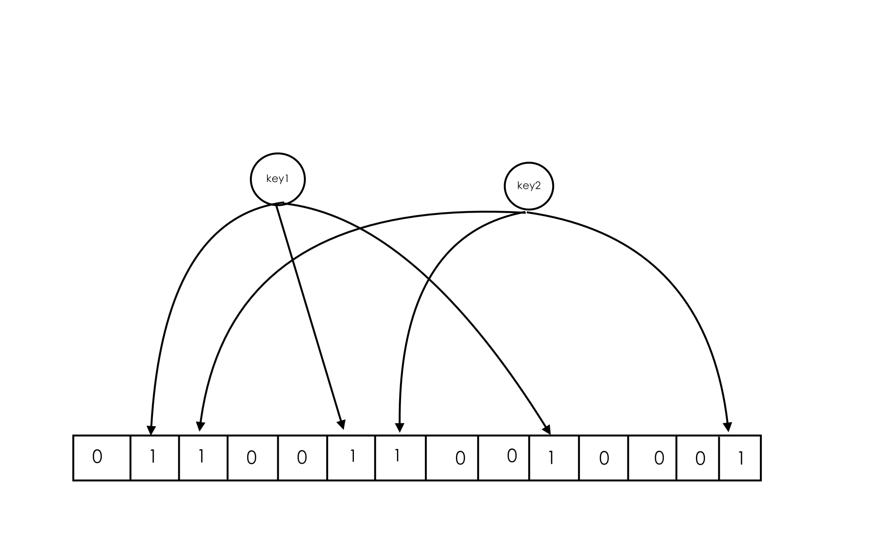

# 第一章 基础与应用

## 1.1 Redis可以做什么

1. 记录帖子的点赞数、评论数、点击数（Hash）
2. 记录用户帖子ID列表（排序），便于快速显示用户的帖子列表（zset）
3. 记录帖子的标题、摘要、作者和封面信息，用于列表页的展示（Hash）
4. 记录帖子的点赞用户ID列表、评论ID列表，用于显示和去重计数（zset）
5. 缓存近期热帖内容（帖子内容的空间占用比较大），减少数据库压力（Hash）
6. 记录帖子的相关文章ID，根据内容推荐相关帖子（list）
7. 如果帖子ID是整数自增的，可以使用Redis来分配帖子ID（计数器）
8. 收藏集和帖子之间的关系（zset）
9. 记录热榜帖子ID列表、总热榜和分类热榜（zset）
10. 缓存用户行为历史，过滤恶意行为（zset、hash）

## 1.2 Redis的基础数据结构

Redis五种基本数据结构，分别为string（字符串）、list（列表）、hash（字典）、set（集合）、zset（有序集合）。

1. string（字符串）

	Redis字符串内部结构是一个字符数组，是一个动态字符串，可以修改的字符串，内部结构实现类似于Java的ArrayList，采用与分配冗余空间的方式来减少内存的频繁分配，内部为当前字符串分配的实际空间capacity一般要高于实际字符串长度len。当字符串长度小于1MB，扩容都是加倍现有的空间。如果字符串长度超过1MB，扩容时一次只会多扩1MB的空间。需要注意的是字符串最大长度为512MB。

	

	常见命令：

	命令|作用|事例|返回结果
	---|---|---|---
	set|添加key-value|set name codehole|是否添加成功
	get|根据key获取value|get name|key为name的value值
	mget|读取多个key的value|mget name1 name2 name3|三个key的值的列表
	mset|设置多个key-value值|mset name1 boy name2 value2 |设置结果
	expire|为key设置超时时间|expire name 5|设置结果（将key为name的键值对的超时时间设置为5s）
	setnx|添加键值对并同时设置超时时间|setnx name 5 codehole|设置简直对name-codehole并将其超时时间设置为5s
	incr|如果字符串是数值则自增1|incr age|age+1
	decr|如果字符串是数值则自减1|decr age|age-1
	incrby|如果字符串是数值则自增指定数值|incrby age 3|age+3
	decrby|如果字符串是数值则自减指定数值|decrby age 3|age-3

	字符串由多个字节组成，每个字节又由8个bit组成，如果可以将一个字符堪称很多个bit的组合，即位图。

2. list（列表）

	Redis的列表相当于Java的LinkedList，它是链表不是数组。这意味着list的插入和删除操作非常快，时间复杂度为O(1)，但是索引定位很慢，时间复杂度为O(n)，列表中的每个元素都使用双向指针顺序，串起来可以同时支持前向后向遍历。当列表被弹出了最后一个元素之后，该数据结构被自动删除，内存被回收。

		 ---     ---     ---     ---     ---
		|   |<->|   |<->|   |<->|   |<->|   |
		 ---     ---     ---     ---     ---

	Redis的列表结构常用来做异步队列使用。将需要延后处理的任务结构体序列化为字符串，塞进Redis队列，另一个线程从这个列表中轮询数据进行处理。
	常见命令：
	命令|作用|事例|返回结果
	---|---|---|---
	rpush|从右压入数据|rpush books python java golang|队列中数据的长度
	llen|列表长度|llen books|列表长度
	lpop|从左弹出数据|lpop books|python（最左元素）
	rpop|从右弹出数据|rpop books|golang（最右元素)
	lpush|从最左压入数据|lpush books python java golang| 队列的长度
	lindex|获取指定索引的值|lindex books 1|返回books中索引值为1处的value
	ltrim|保留指定区间内的值，其余的统统删除|ltrim start_index end_index|保留start_index 到end_index之间的所有数据

	Redis列表的底层存储结构不是一个简单的linkedList，而是一种称之为快速列表的结构。首先在列表元素较少的情况下，会使用一块连续的内存存储，这个结构是ziplist，即压缩列表。它将所有的元素彼此紧挨着一起存储，分配的是一块连续的内存。当数据量比较多的时候才会改成quicklist。因为普通的链表需要的附加指针空间太大，会浪费空间，还会加重内存的碎片化。所以Redis将链表和ziplist结合起来组成了quicklist，也就是将多个ziplist使用双向指针连接起来，既满足了快速的插入删除性能，又不会出现太大的空间冗余。

		 -------     -------     -------     -------     -------
		|ziplist|<->|ziplist|<->|ziplist|<->|ziplist|<->|ziplist|
		 -------     -------     -------     -------     -------

3. hash（字典）

	Redis的字典相当于Java语言里的HashMap，它是无序字典，内部存储了许多键值对，结构上和Java的HashMap是一样的，都是数组+链表的结构。

			  --- key --- value
			 |
		hash- --- key --- value
		   |
			  --- key --- value

	与HashMap不同的是Redis的字典的值只能是字符串，并且它们的rehash方式不同。HashMap的rehash是一次性的完全rehash，Redis为了追求高性能，不能阻塞服务，采用了渐进式rehash策略。
	渐进式rehash会在rehash的同时，保留新旧两个hash结构，如下图

		 ----- -----                        ----- -----
		|ht[0]|ht[1]|                      |ht[0]|ht[1]|
		 ----- -----                        ----- -----
		   |                                  |     |
		   |             ---->      old    --       --     new  
		   *                               *           *
		 ---------                  ---------        ---------
		|hashtable|                |hashtable|      |hashtable|
		 ---------                  ---------        ---------

	查询时会同时查询两个hash结构，然后在后续的定时任务以及hash操作指令中，循序渐进地将旧hash内容一点点地迁移到新的hash结构中。当搬迁完成后，就会使用心得hash结构取而代之。

	当hash结构移除了最后一个元素后，该数据结构会被自动删除，内存被回收。hash结构也可以用来存储信息，而且相比于字符串来说，hash结构可以对单个字段进行存储，如果需要查找单个字段可以减少网络流量对开销。但是hash结构的存储消耗要高于单个字符串。

	常用命令：
	命令|介绍|事例|返回结果
	---|---|---|---

4. set（集合）

	Redis集合相当于Java里面的HashSet，它内部的键值对是无序的、唯一的。它的内部实现相当于一个特殊的字典，字典中所有的value都是一个值NULL。
	当集合中最后一个元素被移除之后，数据结构被自动删除，内存被回收。
	
	常用命令：
	命令|介绍|事例|返回结果
	---|---|---|---

5. zset（有序列表）

	zset类似于Java中的SortedSet和HashMap的结合体，一方面它是一个set，保证了内部value的唯一性，另一方面它可以给每个value赋予一个score，代表这个value的排序权重。它的内部实现用的是一种叫做跳跃列表的数据结构。
	zset中最有一个value被移除后，数据结构会被自动删除，内存会被回收。
	zset的适用情况：
	1. 存储粉丝列表，value值是粉丝的用户ID，score是关注时间，这样可以对粉丝列表按关注时间排序。
	2. 存储学生成绩，value是学生ID，score是他的考试成绩，对成绩排序可以看到名次。
	
	命令|作用|事例|返回结果
	---|---|---|---

	zset内部的排序功能是通过“跳跃队列”数据结构来实现的。因为zset不支持随机的插入和删除，所以不宜使用数组来表示，考虑一个普通链表结构，如下：

		 -----     -----     -----     -----     -----
		|value|<->|value|<->|value|<->|value|<->|value|
		|score|   |score|   |score|   |score|   |score|
		 -----     -----     -----     -----     -----

	如果按照上述数据结构，每次有新数据插入都要定位插入位置，这样才能保证数据是有序的，但是链表无法进行二分查找，因为无法对链表进行随机访问，所以定义了跳表：

                  -----    -----    -----    -----
                 |value|  |value|  |value|  |value|
                 |score|  |score|  |score|  |score|
	     -----    -----    -----    -----    -----
	    |L0   |->|L0   |->|L0   |->|L0   |->|L0   |
	     -----    -----    -----    -----    -----
	    |L1   |---------->|L1   |---------->|L1   |     
	     -----             -----             -----
	    |L2   |---------------------------->|L2   |
	     -----                               -----

	跳跃列表就类似于层级制，最下面一层所有的元素都会串起来，然后每几个元素挑选出一个代表，再将这几个代表使用另外一级指针串起来。然后在这些代表里挑选出二级代表，再串起来，最终就形成了金字塔结构。定位插入点时，先在顶层进行定位，然后下潜到下一级定位，一直下潜到最后一层找到合适位置，新元素插入进去。

list、set、hash、zset这四种数据结构是容器型数据结构，它们共享如下两条规则：

1. 如果容器不存在，那就创建一个，再进行操作。
2. 如果容器里的元素没有了，那么立即删除容器。

Redis所有的数据结构都可以设置过期时间，时间到了，Redis会自动删除相应的对象，需要注意的是，过期是以对象为单位的，比如一个hash结构的过期是整个hash对象的过期，而不是其中某个子key的过期。还有一个需要特别注意的地方，如果一个字符串已经设置了过期时间，然后你用set方法修改了它，它的过期时间会消失。

### 1.2 作业

1. 请定义一个用户信息结构体，使用fastjson对用户信息对象进行序列化和反序列化，再使用Jedis对Redis缓存的用户信息进行存和取。
2. 如果改用hash结构缓存用户信息，该如何封装比较合适？

## 1.3 分布式锁

一个操作要修改用户的状态。修改状态需要先读出用户的状态，在内存里进行修改，改完了再存回去。如果这样的操作同时进行，即多个线程同时修改，就会出现并发问题，因为读取和保存这两个操作不是原子操作。

分布式锁本质上要实现的目标就是在Redis里占一个“坑”，当别的进程也来占坑的时候，发现哪里已经有一个“大萝卜”了，只好放弃或稍后再试。占坑一般使用setnx指令，只允许被一个客户端占坑，先来先占用，用完了，再调用del指令释放“坑”。

但是如果逻辑执行到中间出现异常了，可能会导致del指令没有被调用，这样就会陷入死锁，锁永远得不到释放。即下图所示：

	 -------   竞争    -------    过期或者出现异常（无法调用del）         -------
	|  set  | ------> | setnx | ----------------|----------------> |  del   |
	 -------           -------                                       -------

上述情况就会导致永远无法解锁。解决方案就是在加锁的时候，给锁加上一个过期时间，这样即使出现异常也可以保证到指定时间后锁会被自动释放。逻辑如下：


	 -------   竞争    --------------    过期或者出现异常（无法调用del）         -------
	|  set  | ------> | setnx expire | ----------------|----------------> |   del  |
	 -------           --------------                                       -------

但是setnx与expire这两条指令不是原子指令，所以可能会出现问题。解决方案可以有3种：
1. 使用redis的分布式锁的library。
2. 使用set指令的扩展参数，使setnx和expire同时执行
3. 采用LUA脚本。

Redis的分布式锁不能解决超时问题，如果在加锁和释放锁之间的逻辑执行的太长，以至于超出了锁的超时限制，就会出现问题，为了解决这个问题，Redis分布式锁不要用于较长时间的任务。

稍微安全点的做法是将set指定的value参数设置为一个随机数，释放锁时先匹配随机数是否一致，然后再删除key，这是为了确保当前线程占有的锁不会被其他线程释放，除非这个锁是因为过期了自动释放的，但是匹配value和删除key不是一个原子操作，这时候就需要使用LUA脚本处理。但这也不是一个完美的方案，它只是相对安全一点，因为如果真的超时了，当前线程的逻辑还没有执行完，其他线程也会趁虚而入。（毕竟Java没有办法停止线程）

Redis锁也可以支持可重入锁，需要对客户端的set方法进行包装，使用线程的ThreadLocal变量存储当前持有锁的计数。

```java
import redis.clients.jedis.Jedis;

import java.util.HashMap;
import java.util.Map;

public class RedisWithReentrantLock {

    private ThreadLocal<Map<String,Integer>> lockers = new ThreadLocal<Map<String, Integer>>();

    private Jedis jedis;

    public  RedisWithReentrantLock(Jedis jedis){
        this.jedis = jedis;
    }

    //使用setnx命令进行加锁，超时时间设置为5s
    public boolean _lock(String key){
        return jedis.set(key,"","nx","ex",5L) != null;
    }

    //采用del命令进行解锁
    public void  _unLock(String key){
        jedis.del(key);
    }

    public Map<String,Integer> currentLockers(){
        Map<String,Integer> refs = lockers.get();
        if (refs != null){
            return refs;
        }
        lockers.set(new HashMap<String, Integer>());
        return lockers.get();
    }

    //加锁逻辑：
    //使用ThreadLocal<Map<String,Integer>> 存储重入锁重入次数
    public boolean lock(String key){
        //加锁时只需要获取重入次数进行加1操作即可。
        Map<String,Integer> refs = currentLockers();
        Integer refCount = refs.get(key);
        if (refCount != null){
            refs.put(key,refCount + 1);
            return true;
        }
        boolean ok = this._lock(key);
        if (!ok){
            return false;
        }
        refs.put(key,1);
        return true;
    }

    public boolean unLock(String key){
        //解锁只需要对重入锁次数减一并进行校验。
        Map<String,Integer> refs = currentLockers();
        Integer refCount = refs.get(key);
        if (refCount == null){
            return false;
        }
        refCount -= 1;
        if (refCount > 0){
            refs.put(key,refCount);
        }
        else {
            refs.remove(key);
            this._unLock(key);
        }
        return true;
    }


    public static void main(String[] args) {
        Jedis jedis = new Jedis("127.0.0.1",6379);
        RedisWithReentrantLock lock = new RedisWithReentrantLock(jedis);
        System.out.println(lock.lock("codehole"));
        System.out.println(lock.lock("codehole"));
        System.out.println(lock.unLock("codehole"));
        System.out.println(lock.unLock("codehole"));
    }
}
```

如果客户端在处理请求时加锁没加成功，处理方式一般有3种：

1. 直接抛出异常，通知用户稍后重试。

   这种方式比较适合由用户直接发起的请求。用户看到错误对话框后，会先阅读对话框的内容，再点击重试，这样可以做到人工延时的效果。本质上是对当前请求对放弃，由用户决定是否重新发起新的请求。

2. sleep一会儿，然后再重试。

   sleep会阻塞当前消息处理线程，或导致队列的后续消息出现延迟，如果碰撞得比较频繁或者队列里消息比较多，sleep可能并不合适。如果因为个别死锁的key导致加锁不成功，线程会彻底堵死，导致后续消息永远得不到及时处理。

3. 将请求转移至延时队列，过一会儿再试。

   这种方式比较适合异步消息处理，将当前冲突的请求扔到另一个队列延后处理以避开冲突。

## 1.4 延时队列

延时队列是消息中间件的简化，对于只有一组消费者的消息队列可以使用Redis制作延时队列，但Redis消息队列没有高级特性，没有ack保证，如果对消息队列的可靠性有极高的要求，就不适合使用。

Redis采用list（列表）数据结构来作为消息队列，rpush和lpush操作入队列，用lpop和rpop操作出队列。


发布端不断的进行push数据，Consumer不断的进行pop数据，然后消费数据，但是当列表为空的时候，就会出现问题，或是死循环，或是断掉。为此可以先sleep1秒然后再读，但是这种解决方式并不优雅，无法保证数据一旦进入延时队列就立即被使用。但是可以使用Redis的阻塞读来进行处理，即blpop和brpop进行读取，这两条命令前面的b就代表的是blocking，即阻塞读。阻塞读在队列中没有数据的时候，会立即进入休眠状态，一旦数据到来，则立刻醒过来。消息的延迟几乎为0。用blpop/brpop代替前面的lpop/rpop，就解决了上面的问题。

但是如果线程一直阻塞在那里，Redis的客户端连接就成为了闲置连接，闲置过久，服务器一般会主动断开连接，减少闲置资源的占用。这个时候blpop/brpop会抛出异常，如果捕获到异常，需要进行重试。

延时队列可以通过Redis的zset（有序列表）来实现。将消息序列化成一个字符串作为zset的value，这个消息的到期处理时间作为score，然后用多个线程轮训zset获取到期的任务进行处理。多个线程是为了保障可用性，万一挂了一个线程，其他线程可以继续处理。因为有多个线程，所以需要考虑并发争抢任务，确保任务不会被多次执行。

Redis的zrem方法是多线程多进程争抢任务的关键，它的返回值决定了当前实例有没有抢到任务，因为loop方法可能会被多个线程、进程调用，同一个任务可能会被多个进程、多个线程抢到，要通过zrem来决定唯一的属主。

```java
package com.jllsq.queue;

import com.alibaba.fastjson.JSON;
import com.alibaba.fastjson.TypeReference;
import redis.clients.jedis.Jedis;

import java.lang.reflect.Type;
import java.util.Set;
import java.util.UUID;

public class RedisDelayingQueue<T> {

    static class TaskItem<T> {
        public String id;
        public T msg;
    }

    private final Type taskType = new TypeReference<TaskItem<T>>() {
    }.getType();

    private Jedis jedis;

    private String queueKey;

    public RedisDelayingQueue(Jedis jedis, String queueKey) {
        this.jedis = jedis;
        this.queueKey = queueKey;
    }

    /**
     * 向消息队列中插入一个任务
     *
     * @param msg 延时队列处理消息
     */
    private void delay(T msg) {
        TaskItem<T> task = new TaskItem<T>();
        //分配唯一uuid
        task.id = UUID.randomUUID().toString();
        task.msg = msg;
        //fastJson序列化
        String s = JSON.toJSONString(task);
        //塞入延时队列，5s后再试，score为执行时间
        jedis.zadd(queueKey, System.currentTimeMillis() + 5000, s);
    }

    /**
     * 延时队列消费逻辑
     */
    private void loop() {
        while (!Thread.interrupted()) {
            //从延时队列中获取一条数据
            Set<String> values = jedis.zrangeByScore(queueKey, 0, System.currentTimeMillis(), 0, 1);
            //获取到数据为空，则等待5秒后继续
            if (values.isEmpty()) {
                try {
                    Thread.sleep(5000);
                } catch (InterruptedException e) {
                    e.printStackTrace();
                    break;
                }
                continue;
            }
            //获取到数据则取出它，并使用zrem命令抢到数据
            String s = values.iterator().next();
            if (jedis.zrem(queueKey, s) > 0) {
                //反序列化消息，并处理
                TaskItem<T> task = JSON.parseObject(s, taskType);
                this.handleMsg(task.msg);
            }
            //未抢到数据则继续监听
        }
    }

    public void handleMsg(T msg) {
        System.out.println(msg);
    }

    public static void main(String[] args) {
        Jedis jedis = new Jedis();
        final RedisDelayingQueue<String> queue = new RedisDelayingQueue<String>(jedis, "q-demo");
        Thread producer = new Thread() {
            @Override
            public void run() {
                for (int i = 0; i < 10; i++) {
                    queue.delay("codehole:" + i);
                }
            }
        };
        Thread consumer = new Thread() {
            @Override
            public void run() {
                queue.loop();
            }
        };
        producer.start();
        consumer.start();
        try {
            producer.join();
            Thread.sleep(6000);
            consumer.interrupt();
            consumer.join();
        } catch (InterruptedException e) {

        }
    }
}
```

上述算法中，同一个任务可能会被多个进程取到之后再使用zrem进行争抢，那些没抢到的进程都白取了一次任务，可以考虑使用lua scripting来优化一下这个逻辑，将zrangebyscore和zrem一同挪到服务器端进行原子化操作。

### 思考与作业

1. Redis作为消息队列为什么不能保证100%的可靠性？
2. 使用lua scripting来优化延时队列的逻辑。

## 1.5 位图

Redis提供了位图的数据结构，当有大量布尔值需要存储时，就可以使用Redis的位图，例如存储一个用户一年的签到记录这类。位图 的最小单位是bit，每个bit的取值只能是0或1.Redis提供位图操作的数据结构其实就是字符串，不过提供了一套命令用作位图操作。

Redis的位数组是自动扩展的，如果设置了某个偏移位置超出了现有的内容范围，就会自动将位数组进行零扩充。可以使用位操作将字符串设置为hello。使用python的命令行可以很简单的得到字符的二进制表示法：

```python
>>> bin(ord('h'))
'0b1101000'     #高位->低位
>>> bin(ord('e'))
'0b1100101'
>>> bin(ord('l'))
'0b1101100'
>>> bin(ord('l'))
'0b1101100'
>>> bin(ord('o'))
'0b1101111'
```

然后按照上面查出的二进制位进行设置。

```shell
127.0.0.1:6379> setbit s 1 1
(integer) 0
127.0.0.1:6379> setbit s 2 1
(integer) 0
127.0.0.1:6379> setbit s 4 1
(integer) 0
127.0.0.1:6379> get s
"h"
```

注意位数组的顺序和自负的位顺序是相反的。

Redis提供了位图统计指令bitcount和位图查找指令bitops。bitcount用来统计指定位置范围内1的个数，bitops用来查找指定范围内出现的第一个0或1。不过在指定范围时使用的start和end参数是字节索引，也就是说指定的位必须是8的倍数，而不能任意指定。setbit和getbit都是对单个位进行操作的，如果要一次操作多个位，可以使用管道或者bitfield执行。bitfield有三个指令，分别是get、set、incrby，它们都可以对指定位片段进行读写，但是最多只能处理64个连续的位，如果超过64位，就得使用多个子指令，bitfield可以一次执行多个子指令。

```shell
127.0.0.1:6379> set w hello
OK
127.0.0.1:6379> bitfield w get u4 0    #从第一个位开始取4个位，结果是无符号数（u）
1) (integer) 6
127.0.0.1:6379> bitfield w get u3 2    #从第三个位开始取3个位，结果是无符号数（u）
1) (integer) 5
127.0.0.1:6379> bitfield w get i4 0    #从第一个位开始取4个位，结果是有符号数（i）
1) (integer) 6
127.0.0.1:6379> bitfield w get i3 2    #从第三个位开始取3个位，结果是有符号数（i）
1) (integer) -3
```

Redis如果出现溢出行为，默认处理方式是折返，就将溢出的符号位丢掉。bitfield指令提供了溢出策略子指令overflow，默认是折返（wrap），还可以选择失败（fail），即报错不执行，以及饱和截断，即超过了最大范围就停留在最大值或最小值。overflow指令只影响接下来的第一条指令，这条指令执行完成后溢出策略会变成默认的折返。

### 思考与作业

1. 完成对完整的hello单词的5个字符使用位操作进行设置。
2. bitfield可以混合使用多个set/get/incrby子指令，请尝试完成。

## 1.6 HyperLogLog

考虑统计网站没人每天晚上的UV（用户访问数据），同一个用户一天之内访问则加一，多次访问数值不变。遇到这种情况HyperLogLog就有了很大的意义。HyperLogLog数据结构提供了不精确的去重解决方案，虽然不精确，但是也不离谱，标准误差为0.81%。

HyperLogLog提供了两个指令pfadd和pfcount，一个是增加计数，一个是获取计数。

```shell
127.0.0.1:6379> pfcount codehole
(integer) 1
127.0.0.1:6379> pfadd codehole user2
(integer) 1
127.0.0.1:6379> pfcount codehole
(integer) 2
127.0.0.1:6379> pfcount codehole user3
(integer) 2
127.0.0.1:6379> pfcount codehole user4
(integer) 2
127.0.0.1:6379> pfcount codehole user5 user6 user7 user8 user9
(integer) 2
127.0.0.1:6379> pfadd codehole user5 user6 user7 user8 user9
(integer) 1
127.0.0.1:6379> pfadd codehole
(integer) 0
127.0.0.1:6379> pfcount codehole
(integer) 7
127.0.0.1:6379> 
```

尝试使用Java代码批量向Redis的HyperLogLog中插入数据：

```java
import redis.clients.jedis.Jedis;

public class PfTest {

    public static void main(String[] args) {
        Jedis jedis = new Jedis();
        for (int i = 0;i < 100000;i ++){
            jedis.pfadd("codehole","user"+i);
        }
        long count = jedis.pfcount("codehole");
        System.out.printf("%d %d \n",100000,count);
        jedis.close();
    }

}
```

输出结果如下：

```
100000 99725 
```

共插入100000条数据，实际统计了99725条，误差为0.275%。

HyperLogLog的命令都以pf开头，pf是这个数据结构的发明者叫做Philippe Flajolet。

HyperLogLog除了提供了pfadd和pfcount还提供了pfmerge，用于将多个pf计数值累加在一起形成一个新的pf值。

HyperLogLog数据结构需要占用12KB的存储空间，不适合统计单个用户相关的数据，但是当用户量增大就会变的很有意义。Redis对HyperLogLog的存储进行了优化，在计数比较小时，它的存储空间采用稀疏矩阵存储，空间占用很小，仅仅在计数慢慢增大，稀疏矩阵占用空间渐渐超过了阈值时，才会一次性转变成稠密矩阵，占用12KB的存储空间。

HyperLogLog的工作原理大致如下：给定一系列的随机整数，我们记录下低位连续0位的最大长度K，这个参数叫做maxbit，通过这个K值可以估算出随机数的数量N。


第一个随机数最后3位连续为0，第二个7位，第三个5位，第四个9位，处理多代后变为16位。

接下来使用代码探究K与N的关系：

```java
package com.jllsq.hyperloglog;

import java.util.Map;
import java.util.Random;

public class PfTheory {
    private static Random random = new Random();

    static class BitKeeper {
        private int maxbits;


        public void random(int value) {
            int bits = lowZeros(value);
            if (bits > this.maxbits) {
                this.maxbits = bits;
            }
        }

        private int lowZeros(int value) {
            int i = 1;
            for (; i < 32; i++) {
                if (value >> i << i != value) {
                    break;
                }
            }
            return i - 1;
        }
    }

    static class Experiment {
        private int n;
        private int k;
        private BitKeeper[] keepers;

        public Experiment(int n) {
            this(n, 1024);
        }

        public Experiment(int n, int k) {
            this.n = n;
            this.k = k;
            this.keepers = new BitKeeper[k];
            for (int i = 0; i < this.k; i++) {
                this.keepers[i] = new BitKeeper();
            }
        }

        public void work() {
            for (int i = 0; i < n; i++) {
                int m = random.nextInt(1 << 32);
                BitKeeper keeper = this.keepers[(int) (((m & 0xfff000) >> 16) % this.keepers.length)];
                keeper.random(m);
            }
        }

        public double estimate() {
            double sumbitsInverse = 0.0;
            for (BitKeeper keeper : this.keepers) {
                sumbitsInverse += 1.0 / (float) keeper.maxbits;
            }
            double avgBits = (float) keepers.length / sumbitsInverse;
            return Math.pow(2, avgBits) * this.k;
        }

    }

    public static void main(String[] args) {
        for (int i = 100000; i < 1000000; i += 100000) {
            Experiment exp = new Experiment(i);
            exp.work();
            double est = exp.estimate();
            System.out.printf("%d %.2f %.2f\n", i, est, Math.abs(est - i) / i);
        }
    }


}
```

在上述代码中使用了1024个桶进行计数，在Redis的HyperLogLog实现中用的是16384个桶，也就是2^14，每个桶的maxbits需要6个bit来存储，最大可以表示maxbits=63，于是总共占用的内存就是2^14*6/8，算出的结果是12KB。

### 思考与作业

尝试使用一堆数据进行分组。分别计数，再使用pfmerge合并在一起，观察pfcount计数值，与不分组的情况下的统计局恶果进行比较，观察有没有差异。

## 1.7 布隆过滤器

HyperLogLog可以用来解决类似于统计UV的问题，但是无法知道一个值是否在HyperLogLog里，因为只提供了pfadd和pfcount方法，没有提供pfcontains方法。如果想知道某一项是否在一个集合里，可以使用布隆过滤器。布隆过滤器可以理解为一个不精确的set结构，当你使用它的contains方法判断某个对象是否存在时，它可能会发生误判。但是如果参数设置合理，布隆过滤器的精确度也可以控制的相对足够精确，只会有小小的误判。

当布隆过滤器说某个值存在时，这个值可能不存在；当它说某个值不存在时，那就肯定不存在。

Redis官方提供的布隆过滤器到了Redis 4.0提供了插件功能后才正式登场，布隆过滤器作为一个插件加载到Redis Server中，给Redis提供了强大的布隆去重功能。

Redis布隆过滤器模块的安装，笔者采用的是mac系统，Redis 5.0.3 版本，redisbloom模块采用的是release v1.1.1版本：

```shell
git clone https://github.com/RedisLabsModules/redisbloom.git # 从github上克隆下redis的bloomFilter模块
cd rebloom # 进入项目目录
make       # 编译代码
```

编译过程可能会报错：

```shell
xcrun: error: invalid active developer path (/Library/Developer/CommandLineTools), missing xcrun at: /Library/Developer/CommandLineTools/usr/bin/xcrun
```

出现该错误可以尝试更新xcode并且运行如下命令：

```shell
xcode-select --install
```

然后再进行编译。编译完成后进入到redis安装目录，默认目录是`/usr/local/redis-版本号`，然后修改redis.conf，在末尾添加：

```shell
loadmodule path #path指之前的rebloom路径+rebloom.so，按照笔者的就是/opt/rebloom/rebloom.so
```

最后启动redis-server

```shell
redis-server ./redis.cof
```

模块就安装完成了，或者直接运行如下命令：

``` shell
redis-server --loadmodule path #path指之前的rebloom路径+rebloom.so，按照笔者的就是/opt/rebloom/rebloom.so
```

这样就可以省去redis.conf的修改。

布隆过滤器有两个基本命令bf.add和bf.exists。其中bf.add负责添加元素，bf.exists负责检查元素是否存在。如果想一次添加多个元素，需要使用bf.madd指令，同样一次性检查多个元素是否存在需要使用bf.mexists命令。

```shell
127.0.0.1:6379> bf.add bloom user1
(integer) 1
127.0.0.1:6379> bf.add bloom user2
(integer) 1
127.0.0.1:6379> bf.add bloom user3
(integer) 1
127.0.0.1:6379> bf.exists bloom user3
(integer) 1
127.0.0.1:6379> bf.exists bloom user2
(integer) 1
127.0.0.1:6379> bf.exists bloom user1
(integer) 1
127.0.0.1:6379> bf.exists bloom user0
(integer) 0
127.0.0.1:6379> bf.madd bloom user4 user5 user6
1) (integer) 1
2) (integer) 1
3) (integer) 1
127.0.0.1:6379> bf.mexists bloom user4 user5 user6 user7
1) (integer) 1
2) (integer) 1
3) (integer) 1
4) (integer) 0
```

Jedis-2.x没有提供指令扩展机制，RedisLabs提供了一个单独的包JReBloom，但是是基于Jedis-3.0的。事例代码如下：

```java
import io.rebloom.client.Client;

public class BloomTest1 {
    public static void main(String[] args) {
        Client client = new Client("127.0.0.1",6379);
        client.delete("bloom");
        for (int i = 0;i < 100000;i ++){
            client.add("bloom","user"+i);
            boolean ret = client.exists("bloom","user"+i);
            if (!ret){
                System.out.println(i);
                break;
            }
        }
    }
}
```

执行完这段代码，发现并没有发现误判，因为布隆过滤器有如下特性：当布隆过滤器说某个值存在时，这个值可能不存在；当它说某个值不存在时，那就肯定不存在。所以上述代码绝对不会出现误判。

为了测量误判率可以先随机取出一堆字符串，然后切分为两组，将其中一组塞入布隆过滤器，然后再判断另外一组的字符串存在与否，取误判的个数和字符串总量一半的百分比作为误判率。

```java
package com.jllsq.bloom;

import io.rebloom.client.Client;

import java.util.ArrayList;
import java.util.List;
import java.util.Random;

public class BloomTest2 {

    private String chars;

    {
        StringBuilder sb = new StringBuilder();
        for (int i = 0; i < 26; i++) {
            sb.append(('a' + i));
        }
        chars = sb.toString();
    }

    private Random random = new Random();

    private String randomString(int n) {
        StringBuilder sb = new StringBuilder();
        for (int i = 0; i < n; i++) {
            int idx = random.nextInt(chars.length());
            sb.append(chars.charAt(idx));
        }
        return sb.toString();
    }

    private List<String> randomUsers(int n) {
        List<String> users = new ArrayList<String>();
        for (int i = 0; i < n; i++) {
            users.add(randomString(64));
        }
        return users;
    }

    public static void main(String[] args) {
        BloomTest2 bloomer = new BloomTest2();
        List<String> users = bloomer.randomUsers(100000);
        List<String> usersTrain = users.subList(0, users.size() / 2);
        List<String> usersTest = users.subList(users.size() / 2, users.size());
        Client client = new Client("127.0.0.1", 6379);
        client.delete("bloom");
        for (String user : usersTrain) {
            client.add("bloom", user);
        }
        int falses = 0;
        for (String user : usersTest) {
            boolean ret = client.exists("bloom", user);
            if (ret) {
                falses++;
            }
        }
        System.out.printf("%d %d \n", falses, usersTest.size());
    }

}
```

 运行结果如下：

```shell
837 50000 
```

错误率大约为1.5%左右，Redis其实还提供了自定义参数的布隆过滤器，需要我们在add之前使用bf.reserve指令显示创建。如果对应的key已经存在，bf.reserve会报错。bf.reserve有三个参数，分别是key、error_rate和initial_size。

- error_rate越低，需要的空间越大。
- initial_size表示预计放入的元素数量，当实际数量超出这个数值时，判断旅会上升，所以需要提前设置一个较大的数值避免超出导致误判率升高。

如果不使用rf.reserve，默认的error_rate是0.01，默认的initial_size是100。

布隆过滤器的initial_size设置的过大会浪费存储空间，设置的过小，就会影响准确率，用户在使用之前一定要尽可能地精确估计元素数量，还需要加上一定的冗余空间以避免实际元素可能会意外高出估计值很多。布隆过滤器的error_rate越小，需要的存储空间就越大，对于不需要过于精确的场合，error_rate设置稍大一点也无伤大雅。

下面介绍布隆过滤器的原理。

每个布隆过滤器对应到Redis的数据结构里就是一个大型的位数组和几个不一样的无偏hash函数，如下图：



向布隆过滤器中添加key时，会使用多个hash函数对key进行hash，算得多个整数索引值，然后对位数组长度进行取模运算得到一个位置，每个hash函数都会得到一个不同的位置，再把这些位置都置为1。就完成了添加操作，对于判断是否存在的操作，也是对key进行多个hash函数取hash值，算得多个整数取索引，查找这多个整数是否都为1，如果是，证明输入key极有可能存在，如果有一位为0，都证明一定不存在。

布隆过滤器有两个参数，第一个是预计元素的数量n，第二个是错误率f。但是由原理可以看出，布隆过滤器需要的是存储空间的大小和哈希函数的数量k。其满足以下公式：
$$
k=0.7*(1/n)
$$

$$
f=0.6185^{1/n} 
$$

1. 位数组相对越长，错误率f越低
2. 位数组相对越长，hash函数需要的最佳数量也越多。

当实际元素超出预计数量时，误判率按照如下公式增长：
$$
f=(1-0.5^t)^k
$$

## 1.8 简单限流

限流算法目的有两个：

1. 控制流量。
2. 控制用户行为，避免垃圾请求。例如在规定时间内允许操作n次。

使用Redis进行控制用户行为的操作次数，可以使用zset数据结构完成。使用zset的score存储操作时间，当进行操作的时候，每次都查询当前时间与当前时间减限定时间间隔中所有的操作数据，如果数据大于n值，则拒绝访问，否则可以访问。如果成功访问后端接口，则将用户-操作对应的key-value值添加到Redis中，如果有过期数据，则删除掉，防止zhan用空间。为了防止整个zset数据都过期，为zset设置过期时间，避免空间占用。


实现代码如下：

```java
package com.jllsq.limiter;

import redis.clients.jedis.Jedis;
import redis.clients.jedis.Pipeline;
import redis.clients.jedis.Response;

import java.util.Date;
import java.util.Scanner;
import java.util.Set;
import java.util.UUID;

/**
 * @author Math312
 */
public class SimpleRateLimiter {

    private Jedis jedis;

    private final String LIMITER_FORMAT = "limit_user_%s_api_%s";

    private final Long INTERVAL = 60 * 1000L;

    private final Integer LIMIT_NUM = 4;

    private final Integer EXPIRE_TIME = 100;

    public SimpleRateLimiter(Jedis jedis) {
        this.jedis = jedis;
    }

    public boolean limit(Integer employeeId, Integer apiId) {
        boolean result = false;
        String key = String.format(LIMITER_FORMAT, employeeId, apiId);
        Date endTime = new Date();
        long startTimeValue = endTime.getTime() - INTERVAL;
        Date startTime = new Date(startTimeValue);
        long endTimeNum = endTime.getTime();
        long startTimeNum = startTime.getTime();
        String value = UUID.randomUUID().toString().replace("-", "");
        Pipeline pipeline = jedis.pipelined();
        pipeline.multi();
        Response<Set<String>> response = pipeline.zrangeByScore(key, startTimeNum, endTimeNum);
        pipeline.zadd(key, endTimeNum, value);
        pipeline.zremrangeByScore(key, 0, startTimeNum);
        pipeline.expire(key, EXPIRE_TIME);
        pipeline.exec();
        pipeline.close();
        Set<String> responseDate = response.get();
        if (responseDate.size() < LIMIT_NUM) {
            result = true;
        }
        return result;
    }

    public static void main(String[] args) {
        Jedis jedis = new Jedis();
        SimpleRateLimiter limiter = new SimpleRateLimiter(jedis);
        Scanner scanner = new Scanner(System.in);
        while (true) {
            System.out.println("输入雇员ID：");
            Integer employeeId = scanner.nextInt();
            System.out.println("输入API接口ID：");
            Integer apiId = scanner.nextInt();
            System.out.println("输入Enter进行访问，访问结果如下：");
            boolean result = limiter.limit(employeeId, apiId);
            if (result == true) {
                System.out.println("访问成功");
            } else {
                System.out.println("访问失败");
            }
        }
    }

}
```

但是使用这种方案也有缺点，如果要记录的时间窗口很大，例如每分钟操作不得超过100万次，那么需要记录的数据将会很多，因此会消耗很大的存储空间，所以不适用于该方法。

## 1.9 漏斗限流

漏斗限流是最常用的限流方法之一，其原理与漏斗相似，由于漏斗的容量是有限的，如果将漏嘴堵住，不断向漏斗中注水，漏斗会变满，无法装入水，如果将漏嘴放开，水就会向下流。如果漏水的速率大于注水的速率，那么水漏光之后就会阻塞，直到再有水注入才会继续漏水，例如令牌桶算法：

令牌桶算法规定一个漏斗装入指定数量n个令牌，用户在进行操作时必须要取出一个令牌才能进行操作，否则无法进行操作，存在生产者线程不断向漏斗中放入令牌，例如每秒放入10个令牌，当漏斗放不下就不放入了为止。简单的令牌桶算法如下方式实现：


但是这种方式无法同时限流多个节点，只能限流单个节点的操作，为此可以采用Redis进行漏斗限流。可以将漏斗存为一个hash结构，hash结构存储4个属性：
1. 漏斗总容量 n
2. 漏斗现有令牌数量 leftNum
3. 漏斗每秒令牌增长速率 incrNum
4. 每次操作消耗的令牌数 consumeNum
然后对该hash结构进行上述Java代码进行的操作，即:
1. 消费者：每次获取令牌消耗consumeNum个令牌，如果leftNum < consumeNum 时，则不消耗令牌，否则消耗consumeNum个令牌。
2. 生产者：每秒为漏斗增加incrNum个令牌，如果leftNum+incrNum >= n时，则将leftNum设置为n。

但是使用该操作无法保证操作的原子性，可能会产生并发问题，解决方案有两种：
1. 采用lua脚本进行完成。
2. 采用Redis-cell进行完成。

Redis 4.0提供了一个限流Redis模块，它叫Redis-cell。该模块使用漏斗算法并提供了原子的限流操作。该模块只有一个命令cl.throttle，它的参数与返回值都比较复杂，示例如下：

```shell

    cl.throttle user:reply 15 30 60 1

```

上述命令表示允许用户的回复行为每60秒最多30次，漏斗的初始容量为15。最后的1是可选参数，默认为1，具体含义有待查询。由于安装本模块需要rust环境，而国内rust安装比较困难，笔者借用书中的运行结果进行解释，实际实验以后再补上，书中运行结果为：

```shell

    cl.throttle user:reply 15 30 60 1
    1) (Integer) 0      # 0 表示允许，1表示拒绝
    2) (Integer) 15     # 漏斗容量capacity
    3) (Integer) 14     # 漏斗剩余空间 left_quota
    4) (Integer) -1     # 如果被拒绝了，需要多长时间之后再试（漏斗有空间了，单位秒）
    5) (Integer) 2      # 多长时间之后，漏斗完全空出来（单位秒）
 ```

 在执行限流指令时，如果被拒绝了，可以放弃或者失败后重试，该指令考虑比较周到，将重试时间都算好了。

 ### 作业与思考

 漏斗限流模块除了应用于UGC，还可以应用于哪里？

 ## 1.10 GeoHash

 ## 1.11 scan

 面对从key列表中查出指定的key，Redis提供了一个简单粗暴的命令keys来列出所有满足特定正则字符串规则的key。但是这个命令有很大的缺点：
 1. 没有offset、limit参数，一次性突出所有满足条件的key，万一实例中有几百万个key满足条件，就会很吓人了。
 2. keys算法是遍历算法，复杂度为O(n)，如果实例中有千万级以上的key，这个指令就会导致Redis服务卡顿，所有读写Redis的其他指令都会被延后甚至会报错，因为Redis是单线程程序，顺序执行所有指令，其他指令必须等到当前的keys执行完了才可以继续。

针对这两个缺点，Redis加入了scan指令，相比keys具备如下特点：
1. 复杂度虽然也是O(n)，但它是通过游标分步进行的，不会阻塞线程。
2. 提供limit参数，可以空指每次返回的最大条数，limit只是一个hint，返回的结果可多可少。
3. 同keys一样，它能提供模式匹配功能。
4. 服务器不需要为游标保存状态，游标的唯一状态就是scan返回给客户端的游标属性。
5. 返回的结果可能会又重复，需要客户端去重，这点非常重要。
6. 遍历的过程如果有数据修改，改动后的数据能不能被遍历到是不确定的。
7. 单词返回的结果是空的并不意味着遍历结束，而要看返回的游标是否为0。

为了展示scan命令的使用，首先对数据库进行数据插入，采用如下脚本：

    package com.jllsq.scan;

    import redis.clients.jedis.Jedis;

    public class InitData {

        public static void init(Jedis jedis){
            for (int i = 0;i < 10000;i ++){
                jedis.set("key"+i,i+"");
            }
        }

        public static void main(String[] args) {
            Jedis jedis = new Jedis();
            init(jedis);
            jedis.close();
        }

    }

上述代码向本地Redis中插入了10000条数据，然后调用如下scan命令：

```shell
127.0.0.1:6379> scan 0 match key99* count 1000
1) "7768"
2)  1) "key9974"
    2) "key9990"
    3) "key9936"
    4) "key9914"
    5) "key9968"
    6) "key9951"
    7) "key9959"
    8) "key9982"
    9) "key9980"
   10) "key9903"
   11) "key9923"
   12) "key9928"
```


scan命令需要提供三个参数，第一个参数是游标的整数值，第二个是key的正则表达式，第三个是遍历的limit hint。注意limit参数指的是查询的槽位数。

在Redis中所有的key都存在一个很大的字典中，这个字典的结构和Java中的HashMap一样，即它是一个一维数组，是二维链表结构。也就是采用链表法解决冲突的哈希表，第一维数组的大小总为2^n(n>=0)，扩容一次数组，大小空间加倍，也就是2^(n+1)。

scan指令返回的游标就是第一维数组的位置索引，我们将这个索引称之为槽。如果不考虑字典的扩容缩容，直接按数组下标挨个遍历就行了。limit参数就表示要便利的槽位数，之所以返回的结果可能多可能少，是因为不是所有的槽位都有挂载链表，有些槽位可能为空，还有些槽位上挂在的链表元素可能是多个。每一次遍历都会将limit数量的槽位上挂接的所有链表元素进行模式匹配过滤后，一次性返回给客户端。

scan的遍历顺序非常特别，它不是从第一维数组的0位一直遍历到末尾，而是采用高位进位加法来遍历。之所以用这样特殊的方式进行遍历，是考虑到字典的扩容和缩容时避免槽位的遍历重复与遗漏。高位进位加法与普通加法的区别如下：

```
普通加法 0000 + 1 ==> 0001 ; 0001 + 1 ==> 0010; 0010 + 1==> 0011; 0011 + 1 ==> 0100;

高位进位加法：0000+1 ==> 1000; 1000 + 1 ==> 0100; 0100 + 1 ==> 1100; 1100 + 1 ==> 0010

```
高位进位加法是从左边加，进位往右边移动，与传统加法正好相反。

由于上述的设计方法与字典扩容有关，此处讲解字典扩容相关问题。Java中的HashMap当LoadFactor达到阈值时，需要自动分配一个新的2倍大小的数组，然后将所有的元素全部rehash挂到新的数组下面。rehash就是将元素的hash值对数组长度进行取模运算。又因为数组的长度是2的n次方，所以驱魔运算等价于位与操作，即a % 8 == a & 7；原本处于111位置的元素在被rehash后会处于0111和1111两个位置，采用高位加法进行遍历就保证了rehash后，相同元素在相邻位置。

scan命令式一系列指令，除了可以遍历所有的key之外，还可以对指定的容器集合进行遍历，例如zscan遍历zset集合元素，hscan遍历hash字典的元素，sscan遍历set集合的元素。

PS:平时的业务开发中，尽量避免大key的产生，因为d大key会在扩容与缩容时产生很大的开销（除此之外还有 其他原因）。
