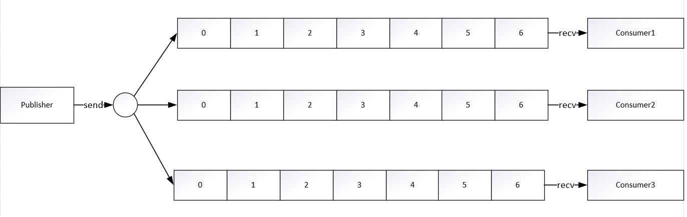

# 第二章 原理篇

## 2.1 线程IO模型

Redis是一个单线程程序。但是它为何还能这么快？这是因为它的数据全部存储在内存中，所有的匀速那都是内存级别的运算，正因为Redis是单线程的，所以需要小心使用Redis指令，对于时间复杂度位O(n)级别的指令，需要谨慎使用，否则一不小心就会导致Redis卡顿。

Redis既然是单线程，那么如何处理那么多的并发客户端连接呢？因为使用多路复用，非阻塞IO，接下来会对其进行详细讲解。

## 非阻塞IO

当我们使用套接字的读写方法，默认它们是阻塞的，比如read方法要传递下去一个参数n，表示最多存取n个字节后再返回，如果一个字节都没有，线程就会卡在那里，直到新的数据到来或者关闭，read方法才可以返回，线程才能继续处理。write方法一般来说不会阻塞，除非内核为套接字分配的写缓冲区已经满了，write方法就会阻塞，直到缓存区中有空间空闲出来。

非阻塞IO在套接字对象上提供了一个Non_Blocking选项，当这个选项打开时，读写方法不会阻塞，能读多少取决于内核为套接字分配的读缓冲区内部的数据字节数，能写多少取决于内核为套接字分配的写缓冲区的空闲空间字节数，读方法和写方法都会通过返回值来告知程序实际读写了多少字节。

有了非阻塞IO意味着线程在读写IO时可以不被阻塞，读写可以瞬间完成。

### 事件轮询

非阻塞IO读一段数据就返回了，但是如何知道何时该读取数据呢？事件轮询API帮助解决这个问题。最简单的事件轮询API是select函数。它是操作系统提供给用户程序的API。输入是读写描述符列表read fds & write fds，输出是与之对应的可读可写事件。同时还提供了一个timeout参数，如果没有任何事件到来，那么最多等待timeout的值的时间，线程处于阻塞状态，一旦期间有任何事件到来，就可以立即返回。时间过了之后还是没有任何事件到来，也会立即返回。拿到事件之后，线程就可以继续挨个处理相应的事件。处理完了继续轮询。如下图所示：

因为使用select系统调用同时处理多个通道描述符的读写事件，因此这类系统调用称为多路复用API。由于select系统调用的性能在描述符特别多时性能会变得很差，因此现代操作系统改用epoll(linux)和kqueue(FreeBSD和macosx)。

事件轮询API就是Java语言里面的NIO技术。Java的NIO并不是Java特有的技术。

### 队列

Redis会将每个客户端套接字都关联一个指令队列，客户端的指令通过队列进行顺序处理，先到先服务。

Redis同样也会为每个客户端套接字关联一个响应队列。Redis服务器通过响应队列来将指令的返回结果回复给客户端。如果对列为空，那么意味着连接暂时处于空闲状态，不需要去获取写事件，也就是可以将当前的客户端描述符从write_fds里面移出来，等到队列有数据了，再将描述符放进去，避免select系统立即返回写事件，结果发现没什么数据可以写，出现这种情况的线程会令CPU消耗飙升。

### 定时任务

Redis的定时任务会记录在一个最小堆中，在这个堆中，最快要执行的任务排放在堆的最上方。在每个循环周期中，Redis都会对最小堆里面已经到时间点的任务进行处理。处理完毕后，将最快要执行的任务还需要的时间值记录下来，这个时间就是select的timeout参数。

## 2.2 通信协议

### RESP

RESP是Redis序列化协议（Redis Serialization Protocol）的简写。它是一种直观的文本协议，优势在于实现过程异常简单，解析性能极好。

Redis协议将传输的结构数据分为5种最小单元类型，单元结束时统一加上回车换行符\r\n。

1. 单行字符串以“+”符号开头。
2. 多行字符串以“$”开头，后跟字符串长度
3. 整数值以“:”符号开头，后跟整数的字符串形成。
4. 错误消息以“-”符号开头。
5. 数组以“*”开头，后跟数组的长度。

示例如下：

- 单行字符串：+hello world\r\n
- 多行字符串：$11\r\nhello world\r\n
- 整数1024：:1024\r\n
- 错误：-WRONGTYPE Operatio against a key holding the wrong kind of value\r\n
- 数组[1,2,3]：*3\r\n:1\r\n:2\r\n:3\r\n
- NULL：$-1\r\n
- 空串：$0\r\n\r\n

客户端向服务器发送的指令只有一种格式，多行字符串数组。比如一个简单的set指令set author codehole会被序列化成下面字符串：
```shell
*3\r\n$3\r\nset\r\n$6\r\nauthor\r\n$8\r\ncodehole\r\n
```
控制台输出这个字符串如下：

```
*3
$3
set
$6
author
$8
codehole
```

## 2.3 持久化

Redis持久化有两种，第一种是快照，是一次全量备份，将内存数据的二进制序列化，第二种是AOF日志，AOF日志记录的是内存修改的指令记录文本。

由于Redis是单线程程序，这个线程同时负责多个客户端套接字的并发读写操作和内存数据结构的逻辑读写。在服务线上请求的同时，Redis还需要进行内存快照，内存快照要求Redis必须进行IO操作，而文件的IO操作不能使用多路复用API。Redis使用操作系统的多进程COW（Copy On Write）机制来实现快照的持久化。

Redis在持久化时会调用glibc的函数fork产生一个子进程，快照持久化完全交给子进程来处理，父进程继续处理客户端请求，子进程刚刚产生时，它和父进程共享内存里面的代码段和数据段。子进程做数据持久化，不会修改现有的内存数据结构，它只是对数据结构进行遍历读取，然后序列化写到磁盘中。但是父进程不一样，必须持续服务客户端请求，然后对内存数据结构进行不间断的更改。COW机制表示，父进程对于其中一个页面的数据进行修改时，会将被共享的页面复制一份分离出来，然后对这个复制的页面进行修改。这时子进程相应的页面是没有变化的。

上述做法的好处是，内存最大也只会变成原本内存的两倍数据，更何况Redis中的冷数据比例往往比较高。而由于子进程数据在持久化期间根本不会改变，因此，因此叫做快照持久化。

AOF日志存储的是Redis服务器的顺序指令序列，AOF日志只记录对内存进行修改的指令记录。Redis会在收到客户端修改指令后，进行参数校验、逻辑处理，如果没问题，就立即将该指令文本存储到AOF日志中，也就是说，先执行指令才将日志存盘，因此Redis无法作为数据库使用。

Redis在长期的运行过程中AOF日志会越来越长，因此出现了AOF重写。Redis提供了bgrewriteaof指令用于对AOF日志进行瘦身，其原理就是开辟一个子进程对内存进行遍历，转换成一系列Redis的操作指令，序列化到一个新的文件中。序列化完毕之后再将操作期间发生的增量AOF日志追加到这个新的AOF日志文件中，追加完毕后就立即替代旧的AOF日志文件，瘦身工作就完成了。

AOF日志是以文件的形式存在的，当程序对AOF日志文件进行写操作时，实际上是将内容写到了内核为文件描述符分配的一个内存缓存中，然后内核会异步将脏数据刷回到磁盘。Linux的glibc提供了fsync(int fd)函数可以将指定文件的内容强制从内核缓存刷到磁盘。只要Redis进程实时调用fsync函数就可以保证AOF日志不丢失，但是fsync函数是一个磁盘IO操作，因此很慢。所以在生产环境中，Redis通常每隔1s左右执行一次fsync操作。Redis同样提供了两种策略，一个是永远不调用fsync——让操作系统来决定何时同步磁盘，这样做很不安全，另一个是来一个指令就调用fsync一次——结果导致非常慢。

通常Redis的主节点不会进行持久化操作，持久化操作主要在从节点进行，从节点是备份节点，没有来自客户端请求的压力。但是如果出现网络分区，从节点长期连不到主节点，就会出现数据不一致的状况，如果此时主节点宕机，就会导致数据丢失，为了防止这种情况发生，需要在生产环境做好实时监控，另外可以再增加一个从节点降低网络分区的概率。

Redis持久化很少使用快照进行回复内存状态，因为会丢失大量数据。通常使用AOF日志重放来进行恢复，但是重放AOF日志又比较慢，因此在Redis实例很大的时候，启动会花费很长时间。

Redis4.0 为了解决这个问题，带来了一个新的持久化选项——混合持久化，即同时利用快照与AOF日志进行持久化。这里的AOF日志是增量的AOF日志，而不是全量的AOF日志。Redis用一个循环链表来存储AOF日志，每当覆盖的时候就进行快照持久化。

## 2.4 管道

管道本身并不是Redis服务器直接提供的技术，这个技术本质上是由客户端提供的。考虑Redis客户端向服务器端发送指令并返回操作结果的过程。

1. 客户端进程调用write将消息写到操作系统内核为套接字分配的发送缓冲send buffer中。
2. 客户端操作系统内核将发送缓冲的内容发送到网卡，网卡硬件将数据通过“网际路由”送到服务器的网卡。
3. 服务器操作系统内核将网卡的数据放到内核为套接字分配的接受缓冲recv buffer中。
4. 服务器进程调用read从接受缓冲中取出消息进行处理。
5. 服务器进程调用write将响应消息写到内核为套接字分配的发送缓冲send buffer中。
6. 服务器操作系统内核将发送缓冲的内容发送到网卡，网卡硬件将数据通过“网际路由”送到客户端的网卡。
7. 客户端操作系统内核将网卡的数据放到内核为套接字分配的接收缓冲recv buffer中。
8. 客户端进程调用read从接受缓冲中取出消息返回给上层业务逻辑进行处理。
9. 结束。

write操作只负责将数据写到本地操作系统内核发送缓冲中然后就返回了，剩下的事交给操作系统内核异步将数据送到目标机器。但是如果发送缓冲满了，那么就需要等待缓冲空出空闲空间来，这就是写操作IO操作的真正耗时。

read操作只负责将数据从本次操作系统内核的接受缓存中取出来就了事了。但是如果缓冲是空的，那么就需要等待数据到来，这个就是read操作IO操作的真正耗时。

所以对于value=redis.get(key)这样一个简单的请求来说，write操作几乎是没有耗时的，直接写到发送缓冲中就返回了，而read就比较耗时了，因为它要等待消息经过网络路由到目标机器处理后的响应消息，再回送到当前的内核读缓冲中才可以返回。这才是一个网络来回的真正开销。

考虑如下场景，使用客户端对Redis进行写——读——写——读 4个操作时需要经历如下过程：

    write——read——write——read

我们可以对其进行重排序，排序成如下格式：

    write——write——read——read

这样就会大幅度节省IO时间。因为对于管道来说，连续的write操作根本没有耗时，之后第一个read操作会等待一个网络的来回开销，然后所有的响应消息就都已经送回到内核的读缓冲了，后续的read操作直接就可以从缓冲中拿到结果，瞬间就返回了。

## 2.5 事务

每个事务的操作指令都有begin、commit和rollback操作，对应于Redis 的multi、exec、discard。其中multi指示事务的开始，exec指示事务的执行，discard指示事务的丢弃。示例如下：

```redis
> multi
OK 
> incr books
QUEUED
> incr books
QUEUED
> exec
(integer) 1
(integer) 2
```
所有的指令在exec之前是不执行的，而是缓存在服务器的一个事务队列种，服务器一旦收到exec指令，才开始执行整个事务队列，执行完毕后一次性返回所有指令的运行结果。因为Redis单线程的特性，它不用担心自己在执行队列的时候会被其他指令打扰，可以保证他们得到“原子性”的执行。

但是Redis的事务不是真正的原子性，事务的原子性是指事务要么全部成功，要么全部失败，但是Redis事务种某一条命令失败后，并不会进行回滚。示例如下：

```
> multi
OK
> set books iammastring
QUEUED
> incr books
QUEUED
> set poorman iamdesperate
QUEUED
> exec
```

key为books的值是string型，因此对其进行incr操作时，会发生错误，但是并不会导致事务回滚。

因此Redis事务根本不具备原子性，仅仅满足了事务的隔离性种的串行化——当前执行的事务有着不被其他事物打扰的权利。

Redis为事务提供了一个discard命令，该命令可以在事务执行exec之前，丢弃事务缓存队列中的所有指令。示例如下：

```
> get books
(nil)
> multi
OK
> incr books
QUEUED
> incr books
QUEUED
> discard
OK
> get books
(nil)
```

由于事务在发送每个指令到事务缓存队列时都要经过一次网络读写，所以Redis的客户端在执行事务时都会结合pipeline一起使用，这样可以将多次IO操作压缩为单词IO操作。

考虑一个业务场景，Redis存储了账户余额数据，它是一个整数，如果每次操作需要对其进行添加或减小操作，多个并发的客户端都要对其进行操作，如何保证其安全性。

1. 使用Redis分布式锁。但是Redis分布式锁是一种悲观锁。
2. 使用watch实现乐观锁。
   watch会在事务开始之前盯住一个或多个关键变量，当事务执行时，也就是服务器收到了exec指令要顺序执行缓存的事务队列时，Redis会检查关键变量自watch之后是否被修改了。如果关键变量被人动了，exec指令就会返回NULL回复告知客户端事务执行失败。示例如下：

   ```
   > watch books
   OK
   > incr books
   (integer) 1
   > multi
   OK
   > incr books
   QUEUED
   > exec
   (nil)
   ```

   Redis禁止在multi和exec之间执行watch指令，必须在multi之前盯住变量，否则会出错。

## 2.6 Pubsub

消息多播允许生产者只生产一次消息，由中间件负责将消息复制到多个消息队列，每个消息队列由相应的消费组进行消费，它是分布式的一种解耦方式，由于将多个消费组的逻辑进行拆分。支持了消息多播，多个消费组的逻辑可以放到不同的子系统中。



普通消息队列，就得将多个不同的消费组逻辑串接起来放在一个子系统中，进行连续消费。


为了支持消息多播，Redis不能再依赖于5种基本结构，单独采用一个PubSub模块支持消息多播。PubSub的生产者传递过来一个消息，Redis会直接找到相应的消费者传递过去。如果一个消费者都没有，那么消息会被直接丢弃。如果开始有三个消费者，一个消费者突然挂掉了，生产者会继续发送消息，另外两个消费者可以持续收到消息，但是当挂掉的消费者重新连上的时候，在断连期间生产者发送的消息，对于这个消费者来说就是彻底丢失了。

Redis5.0新增了Stream数据类型，这个功能给Redis带来了持久化消息队列。