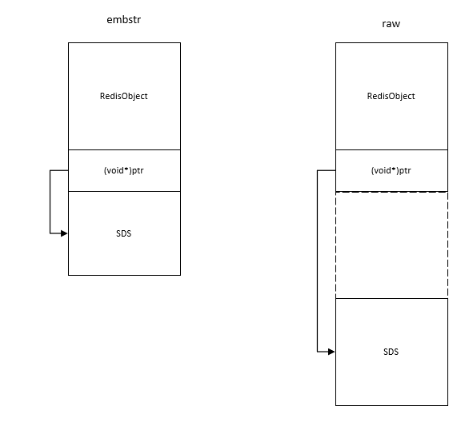
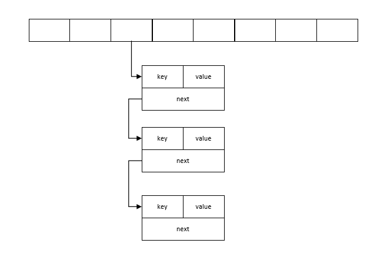
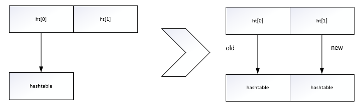
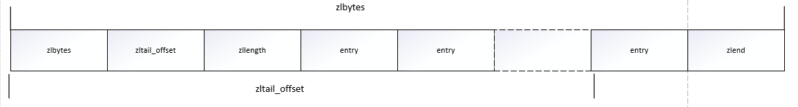
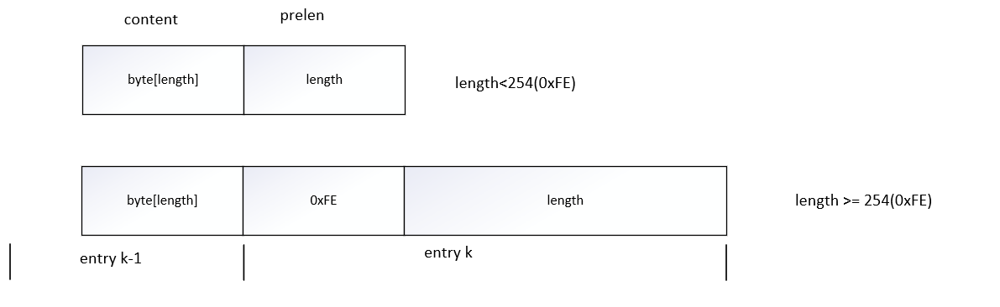
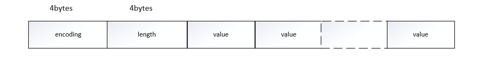
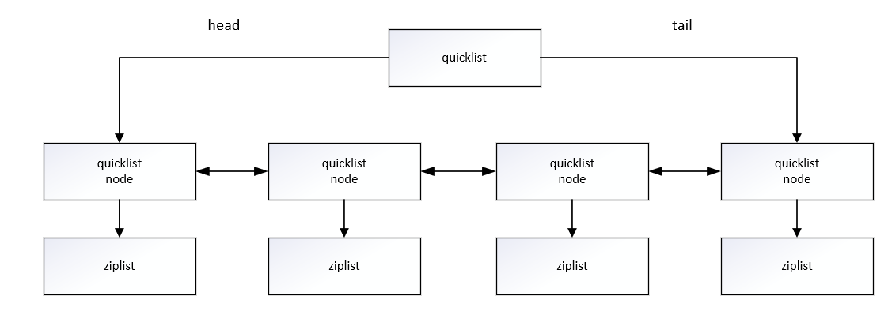

# 第五章 源码篇

## 5.1 字符串

### 5.1.1. Redis的字符串存储结构是怎样的？

C语言里字符串的标准形式是以NULL结尾的，Redis里并不这样表示，因为C语言的strlen函数的算法复杂度为O(n)，单线程的Redis表示不能承受。所以Redis的字符串叫做“SDS”，即Simple Dynamic String。结构如下：

    struct SDS<T>{
        T capacity;     //数组容量
        T len;          //数组长度
        byte flags;     //特殊标志位
        byte[] content; //数组内容
    }

该结构类似于Java中的ArrayList结构，其中capacity表示分配的空间长度，而len表示字符串的实际长度，content中存储的是真正的数据。由于字符串是可以修改的字符串，要支持append操作，如果数组没有冗余空间，就需要分配新数组，然后将旧内容复制过来，再append新内容，如果字符串的长度非常长，那么内存的分配和复制开销就会变大。

Redis的字符串有两种存储方式，再长度特别短时，使用embstr形式进行存储，当长度超过44字节时，使用raw形式进行存储。这两种方式的内存分布状况如下：



其中RedisObject代表是Redis对象的对象头结构，所有的Redis对象都有如下头结构：

    struct RedisObject{
        int4 type;
        int4 coding;
        int24 lru;
        int32 refcount;
        void *ptr;
    } robj;

其中type表示Redis对象的类型，同一个类型的type会有不同的存储形式coding，使用24位bit记录LRU信息，每个对象有一个引用计数，当引用技术为0时，对象就会被销毁，内存被回收。ptr指针指向对象内容的具体存储位置。这样一个RedisObject对象头结构占据16字节。考察SDS的存储结构，可以看出SDS对象头结构大小为capacity+3字节，因为除content外还有3字节的头信息，所以分配一个字符串最小占用19字节。由于内存分配器分配内存的大小单位都是2/4/8/16/32/64字节，64-19为45，由于字符串是以NULL结尾的，因此是44字节。

#### 5.1.1.1 数组容量、数组长度为何要使用泛型T？

当字符串比较短时，len和capacity可以使用byte和short来表示，Redis为了对内存做极致的优化，不同长度的字符串使用不同的结构体表示。Redis规定字符串的长度不能超过512MB，创建字符串时len和capacity一样长，不会多分配冗余空间，因为append操作修改字符串的情况很少。

#### 5.1.1.2 为什么Redis字符串最长为512MB?

    Actually the internal limit of an sds.c string, that is the dynamic string abstraction used inside Redis, is 2GB (as the string header represents length and remaining space as a signed 32 bit integers), but at some point we decided to reduce it to 512 MB since it's a large enough value anyway, and a 32 bit integer can address every bit inside a 512 MB value, that was handy for bit operations.

Redis作者表示实际上这种限制是一种内部限制，如果使用32位无符号数，string的限制应该为2GB，但是因为512MB足够大解决问题了，所以将其限制到512MB，32位整数可以解决512MB值内的每个位，这对位操作也十分方便。但是这也带来了问题，详见如下链接[Remove 512 MB max value limit #757](https://github.com/antirez/redis/issues/757)

### 5.1.2 扩容策略

字符串长度小于1MB之前，扩容采用加倍策略，超过1MB，则采用每次扩容多分配1MB空间的策略。

## 5.2 字典

### 5.2.1 Redis字典存储结构是怎样的？

Redis字典的存储结构与Java的HashMap几乎是一样的，都是通过分桶的方式解决hash冲突，第一维是数组，第二维是链表。数组中存储的都是第二维链表的第一个元素的指针。即如下形式：



hashtable的性能好不好完全取决于hash函数的质量。如果hash函数可以将key打散的比较均匀，那么这个hash函数就是个好函数。Redis的字典默认的hash函数是siphash。siphash算法即使在输入key很小的情况下，也可以产生随机性特别好的输出。

### 5.2.1 Redis字典如何扩容？

扩容条件：正常情况下，当hash表中元素的个数等于第一维数组的长度时，就会开始扩容，扩容的新数组是原数组大小的两倍。如果Redis正在做bgsave时，为了减少内存也的过多分离（COW），Redis尽量不去扩容（dict_can_resize），但是如果hash表已经非常满了，元素的个数已经达到了第一维数组长度的5倍（dict_force_resize_ratio），说明hash表已经过于拥挤了，这个时候就会进行强制扩容。

扩容过程中，Redis字典采用渐进式rehash的方式进行扩容，即分配新的hashtable，然后进行渐进式搬迁，待搬迁结束后，旧的hashtable被删除，新的hashtable取代其存在。

### 5.2.2 什么是渐进式rehash？

Redis为了追求高性能，不能阻塞服务，所以采用了渐进式rehash策略。渐进式rehash会在rehash的同时，保留新旧两个hash结构，查询时会同时查询两个hash结构，然后在后续的定时任务以及hash操作指令中，循序渐进地将旧hash的内容一点点地迁移到新的hash结构中。当搬迁完成了，就会使用新的hash结构取而代之。



当hash移除了最后一个元素之后，该数据结构被自动删除。hash结构也有缺点，hash结构地存储消耗要高于单个字符串，需要根据实际情况再三权衡。

### 5.2.3 缩容条件是什么？

当hash表因为元素逐渐被删除变得越来越稀疏，Redis会对hash表进行缩容来减少hash表的第一维数组空间占用。缩容的条件是元素个数低于数组长度的10%。缩容不会考虑Redis是否正在做bgsave。

### 5.2.4 为什么缩容不用考虑bgsave?

## 5.3 压缩列表内部

### 5.3.1 为什么要用压缩列表？

Redis为了节约内存空间使用，zset和hash容器对象在元素个数较小的时候，采用压缩列表（ziplist）进行存储。压缩列表是一块连续的内存空间，元素之间紧挨着存储，没有任何冗余空隙。

### 5.3.2 压缩列表结构

压缩列表内部结构示意图如下：



其中压缩列表结构体如下：
```c++
struct ziplist<T> {
   int32 zlbytes;       // 整个压缩列表占用字节数
   int32 zltail_offset; // 最后一个元素距离压缩列表起始位置的偏移量，用于快速定位到最后一个节点
   int16 zllength;      // 元素个数
   T[] entries;         // 元素内容列表，依次紧凑存储
   int8 zlend;          // 标志压缩列表的结束，值恒为0xFF
}
```
压缩列表为了支持双向遍历，所以才有ztail_offset这个字段，用来快速定位最后一个元素，然后倒着遍历。

entry块随着容纳的元素类型不同也会有不一样的结构。结构如下：

```c++
struct entry{
    int<var> prevlen;           // 前一个entry的字节长度
    int<var> encoding;          // 元素类型编码
    optional byte[] content;    // 元素内容
}
```

其中prevlen字段表示前一个entry的字节长度，当压缩列表到这遍历时，需要通过这个字段来快速定位到下一个元素的位置。它是一个变长的整数，当字符串长度小于254时，使用一个字节表示；如果达到或者超出254时，就用5个字节表示。第一个字节是0xFE，剩余四个字节表示字符串长度。

entry的结构如下：



encoding字段存储了元素内容的编码类型信息，ziplist通过这个字段来决定后面的content的形式。

Redis为了节约内存空间，对encoding字段进行了相当复杂的设计。Redis这个字段的前缀位来识别具体存储的数据形式。

Redis为了节约存储空间。对encoding字段进行了相当复杂的设计。Redis通过这个字段的前缀位来识别具体存储的数据形式。

1. 00xxxxxx是最大长度位数为63的短字符串，后面的6个位存储字符串的位数，剩余的字节就是字符串的内容。
2. 01xxxxxx xxxxxxxx是中等长度的字符串，后面14个位来表示字符串的长度，剩余的字节就是字符串的内容。
3. 10000000 aaaaaaaa bbbbbbbb cccccccc dddddddd是特大字符串，需要使用额外4个字节来表示长度。第一个字节前缀是10，剩余6位都没有使用，统一置为0。后面跟着字符串内容。不过这样的大字符串是没有机会使用的，压缩列表通常只是用来存储小数据的。
4. 11000000 表示int16，后跟两个字节表示整数。
5. 11010000 表示int32，后跟四个字节表示整数。
6. 11100000 表示int64，后跟八个字节表示整数。
7. 11110000 表示int24，后跟三个字节表示整数。
8. 11111110 表示int8，后跟三个字节表示整数。
9. 11111111 表示ziplist的结束，也就是zlend的值0xFF。
10. 1111xxxx 表示极小整数，xxxx的范围只能是（0001~1101），也就是1~13，因为0000、1110、1111都被占用了。读取到的value需要将xxxx减1，也就是说整数0~12就是最终的value。

注意content字段在结构体中定义为optional类型，表示这个字段是可选的，对于很小的整数而言，它的内容已经内联到encoding字段的尾部了。

### 5.3.3 如何添加元素？

ziplist都是紧凑存储，没有冗余空间，意味着插入一个新的元素就要调用realloc扩展内存。取决于内存分配器算法和当前的ziplist内存大小，realloc可能会重新分配新的内存空间，并将之前的内容一次性拷贝到新的地址，也有可能在原有的地址上进行扩展。如果ziplist占据内存太大，重新分配内存和拷贝内存就会又很大的开销，所以ziplist不适合存储大型字符串，存储的元素也不宜过多。

### 5.3.4 级联更新问题

考察entry结构如下：


```c++
struct entry{
    int<var> prevlen;           // 前一个entry的字节长度
    int<var> encoding;          // 元素类型编码
    optional byte[] content;    // 元素内容
}
```

由于每个entry都保存了一个prevlen字段存储前一个entry的长度。如果内容小于254字节，prevlen就用一个字节存储，否则用5个字节存储，这意味着如果某个entry经过了修改操作从253字节变成了254字节，那么它的下一个entry的prevlen字段就要进行更新，从一个字节扩展成5个，那么接下来的entry都需要进行更新。删除中间的某个节点也可能会造成级联更新，因为如果被删除的节点的长度是254以下，而该节点的前一节点长度为254及以上，就会造成级联更新。级联更新的最根本原因还是压缩存储方式，但是该方式带来了节约内存的优点。

### 5.3.5 intset小整数集合

当set集合容纳的元素都是整数并且元素个数较少时，Redis会使用intset来存储集合元素。intset是紧凑的数组结构，同时支持16位、32位和64位整数。其结构如下：

```c++
struct intset<T> {
    int32 encoding;     // 决定整数位宽是16位、32位还是64位
    int32 length;       // 元素个数
    int<T> contents;    // 整数数组，可以是16位、32位和64位
}
```

结构图如下：



上图所示是intset的内部结构示意图。需要注意当set中放入非整数值时，存储形式立即从intset转变成hash结构。

### 5.3.6 为什么set集合在数量很小时不采用ziplist存储？

ziplist的数据结构保证了数据的有序性，但是因此带来了级联更新的问题，导致效率不高，而set集合不需要数据有序，因此不使用ziplist进行存储。而且intset并不存储prevlen字段，这样就避免了级联更新问题，而且由于紧凑存储，节省了内存。

## 5.4 快速列表

### 5.4.1 为什么要使用快速列表？

Redis早期版本list数据结构使用的是压缩列表ziplist和普通的双向列表，即元素少时采用ziplist，元素多时采用linkedlist。

链表结构如下：

```c++
// 链表的节点
struct listNode<T> {
    listNode* prev;
    listNode* next;
    T value;
}
// 链表
struct list {
    listNode* head;
    listNode* tail;
    long length;
}
```

由于链表的附加空间相对太高，prev和next指针就需要占用16个字节，另外每个节点的内存都是单独分配的，会加剧内存的碎片化，影响内存管理。所以采用快速列表进行替代。

### 5.4.2 什么是快速列表？

快速列表是双向链表和ziplist的混合体，它将linkedlist按段进行切分，每一段使用ziplist让存储紧凑，多个ziplist之间使用双向指针进行串联。采用了操作系统的分页思想。使用了分页的思想保证了外部碎片较少。结构如下：



快表使用连续内存存储节省了内存，并且降低了碎片化，但是由于连续内存存储会导致级联更新的问题，因此使用了ziplist，这样使得每个ziplist的长度有限，类似于操作系统的页，降低了级联更新的影响。由于使用快速列表，对于列表的所有头或尾的操作，都是O(1)的操作，大大节省了时间。为了进一步节约空间，Redis还会对ziplist进行压缩存储，使用LZF算法压缩，可以选择压缩深度。

```c++
struct ziplist {
    ...
}

struct ziplist_compressed {
    int32 size;
    byte[] compressed_data;
}

struct quicklistNode {
    quicklistNode *prev;
    quicklistNode *next;
    ziplist *zl;
    int32 size;
    int16 count;
    int2 encoding;
}

struct quicklist {
    quicklistNode *head;
    quicklistNode *tail;
    long count;
    int nodes;
    int compressDepth;
}
```

### 5.4.3 每个ziplist存储多少个元素？

由于快表中的ziplist是压缩列表，用来解决listNode带来的内存碎片化的问题，但是同时也带来了ziplist的级联更新问题，因此，存储元素过大会导致级联更新问题严重，影响效率，过小又会产生内存碎片化问题，导致内存难以管理。quicklist内部默认单个ziplist长度尾8KB，超出了这个字节数，就会另起一个ziplist。ziplist的长度由配置参数list-max-ziplist-size决定。quicklist默认的压缩深度是0，也就是不压缩。压缩的实际深度由配置参数list-compress-depth决定。为了支持快速的pop和push操作，quicklist的受委两个ziplist不进行压缩，此时压缩深度尾1，如果压缩深度为2，就表示quicklist的受委第一个和第二个ziplist不进行压缩。

## 5.5 跳表

Redis的zset是一种复合结构，采用跳表和哈希表来进行完成，其中哈希表用来存储value和score的对应关系，另一方面使用跳表解决score的排序问题。

为什么要用跳表？而不用其他的数据结构？例如堆、B+树？

如果采用堆将无法保证最快的查找到指定score的值，并且每次插入删除操作都需要对堆进行重排序操作，非常浪费时间。使用B+树，要进行的节点结构操作过大，效率较低。

### 5.5.1 什么是跳表？

跳表就是跳跃链表，如下图所示：

Redis的跳表共有64层，可以容纳2^64个元素，每一个kv(key/value)块对应一个zlnode结构，kvheader也是这个结构，不过value字段值为NULL——无效的，score是Double.MIN_VALUE，用来垫底的。kv之间使用指针串连接起来形成了双向链表的结构，它们是有序的，从小到大。不同的kv层高可能不一样，层数越高，kv越少。同一层的kv会使用指针串起来。每一层的元素遍历都是从kvheader出发。

对于跳跃链表的查找，如果只有一层，查找的时间复杂度为O(n)，但是跳表的时间复杂度为O(lg(n))。查找规则如下：

查找首层节点，如果查找到的节点大于第一层节点，则查找该节点的下一层节点，如果查找到的节点小于该层节点，则说明查找失败。

跳跃列表插入时，分层方法为随机分层。对于每一个新插入的系欸的那都需要调用一个随机算法给它分配一个合理的层数。直观上期望的目标是50%的概率被分配到Level1，25%的概率被分配到Level2，以此类推，每一层的晋升率为50%。

不过Redis标准源码中的晋升率只有25%，所以官方的跳跃列表更加扁平化，层高相对较低，在单个层上需要遍历的节点数量会稍微多一点。也正是因为层数一般不高，所以遍历的时候从顶层开始往下遍历会非常浪费，条约列表会记录下当前的最高层数maxLevel，遍历时从这个maxLevel开始遍历，性能就会提高很多。

插入过程整体如下：首先需要搜索合适插入点的过程中将搜索路径找出来，然后可以开始创建新节点。创建的时候需要给这个节点随机分配一个层数，再将搜索路径上的节点和这个节点通过前后向指针串联起来。如果分配的新节点的高度高于当前跳跃列表的最大高度，就需要更新一下跳跃列表的最大高度。

删除过程如下：先把搜索路径找出来，然后对于每个曾的相关节点重排一下前向后向指针，同时还要注意更新一下最高层数maxLevel。

更新过程：当调用zadd方法时，如果对应的value不存在，那就是插入过程。如果这个value已经存在了，只是调整一下score的值，那就需要走一个更新流程。假设这个新的score值不会带来排序上的改变，那么就不需要调整位置，直接修改元素的score值就可以了。但是如果排序位置改变了，那就要调整位置，调整位置的策略如下：一个简单的策略就是先删除这个元素，再插入这个元素，需要经过两次路径搜索。不过Redis遇到score值改变了的情况就直接删除后再插入，不去判断位置是否需要调整。

在一个极端的情况下，zset中的所有score的值都是一样的，zset的查找性能会退化为O(n)么？zset的排序元素不止看score值，如果score值相同还需要再比较value值。

### 5.5.2 如何计算元素排名？

Redis在跳表的forward指针上进行了优化，给每一格forward指针都增加了span属性，span是“跨度”的意思，表示从前一个姐弟啊沿着当前层的forward指针跳到当前这个节点中间会跳过多少个节点。Redis在插入、删除操作时会小心翼翼地更新span值的大小。当我们要计算一个元素的排名时，只需要将搜索路径所经过的所有节点的跨度进行叠加就可以算出最终的rank值。