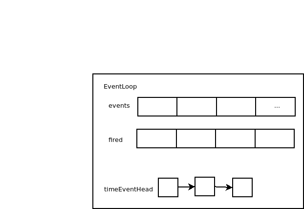

# AE框架基础结构

Redis使用AE框架完成整套系统的事件监听工作。AE框架主要采用事件循环方式对事件进行处理。接下来我们将对AE框架进行详尽的分析。

AE框架采用一个事件循环循环处理事件，因此，保存事件的数组与队列是必须的，AE将事件分为两种，分别是：

1. 文件事件
2. 时间事件

分别由`aeFileEvent`和`aeTimeEvent`表示，通过名字我们可以知道，文件事件表示文件发生变化时进行的事件，例如出现可读数据、需要写入数据。时间事件是指到达特定时间需要触发特定操作。

众所周知，对于文件的操作仅仅也就只有读写两类操作，因此事件也就只有读与写两种。`aeFileEvent`采用`rfileProc`和`wfileProc`两个函数指针表示读事件与写事件发生时进行的操作，相关的数据保存在`clientData`属性中，至于究竟触发了哪个事件是通过`mask`属性进行标识的，因此，`aeFileEvent`具有如下结构：

```c
typedef struct aeFileEvent {
    int mask; /* one of AE_(READABLE|WRITABLE) */
    aeFileProc *rfileProc;
    aeFileProc *wfileProc;
    void *clientData;
} aeFileEvent;
```

而对于时间事件，最重要的就是该事件何时开始执行，何时结束，每次执行怎样的操作，结束时间事件时是否有一定的回调操作。`aeTimeEvent`采用`when_sec`和`when_ms`表示该事件将在何时执行，使用`timeProc`函数指针表示每次事件执行时执行的操作，`finalizerProc`函数指针表示事件终止时执行的操作，`clientData`表示与事件执行相关的数据。`aeTimeEvent`具有如下结构：

```c
typedef struct aeTimeEvent {
    long long id; /* time event identifier. */
    long when_sec; /* seconds */
    long when_ms; /* milliseconds */
    aeTimeProc *timeProc;
    aeEventFinalizerProc *finalizerProc;
    void *clientData;
    struct aeTimeEvent *next;
} aeTimeEvent;
```

查看两个Event的源码可以明显发现两者有一个巨大的不同，就是`aeTimeEvent`中不单单保存事件数据，还保存着一个`next`指针，这意味着`aeTimeEvent`使用链表保存时间事件。文件事件事实上是使用数组保存的。我们考察`aeEventLoop`来查看两种事件的存储结构：

```c
typedef struct aeEventLoop {
    int maxfd;
    long long timeEventNextId;
    aeFileEvent events[AE_SETSIZE]; /* Registered events */
    aeFiredEvent fired[AE_SETSIZE]; /* Fired events */
    aeTimeEvent *timeEventHead;
    int stop; // 表示EventLoop状态，是否停止，1为停止，0为运行
    void *apidata; /* This is used for polling API specific data */
    aeBeforeSleepProc *beforesleep;
} aeEventLoop;
```

可以看到，保存文件事件的`events`是一个数组，而保存时间事件的`timeEventHead`是一条链表。至于为何两种事件使用不同的方式存储，之后再进行讨论。

由于AE框架本身使用的是Linux的多路复用API，而多路复用API本身需要监听各个文件的FD，而本身也需要一个FD，为了与被监听的事件的FD相区分，我们将多路复用API使用的FD称为epfd。关于更多多路复用API的使用细节，可以查看[Epoll](../../../../Linux/多路复用/1.&#32;Epoll.md)

我们已经知道被监听的事件信息存放在`events`中，那么被监听事件的FD去哪儿了呢？事实上那些FD已经被注册到多路复用API中了，那么多路复用API的FD(epfd)呢？该epfd保存在apidata中，方便使用。那么最后还剩下`beforesleep`属性未进行解释，该属性实际上用于在事件循环启动前进行一系列的前置操作。这些会在之后分析Redis源码时看到。

最后分析`asFiredEvent`，该结构体主要存储已经被触发了的事件，这就相对简单了。不多做分析。

因此EventLoop包含了一个未完成文件事件队列、一个已完成文件事件队列、一个时间事件队列，上述三个队列用于存储事件信息，多路复用API信息保存在apidata中。



接下来我们考察EventLoop的创建过程。
