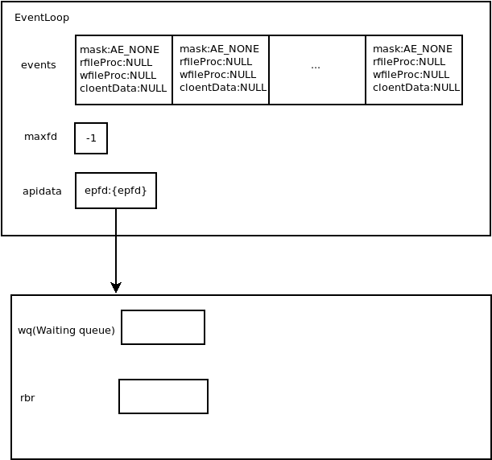
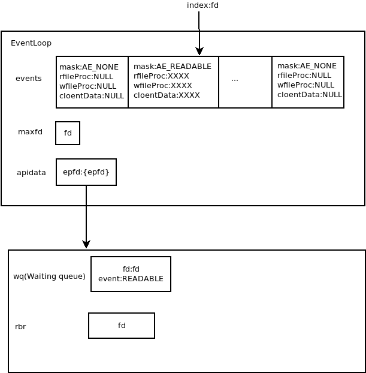

# 3.EventLoop文件事件的管理

根据之前的分析，我们已经了解到AE将事件分为时间事件以及文件事件，他们的管理方式也有不同，这里我们优先分析文件事件的管理方式。

管理无非就是增删改查，AE框架只提供了增删查三个功能，没有提供改，因为改已经被整合到了增和删操作之中。由于AE对于文件事件的查（监听）操作与时间事件的查（监听）操作是放在一起处理的，所以本部分主要讲解文件事件的增删操作。

由于AE框架底层使用的是多路复用API，这里我们主要讲述Epoll，对于管理事件，epoll提供了如下方法：

```c
int epoll_ctl(int epfd, int op, int fd, struct epoll_event *event);
```

AE正是使用该方法进行的事件管理。关于该方法的更多解释可以查看[Epoll](../../../../Linux/多路复用/1.Epoll.md)

接下来开始分析AE框架对于EventLoop监听事件的管理操作：

首先查看添加文件事件的方法`int aeCreateFileEvent(aeEventLoop *eventLoop, int fd, int mask,aeFileProc *proc, void *clientData)`，该方法要求传入5个参数，含义分别如下：

1. eventLoop：aeEventLoop对象的指针
2. fd：要监听的事件的fd
3. mask：监听事件的类型
4. proc：监听的事件发生后执行的操作
5. clientData：调用者自定义的数据，由proc使用

接下来查看方法代码：

```c
int aeCreateFileEvent(aeEventLoop *eventLoop, int fd, int mask,
        aeFileProc *proc, void *clientData)
{
    // 如果fd超过最大的范围，则报错，最大为1024*10
    if (fd >= AE_SETSIZE) return AE_ERR;
    // 从eventLoop的保存文件事件的数组中获取已经存在的事件
    aeFileEvent *fe = &eventLoop->events[fd];
    // 调用Epoll API添加事件
    if (aeApiAddEvent(eventLoop, fd, mask) == -1)
        return AE_ERR;
    // 整合之前监听的事件与现在监听事件的标志
    // 例如之前已经监听了当前fd的可读事件，
    // 现在需要监听当前fd的可写事件
    fe->mask |= mask;
    // 为对应事件添加事件发生后的操作
    if (mask & AE_READABLE) fe->rfileProc = proc;
    if (mask & AE_WRITABLE) fe->wfileProc = proc;
    // 传入客户端指定的数据
    fe->clientData = clientData;
    // 更新最大jiexiali
```

然后查看`static int aeApiAddEvent(aeEventLoop *eventLoop, int fd, int mask)`方法，该方法用于调用epoll API将事件添加到 epoll的eventLoop中，考察该方法：

```c
static int aeApiAddEvent(aeEventLoop *eventLoop, int fd, int mask) {
    aeApiState *state = eventLoop->apidata;
    struct epoll_event ee;
    // 判断传入的fd是否已经被注册过了
    // 如果注册过了，只用更改其事件
    // 不用添加
    int op = eventLoop->events[fd].mask == AE_NONE ?
            EPOLL_CTL_ADD : EPOLL_CTL_MOD;

    ee.events = 0;
    // 合并两者监听事件的类型
    mask |= eventLoop->events[fd].mask;
    // 根据监听事件的类型，转化成何时的Epoll API参数
    if (mask & AE_READABLE) ee.events |= EPOLLIN;
    if (mask & AE_WRITABLE) ee.events |= EPOLLOUT;
    ee.data.u64 = 0; /* avoid valgrind warning */
    ee.data.fd = fd;
    // 调用epoll_ctl方法进行监听事件修改
    if (epoll_ctl(state->epfd,op,fd,&ee) == -1) return -1;
    return 0;
}
```

在EventLoop初始化之后，所有关于文件事件的属性，状态如下图：



此时，apidata已经初始化好一个epoll api创建的EventLoop，其epfd放在apidata.epfd中，并且events中所有事件mask均被赋值为AE_NONE，表示未初始化事件。

epoll 的eventLoop中等待队列中没有任何事件被等待，rbr中由于没有注册任何fd，因此rbr也是空的（由于红黑树太难画了，这里使用链表表示）。

这里给出为文件描述符fd添加一个文件事件后的状态：



可以看到，这里有一点很重要，就是传入的fd不仅仅是要监听事件的fd，而且是events数组的index，用于进行随机访问，事实上这也是一种优化，不过带来的缺点就是占用的额外空间较多，可能被浪费。

继续考察删除事件的方法`void aeDeleteFileEvent(aeEventLoop *eventLoop, int fd, int mask)`，该方法仅要求传入3个参数，毕竟删除事件不需要传入客户端数据，但是这样也会让无用数据存留在内存中。先解释传入3个参数的含义：

1. eventLoop: 监听事件的aeEventLoop
2. fd：监听的fd
3. delmask：删除的事件的标志。例如如果删除该fd的监听读事件，那么传入AE_READABLE，如果不监听该fd的写入事件，那么传入AE_WRITABLE

接下来考察该方法代码：

```c
void aeDeleteFileEvent(aeEventLoop *eventLoop, int fd, int mask)
{
    // fd范围判断
    if (fd >= AE_SETSIZE) return;
    aeFileEvent *fe = &eventLoop->events[fd];
    // 判断是否事件存在
    if (fe->mask == AE_NONE) return;
    // 消除事件监听记录
    fe->mask = fe->mask & (~mask);
    // 更新maxfd
    if (fd == eventLoop->maxfd && fe->mask == AE_NONE) {
        /* Update the max fd */
        int j;

        for (j = eventLoop->maxfd-1; j >= 0; j--)
            if (eventLoop->events[j].mask != AE_NONE) break;
        eventLoop->maxfd = j;
    }
    // 删除监听事件
    aeApiDelEvent(eventLoop, fd, mask);
}
```

需要注意，`aeDeleteFileEvent(aeEventLoop *eventLoop, int fd, int mask)`方法仅仅更改了用户内存中保存的事件信息，并没有更改epoll API监听的事件信息，而真正更改epoll API事件信息的方法是`aeApiDelEvent(eventLoop, fd, mask);`，需要注意的是，这里的`mask`变量传入的值与`aeDeleteFileEvent`传入的一模一样。这里我们继续考虑`static void aeApiDelEvent(aeEventLoop *eventLoop, int fd, int delmask)`方法，该方法的三个参数含义相同，很多处理逻辑甚至相似，考虑该方法代码：

```c
static void aeApiDelEvent(aeEventLoop *eventLoop, int fd, int delmask) {
    aeApiState *state = eventLoop->apidata;
    struct epoll_event ee;
    // 删除指定事件监听标志
    int mask = eventLoop->events[fd].mask & (~delmask);

    ee.events = 0;
    if (mask & AE_READABLE) ee.events |= EPOLLIN;
    if (mask & AE_WRITABLE) ee.events |= EPOLLOUT;
    ee.data.u64 = 0; /* avoid valgrind warning */
    ee.data.fd = fd;
    // 修改epoll的eventLoop
    if (mask != AE_NONE) {
        epoll_ctl(state->epfd,EPOLL_CTL_MOD,fd,&ee);
    } else {
        epoll_ctl(state->epfd,EPOLL_CTL_DEL,fd,&ee);
    }
}
```

可以看到，该方法对mask进行了相同的操作，然后根据更改后是否是AE_NONE调用特定的方法，这里相对简单，便不多赘述。

不过经过上面的分析可以看到，addEvent和delEvent方法充分完成了修改操作。修改的新增操作交给了addEvent方法，而修改的删除操作交给了delEvent方法，这也是设计严谨性的体现。
