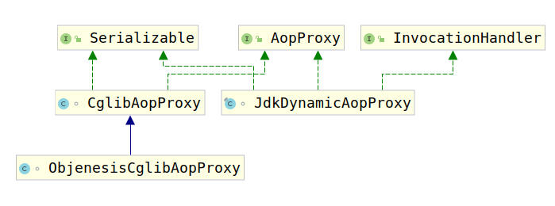

# AopProxy

经过了上面的考察，我们发现，AOP最后创建代理总是两种代理：

1. JdkDynamicAopProxy，即Java动态代理
2. ObjenesisCglibAopProxy，即CGLib动态代理

满足如下条件则使用CGLib动态代理：

1. 指定代理整个类，而不是接口（因为JDK动态代理基于接口代理，所以无法代理非接口方法）

否则依旧使用Java动态代理。



可以看到，上述两个代理类均是AopProxy的实现类，这里考察该接口：

```java
/**
 * Delegate interface for a configured AOP proxy, allowing for the creation
 * of actual proxy objects.
 * 用于配置的AOP代理的委托接口，允许创建实际的代理对象。
 * <p>Out-of-the-box implementations are available for JDK dynamic proxies
 * and for CGLIB proxies, as applied by {@link DefaultAopProxyFactory}.
 *
 * 由DefaultAopProxyFactory应用的即用型实现可用于JDK动态代理和CGLIB代理。
 * @author Rod Johnson
 * @author Juergen Hoeller
 * @see DefaultAopProxyFactory
 */
```

考虑其要求实现方法：

```java
Object getProxy();
Object getProxy(@Nullable ClassLoader classLoader);
```

可以看到该接口仅仅要求实现getProxy()方法，不同的是是否传入类加载器。考虑ProxyFactory类，我们知道获取代理时，调用的是如下方法：

```java
public Object getProxy(@Nullable ClassLoader classLoader) {
    return createAopProxy().getProxy(classLoader);
}
```

其中createAopProxy仅仅将配置传入了 JdkDynamicAopProxy或者ObjenesisCglibAopProxy中，但是创建操作并没有执行，所以真正的代理创建操作就在getProxy()和getProxy(ClassLoader)方法中。

查看方法注释可以看到：

```java
/**
 * Create a new proxy object.
 * 创建新的代理对象
 * <p>Uses the given class loader (if necessary for proxy creation).
 * {@code null} will simply be passed down and thus lead to the low-level
 * proxy facility's default, which is usually different from the default chosen
 * by the AopProxy implementation's {@link #getProxy()} method.
 * null会简单地传递下去，从而导致低级代理功能的默认值，该默认值通常与AopProxy实现的getProxy（）方法选择的默认值不同。
 * @param classLoader the class loader to create the proxy with
 * (or {@code null} for the low-level proxy facility's default)
 * @return the new proxy object (never {@code null})
 */
Object getProxy(@Nullable ClassLoader classLoader);
```

已经知道了该接口的功能，那么考虑其实现类，这里分为两节单独介绍。
