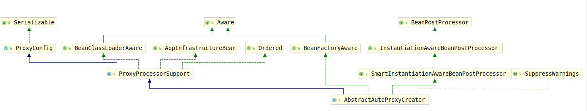

# AbstractAutoProxyCreator（1）

该类用于为每个候选的类进行包装，将其包装成AOP代理。

该类类继承结构图如下：



该类与一般的代理不同：该类可以用来代理所有的类，或者说他是代理所有类的入口，可以使用它判断是否要进行代理，然后对传入的对象进行代理，简化工作量。但又与特定的代理类不同：特定的代理类只能代理一个类或者几个类，如果有许多类需要代理则需要写很多代理，通过该类来解耦。

其实这正符合AOP的思想，AOP允许我们通过一些表达式配置，或者很少的编程，为大量的Bean进行包装，使其能够在方法执行前后、抛出异常时执行指定操作，而不是为每个Bean都写一个代理类。这也就引申出了AOP的基本概念。该类提供了基本的模板方法，通过这些方法，进行对象的包装，将其包装成代理。

子类可以应用任何策略来确定是否要代理Bean，例如 按类型，名称，定义详细信息等。它们还可以返回应仅应用于特定bean实例的其他拦截器。 一个简单的具体实现是{@link BeanNameAutoProxyCreator}，它通过给定名称标识要代理的bean。

可以通过interceptorNames属性配置使用的interceptor。

该类通过类似建造者模式，将具体的bean结合传入的Advice组装成代理后返回。由于具体的组装方式比较相似，所以可以带来比较好的效果。

## 接口方法

1. BeanFactoryAware接口

    该接口定义了setBeanFactory(BeanFactory beanFactory)用于向Bean中注入BeanFactory类型的属性，实现如下：

    ```java
        @Override
        public void setBeanFactory(BeanFactory beanFactory) {
            this.beanFactory = beanFactory;
        }
    ```

2. BeanPostProcessor接口

    该接口定义了postProcessBeforeInitialization(Object bean, String beanName)和postProcessAfterInitialization(Object bean, String beanName)方法，实现如下：

    ```java
        @Override
        public Object postProcessBeforeInitialization(Object bean, String beanName) {
            return bean;
        }

        /**
        * Create a proxy with the configured interceptors if the bean is
        * identified as one to proxy by the subclass.
        * @see #getAdvicesAndAdvisorsForBean
        */
        @Override
        public Object postProcessAfterInitialization(@Nullable Object bean, String beanName) throws BeansException {
            if (bean != null) {
                Object cacheKey = getCacheKey(bean.getClass(), beanName);
                if (!this.earlyProxyReferences.contains(cacheKey)) {
                    return wrapIfNecessary(bean, beanName, cacheKey);
                }
            }
            return bean;
        }
    ```

## 核心接口BeanPostProcessor

由于该类的目的终究是包装实例，将其包装为一个代理，因此其核心方法仍然是负责包装的各个方法，典型的是`postProcessAfterInitialization(@Nullable Object bean, String beanName)`和`postProcessBeforeInitialization(Object bean, String beanName)`。`postProcessBeforeInitialization(Object bean, String beanName)`仅仅是默认方式实现，即返回输入的bean，关键在于`postProcessAfterInitialization(@Nullable Object bean, String beanName)`，代码实现如下：

```java
    /**
    * Create a proxy with the configured interceptors if the bean is
    * identified as one to proxy by the subclass.
    * @see #getAdvicesAndAdvisorsForBean
    */
    @Override
    public Object postProcessAfterInitialization(@Nullable Object bean, String beanName) throws BeansException {
        if (bean != null) {
            // 获取cacheKey
            Object cacheKey = getCacheKey(bean.getClass(), beanName);
            if (!this.earlyProxyReferences.contains(cacheKey)) {
                // 根据情况将其包装为代理
                return wrapIfNecessary(bean, beanName, cacheKey);
            }
        }
        return bean;
    }
```

考察`wrapIfNecessary(Object bean, String beanName, Object cacheKey)`方法：

```java
/**
 * Wrap the given bean if necessary, i.e. if it is eligible for being proxied.
 * @param bean the raw bean instance
 * @param beanName the name of the bean
 * @param cacheKey the cache key for metadata access
 * @return a proxy wrapping the bean, or the raw bean instance as-is
 */
protected Object wrapIfNecessary(Object bean, String beanName, Object cacheKey) {
    // 如果是自定义的代理，则直接返回
    if (StringUtils.hasLength(beanName) && this.targetSourcedBeans.contains(beanName)) {
        return bean;
    }
    // 如果不需要代理则返回
    if (Boolean.FALSE.equals(this.advisedBeans.get(cacheKey))) {
        return bean;
    }
    // 如果是基础类或者需要跳过的类则记录其永不代理，然后返回
    if (isInfrastructureClass(bean.getClass()) || shouldSkip(bean.getClass(), beanName)) {
        this.advisedBeans.put(cacheKey, Boolean.FALSE);
        return bean;
    }

    // Create proxy if we have advice.
    // 获取对应的Advice
    Object[] specificInterceptors = getAdvicesAndAdvisorsForBean(bean.getClass(), beanName, null);
    if (specificInterceptors != DO_NOT_PROXY) {
        // 通过Advice创建代理
        this.advisedBeans.put(cacheKey, Boolean.TRUE);
        Object proxy = createProxy(
            bean.getClass(), beanName, specificInterceptors, new SingletonTargetSource(bean));
        this.proxyTypes.put(cacheKey, proxy.getClass());
        return proxy;
    }

    this.advisedBeans.put(cacheKey, Boolean.FALSE);
        return bean;
}
```

可以看到，是否要在该类上创建代理的主要决定因素有4个:

1. targetSourcedBeans中是否包含相同beanName的bean
2. advisedBeans中cacheKey对应的内容是否为FALSE
3. 是否是基础类或者shouldSkip
4. 是否具有对应的Advice

前两个因素一会儿再讨论，考察第三个因素，优先判断是否为基础类：

```java
protected boolean isInfrastructureClass(Class<?> beanClass) {
    boolean retVal = Advice.class.isAssignableFrom(beanClass) ||
    Pointcut.class.isAssignableFrom(beanClass) ||
    Advisor.class.isAssignableFrom(beanClass) ||
    AopInfrastructureBean.class.isAssignableFrom(beanClass);
    if (retVal && logger.isTraceEnabled()) {
        logger.trace("Did not attempt to auto-proxy infrastructure class [" + beanClass.getName() + "]");
    }
    return retVal;
}
```

查看源码可以知道任何Advice、PointCut、Advisor、AopInfrastructureBean都不能被使用AOP作为代理，也就是说最起码不能创建切面的切面。

然后考察`shouldSkip(Class<?> beanClass, String beanName)`方法：

```java
/**
 * Subclasses should override this method to return {@code true} if the
 * given bean should not be considered for auto-proxying by this post-processor.
 * <p>Sometimes we need to be able to avoid this happening if it will lead to
 * a circular reference. This implementation returns {@code false}.
 * @param beanClass the class of the bean
 * @param beanName the name of the bean
 * @return whether to skip the given bean
 */
protected boolean shouldSkip(Class<?> beanClass, String beanName) {
    return false;
}
```

根据方法注释可以知道，该类推荐我们使用子类去覆盖该方法，如果出现了循环引用，我们应该自己处理这种情况。

考虑第4种情况，即是否具有对应的Advice:

```java
/**
 * Return whether the given bean is to be proxied, what additional
 * advices (e.g. AOP Alliance interceptors) and advisors to apply.
 * @param beanClass the class of the bean to advise
 * @param beanName the name of the bean
 * @param customTargetSource the TargetSource returned by the
 * {@link #getCustomTargetSource} method: may be ignored.
 * Will be {@code null} if no custom target source is in use.
 * @return an array of additional interceptors for the particular bean;
 * or an empty array if no additional interceptors but just the common ones;
 * or {@code null} if no proxy at all, not even with the common interceptors.
 * See constants DO_NOT_PROXY and PROXY_WITHOUT_ADDITIONAL_INTERCEPTORS.
 * @throws BeansException in case of errors
 * @see #DO_NOT_PROXY
 * @see #PROXY_WITHOUT_ADDITIONAL_INTERCEPTORS
 */
@Nullable
protected abstract Object[] getAdvicesAndAdvisorsForBean(Class<?> beanClass, String beanName,
    @Nullable TargetSource customTargetSource) throws BeansException;
```

该方法交由子类进行实现，用于获取要被使用的Advice。至此，我们已经知道是否该类需要被代理，并且，该类使用哪些Advice进行代理。接下来考虑代理生成过程，即`createProxy(Class<?> beanClass, @Nullable String beanName,@Nullable Object[] specificInterceptors, TargetSource targetSource)`方法。
