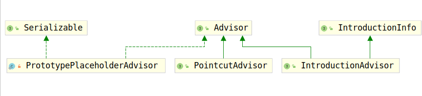

# Advisor

通知器是持有AOP通知的对象的根接口，并且用于确定是否应该通知某个对象。该接口不供Spring用户使用，而是允许支持各种各样的通知。Spring AOP是基于around Advice完成的。通知器用于支持各种各样的通知，例如before、after通知。

如下是几个简单的Advisor和它的几个子接口的类继承结构图：



## 要求实现方法

Advisor接口要求实现的方法有两个：

1. getAdvice();
2. isPerInstance();

首先考察第一个方法，getAdvice()：

```java
/**
 * Return the advice part of this aspect.
 * 返回该切面的Advice部分配置。
 * An advice may be an
 * interceptor, a before advice, a throws advice, etc.
 * 一个Advice可能是一个拦截器，或者一个before advice、throws advice或者其他
 * @return the advice that should apply if the pointcut matches
 * @see org.aopalliance.intercept.MethodInterceptor
 * @see BeforeAdvice
 * @see ThrowsAdvice
 * @see AfterReturningAdvice
 */
Advice getAdvice();
```

根据AOP的使用规则我们知道，使用AOP时，我们指定了切面（切面指出了要拦截的方法），以及拦截方法后的要织入的具体操作，这里均由Advice进行存储。

考虑第二个方法，isPerInstance():

```java
/**
 * Return whether this advice is associated with a particular instance
 * (for example, creating a mixin) or shared with all instances of
 * the advised class obtained from the same Spring bean factory.
 * 返回此Advice是与特定实例相关联（例如，创建一个mixin）还是与从同一Spring bean工厂获得的Adviced类的所有实例共享。
 * <p><b>Note that this method is not currently used by the framework.</b>
 * Typical Advisor implementations always return {@code true}.
 * 实际上Advisor实现的该方法应该总返回true
 * Use singleton/prototype bean definitions or appropriate programmatic
 * proxy creation to ensure that Advisors have the correct lifecycle model.
 * @return whether this advice is associated with a particular target instance
 */
boolean isPerInstance();
```

由于AOP的具体控制是否拦截方法的规则是在切面配置的，通知只是简单地进行具体逻辑的处理，这里简单地将配置与具体逻辑放在一起也有些不合理，因此AOP将配置全部放在了PointCut中，Advice仅仅负责拦截到方法后具体逻辑的实现。有一部分的Advice实现了MethodInterceptor，即实现了具体的拦截后的具体逻辑，但是有一些却没有实现，这时就需要AdvisorAdapter为其进行查找实现了MethodInterceptor接口的对象负责帮助其实现拦截方法后的具体调用逻辑。

Advisor本身就是将代理拦截方法调用的时机与拦截后具体的调用逻辑连接起来，所以AdvisorAdaptor这个名字也就不过分了。
