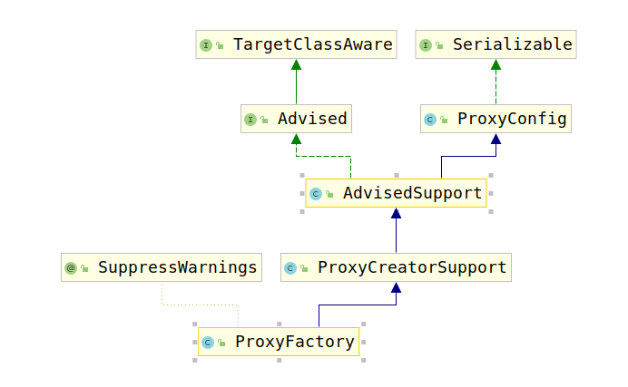

# ProxyFactory(1)

AOP代理使用该代理工厂进行创建，其类继承结构图如下：



首先考察`TargetClassAware`接口，该接口用于暴露代理的目标类，该接口由AOP代理对象喝代理工厂以及TargetSources实现：

```java
public interface TargetClassAware {

    /**
    * Return the target class behind the implementing object
    * (typically a proxy configuration or an actual proxy).
    * 将目标类返回到实现对象（通常是代理配置或实际代理）后面。
    * @return the target Class, or {@code null} if not known
    */
    @Nullable
    Class<?> getTargetClass();

}
```

然后考察`Advised`接口，该接口被持有AOP代理工厂配置的类进行实现；配置包括拦截器和其他的通知，通知器，以及代理接口。从Spring获得的任何AOP代理都可以转换为该接口，以允许对其AOP通知进行操作。

该接口要求实现如下接口：

```java
/**
 * Return whether the Advised configuration is frozen,
 * in which case no advice changes can be made.
 * 返回Advised的配置是否被冻结，在这种情况下，不能更改Advised。
 */
boolean isFrozen();
```

```java
/**
 * Are we proxying the full target class instead of specified interfaces?
 * 是否代理整个目标类，而不是代理指定接口
 */
boolean isProxyTargetClass();
```

```java
/**
 * Return the interfaces proxied by the AOP proxy.
 * 返回被AOP代理的接口
 * <p>Will not include the target class, which may also be proxied.
 * 将不包括目标类别，也可以将其作为代理。
 */
Class<?>[] getProxiedInterfaces();
```

```java
/**
 * Determine whether the given interface is proxied.
 * 判断是否被给出的接口要被代理
 * @param intf the interface to check
 */
boolean isInterfaceProxied(Class<?> intf);
```

```java
/**
 * Change the {@code TargetSource} used by this {@code Advised} object.
 * 更改Advised对象使用的TargetSource
 * <p>Only works if the configuration isn't {@linkplain #isFrozen frozen}.
 * 仅仅在配置没有被冻结时进行工作。
 * @param targetSource new TargetSource to use
 */
void setTargetSource(TargetSource targetSource);
```

```java
/**
 * Return the {@code TargetSource} used by this {@code Advised} object.
 * 返回Advised对象使用的TargetSource
 */
TargetSource getTargetSource();
```

```java
/**
 * Set whether the proxy should be exposed by the AOP framework as a
 * {@link ThreadLocal} for retrieval via the {@link AopContext} class.
 * <p>It can be necessary to expose the proxy if an advised object needs
 * to invoke a method on itself with advice applied. Otherwise, if an
 * advised object invokes a method on {@code this}, no advice will be applied.
 * 设置代理是否应由AOP框架公开为ThreadLocal以便通过AopContext类进行检索。
 * 如果你被通知的类需要在他内部执行一个需要通知的方法时，则需要暴露。否则，当被通知的类的对象在使用this调用方法时，通知将不会适用
 * <p>Default is {@code false}, for optimal performance.
 * 默认是false;
 */
void setExposeProxy(boolean exposeProxy);
```

```java
/**
 * Return whether the factory should expose the proxy as a {@link ThreadLocal}.
 * <p>It can be necessary to expose the proxy if an advised object needs
 * to invoke a method on itself with advice applied. Otherwise, if an
 * advised object invokes a method on {@code this}, no advice will be applied.
 * <p>Getting the proxy is analogous to an EJB calling {@code getEJBObject()}.
 * @see AopContext
 */
boolean isExposeProxy();
```

```java
/**
 * Set whether this proxy configuration is pre-filtered so that it only
 * contains applicable advisors (matching this proxy's target class).
 * 设置此代理配置是否已预先过滤，以使其仅包含适用的顾问程序（与该代理的目标类匹配）。
 * <p>Default is "false".
 * 默认是false
 * Set this to "true" if the advisors have been
 * pre-filtered already, meaning that the ClassFilter check can be skipped
 * when building the actual advisor chain for proxy invocations.
 * 如果设置为true那么ClassFilter的检测将会被直接跳过
 * @see org.springframework.aop.ClassFilter
 */
void setPreFiltered(boolean preFiltered);
```

```java
/**
 * Return whether this proxy configuration is pre-filtered so that it only
 * contains applicable advisors (matching this proxy's target class).
 */
boolean isPreFiltered();
```

```java
/**
 * Return the advisors applying to this proxy.
 * 返回应用到该代理的所有Advisor
 * @return a list of Advisors applying to this proxy (never {@code null})
 */
Advisor[] getAdvisors();
```

剩余的接口仅仅用来做Advisor的管理，即创建、删除、替代、查询等。
