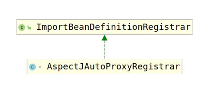

# EnableAspectJAutoProxy

前一小节我们说过`Enable.*`类的注解适用于开启`.*`所指定的功能的，`EnableAspectJAutoProxy`注解就是用来开启AOP功能的。那么到底是怎么开启的呢？

首先我们考察该注解上修饰的注解：

```java
@Target(ElementType.TYPE)
@Retention(RetentionPolicy.RUNTIME)
@Documented
@Import(AspectJAutoProxyRegistrar.class)
```

可以看到，该注解被`Import`注解修饰，查看过`ioc`源码可知，Spring会通过`Import`注解value中的值创建对应的Bean。这里我们考察一下`AspectJAutoProxyRegistrar`的类继承结构图：



可以看到该类继承了`ImportBeanDefinitionRegistrar`，根据`Import`的解析规则我们知道Spring容器会通过`public void registerBeanDefinitions(AnnotationMetadata importingClassMetadata, BeanDefinitionRegistry registry)`进行BeanDefinition修改。

那么接下来让我们查看`AspectJAutoProxyRegistrar`的`public void registerBeanDefinitions(AnnotationMetadata importingClassMetadata, BeanDefinitionRegistry registry)`方法实现。

```java
public void registerBeanDefinitions(
    AnnotationMetadata importingClassMetadata, BeanDefinitionRegistry registry) {
    // 如果需要的话注册AspectJAnnotationAutoProxyCreator
    AopConfigUtils.registerAspectJAnnotationAutoProxyCreatorIfNecessary(registry);
    // 获取EnableAspectJAutoProxy注解的属性值
    // 并将属性放入`AspectJAnnotationAutoProxyCreator`中
    AnnotationAttributes enableAspectJAutoProxy =
        AnnotationConfigUtils.attributesFor(importingClassMetadata, EnableAspectJAutoProxy.class);
    if (enableAspectJAutoProxy != null) {
        if (enableAspectJAutoProxy.getBoolean("proxyTargetClass")) {
            AopConfigUtils.forceAutoProxyCreatorToUseClassProxying(registry);
        }
        if (enableAspectJAutoProxy.getBoolean("exposeProxy")) {
            AopConfigUtils.forceAutoProxyCreatorToExposeProxy(registry);
        }
    }
}
```

这里我们详细考虑一下上面的三个重要方法，分别是：

1. AopCOnfigUtils的`registerAspectJAnnotationAutoProxyCreatorIfNecessary(BeanDefinitionRegistry)`方法

    ```java
    public static BeanDefinition registerAspectJAnnotationAutoProxyCreatorIfNecessary(BeanDefinitionRegistry registry) {
        return registerAspectJAnnotationAutoProxyCreatorIfNecessary(registry, null);
    }

    public static BeanDefinition registerAspectJAnnotationAutoProxyCreatorIfNecessary(
        BeanDefinitionRegistry registry, @Nullable Object source) {

        return registerOrEscalateApcAsRequired(AnnotationAwareAspectJAutoProxyCreator.class, registry, source);
    }
    ```

    前两步方法调用只是简单进行了封装罢了，最后的`registerOrEscalateApcAsRequired(AnnotationAwareAspectJAutoProxyCreator.class, registry, source)`才是真正的方法调用。考察该方法，注意此时传入的参数分别是：

    1. cls： AnnotationAwareAspectJAutoProxyCreator.class
    2. registry： registry
    3. source： null

    ```java
    private static BeanDefinition registerOrEscalateApcAsRequired(
        Class<?> cls, BeanDefinitionRegistry registry, @Nullable Object source) {

        Assert.notNull(registry, "BeanDefinitionRegistry must not be null");
        // 如果BeanDefinition注册表中包含名为`AUTO_PROXY_CREATOR_BEAN_NAME`的Bean
        // `AUTO_PROXY_CREATOR_BEAN_NAME`是"org.springframework.aop.config.internalAutoProxyCreator"
        if (registry.containsBeanDefinition(AUTO_PROXY_CREATOR_BEAN_NAME)) {
            // 获取到`"org.springframework.aop.config.internalAutoProxyCreator"`的BeanDefinition
            // 判断该BeanDefinition中定义的类型是否和传入的一样
            // 如果不一样，则查找优先级更高的
            // 然后将类名设置为该BeanDefinition的beanClassName
            BeanDefinition apcDefinition = registry.getBeanDefinition(AUTO_PROXY_CREATOR_BEAN_NAME);
            if (!cls.getName().equals(apcDefinition.getBeanClassName())) {
                int currentPriority = findPriorityForClass(apcDefinition.getBeanClassName());
                int requiredPriority = findPriorityForClass(cls);
                if (currentPriority < requiredPriority) {
                    apcDefinition.setBeanClassName(cls.getName());
                }
            }
            return null;
        }
        // 创建传入的Class对象的BeanDefinition
        // 然后设置其order信息
        // 将BeanDefinition注册到BeanDefinition注册表中
        RootBeanDefinition beanDefinition = new RootBeanDefinition(cls);
        beanDefinition.setSource(source);
        beanDefinition.getPropertyValues().add("order", Ordered.HIGHEST_PRECEDENCE);
        beanDefinition.setRole(BeanDefinition.ROLE_INFRASTRUCTURE);
        registry.registerBeanDefinition(AUTO_PROXY_CREATOR_BEAN_NAME, beanDefinition);
        return beanDefinition;
    }
    ```

    经过上面的操作后，Spring向BeanDefinition注册表中注册了一个名为`org.springframework.aop.config.internalAutoProxyCreator`的Bean，注意该Bean的类型是`AnnotationAwareAspectJAutoProxyCreator`或者优先级更高的`AbstractProxyCreator`。

2. AopConfigUtils的`forceAutoProxyCreatorToUseClassProxying(BeanDefinitionRegistry)`方法

    ```java
    public static void forceAutoProxyCreatorToUseClassProxying(BeanDefinitionRegistry registry) {
        if (registry.containsBeanDefinition(AUTO_PROXY_CREATOR_BEAN_NAME)) {
            BeanDefinition definition = registry.getBeanDefinition(AUTO_PROXY_CREATOR_BEAN_NAME);
            definition.getPropertyValues().add("proxyTargetClass", Boolean.TRUE);
        }
    }
    ```

3. AopConfigUtils的`forceAutoProxyCreatorToExposeProxy(BeanDefinitionRegistry)`方法

    ```java
    public static void forceAutoProxyCreatorToExposeProxy(BeanDefinitionRegistry registry) {
    if (registry.containsBeanDefinition(AUTO_PROXY_CREATOR_BEAN_NAME)) {
            BeanDefinition definition = registry.getBeanDefinition(AUTO_PROXY_CREATOR_BEAN_NAME);
            definition.getPropertyValues().add("exposeProxy", Boolean.TRUE);
        }
    }
    ```

其实剩下的两个方法就相对简单多了，仅仅是为名为`"org.springframework.aop.config.internalAutoProxyCreator"`的Bean将两个属性设置为True，分别是：

1. proxyTargetClass：是否显式使用CG-LIB创建代理
2. exposeProxy：是否将代理暴露到外部，指示代理应由AOP框架作为ThreadLocal公开，以便通过AopContext类进行检索。 默认情况下处于关闭状态，即无法保证AopContext访问将正常进行。

接下来让我们开始对`AnnotationAwareAspectJAutoProxyCreator`进行分析。
