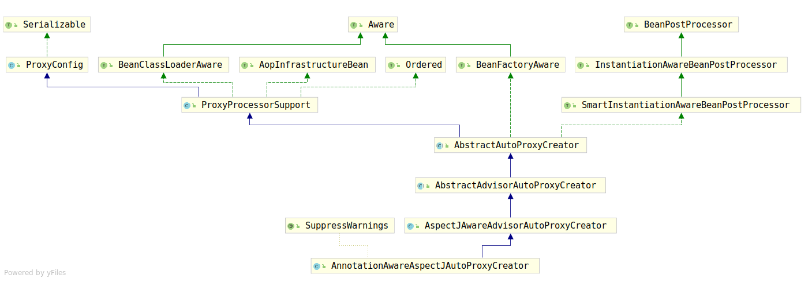

# AnnotationAwareAspectJAutoProxyCreator

通过上一章我们已经知道，`Spring-AOP`的代理是由`AnnotationAwareAspectJAutoProxyCreator`创建的，因为`Spring-AOP`只注册了这一个Bean，那么，接下来我们来分析这个类。

分析一个类首先要做的事就是查看该类的类继承结构，`AnnotationAwareAspectJAutoProxyCreator`的类继承结构如图：

看到这个类继承结构，我们姑且猜测`AbstractAutoProxyCreator`的设计又是一个模板方法模式，毕竟`Abstract.*`这类的类看着都很像。`AnnotationAwareAspectJAutoProxyCreator`继承自`BeanPostProcessor`接口族的接口。因此首先先查看该接口族的方法是谁进行实现的。

经过仔细查找，发现就是`AbstractAutoProxyCreator`实现的，而且其子类甚至没有覆盖`BeanPostProcessor`接口族的方法，这已经证明了`AbstractAutoProxyCreator`就是使用了模板方法模式。

因此我们分析的重点首先转移到`AbstractAutoProxyCreator`上。
