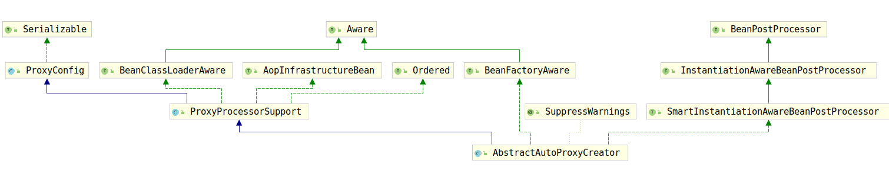

# AbstractAutoProxyCreator

经过上一节的分析，我们发现`AnnotationAwareAspectJAutoProxyCreator`的`BeanPostProcessor`接口族的所有方法都是`AbstractAutoProxyCreator`实现的，并且子类甚至没有具体实现。初步判断他是一个模板方法模式实现的类，那么开始考察该类。

为了查看更方便，这里再次给出`AbstractAutoProxyCreator`的类继承关系图：

可以看到，该类的继承的接口分为三部分：

1. ProxyProcessorSupport：提供代理创建相关的操作
2. BeanPostProcessor接口族
3. BeanFactorAware

