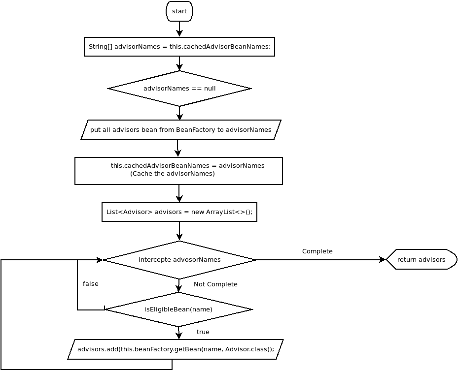

# AbstractAdvisorAutoProxyCreator

经过上一节的分析，我们知道`AbstractAutoProxyCreator`中如下两个方法作为模板方法覆盖：

1. protected abstract Object[] getAdvicesAndAdvisorsForBean(Class<?> beanClass, String beanName,@Nullable TargetSource customTargetSource) throws BeansException：用于获取构建Advisor的Advice或者Advisor
2. protected boolean shouldSkip(Class<?> beanClass, String beanName)：用于判断是否为该Bean创建代理。

在`AbstractAdvisorAutoProxyCreator`中主要覆盖了方法1。考察该方法：

```java
protected Object[] getAdvicesAndAdvisorsForBean(
    Class<?> beanClass, String beanName, @Nullable TargetSource targetSource) {
    // 获取可用的Advisor
    List<Advisor> advisors = findEligibleAdvisors(beanClass, beanName);
    if (advisors.isEmpty()) {
        return DO_NOT_PROXY;
    }
    return advisors.toArray();
}
```

`findEligibleAdvisors(Class<?> beanClass, String beanName)`方法负责获取该Bean可用的所有Advisor，考察该方法的具体实现：

```java
protected List<Advisor> findEligibleAdvisors(Class<?> beanClass, String beanName) {
    // 获取全部可用的Advisor
    List<Advisor> candidateAdvisors = findCandidateAdvisors();
    // 从全部可用的Advisor中筛选出该Bean可用的Advisor
    List<Advisor> eligibleAdvisors = findAdvisorsThatCanApply(candidateAdvisors, beanClass, beanName);
    // 对所有的候选Advisor进行后处理
    extendAdvisors(eligibleAdvisors);
    // 对所有候选的Advisor进行排序
    // 为了实现@Before、@After这些注解完成的功能
    if (!eligibleAdvisors.isEmpty()) {
        eligibleAdvisors = sortAdvisors(eligibleAdvisors);
    }
    return eligibleAdvisors;
}
```

`AbstractAdvisorAutoProxyCreator`在使用`findEligibleAdvisors`方法查找可用Bean可用的Advisor时，分为四个步骤：

1. 调用`findCandidateAdvisors()`获取全部可用的Advisor
2. 调用`findAdvisorsThatCanApply(...)`获取传入的Bean可以使用的Advisor
3. 调用`extendAdvisors(...)`对Bean可用的Advisor进行后处理
4. 调用`sortAdvisors(...)`为各个Advisor进行排序，为了规定调用顺序

这里我们对其一一考察。

## 1. 获取全部可用Advisor

`AbstractAdvisorAutoProxyCreator`使用`findCandidateAdvisors()`方法获取全部可用的Advisor。考察该方法源码可以发现，查找Advisor的是通过`this.advisorRetrievalHelper`属性完成的，代码如下：

```java
protected List<Advisor> findCandidateAdvisors() {
    Assert.state(this.advisorRetrievalHelper != null, "No BeanFactoryAdvisorRetrievalHelper available");
    return this.advisorRetrievalHelper.findAdvisorBeans();
}
```

`AbstractAdvisorAutoProxyCreator`不仅覆盖了`getAdvicesAndAdvisorsForBean(...)`方法，还覆盖了`BeanFactoryAware`的`setFactory(...)`方法，该方法负责初始化`this.advisorRetrievalHelper`属性。代码如下：

```java
public void setBeanFactory(BeanFactory beanFactory) {
    super.setBeanFactory(beanFactory);
    if (!(beanFactory instanceof ConfigurableListableBeanFactory)) {
        throw new IllegalArgumentException(
            "AdvisorAutoProxyCreator requires a ConfigurableListableBeanFactory: " + beanFactory);
    }
    initBeanFactory((ConfigurableListableBeanFactory) beanFactory);
}

protected void initBeanFactory(ConfigurableListableBeanFactory beanFactory) {
    this.advisorRetrievalHelper = new BeanFactoryAdvisorRetrievalHelperAdapter(beanFactory);
}
```

可以看到，真正执行`findAdvisorBeans()`方法的是`BeanFactoryAdvisorRetrievalHelperAdapter`类型的对象。考察该类的源码如下：

```java
private class BeanFactoryAdvisorRetrievalHelperAdapter extends BeanFactoryAdvisorRetrievalHelper {

    public BeanFactoryAdvisorRetrievalHelperAdapter(ConfigurableListableBeanFactory beanFactory) {
        super(beanFactory);
    }

    @Override
    protected boolean isEligibleBean(String beanName) {
        return AbstractAdvisorAutoProxyCreator.this.isEligibleAdvisorBean(beanName);
    }
}
```

该类是`AbstractAdvisorAutoProxyCreator`的内部类，主要是为了调用`AbstractAdvisorAutoProxyCreator`的`isEligibleAdvisorBean(String)`为了能让子类进行覆盖，默认返回true。

`findAdvisorBeans()`方法源码比较长，但是逻辑相对简单，仅仅是获取BeanFactory中所有类型为`Advisor`的Bean的名称，并存入`advisors`和`cachedAdvisorBeanNames`中，然后遍历`advisors`中的所有Bean名称，调用`isEligibleBean(name)`，如果返回true，则从BeanFactory中getBean(name)，将Bean放入结果集。流程图如下：



详细代码过长，请自行查看`BeanFactoryAdvisorRetrievalHelper`类源码。

## 1.2 获取该Bean可用的Advisor

获取了所有可用的Advisor，我们需要从中选出当前创建的Bean适用的Advisor，完成这个工作的是`findAdvisorsThatCanApply(List<Advisor> candidateAdvisors, Class<?> beanClass, String beanName)`方法。下面我们考察该方法源码如下：

```java
protected List<Advisor> findAdvisorsThatCanApply(
    List<Advisor> candidateAdvisors, Class<?> beanClass, String beanName) {

    ProxyCreationContext.setCurrentProxiedBeanName(beanName);
    try {
        return AopUtils.findAdvisorsThatCanApply(candidateAdvisors, beanClass);
    }
    finally {
        ProxyCreationContext.setCurrentProxiedBeanName(null);
    }
}
```

为了防止递归，ProxyCreationContext进行了保存现场和现场恢复的操作，这里我们主要考察这两个操作中间的`return AopUtils.findAdvisorsThatCanApply(candidateAdvisors, beanClass);`这行代码，这行代码完成了真正的查找适用的`Advisor`的操作。让我们考察该方法：

```java
public static List<Advisor> findAdvisorsThatCanApply(List<Advisor> candidateAdvisors, Class<?> clazz) {
    if (candidateAdvisors.isEmpty()) {
        return candidateAdvisors;
    }
    // 处理IntroductionAdvisor
    List<Advisor> eligibleAdvisors = new ArrayList<>();
    for (Advisor candidate : candidateAdvisors) {
        if (candidate instanceof IntroductionAdvisor && canApply(candidate, clazz)) {
            eligibleAdvisors.add(candidate);
        }
    }
    boolean hasIntroductions = !eligibleAdvisors.isEmpty();
    // 处理PointCutAdvisor
    for (Advisor candidate : candidateAdvisors) {
        if (candidate instanceof IntroductionAdvisor) {
            // already processed
            continue;
        }
        if (canApply(candidate, clazz, hasIntroductions)) {
            eligibleAdvisors.add(candidate);
        }
    }
    return eligibleAdvisors;
}
```

可以看到该部分将Advisor分为两类处理，分别是：

1. IntroductionAdvisor
2. PointcutAdvisor

这两类的详细信息可以查看[这里](./Advisor/1.3-1.Advisor.md)，这里我们不详细讨论。Advisor的具体判断逻辑是在`canApply(...)`方法中，考察该方法：

```java
public static boolean canApply(Advisor advisor, Class<?> targetClass, boolean hasIntroductions) {
    // 如果传入的Advisor是IntroductionAdvisor
    // 那么通过ClassFilter进行匹配
    if (advisor instanceof IntroductionAdvisor) {
        return ((IntroductionAdvisor) advisor).getClassFilter().matches(targetClass);
    }
    // 如果传入的是PointcutAdvisor
    // 那么通过Pointcut中的ClassFilter和MethodMatcher进行匹配
    else if (advisor instanceof PointcutAdvisor) {
        PointcutAdvisor pca = (PointcutAdvisor) advisor;
        return canApply(pca.getPointcut(), targetClass, hasIntroductions);
    }
    // 如果两者都不是，则默认返回true
    else {
        // It doesn't have a pointcut so we assume it applies.
        return true;
    }
}
```

可以看到`findAdvisorsThatCanApply`方法仅仅是使用Advisor中配置的条件对传入的所有Advisor进行了简单的过滤，返回过滤后的结果罢了。

## 1.3 Advisor的后处理

在筛选出Bean可用的所有Advisor后，可以对这些Advisor进行后处理，这些功能通过`extendAdvisors(List<Advisor>)`进行处理，该方法就是一个模板方法，默认实现为空，默认实现代码如下：

```java
protected void extendAdvisors(List<Advisor> candidateAdvisors) {}
```

## 1.4 对Advisor进行排序

获取了Bean对应的所有Advisor，但是Advisor对应的所有MethodInterceptor是有一定执行顺序的，因此需要对其进行排序，保证代理执行各个MethodInterceptor时的顺序，排序操作通过`sortAdvisors(List<Advisor> advisors)`方法完成。考察该方法实现如下：

```java
protected List<Advisor> sortAdvisors(List<Advisor> advisors) {
    AnnotationAwareOrderComparator.sort(advisors);
    return advisors;
}
```

方法实现相对简单，就是通过Order接口进行排序，这里就不多赘述了。

## 1.5 小结

经过了上述所有的步骤，我们已经了解了AOP实现中创建代理之前的主要流程，但是对于注解解析的详细内容还没有进行分析，接下来将对`AnnotationAwareAspectJAutoProxyCreator`进行分析。
