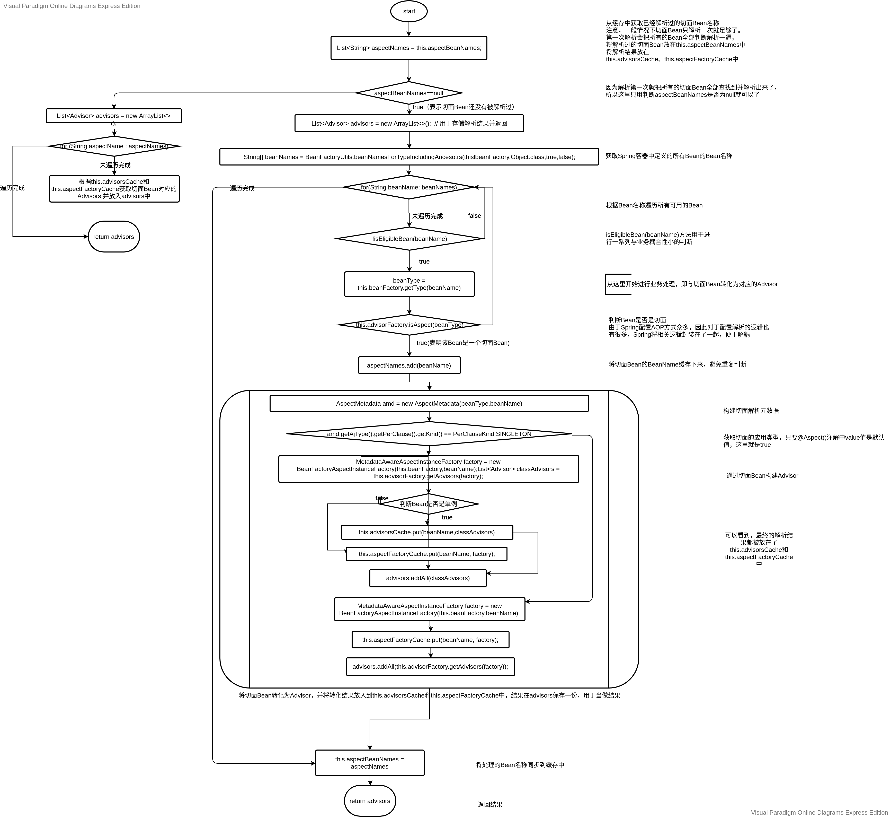

# 4. AnnotationAwareAspectJAutoProxyCreator

对于AOP的基本使用来说，其实代码最终处理的就是被`@Aspect`修饰的Bean。代码将这个Bean中的方法根据配置规则对应成Advisor，最终转化成MethodInterceptor进行业务处理。而这些操作就是在`AnnotationAwareAspectJAutoProxyCreator`中完成的。

我们知道，查询所有可以使用的Advisor的方法是`AbstractAdvisorAutoProxyCreator`的`findCandidateAdvisors()`方法。`AnnotationAwareAspectJAutoProxyCreator`覆盖了`findCandidateAdvisors()`方法，用于处理`@Aspect`修饰的Bean。源码如下：

```java
protected List<Advisor> findCandidateAdvisors() {
    // Add all the Spring advisors found according to superclass rules.
    List<Advisor> advisors = super.findCandidateAdvisors();
    // Build Advisors for all AspectJ aspects in the bean factory.
    if (this.aspectJAdvisorsBuilder != null) {
        advisors.addAll(this.aspectJAdvisorsBuilder.buildAspectJAdvisors());
    }
    return advisors;
}
```

可以看到`this.aspectJAdvisorsBuilder`的`buildAspectJAdvisors()`方法用用于扫描被`@Aspect`修饰的Bean，将其转化为可用的Advisor。首先考察`this.aspectJAdvisorsBuilder`属性的初始化方法，即`initBeanFactory(ConfigurableListableBeanFactory)`方法。该方法是`AspectJAwareAdvisorAutoProxyCreator`的覆盖方法，代码如下：

```java
protected void initBeanFactory(ConfigurableListableBeanFactory beanFactory) {
    super.initBeanFactory(beanFactory);
    if (this.aspectJAdvisorFactory == null) {
        this.aspectJAdvisorFactory = new ReflectiveAspectJAdvisorFactory(beanFactory);
    }
    this.aspectJAdvisorsBuilder =
        new BeanFactoryAspectJAdvisorsBuilderAdapter(beanFactory, this.aspectJAdvisorFactory);
}
```

可以看到`this.aspectJAdvisorsBuilder`是`BeanFactoryAspectJAdvisorsBuilderAdapter`类型的对象，这样我们就可以查找到`buildAspectJAdvisors()`方法的具体调用了，考察`BeanFactoryAspectJAdvisorsBuilderAdapter`源码，可以看到该类又是一个内部类：

```java
private class BeanFactoryAspectJAdvisorsBuilderAdapter extends BeanFactoryAspectJAdvisorsBuilder {

    public BeanFactoryAspectJAdvisorsBuilderAdapter(
        ListableBeanFactory beanFactory, AspectJAdvisorFactory advisorFactory) {

        super(beanFactory, advisorFactory);
    }

    @Override
    protected boolean isEligibleBean(String beanName) {
        return AnnotationAwareAspectJAutoProxyCreator.this.isEligibleAspectBean(beanName);
    }
}
```

可以看到该类的实现方式和`BeanFactoryAdvisorRetrievalHelperAdapter`相同，如此实现就是为了能够使用子类的`isEligibleBean(String beanName)`方法。这里我们主要考察该类的`buildAspectJAdvisors()`方法：

```java
public List<Advisor> buildAspectJAdvisors() {
    // this.aspectBeanNames属性用于缓存切面Bean的名称
    List<String> aspectNames = this.aspectBeanNames;

    if (aspectNames == null) {
        synchronized (this) {
            // 使用缓存
            aspectNames = this.aspectBeanNames;
            if (aspectNames == null) {
                List<Advisor> advisors = new ArrayList<>();
                aspectNames = new ArrayList<>();
                // 获取BeanFactory的所有Bean
                String[] beanNames = BeanFactoryUtils.beanNamesForTypeIncludingAncestors(this.beanFactory, Object.class, true, false);
                // 遍历所有的Bean,根据切面Bean创建Advisor
                for (String beanName : beanNames) {
                    if (!isEligibleBean(beanName)) {
                        continue;
                    }
                    // 获取Bean的类型
                    // 注意是getType(String)，不是getBean(String)
                    Class<?> beanType = this.beanFactory.getType(beanName);
                    if (beanType == null) {
                        continue;
                    }
                    // 如果这个Bean是切面，那么开始使用这个Bean的Class对象创建Advisor
                    // 否则不用处理
                    if (this.advisorFactory.isAspect(beanType)) {  
                        // 将切面Bean的名称放入到缓存中
                        aspectNames.add(beanName);
                        // 将遍历到的切面Bean的信息封装，便于获取切面的相关信息
                        AspectMetadata amd = new AspectMetadata(beanType, beanName);
                        if (amd.getAjType().getPerClause().getKind() == PerClauseKind.SINGLETON) {
                            MetadataAwareAspectInstanceFactory factory = new BeanFactoryAspectInstanceFactory(this.beanFactory, beanName);
                            // 根据遍历到的切面Bean获取Advisor
                            List<Advisor> classAdvisors = this.advisorFactory.getAdvisors(factory);
                            // 创建完成后放入缓存
                            if (this.beanFactory.isSingleton(beanName)) {
                                this.advisorsCache.put(beanName, classAdvisors);
                            }
                            else {
                                this.aspectFactoryCache.put(beanName, factory);
                            }
                            advisors.addAll(classAdvisors);
                        }
                        else {
                            // 如果切面Bean是单例，但是切面的实现模式不是单例，则由此处处理
                            if (this.beanFactory.isSingleton(beanName)) {
                                throw new IllegalArgumentException("Bean with name '" + beanName +
                                    "' is a singleton, but aspect instantiation model is not singleton");
                            }
                            MetadataAwareAspectInstanceFactory factory = new PrototypeAspectInstanceFactory(this.beanFactory, beanName);
                            this.aspectFactoryCache.put(beanName, factory);
                            // 将解析后的Advisor放入缓存
                            advisors.addAll(this.advisorFactory.getAdvisors(factory));
                        }
                    }
                }
                this.aspectBeanNames = aspectNames;
                return advisors;
            }
        }
    }

    if (aspectNames.isEmpty()) {
        return Collections.emptyList();
    }
    List<Advisor> advisors = new ArrayList<>();
    // 根据处理结果获取Advisor，并返回结果
    for (String aspectName : aspectNames) {
        List<Advisor> cachedAdvisors = this.advisorsCache.get(aspectName);
        if (cachedAdvisors != null) {
            advisors.addAll(cachedAdvisors);
        }
        else {
            MetadataAwareAspectInstanceFactory factory = this.aspectFactoryCache.get(aspectName);
            advisors.addAll(this.advisorFactory.getAdvisors(factory));
        }
    }
    return advisors;
}
```

获取Advisor的代码虽然长，但是逻辑其实很简单，这里首先介绍几个数据结构，然后再介绍通过切面Bean构建Advisor的具体流程。

上述操作流程中使用了如下的数据结构：

参数名|类型|功能
---|---|---
this.aspectBeanNames|`List<String>`|该集合用于保存所有切面Bean的名称，避免重复解析
this.advisorCache|`Map<String, List<Advisor>>`|该集合用于缓存根据切面Bean创建的Advisor
this.aspectFactoryCache|`Map<String, MetadataAwareAspectInstanceFactory>`|该集合用于缓存根据切面Bean创建的Advisor，与`this.advisorCache`的区别就是，有些切面Bean不是单例的，无法根据名字直接进行获取，因此只能存在创建对象里，等到使用Advisor时，可以根据`MetadataAwareAspectInstanceFactory`直接创建。

接下来考察切面Bean转化为Advisor的详细过程，由于代码过于冗长，流程如图：



由于图比较大，想要查看大图的读者可以查看[这里](https://drive.google.com/file/d/1h7dM1hvBv7L6wBOaHirWExtKAwqLJm1b/view?usp=sharing)

通过转化流程的分析，可以发现，解析切面Bean并转化为Advisor的方法是`this.advisorFactory.getAdvisors(factory)`方法。根据initFactory()方法可以直到，这里`this.advisorFactory`是`ReflectiveAspectJAdvisorFactory`类型的对象。我们考察其`getAdvisors(MetadataAwareAspectInstanceFactory)`方法源码：

```java
public List<Advisor> getAdvisors(MetadataAwareAspectInstanceFactory aspectInstanceFactory) {
    // 获取切面Bean元数据中的切面Bean类型对象
    Class<?> aspectClass = aspectInstanceFactory.getAspectMetadata().getAspectClass();
    // 获取切面名称
    String aspectName = aspectInstanceFactory.getAspectMetadata().getAspectName();
    // 验证切面Bean信息
    validate(aspectClass);

    // 这里使用了装饰器模式，让Advisor不重复创建
    // 装饰器里面实现了类似单例的原理
    MetadataAwareAspectInstanceFactory lazySingletonAspectInstanceFactory =
        new LazySingletonAspectInstanceFactoryDecorator(aspectInstanceFactory);

    List<Advisor> advisors = new ArrayList<>();
    // 查找非@Pointcut修饰的方法，将其转化为InstantiationModelAwarePointcutAdvisorImpl类型的Advisor
    for (Method method : getAdvisorMethods(aspectClass)) {
        Advisor advisor = getAdvisor(method, lazySingletonAspectInstanceFactory, advisors.size(), aspectName);
        if (advisor != null) {
            advisors.add(advisor);
        }
    }

    // If it's a per target aspect, emit the dummy instantiating aspect.
    if (!advisors.isEmpty() && lazySingletonAspectInstanceFactory.getAspectMetadata().isLazilyInstantiated()) {
        Advisor instantiationAdvisor = new SyntheticInstantiationAdvisor(lazySingletonAspectInstanceFactory);
        advisors.add(0, instantiationAdvisor);
    }

    // 查找被DeclareParents修饰的属性，将其转化为DeclareParentsAdvisor
    for (Field field : aspectClass.getDeclaredFields()) {
        Advisor advisor = getDeclareParentsAdvisor(field);
        if (advisor != null) {
            advisors.add(advisor);
        }
    }

    return advisors;
}
```

具体构造Advisor的逻辑不再详细介绍，有兴趣的读者可以自己查看。
