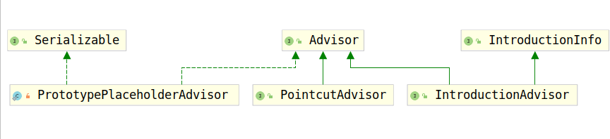

# Advisor

通知器是持有AOP通知的对象的根接口，并且用于确定是否应该通知某个对象。该接口不供Spring用户使用，而是允许支持各种各样的通知。Spring AOP是基于around Advice完成的。通知器用于支持各种各样的通知，例如before、after通知。

如下是几个简单的Advisor和它的几个子接口的类继承结构图：



Advisor接口要求实现的方法有两个：

1. getAdvice();
2. isPerInstance();

首先考察第一个方法，getAdvice()：

```java
Advice getAdvice();
```

根据方法名我们知道，该方法用于获取通知的，而前面提到过，通知用来转化为MethodInterceptor，然后真正的操作交给MethodInterceptor执行。但是事实上有很多的实现即实现了`Advice`接口也实现了`MethodInterceptor`接口，这种实现的Advice就不用再进行转化了。

除了这个方法，Advisor还实现了第二个方法，`isPerInstance()`，不过该方法在AOP框架中并没有被使用。该方法用于返回`Advisor`是否与特定Bean绑定在一起。

Advisor是表示Bean是否应该被通知的，但是我们并没有查看到判断方法，事实上，判断条件主要在`Advisor`的两个子类`PointcutAdvisor`和`IntroductionAdvisor`中。下面我们查看一下这两个子类。

## PointcutAdvisor和IntroductionAdvisor

PointcutAdvisor用于根据切面进行判断bean是否应该被通知，因此，PointcutAdvisor必须将用于判断的切面封装到PointcutAdvisor中。查看PointcutAdvisor源码如下：

```java
public interface PointcutAdvisor extends Advisor {

    Pointcut getPointcut();

}
```

那么到底怎么使用Pointcut进行判断呢？考察Pointcut源码可以发现，其实Pointcut是两个条件过滤器的集合，这两个条件过滤器分别是ClassFilter()和MethodMathcher()，Pointcut正式通过这两个过滤器进行判断的。

```java
public interface Pointcut {

    ClassFilter getClassFilter();

    MethodMatcher getMethodMatcher();

}
```

除了PointcutAdvisor外，还有一种Advisor是`IntroductionAdvisor`，与`PointcutAdvisor`不同的是`IntroductionAdvisor`并不支持方法级别的过滤，只支持类型、接口级别的过滤，毕竟其实现只提供了如下方法：

```java
public interface IntroductionAdvisor extends Advisor, IntroductionInfo {

    ClassFilter getClassFilter();

    void validateInterfaces() throws IllegalArgumentException;

}
```

有了这两种Advisor就可以进行是否要为某个bean做代理的判断了。
