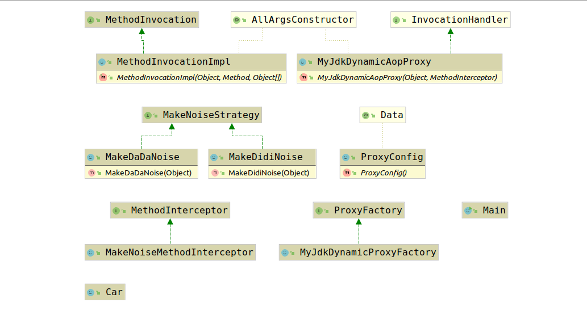

# 2.JdkDynamicAopProxy

经过上面的分析我们已经知道，Spring-AOP支持通过CG-LIB和Java API创建动态代理。该类负责使用Java API提供的动态代理API创建动态代理，这种方法创建动态代理有一定的优势，也有一定的缺点，这里我们简单介绍一下。

Java动态代理基于接口，因此，用户代理的方法也必须是实现接口的方法。这是一个优点也是一个弊端。根据依赖倒置原则，我们应该针对接口编程，而不是针对实现编程，这样就能够更好的将操作和实现解耦，在这点看来，Java动态代理的基于接口确实是一个优点，甚至是应该这样做的。但是也正因为如此，不实现接口的对象就无法被创建动态代理，降低了用户控制的自由度，这就变成了一个弊端。不过个人认为，这个特性的利大于弊。因此我也认为这是Spring将Java动态代理设置为默认的动态代理创建方式的主要原因。

Java动态代理在效率上是低于CG-LIB的。如果十分需要的话，可以选择其他的技术。

为了能更好的理解Spring-AOP如何利用的Java动态代理，笔者使用该方法创建一个Demo放在实例代码的`com.jllsq.proxy.java`包中，回顾一下Java动态代理的基本使用方式。

这里简单介绍一下Demo中各类之间的关系：



其中`MakeNoiseStrategy`就是我们要代理的接口，具有两个实现类`MakeDaDaNoise`和`MakeDiDiNoise`。而我们要使用代理执行的更多操作封装在`MethodInterceptor`接口中，该接口要求实现如下方法：

```java
Object invoke(MethodInvocation methodInvocation);
```

其中`MethodInvocation`封装了方法执行的所有必要属性，即：

1. 方法调用者
2. 执行的方法
3. 方法传入参数

这样用户可以在`invoke(MethodInvocation)`中控制方法调用逻辑。

接下来最重要的是ProxyConfig类，该类用于保存新创建代理的配置，例如我要为对象A创建代理，额外执行的操作是由B这个MethodInterceptor实现的，那么ProxyConfig就是如下三元组`[A , A.class , new MethodInterceptor[]{B}]`，这样，我们就可以只通过ProxyConfig创建一个代理了，而使用`ProxyConfig`创建代理的就是`MyJdkDynamicProxyFactory`。使用的`InvokeHandler`是`MyJdkDynamicAopProxy`，用于获取ProxyConfig中的`MethodInterceptor`，并执行其`invoke`方法、

其实Spring就是通过这种方法来实现的AOP，只是他们的`ProxyConfig`和`InvokeHandler`更加复杂罢了。

那么接下来我们考察`JdkDynamicAopProxy`到底是怎么创建的代理，即`JdkDynamicAopProxy`的`getProxy(@Nullable ClassLoader classLoader)`方法：

```java
public Object getProxy(@Nullable ClassLoader classLoader) {
    if (logger.isTraceEnabled()) {
        logger.trace("Creating JDK dynamic proxy: " + this.advised.getTargetSource());
    }
    // 获取所有需要代理的接口
    Class<?>[] proxiedInterfaces = AopProxyUtils.completeProxiedInterfaces(this.advised, true);
    // 判断接口是否覆盖了equals方法和hashCode方法
    findDefinedEqualsAndHashCodeMethods(proxiedInterfaces);
    // 创建代理
    return Proxy.newProxyInstance(classLoader, proxiedInterfaces, this);
}
```

我们知道使用Java API创建动态代理时需要获取代理的Bean实现的接口，然而除了这些接口以外，为了获取ProxyConfig中的其他配置信息，例如`isFrozen()`等信息，Spring AOP还为每个代理的Bean实现了`SpringProxy`、`Advised`、`DecoratingProxy`接口。`AopProxyUtils.completeProxiedInterfaces(this.advised, true);`就是用来完成该工作的。

除此之外，由于equals方法和hashCode方法是普通方法可以被覆盖，因此，如果这两个方法也被代理了需要进行特殊处理。`findDefinedEqualsAndHashCodeMethods(proxiedInterfaces);`就是用来处理这件事情的。

最后的一行代码就是创建代理了，即`return Proxy.newProxyInstance(classLoader, proxiedInterfaces, this);`可以看到，使用的InvokeHandler就是`JdkDynamicAopProxy`本身。

到这里，代理已经创建完成了，在调用代理的接口声明的方法时，会调用InvokeHandler的`invoke(Object proxy, Method method, Object[] args)`方法，通过该方法我们就可以看到代理方法的执行逻辑。这里我们考虑`JdkDynamicAopProxy`的该方法，进一步考虑代理方法是怎样执行的。

```java
public Object invoke(Object proxy, Method method, Object[] args) throws Throwable {
    Object oldProxy = null;
    boolean setProxyContext = false;

    TargetSource targetSource = this.advised.targetSource;
    Object target = null;

    try {
        if (!this.equalsDefined && AopUtils.isEqualsMethod(method)) {
            // The target does not implement the equals(Object) method itself.
            return equals(args[0]);
        }
        else if (!this.hashCodeDefined && AopUtils.isHashCodeMethod(method)) {
            // The target does not implement the hashCode() method itself.
            return hashCode();
        }
        else if (method.getDeclaringClass() == DecoratingProxy.class) {
            // There is only getDecoratedClass() declared -> dispatch to proxy config.
            return AopProxyUtils.ultimateTargetClass(this.advised);
        }
        else if (!this.advised.opaque && method.getDeclaringClass().isInterface() &&
            method.getDeclaringClass().isAssignableFrom(Advised.class)) {
                // Service invocations on ProxyConfig with the proxy config...
                return AopUtils.invokeJoinpointUsingReflection(this.advised, method, args);
        }

        Object retVal;

        if (this.advised.exposeProxy) {
            // Make invocation available if necessary.
            oldProxy = AopContext.setCurrentProxy(proxy);
            setProxyContext = true;
        }

        // Get as late as possible to minimize the time we "own" the target,
        // in case it comes from a pool.
        target = targetSource.getTarget();
        Class<?> targetClass = (target != null ? target.getClass() : null);

        // Get the interception chain for this method.
        List<Object> chain = this.advised.getInterceptorsAndDynamicInterceptionAdvice(method, targetClass);

        // Check whether we have any advice. If we don't, we can fallback on direct
        // reflective invocation of the target, and avoid creating a MethodInvocation.
        if (chain.isEmpty()) {
            // We can skip creating a MethodInvocation: just invoke the target directly
            // Note that the final invoker must be an InvokerInterceptor so we know it does
            // nothing but a reflective operation on the target, and no hot swapping or fancy proxying.
            Object[] argsToUse = AopProxyUtils.adaptArgumentsIfNecessary(method, args);
            retVal = AopUtils.invokeJoinpointUsingReflection(target, method, argsToUse);
        }
        else {
            // We need to create a method invocation...
            MethodInvocation invocation =
            new ReflectiveMethodInvocation(proxy, target, method, args, targetClass, chain);
            // Proceed to the joinpoint through the interceptor chain.
            retVal = invocation.proceed();
        }

        // Massage return value if necessary.
        Class<?> returnType = method.getReturnType();
        if (retVal != null && retVal == target &&
                returnType != Object.class && returnType.isInstance(proxy) &&
                !RawTargetAccess.class.isAssignableFrom(method.getDeclaringClass())) {
            // Special case: it returned "this" and the return type of the method
            // is type-compatible. Note that we can't help if the target sets
            // a reference to itself in another returned object
            retVal = proxy;
        }
        else if (retVal == null && returnType != Void.TYPE && returnType.isPrimitive()) {
            throw new AopInvocationException(
                "Null return value from advice does not match primitive return type for: " + method);
        }
        return retVal;
    }
    finally {
        if (target != null && !targetSource.isStatic()) {
            // Must have come from TargetSource.
            targetSource.releaseTarget(target);
        }
        if (setProxyContext) {
            // Restore old proxy.
            AopContext.setCurrentProxy(oldProxy);
        }
    }
}
```
