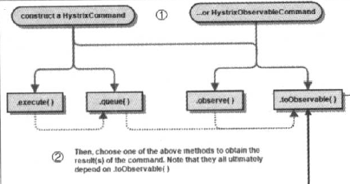
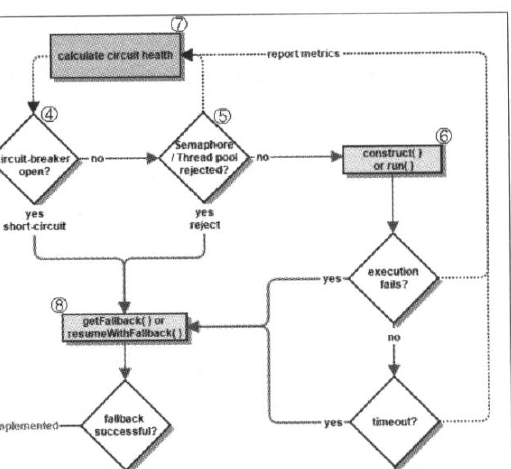
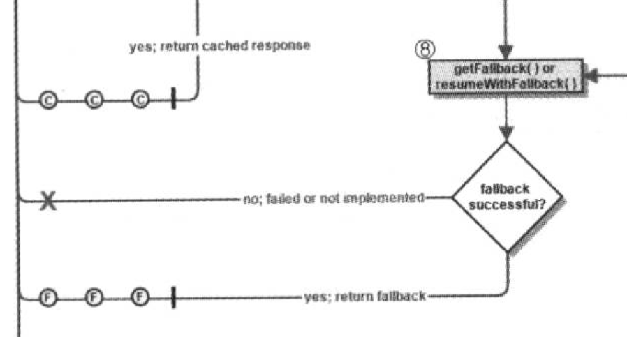
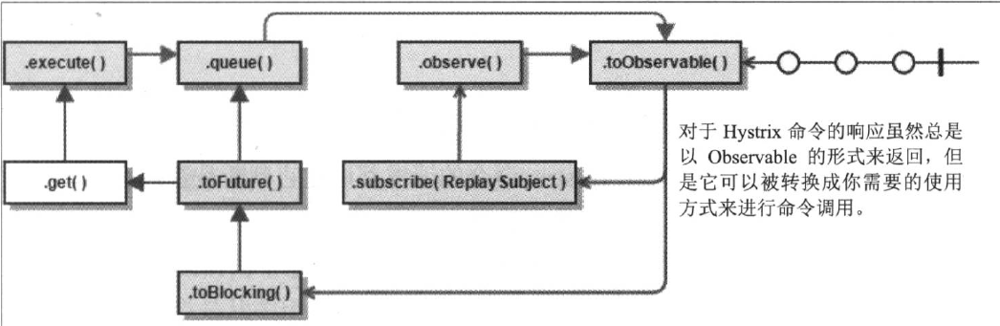

# Hystrix

## 工作流程

上图描述了Hystrix的工作流程，下面我们对其进行进一步的解释：

### 1. 创建HystrixCommand或者HystrixObservableCommand对象

构建HystrixCommand和HystrixObservableCommand对象，用于表示对依赖服务的请求操作，同时传递所有需要的参数。而两者的区别如下：

- HystrixCommand:用在依赖的服务返回单个操作结果的时候。
- HystrixObservableCommand:用在依赖的服务返回多个结果的时候。

### 2. 命令执行

根据图中我们看到，总共具有4中执行方式，大图如下：

我们可以看到HystrixCommand具有execute()和queue()方法，HystrixObservableCommand具有observe()和toObservable()方法。

下面我们对其进行详细的描述：

- execute():同步执行，从依赖的服务返回单一的结果对象，或是在发生错误时抛出异常。
- queue():异步执行，直接返回一个Future对象，其中包含了服务执行结束时要返回的单一对象。
- observe():返回Observable对象，它代表了操作的多个结果，它是一个Hot Observable。
- toObservable():同样返回Observable对象，代表了操作的多个结果，返回到是一个Cold Observable。

事实上所有的的执行逻辑都依赖于toObservable()方法。

### 3. 结果是否被缓存

注意，从这里开始是execute()、queue()和observe()、toObservable()的执行逻辑。

若当前命令的请求缓存功能是启用的，并且该命令缓存命中，缓存的结果会立刻以Observable对象的形式返回。

### 4. 断路器是否打开

在命令结果没有缓存命中的时候，Hystrix在执行命令前就要检查断路器是否是打开状态。

可以看到，如果断路器是打开的就跳到第八步，否则跳到第五步。

### 5. 线程池/信号量/请求队列是否占满

如果与命令相关的线程池和请求队列，或者信号量已经被占满，那么会执行第八步。

需要注意的是，这里Hystrix所判断的线程并非容器的线程池，而是每个依赖服务的专有线程池。Hystrix为了保证不会因为某个依赖服务的问题影响到其他依赖服务而采用“舱壁模式”来隔离每个依赖服务。

### 6. HystrixObservableCommand.construct()或HystrixCommand.run()

Hystrix会根据我们编写的方法来决定采用什么样的方式去请求依赖服务。

- HystrixCommand.run(): 返回单一结果，或抛出异常。
- HystrixObservableCommand.construct():返回一个Observable对象来发射多个结果，或通过onError来发送错误通知。

如果上述两个方法执行失败或者执行超时，则跳到第八步，否则返回Observable对象。

### 7. 计算断路器的健康度

如图，我们看到Hystrix会将"成功“、”失败“、”拒绝“、”超时“等信息报告给断路器，而断路器会维护一组计数器来统计这些数据。

断路器通过这些统计数据来判断断路器是否打开，来对某个服务进行”熔断/短路“,直到恢复期结束。若在恢复期结束后，该服务仍未达到健康指标，则再次”熔断/短路“。

### 8. fallback处理

根据上文所述，有3种情况会交给fallback处理，这种处理我们也称其为”降级服务“，三种情况分别为：
1. 第四步，当前命令处于断路/熔断状态，断路器被打开的时候。
2. 第五步，当前线程池、请求队列、信号量被占满的时候。
3. 第六步，HystrixObservableCommand.construct()或HystrixCommand.run()抛出异常的时候。

需要注意的是，在服务降级逻辑中，实现的逻辑应该是一个通用的结果，并且不要依赖于网络。如果一定要包含网络请求，那么该请求也应该被包含在HystrixObservableCommand或者HystrixCommand中，从而形成级联的降级策略，但是需要注意，最终的降级策略，仍然需要不依赖于网络。

事实上，HystrixObservableCommand执行降级策略，执行的函数与HystrixCommand还有明显不同：

1. HystrixObservableCommand执行的方法是resumeWithFallback()实现降级逻辑，并且返回一个包含有多个返回结果的Observable对象。
2. HystrixCommand执行的方法是getFallback()方法，返回一个Observable对象，发射getFallback()的处理结果。

如果，我们没有为命令实现降级逻辑或者降级处理逻辑中出现了异常，那么Hystrix仍然会返回一个Observable对象，但是不会发送任何数据，而是通过onError方法通知请求中断。

当降级策略失败时,Hystrix会根据不同的时间方法做出不同的处理:

- execute():抛出异常；
- queue():正常返回Future对象，但是调用get()方法时会抛出异常。
- observe():正常返回Observable对象，当订阅它时,将立即通过调用订阅者的onError方法来终止请求。
- toOberverable():正常返回Observable对象，当订阅它的时候，将通过onError方法终止请求。

### 9. 返回成功的响应

- toObservable():返回最原始的Observable，必须通过订阅它才会触发命令的执行流程。
- observe():在toObservable()产生Observable之后立即订阅它，让命令能马上开始异步执行，并返回一个Observable对象，当调用它的subscribe时，将重新产生结果和通知给订阅者。
- queue():将toObservable()产生的原始Observable通过toBlocking()方法转化成BlockingObservable对象，并调用它的toFuture()方法返回异步的Future对象。
- execute()：在queue()产生异步结果Future对象之后，通过get()方法阻塞并等待结果的返回。

## 源码分析

### HystrixCircuitBreaker

顾名思义，该类描述的就是断路器，考察源码可知，该类是一个接口，需要实现如下方法：

1. boolean allowRequest():每个Hystrix命令都通过该接口的判断是否执行。
2. boolean isOpen():返回当前断路器是否打开。
3. boolean markSuccess():关闭断路器。

并且接口中还有三个类：

1. Factory:该类维护了一个ConcurrentHashMap<String,HystrixCircuitBreaker>类型的列表，用于表述一个Hystrix命令和HystrixCircuitBreaker的关系。
2. NoOpCircuitBreaker:该类定义了一个什么都不做的HystrixCircuitBreaker，允许所有请求，断路器状态始终闭合。
3. HystrixCircuitBreakerImpl:该类包含了4个对象：
- HystrixCommandProperties properties:断路器对应HystrixCommand实例的属性对象。
- HystrixCommandMetrics metrics:用来让HystrixCommand记录各类度量指标的对象。
- AtomicBoolean circuitOpen:断路器是否打开的标志，默认为false;
- AtomicLong circuitOpenedOrLastTestedTime:断路器打开或是上一次测试的时间戳。

#### HystrixCircuitBreakerImpl

源码如下：

    static class HystrixCircuitBreakerImpl implements HystrixCircuitBreaker {
        private final HystrixCommandProperties properties;
        private final HystrixCommandMetrics metrics;

        /* track whether this circuit is open/closed at any given point in time (default to false==closed) */
        private AtomicBoolean circuitOpen = new AtomicBoolean(false);

        /* when the circuit was marked open or was last allowed to try a 'singleTest' */
        private AtomicLong circuitOpenedOrLastTestedTime = new AtomicLong();

        protected HystrixCircuitBreakerImpl(HystrixCommandKey key, HystrixCommandGroupKey commandGroup, HystrixCommandProperties properties, HystrixCommandMetrics metrics) {
            this.properties = properties;
            this.metrics = metrics;
        }

        public void markSuccess() {
            if (circuitOpen.get()) {
                if (circuitOpen.compareAndSet(true, false)) {
                    //win the thread race to reset metrics
                    //Unsubscribe from the current stream to reset the health counts stream.  This only affects the health counts view,
                    //and all other metric consumers are unaffected by the reset
                    metrics.resetStream();
                }
            }
        }

        @Override
        public boolean allowRequest() {
            if (properties.circuitBreakerForceOpen().get()) {
                // properties have asked us to force the circuit open so we will allow NO requests
                return false;
            }
            if (properties.circuitBreakerForceClosed().get()) {
                // we still want to allow isOpen() to perform it's calculations so we simulate normal behavior
                isOpen();
                // properties have asked us to ignore errors so we will ignore the results of isOpen and just allow all traffic through
                return true;
            }
            return !isOpen() || allowSingleTest();
        }

        public boolean allowSingleTest() {
            long timeCircuitOpenedOrWasLastTested = circuitOpenedOrLastTestedTime.get();
            // 1) if the circuit is open
            // 2) and it's been longer than 'sleepWindow' since we opened the circuit
            if (circuitOpen.get() && System.currentTimeMillis() > timeCircuitOpenedOrWasLastTested + properties.circuitBreakerSleepWindowInMilliseconds().get()) {
                // We push the 'circuitOpenedTime' ahead by 'sleepWindow' since we have allowed one request to try.
                // If it succeeds the circuit will be closed, otherwise another singleTest will be allowed at the end of the 'sleepWindow'.
                if (circuitOpenedOrLastTestedTime.compareAndSet(timeCircuitOpenedOrWasLastTested, System.currentTimeMillis())) {
                    // if this returns true that means we set the time so we'll return true to allow the singleTest
                    // if it returned false it means another thread raced us and allowed the singleTest before we did
                    return true;
                }
            }
            return false;
        }

        @Override
        public boolean isOpen() {
            if (circuitOpen.get()) {
                // if we're open we immediately return true and don't bother attempting to 'close' ourself as that is left to allowSingleTest and a subsequent successful test to close
                return true;
            }

            // we're closed, so let's see if errors have made us so we should trip the circuit open
            HealthCounts health = metrics.getHealthCounts();

            // check if we are past the statisticalWindowVolumeThreshold
            if (health.getTotalRequests() < properties.circuitBreakerRequestVolumeThreshold().get()) {
                // we are not past the minimum volume threshold for the statisticalWindow so we'll return false immediately and not calculate anything
                return false;
            }

            if (health.getErrorPercentage() < properties.circuitBreakerErrorThresholdPercentage().get()) {
                return false;
            } else {
                // our failure rate is too high, trip the circuit
                if (circuitOpen.compareAndSet(false, true)) {
                    // if the previousValue was false then we want to set the currentTime
                    circuitOpenedOrLastTestedTime.set(System.currentTimeMillis());
                    return true;
                } else {
                    // How could previousValue be true? If another thread was going through this code at the same time a race-condition could have
                    // caused another thread to set it to true already even though we were in the process of doing the same
                    // In this case, we know the circuit is open, so let the other thread set the currentTime and report back that the circuit is open
                    return true;
                }
            }
        }

    }

该类的注释告诉我们：

    The default production implementation of {@link HystrixCircuitBreaker}.

它是`HystrixCircuitBreaker`的默认实现。

分别考察其对接口的实现，首先，isOpen()方法，源码如下：

    public boolean isOpen() {
            if (circuitOpen.get()) {
                // if we're open we immediately return true and don't bother attempting to 'close' ourself as that is left to allowSingleTest and a subsequent successful test to close
                return true;
            }

            // we're closed, so let's see if errors have made us so we should trip the circuit open
            HealthCounts health = metrics.getHealthCounts();

            // check if we are past the statisticalWindowVolumeThreshold
            if (health.getTotalRequests() < properties.circuitBreakerRequestVolumeThreshold().get()) {
                // we are not past the minimum volume threshold for the statisticalWindow so we'll return false immediately and not calculate anything
                return false;
            }

            if (health.getErrorPercentage() < properties.circuitBreakerErrorThresholdPercentage().get()) {
                return false;
            } else {
                // our failure rate is too high, trip the circuit
                if (circuitOpen.compareAndSet(false, true)) {
                    // if the previousValue was false then we want to set the currentTime
                    circuitOpenedOrLastTestedTime.set(System.currentTimeMillis());
                    return true;
                } else {
                    // How could previousValue be true? If another thread was going through this code at the same time a race-condition could have
                    // caused another thread to set it to true already even though we were in the process of doing the same
                    // In this case, we know the circuit is open, so let the other thread set the currentTime and report back that the circuit is open
                    return true;
                }
            }
        }

逻辑如下：

1. 如果断路器打开标识为true，那么直接返回true，表示断路器为打开状态。
2. 根据metrics来对断路器是否打开进行判断：
- 如果它的请求总数在预设的阈值范围内（`health.getTotalRequests() < properties.circuitBreakerRequestVolumeThreshold().get()`）就返回false，表示断路器处于未打开状态，阈值的配置参数为`circuitBreakerRequestVolumeThreshold`，默认值为20。
- 如果它的错误百分比在预设的阈值范围内（`health.getErrorPercentage() < properties.circuitBreakerErrorThresholdPercentage().get()`）就返回false，表示断路器处于未打开状态，阈值的配置参数为`circuitBreakerErrorThresholdPercentage`，默认值为50。
- 如果上述两种条件都不满足，那么就调用`circuitOpen.compareAndSet(false, true)`查看`circuitOpen`原值是否为false，如果是，就将其设置为true，并且更新`circuitOpenedOrLastTestedTime`时间为现在的时间。如果不是，则单纯的设置。

下面我们分析allowRequest()方法，该方法的职责是`每个Hystrix命令都通过该接口的判断是否执行`，现在我们分析其源码：

    public boolean allowRequest() {
            if (properties.circuitBreakerForceOpen().get()) {
                // properties have asked us to force the circuit open so we will allow NO requests
                return false;
            }
            if (properties.circuitBreakerForceClosed().get()) {
                // we still want to allow isOpen() to perform it's calculations so we simulate normal behavior
                isOpen();
                // properties have asked us to ignore errors so we will ignore the results of isOpen and just allow all traffic through
                return true;
            }
            return !isOpen() || allowSingleTest();
        }

实现逻辑如下：

1. 首先判断断路器是否强制开放，如果是的话就返回false。
2. 判断断路器是否强制关闭，如果是就返回true。值得注意的是，虽然都会返回true，但是仍然会执行isOpen()逻辑。
3. 如果不是这两种情况，那么就调用`!isOpen()||allowSingleTest()`来判断结果。

那么现在我们分析一下`allowSingleTest()`的逻辑，源码如下：

    public boolean allowSingleTest() {
            long timeCircuitOpenedOrWasLastTested = circuitOpenedOrLastTestedTime.get();
            // 1) if the circuit is open
            // 2) and it's been longer than 'sleepWindow' since we opened the circuit
            if (circuitOpen.get() && System.currentTimeMillis() > timeCircuitOpenedOrWasLastTested + properties.circuitBreakerSleepWindowInMilliseconds().get()) {
                // We push the 'circuitOpenedTime' ahead by 'sleepWindow' since we have allowed one request to try.
                // If it succeeds the circuit will be closed, otherwise another singleTest will be allowed at the end of the 'sleepWindow'.
                if (circuitOpenedOrLastTestedTime.compareAndSet(timeCircuitOpenedOrWasLastTested, System.currentTimeMillis())) {
                    // if this returns true that means we set the time so we'll return true to allow the singleTest
                    // if it returned false it means another thread raced us and allowed the singleTest before we did
                    return true;
                }
            }
            return false;
        }

上述函数逻辑如下：

1. 获取断路器打开或是上一次测试的时间戳`timeCircuitOpenedOrWasLastTested`。
2. 如果断路器是打开的，并且`System.currentTimeMillis() > timeCircuitOpenedOrWasLastTested + properties.circuitBreakerSleepWindowInMilliseconds().get()`，这里的`prorerties.circuitBreakerSleepWindowInMilliseconds()。get()`是说我们设置了一个休眠时间，在休眠时间到达之后才允许访问，否则根本不允许访问，当再次访问时，断路器处于半开状态，如果这时请求继续失败，那么，断路器进入打开状态，反之亦然。

最后我们考察一下最后一个方法`markSuccess()`方法，源码如下：

    public void markSuccess() {
            if (circuitOpen.get()) {
                if (circuitOpen.compareAndSet(true, false)) {
                    //win the thread race to reset metrics
                    //Unsubscribe from the current stream to reset the health counts stream.  This only affects the health counts view,
                    //and all other metric consumers are unaffected by the reset
                    metrics.resetStream();
                }
            }
        }

如果断路器打开，将`circuitOpen`设置为关闭状态，并重置度量指标对象。

