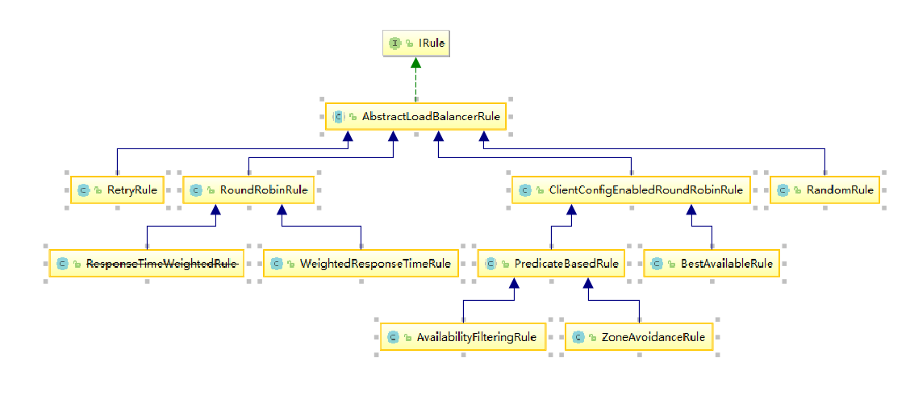

# Rule

通过前两篇文章的分析我们知道，LoadBalancer的chooseServer(key)函数是委托给IRule接口的choose(Object key)进行的，现在我们来考察一下IRule接口的源码：

    /**
     * Interface that defines a "Rule" for a LoadBalancer. A Rule can be thought of
     * as a Strategy for loadbalacing. Well known loadbalancing strategies include
     * Round Robin, Response Time based etc.
     * 
     * @author stonse
     * 
     */
    public interface IRule{
        /*
         * choose one alive server from lb.allServers or
         * lb.upServers according to key
         * 
         * @return choosen Server object. NULL is returned if none
         *  server is available 
         */

        public Server choose(Object key);

        public void setLoadBalancer(ILoadBalancer lb);

        public ILoadBalancer getLoadBalancer();    
    }

从注释我们看出该类为LoadBalancer定义了规则，一个规则就是负载均衡的一个策略。众所周知的负载均衡策略包括Round Robin，响应时间等。

该接口定义了三个方法：
1. choose(Object key):通过传入的key选择合适的存活的server。
2. setLoadBalancer(ILoadBalancer lb)
3. getLoadBalancer()

下面我们考察下，IRule接口的具体实现类，类图如下：

## AbstractLoadBalancerRule

查看源码：

    /**
     * Class that provides a default implementation for setting     and getting load balancer
     * @author stonse
     *
     */
    public abstract class AbstractLoadBalancerRule implements   IRule, IClientConfigAware {

        private ILoadBalancer lb;

        @Override
        public void setLoadBalancer(ILoadBalancer lb){
            this.lb = lb;
        }

        @Override
        public ILoadBalancer getLoadBalancer(){
            return lb;
        }      
    }
    
可以看到，该类只是简单提供了setLoadBalancer(ILoadBalancer lb)和getLoadBalancer()方法的简单实现。

## RandomRule

查看该类源码我们发现，该类并没有新的实现setLoadBalancer(ILoadBalancer lb)和getLoadBalancer()方法，对于choose(Object key)方法，其实现如下：

    public Server choose(Object key) {
		return choose(getLoadBalancer(), key);
	}

这明显讲选择委托给了choose(ILoadBalancer ib,Object key)方法，那么我们考察该方法源码：

    public Server choose(ILoadBalancer lb, Object key) {
        if (lb == null) {
            return null;
        }
        Server server = null;

        while (server == null) {
            if (Thread.interrupted()) {
                return null;
            }
            List<Server> upList = lb.getReachableServers();
            List<Server> allList = lb.getAllServers();

            int serverCount = allList.size();
            if (serverCount == 0) {
                /*
                 * No servers. End regardless of pass, because subsequent passes
                 * only get more restrictive.
                 */
                return null;
            }

            int index = rand.nextInt(serverCount);
            server = upList.get(index);

            if (server == null) {
                /*
                 * The only time this should happen is if the server list were
                 * somehow trimmed. This is a transient condition. Retry after
                 * yielding.
                 */
                Thread.yield();
                continue;
            }

            if (server.isAlive()) {
                return (server);
            }

            // Shouldn't actually happen.. but must be transient or a bug.
            server = null;
            Thread.yield();
        }

        return server;

    }

考察源码我们发现，该方法的是实现逻辑如下：

1. 如果传入的ILoadBalancer是空，则返回null。
2. 设置一个Server类型的对象，将其设置为空，然后循环判断这个Server类型的对象。
3. 首先获取所有可达的服务列表。然后获取所有的服务列表。
4. 判断所有的服务的长度是否为0，如果是，则返回空，否则根据serverCount产生一个随机数，然后从可达服务列表中去获取该随机数代表的server，如果能获取到，并且该server是alive的，则返回该server。否则，继续循环。

## RoundRobinRule

查看源码：

    public Server choose(ILoadBalancer lb, Object key) {
        if (lb == null) {
            log.warn("no load balancer");
            return null;
        }

        Server server = null;
        int count = 0;
        while (server == null && count++ < 10) {
            List<Server> reachableServers = lb.getReachableServers();
            List<Server> allServers = lb.getAllServers();
            int upCount = reachableServers.size();
            int serverCount = allServers.size();

            if ((upCount == 0) || (serverCount == 0)) {
                log.warn("No up servers available from load balancer: " + lb);
                return null;
            }

            int nextServerIndex = incrementAndGetModulo(serverCount);
            server = allServers.get(nextServerIndex);

            if (server == null) {
                /* Transient. */
                Thread.yield();
                continue;
            }

            if (server.isAlive() && (server.isReadyToServe())) {
                return (server);
            }

            // Next.
            server = null;
        }

        if (count >= 10) {
            log.warn("No available alive servers after 10 tries from load balancer: "
                    + lb);
        }
        return server;
    }

考察源码逻辑如下：

1. 如果传入的ILoadBalancer为空，则返回空。
2. 初始化一个Server类型的对象server，并初始化一个int值用于记录轮询次数count。
3. 如果server为空并且count < 10，那么进入循环，执行以下逻辑：
- 根据负载均衡器获取到可达的Server列表reachableServers。
- 根据负载均衡器获取到所有的Server列表allServers。
- 然后获取reachableServers的数量upCount。
- 获取allServers的数量serverCount。
- 通过incrementAndGetModulo(serverCount)获取下一个Server的ID。获取ID的方法就是获取到当前的ID值，然后加1取余，比较当前和现在的区别，如果不同，则返回。
- 通过返回的ID获取Server。
- 如果Server是活着的或者Server是可以提供服务的就返回它。
- 如果count大于10，跳出循环，打印日志。

## RetryRule

该策略实现了一个具备重试机制的实例选择功能。查看源码：

    public Server choose(Object key) {
		return choose(getLoadBalancer(), key);
	}

我们发现该类的choose(Object key)方法也委托给了choose(ILoadBalancer ib，Object key)方法，查看该方法：

    /*
	 * Loop if necessary. Note that the time CAN be exceeded depending on the
	 * subRule, because we're not spawning additional threads and returning
	 * early.
	 */
	public Server choose(ILoadBalancer lb, Object key) {
		long requestTime = System.currentTimeMillis();
		long deadline = requestTime + maxRetryMillis;

		Server answer = null;

		answer = subRule.choose(key);

		if (((answer == null) || (!answer.isAlive()))
				&& (System.currentTimeMillis() < deadline)) {

			InterruptTask task = new InterruptTask(deadline
					- System.currentTimeMillis());

			while (!Thread.interrupted()) {
				answer = subRule.choose(key);

				if (((answer == null) || (!answer.isAlive()))
						&& (System.currentTimeMillis() < deadline)) {
					/* pause and retry hoping it's transient */
					Thread.yield();
				} else {
					break;
				}
			}

			task.cancel();
		}

		if ((answer == null) || (!answer.isAlive())) {
			return null;
		} else {
			return answer;
		}
	}

分析源码逻辑我们看到：
1.  首先获取当前系统时间为requestTime，并根据requestTime加上maxRetryMillis来设置deadline。
2. 设置空的Server类型的变量answer为空。
3. 使用规则中默认的subRule（默认为RoundRobinRule）来进行选择。
4. 如果选择结果为空或者answer不是alive的，并且还没有超时，那么久执行一个超时打断任务，如果该任务没有打断，就不断执行选择服务器的代码，直到找到合适的为止，如果到时间了还没有找到就返回空。

## WeightedResponseTimeRule

WeightedResponseTimeRule继承了RoundRobinRule类，所以只需要重写choose(ILoadBalancer ib,Object key)方法。源码如下：

    public Server choose(ILoadBalancer lb, Object key) {
        if (lb == null) {
            return null;
        }
        Server server = null;

        while (server == null) {
            // get hold of the current reference in case it is changed from the other thread
            List<Double> currentWeights = accumulatedWeights;
            if (Thread.interrupted()) {
                return null;
            }
            List<Server> allList = lb.getAllServers();

            int serverCount = allList.size();

            if (serverCount == 0) {
                return null;
            }

            int serverIndex = 0;

            // last one in the list is the sum of all weights
            double maxTotalWeight = currentWeights.size() == 0 ? 0 : currentWeights.get(currentWeights.size() - 1); 
            // No server has been hit yet and total weight is not initialized
            // fallback to use round robin
            if (maxTotalWeight < 0.001d) {
                server =  super.choose(getLoadBalancer(), key);
                if(server == null) {
                    return server;
                }
            } else {
                // generate a random weight between 0 (inclusive) to maxTotalWeight (exclusive)
                double randomWeight = random.nextDouble() * maxTotalWeight;
                // pick the server index based on the randomIndex
                int n = 0;
                for (Double d : currentWeights) {
                    if (d >= randomWeight) {
                        serverIndex = n;
                        break;
                    } else {
                        n++;
                    }
                }

                server = allList.get(serverIndex);
            }

            if (server == null) {
                /* Transient. */
                Thread.yield();
                continue;
            }

            if (server.isAlive()) {
                return (server);
            }

            // Next.
            server = null;
        }
        return server;
    }

由于该算法是根据权重来进行负载均衡的，因此需要先对权重进行计算。统计函数如下：

    class DynamicServerWeightTask extends TimerTask {
        public void run() {
            ServerWeight serverWeight = new ServerWeight();
            try {
                serverWeight.maintainWeights();
            } catch (Throwable t) {
                logger.error(
                        "Throwable caught while running DynamicServerWeightTask for "
                                + name, t);
            }
        }
    }

我们可以看到这创建了一个定时任务,在该DynamicServerWeightTask中我们创建一个ServerWeight类型的对象，调用该对象进行更新操作。我们查看ServerWeight的源码：

    class ServerWeight {

        public void maintainWeights() {
            ILoadBalancer lb = getLoadBalancer();
            if (lb == null) {
                return;
            }
            if (serverWeightAssignmentInProgress.get()) {
                return; // Ping in progress - nothing to do
            } else {
                serverWeightAssignmentInProgress.set(true);
            }
            try {
                logger.info("Weight adjusting job started");
                AbstractLoadBalancer nlb = (AbstractLoadBalancer) lb;
                LoadBalancerStats stats = nlb.getLoadBalancerStats();
                if (stats == null) {
                    // no statistics, nothing to do
                    return;
                }
                double totalResponseTime = 0;
                // find maximal 95% response time
                for (Server server : nlb.getAllServers()) {
                    // this will automatically load the stats if not in cache
                    ServerStats ss = stats.getSingleServerStat(server);
                    totalResponseTime += ss.getResponseTimeAvg();
                }
                // weight for each server is (sum of responseTime of all servers - responseTime)
                // so that the longer the response time, the less the weight and the less likely to be chosen
                Double weightSoFar = 0.0;
                
                // create new list and hot swap the reference
                List<Double> finalWeights = new ArrayList<Double>();
                for (Server server : nlb.getAllServers()) {
                    ServerStats ss = stats.getSingleServerStat(server);
                    double weight = totalResponseTime - ss.getResponseTimeAvg();
                    weightSoFar += weight;
                    finalWeights.add(weightSoFar);   
                }
                setWeights(finalWeights);
            } catch (Throwable t) {
                logger.error("Exception while dynamically calculating server weights", t);
            } finally {
                serverWeightAssignmentInProgress.set(false);
            }

        }
    }

考察里面的maintainWeights()方法源码逻辑：

1. 获取LoadBalancer对象lb。
2. 如果lb对象为空，则返回空，否则获取对应的LoadBalancerStats。
3. 创建totalResponseTime对象用于记录计算所有实例平均响应时间总和。
4. 使用for循环遍历所有lb能获取到的Server，然后计算这些Server的平均响应时间总和。
5. 利用for循环计算权重，并将其记录到List<Double>类型的对象finalWeights中。
- totalResponseTime - 该对象的平均响应时间 = weight。
- weightSoFar = weightSoFar + weight。
- 添加进入finalWeights中。
6. 调用setWeights()方法进行更新。

那么这种更新多久进行一次呢？查看下面代码:

    void initialize(ILoadBalancer lb) {        
        if (serverWeightTimer != null) {
            serverWeightTimer.cancel();
        }
        serverWeightTimer = new Timer("NFLoadBalancer-serverWeightTimer-"
                + name, true);
        serverWeightTimer.schedule(new DynamicServerWeightTask(), 0,
                serverWeightTaskTimerInterval);
        // do a initial run
        ServerWeight sw = new ServerWeight();
        sw.maintainWeights();

        Runtime.getRuntime().addShutdownHook(new Thread(new Runnable() {
            public void run() {
                logger
                        .info("Stopping NFLoadBalancer-serverWeightTimer-"
                                + name);
                serverWeightTimer.cancel();
            }
        }));
    }

initialize(ILoadBalancer lb)方法在初始化时就开启了这个更新任务：

    serverWeightTimer = new Timer("NFLoadBalancer-serverWeightTimer-"
                + name, true);
    serverWeightTimer.schedule(new DynamicServerWeightTask(), 0,
                serverWeightTaskTimerInterval);

这里的serverWeightTaskTimerInterval值为（30 * 1000）ms。在Rule进行初始化的时候就开启这个更新权重的任务，并且每30秒更新一次。

截止到这里，我们已经获取到了完整的权重数据，那么如何根据权重数据进行负载均衡呢？

参照choose(ILoadBalancer lb,Object obj)方法的源码：

public Server choose(ILoadBalancer lb, Object key) {
        if (lb == null) {
            return null;
        }
        Server server = null;

        while (server == null) {
            // get hold of the current reference in case it is changed from the other thread
            List<Double> currentWeights = accumulatedWeights;
            if (Thread.interrupted()) {
                return null;
            }
            List<Server> allList = lb.getAllServers();

            int serverCount = allList.size();

            if (serverCount == 0) {
                return null;
            }

            int serverIndex = 0;

            // last one in the list is the sum of all weights
            double maxTotalWeight = currentWeights.size() == 0 ? 0 : currentWeights.get(currentWeights.size() - 1); 
            // No server has been hit yet and total weight is not initialized
            // fallback to use round robin
            if (maxTotalWeight < 0.001d) {
                server =  super.choose(getLoadBalancer(), key);
                if(server == null) {
                    return server;
                }
            } else {
                // generate a random weight between 0 (inclusive) to maxTotalWeight (exclusive)
                double randomWeight = random.nextDouble() * maxTotalWeight;
                // pick the server index based on the randomIndex
                int n = 0;
                for (Double d : currentWeights) {
                    if (d >= randomWeight) {
                        serverIndex = n;
                        break;
                    } else {
                        n++;
                    }
                }

                server = allList.get(serverIndex);
            }

            if (server == null) {
                /* Transient. */
                Thread.yield();
                continue;
            }

            if (server.isAlive()) {
                return (server);
            }

            // Next.
            server = null;
        }
        return server;
    }

源码逻辑如下：
1. 如果ILoadBalancer类型的对象lb是空，那么就返回空。
2. 创建一个Server类型的对象server，该对象初始化为空。
3. 如果server为空，就进入循环。
- 获取当前的Server权重表currentWeights；
- 获取所有的Server，存为对象allList，并将allList的大小存为serverCount变量。
- 如果serverCount为0，则返回空。
- 创建serverIndex，并初始化为0，目的是帮助选择Server。
- 创建maxTotalWeight，用来存储最大的权重值。
- 如果maxTotalWeight < 0.001d（判断是否等于0）,那就调用父类的chooseServer(key)方法，并返回。
- 如果maxTotalWeight >= 0.001d，就创建一个变量用于randomWeight，该变量使用Random.nextDouble()*maxTotalWeight填充，选择一个合适的权重值，然后根据这个权重值去选择合适的Server填充到server里，如果该server为空或者不是alive的话，就继续循环，直到找到为止。

## ClientConfigEnabledRoundRobinRule

ClientConfigEnabledRoundRobinRule该类只是为了其子类提供了一个基础的实现算法，常常不直接使用，意思就是，如果子类的choose(Object key)方法中的实现有一些情况无法处理，我们仍可以使用super.choose(Object key)，来提供一种可用的解决方案。

考察ClientConfigEnabledRoundRobinRule类源码：

    public class ClientConfigEnabledRoundRobinRule extends  AbstractLoadBalancerRule {

        RoundRobinRule roundRobinRule = new RoundRobinRule();

        @Override
        public void initWithNiwsConfig(IClientConfig clientConfig)  {
            roundRobinRule = new RoundRobinRule();
        }

        @Override
        public void setLoadBalancer(ILoadBalancer lb) {
        	super.setLoadBalancer(lb);
        	roundRobinRule.setLoadBalancer(lb);
        }

        @Override
        public Server choose(Object key) {
            if (roundRobinRule != null) {
                return roundRobinRule.choose(key);
            } else {
                throw new IllegalArgumentException(
                        "This class has not been initialized with   the RoundRobinRule class");
            }
        }

    }
考察源码我们发现，ClientConfigEnabledRoundRobinRule在该类内部初始化了一个RoundRobinRule类型的对象，而choose(Object key)就是使用的该方法。    

## BestAvailableRule

考察源码：

    public class BestAvailableRule extends  ClientConfigEnabledRoundRobinRule {

        private LoadBalancerStats loadBalancerStats;

        @Override
        public Server choose(Object key) {
            if (loadBalancerStats == null) {
                return super.choose(key);
            }
            List<Server> serverList = getLoadBalancer() .getAllServers();
            int minimalConcurrentConnections = Integer.MAX_VALUE;
            long currentTime = System.currentTimeMillis();
            Server chosen = null;
            for (Server server: serverList) {
                ServerStats serverStats =   loadBalancerStats.getSingleServerStat(server);
                if (!serverStats.isCircuitBreakerTripped    (currentTime)) {
                    int concurrentConnections =     serverStats.getActiveRequestsCount(currentTime) ;
                    if (concurrentConnections <     minimalConcurrentConnections) {
                        minimalConcurrentConnections =  concurrentConnections;
                        chosen = server;
                    }
                }
            }
            if (chosen == null) {
                return super.choose(key);
            } else {
                return chosen;
            }
        }

        @Override
        public void setLoadBalancer(ILoadBalancer lb) {
            super.setLoadBalancer(lb);
            if (lb instanceof AbstractLoadBalancer) {
                loadBalancerStats = ((AbstractLoadBalancer) lb) .getLoadBalancerStats();            
            }
        }

    }

根据源码我们知道该类继承了ClientConfigEnabledRoundRobinRule，我们之前提到ClientConfigEnabledRobinRule常常不独立使用，这里我们来具体解释下该类的作用。BestAvailableRule方法维护了一个LoadBalancerStats类型的对象。我们已经知道这个对象提供了负载均衡器的基本信息和统计信息，我们通过这个对象实现choose(Object key)方法，逻辑如下：

1. 如果LoadBalalcerStats类的对象loadBalancerStats是空的，那么调用父类方法，即ClientConfigEnabledRoundRobinRule类的choose(Object key)方法。
2. 否则，先根据LoadBalancer获取Server列表对象serverList，然后创建对象minimalConcurrentConnections用来存储最小连接数，并将其初值设置为Integer的最大值，将当前时间保存到currentTime对象中，设置chosenServer对象，用来保存被选定的Server。
3. 遍历整个serverList，如果里面的server没有被断路器断开，就获取server现在的连接数，如果比minimalConcurrentConnections小，就将该值设置为minimalConcurrentConnections，并且更新chosenServer为该server。
4. 遍历过后，如果chosenServer仍为空，则调用父类choose(Object key)方法。否则返回chosenServer。

根据逻辑我们可以看到该负载均衡规则负责选出请求数最小的，如果未提供LoadBalancerStats或者上述方法无法选出Server那么就使用RoundRobinRule。

## PredicateBasedRule

该类同样继承于ClientConfigEnabledRoundRobinRule，源码如下：

/**
 * A rule which delegates the server filtering logic to an instance of {@link AbstractServerPredicate}.
 * After filtering, a server is returned from filtered list in a round robin fashion.
 * 
 * 
 * @author awang
 *
 */
public abstract class PredicateBasedRule extends ClientConfigEnabledRoundRobinRule {
   
    /**
     * Method that provides an instance of {@link AbstractServerPredicate} to be used by this class.
     * 
     */
    public abstract AbstractServerPredicate getPredicate();
        
    /**
     * Get a server by calling {@link AbstractServerPredicate#chooseRandomlyAfterFiltering(java.util.List, Object)}.
     * The performance for this method is O(n) where n is number of servers to be filtered.
     */
    @Override
    public Server choose(Object key) {
        ILoadBalancer lb = getLoadBalancer();
        Optional<Server> server = getPredicate().chooseRoundRobinAfterFiltering(lb.getAllServers(), key);
        if (server.isPresent()) {
            return server.get();
        } else {
            return null;
        }       
    }
}

根据注释我们知道，PredicateBasedRule类是将服务器筛选逻辑委派给AbstractServerPredicate实例，过滤后，以循环方式从筛选列表返回服务器。考察PredicateBasedRule的choose(Object key)方法，分析逻辑：

1. 首先获取ILoadBalancer类型的对象lb。
2. 通过getPredicate()获取到的Predicate来对lb.getAllServers()获取到的Server列表通过key进行筛选，筛选结果存在Optional<Server>类型的对象server里。
3. 如果server里包装的Server类型对象不为空，返回server包装的对象，否则返回空。

可以看到，这里具体的筛选逻辑交给了AbstractServerPredicate类型的chooseRoundRobinAfterFiltering(List<Server> servers,Object key)方法，该方法源码如下:

    public Optional<Server> chooseRoundRobinAfterFiltering(List<Server> servers, Object loadBalancerKey) {
        List<Server> eligible = getEligibleServers(servers,loadBalancerKey);
        if (eligible.size() == 0) {
            return Optional.absent();
        }
        return Optional.of(eligible.get(nextIndex.getAndIncrement() % eligible.size()));
    }

考察源码逻辑我们发现，该函数先使用getEligibleServers(List<Server> servers,Object loadBalancerKey)进行筛选servers，然后由eligible对象接收结果，如果筛选后的结果一个都没有了就返回Optional.absent()，否则就根据线性轮询方式从备选清单中获取一个实例。

我们继续考察getEligibleServers(List<Server> servers)方法：

    /**
     * Get servers filtered by this predicate from list of servers. 
     */
    public List<Server> getEligibleServers(List<Server> servers, Object loadBalancerKey) {
        if (loadBalancerKey == null) {
            return ImmutableList.copyOf(Iterables.filter(servers, this.getServerOnlyPredicate()));            
        } else {
            List<Server> results = Lists.newArrayList();
            for (Server server: servers) {
                if (this.apply(new PredicateKey(loadBalancerKey, server))) {
                    results.add(server);
                }
            }
            return results;            
        }
    }

我们看到如果loadBalancerKey是空，那么就直接返回ImmutableList.copyOf(Iterables.filter(servers, this.getServerOnlyPredicate())，否则，对于servers中的每个server都进行遍历，调用Predicate的apply方法如果返回空，则为结果集添加server，遍历完成后返回result。

## AvailabilityFilteringRule

该类继承了PredicateBasedRule类，choose(Object key)方法源码如下：

    public Server choose(Object key) {
        int count = 0;
        Server server = roundRobinRule.choose(key);
        while (count++ <= 10) {
            if (predicate.apply(new PredicateKey(server))) {
                return server;
            }
            server = roundRobinRule.choose(key);
        }
        return super.choose(key);
    }

分析该方法的逻辑，我们看到：不断循环10次，首先使用roundRobinRule的choose(key)方法去选择Server类型对象。然后使用predicate对象去进行判断，如果符合条件就返回server。

而这个predicate对象是AvailabilityPredicate类型的对象，我们考察这个类的源码：

    public boolean apply(@Nullable PredicateKey input) {
        LoadBalancerStats stats = getLBStats();
        if (stats == null) {
            return true;
        }
        return !shouldSkipServer(stats.getSingleServerStat(input.getServer()));
    }
该类型的apply(@Nullable PredicateKey input)方法具有如下逻辑：

1. 获取LoadBalancerStats保存在stats对象中。
2. 如果stats对象为空返回true。
3. 否则返回!shouldSkipServer(stats.getSingleServerStat(input.getServer()))；

考察shouldSkipServer(ServerStats stats)方法的源码：

    private boolean shouldSkipServer(ServerStats stats) {        
        if ((CIRCUIT_BREAKER_FILTERING.get() && stats.isCircuitBreakerTripped()) 
                || stats.getActiveRequestsCount() >= activeConnectionsLimit.get()) {
            return true;
        }
        return false;
    }

上述代码主要判断两个内容：
1. 是否故障，即断路器生效已经开启
2. 实例的并发请求数大于阈值，默认为2^32-1，该配置可以通过       
        
        <clientName>.<nameSpace>.ActiveConnetionsLimit

参数来修改。

## ZoneAvoidanceRule

该类继承自PredicateBasedRule类，查看源码：

    private CompositePredicate compositePredicate;

我们发现它使用了CompositeOredicate类型的对象compositePredicate。考察初始化方法：

     public ZoneAvoidanceRule() {
        super();
        ZoneAvoidancePredicate zonePredicate = new ZoneAvoidancePredicate(this);
        AvailabilityPredicate availabilityPredicate = new AvailabilityPredicate(this);
        compositePredicate = createCompositePredicate(zonePredicate, availabilityPredicate);
    }

我们发现这个compositePredicate是由ZoneAvoidancePredicate和AvailabilityPredicate两个类对象组成。考察其getEligibleServers(List<Server> servers, Object loadBalancerKey)方法。

    public List<Server> getEligibleServers(List<Server> servers,  Object loadBalancerKey) {
            List<Server> result = super.getEligibleServers(servers,  loadBalancerKey);
            Iterator<AbstractServerPredicate> i =   fallbacks.iterator();
            while (!(result.size() >= minimalFilteredServers &&     result.size() > (int) (servers.size() *     minimalFilteredPercentage))
                    && i.hasNext()) {
                AbstractServerPredicate predicate = i.next();
                result = predicate.getEligibleServers(servers,  loadBalancerKey);
            }
            return result;
        }

实现逻辑：

1. 使用主过滤条件对所有实例过滤并返回过滤结果。
2. 依次使用次过滤条件再次进行过滤
3. 每次过滤后判断如下两个条件,只要有一个不符合就不再进行过滤，将当前结果返回供线性轮询方法选择：
- 过滤后的实例总数 >= 最小过滤实例数(minimalFilteredServers，默认为1)。
- 过滤后的实例比例 > 最小过滤百分比(minimalFilteredPercentage，默认为0)

至此，IRule接口的所有实现分析完毕。