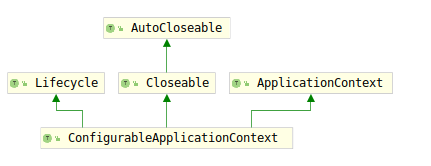

# ConfigurableApplicationContext

并不是所有的应用程序context都实现了SPI接口。`ApplicationContext`接口提供了Context的客户端接口，`ConfigurableApplicationContext`提供了配置接口以及生命周期接口。

该接口同样应该避免由ApplicationContext客户端直接调用，这些方法应该仅在启动和关闭代码时进行调用。

首先考虑该接口的类继承结构图：

可以看到`ConfigurableApplicationContext`继承了`ApplicationContext`、`Lifecycle`和`Closeable`接口。

分别提供了如下作用：

1. ApplicationContext:提供了`ApplicationContext`的客户端接口
2. Lifecycle：提供了生命周期接口
3. Closeable：提供了自动关闭资源的接口。

这里我们首先考察`Lifecycle`接口，该接口定义了生命周期控制方法使用的通用的start/stop方法。典型的用例是控制异步处理。不过需要注意的是该接口并不意味着会自动启动，如果希望实现此功能建议使用`SmartLifecycle`接口。

Spring context与bean都可以实现该接口。容器会将开始/停止信号传播到每个容器中应用的所有组件，例如在运行时停止/重新启动的情况。需要注意的是，该接口只对顶级单例Bean有效。对于其他的bean，该接口方法都会被忽视。该接口仅仅提供了三个方法：

1. void start();
2. void stop();
3. boolean isRunning();

想必光看名字也知道什么用途了。

下面考虑`ConfigurableApplicationContext`接口要求实现的方法：

1. void setId(String id):设置Application context的唯一id;
2. void setParent(@Nullable ApplicationContext parent):设置父级上下文
3. void setEnvironment(ConfigurableEnvironment environment)：设置环境参数
4. ConfigurableEnvironment getEnvironment()：获取环境参数
5. void addBeanFactoryPostProcessor(BeanFactoryPostProcessor postProcessor)：添加BeanFactoryPostProcessor（BeanFactory用）
6. void addApplicationListener(ApplicationListener<?> listener)：向context注册事件监听器
7. void addProtocolResolver(ProtocolResolver resolver)：注册协议解析器（ResourceLoader用）
8. void refresh() throws BeansException, IllegalStateException：加载或者刷新配置。因为这是一种启动方法，所以如果失败，它应该销毁已创建的单例，以避免资源悬空。 换句话说，在调用该方法之后，应实例化所有单例或根本不实例化。
9. void registerShutdownHook()：向JVM运行时注册一个shutdown挂钩，除非JVM当时已经关闭，否则在JVM关闭时关闭该上下文。可以多次调用此方法。每个上下文实例仅注册一个关闭挂钩（最大数量）。
10. void close()：关闭context，释放context持有的所有资源和锁。包括摧毁所有缓存的bean。
11. boolean isActive()：指定该context是否是活跃的。是否已经被至少刷新一次但没有被关闭。
12. ConfigurableListableBeanFactory getBeanFactory() throws IllegalStateException：返回context的内部beanFactory。可用于访问基础工厂的特定功能。请不要使用该方法去后处理beanFactory，在这之前实例已经被实例化了，如果需要请使用BeanFactoryPostProcessor。一般来说，这个内部的factory会被context访问。
