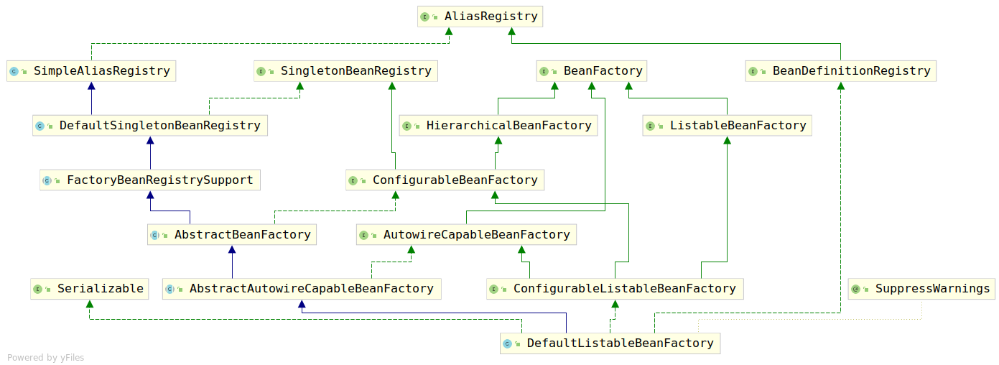

# GenericApplicationContext

该类是一个通用的ApplicationContext实现，该类使用的BeanFactory是一个内部的`{@link org.springframework.beans.factory.support.DefaultListableBeanFactory}`类型的实例。由于该实现相对较为通用，因此该类没有指定bean定义的格式。为了保证各种格式都能被使用，该类实现了`{@link org.springframework.beans.factory.support.BeanDefinitionRegistry}`接口去管理bean定义，各种表示方式的bean定义只需要转化成`BeanDefinition`类型的对象，并注册到`BeanDefinitionRegistry`中即可。当所有的bean定义都注册到了ApplicationContext后，调用`refresh()`方法即可初始化所有的Bean。

有一部分的ApplicationContext实现会在每次刷新时创建一个新的BeanFactory实例，与这类实现不同的是，GenericApplicationContext在刚刚创建时就已经有了一个BeanFactory可用，可以将bean定义注册到其中。因此`refresh()`方法可能仅仅被调用一次。

由于在`AbstractApplicationContext`中对于两类方法的实现并不是很具体：

1. BeanFactory接口相关的方法：通过上一篇的分析已经知道这类方法均是调用getBeanFactory()获取BeanFactory，然而并没有给出默认的beanFactory。
2. ResourceLoader接口指定的方法：该接口的方法在`AbstractApplicationContext`中并没有得到实现。

因此这些功能在该类中都被补充。

该类同样做了代理工作：

1. 将所有的BeanFactory相关的操作代理给`this.beanFactory`属性
2. 将所有的ResourceLoader相关的操作代理给`this.resourceLoader`属性
3. 将所有的BeanDefinitionRegistry相关的操作代理给`this.beanFactory`属性

除了做了这些代理操作以外，GenericApplicationContext封装了一系列的registerBean的方法，不过这些方法也只有子类使用了。毕竟业务代码不可能使用，而且继承了该类证明refresh()方法一般只调用一次，所以也只有子类在初始化时使用了。实际注册Bean定义时肯定使用的还是`BeanDefinitionRegistry`接口暴露的方法。

其实这里说桥接应该更符合应用场景，桥接相对于代理来说，更加注重于被代理的对象到底可不可以更换，在我个人认为桥接模式=代理模式+策略模式。

由于`GenericApplicationContext`做了桥接工作，那么下面我们要明确真正处理逻辑的对象是谁，是哪些类型的。

这里首先考察`this.beanFactory`属性：

```java
private final DefaultListableBeanFactory beanFactory;
```

可以看到该属性没有默认值，仅仅被允许赋值一次，考虑该参数初始化。该参数只允许在如下两个地方进行初始化：

1. 默认构造器：

    ```java
    public GenericApplicationContext() {
        this.beanFactory = new DefaultListableBeanFactory();
    }
    ```

2. 参数为DefaultListableBeanFactory的构造器：

    ```java
    public GenericApplicationContext(DefaultListableBeanFactory beanFactory) {
        Assert.notNull(beanFactory, "BeanFactory must not be null");
        this.beanFactory = beanFactory;
    }
    ```

可以看到无论使用那种方法赋值，使用的beanFactory都将会是DefaultListableBeanFactory。考察该类的类继承结构图如下：



由于该类的类继承结构太过复杂，在之后单独进行分析。

而对于`this.resourceLoader`属性，则使用`setResourceLoader(ResourceLoader resourceLoader)`进行初始化：

```java
public void setResourceLoader(ResourceLoader resourceLoader) {
    this.resourceLoader = resourceLoader;
}
```

考察其相关接口，逻辑均是从`this.resourceLoader`获取资源，如果该属性为空或者不满足接口需求，则调用父类的相应方法获取资源。考察代码：

```java
public Resource getResource(String location) {
    if (this.resourceLoader != null) {
        return this.resourceLoader.getResource(location);
    }
    return super.getResource(location);
}

public Resource[] getResources(String locationPattern) throws IOException {
    if (this.resourceLoader instanceof ResourcePatternResolver) {
        return ((ResourcePatternResolver) this.resourceLoader).getResources(locationPattern);
    }
    return super.getResources(locationPattern);
}
```
