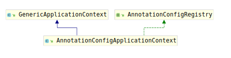

# AnnotationConfigApplicationContext

该类继承于GenericApplicationContext，由于在其父类`GenericApplicationContext`中只提供了bean定义的注册方法，但并没有注册逻辑，AnnottationConfigApplicationContext提供了针对于注解配置的bean定义注册逻辑。

该类提供了基于包扫描进行注册和基于@Configuration修饰的类进行bean定义注册。在包扫描注册时会将@Component修饰的类注册为bean，同事支持JSR-330的注解。

首先考察该类的类继承结构图：



`AnnotationConfigRegistry`接口声明了基于注解注册的所有功能所需的方法：

1. 包扫描功能：void scan(String... basePackages);
2. 基于@Configuration修饰的类进行注册功能：void register(Class<?>... componentClasses);

这两个功能分别依靠`ClassPathBeanDefinitionScanner`和`AnnotatedBeanDefinitionReader`进行完成。可以查看两个方法的具体实现：

```java
public void register(Class<?>... componentClasses) {
    Assert.notEmpty(componentClasses, "At least one component class must be specified");
    this.reader.register(componentClasses);
}
```

```java
public void scan(String... basePackages) {
    Assert.notEmpty(basePackages, "At least one base package must be specified");
    this.scanner.scan(basePackages);
}
```

this.reader、this.scanner在构造器中进行初始化：

```java
public AnnotationConfigApplicationContext() {
    this.reader = new AnnotatedBeanDefinitionReader(this);
    this.scanner = new ClassPathBeanDefinitionScanner(this);
}
```

但是可能你有自己自定义的Environment、Bean名称生成器、元数据解析器，可以自己设置：

```java
public void setEnvironment(ConfigurableEnvironment environment) {
    super.setEnvironment(environment);
    this.reader.setEnvironment(environment);
    this.scanner.setEnvironment(environment);
}

public void setBeanNameGenerator(BeanNameGenerator beanNameGenerator) {
    this.reader.setBeanNameGenerator(beanNameGenerator);
    this.scanner.setBeanNameGenerator(beanNameGenerator);
    getBeanFactory().registerSingleton(
            AnnotationConfigUtils.CONFIGURATION_BEAN_NAME_GENERATOR, beanNameGenerator);
}

public void setScopeMetadataResolver(ScopeMetadataResolver scopeMetadataResolver) {
    this.reader.setScopeMetadataResolver(scopeMetadataResolver);
    this.scanner.setScopeMetadataResolver(scopeMetadataResolver);
}
```

至于真正的包扫描逻辑以及根据配置类注册bean的逻辑，将在后面进行讲解。
