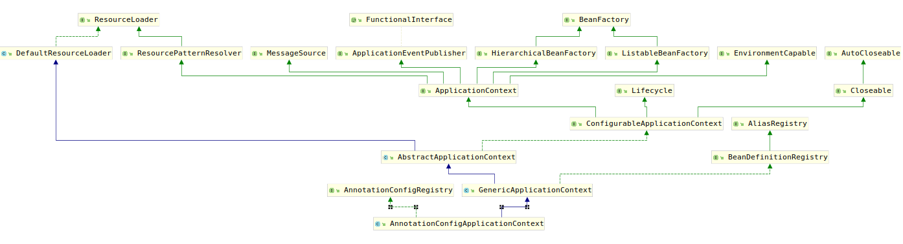

# AnnotationConfigApplicationContext

示例代码的入口是Main类的Main函数，考察该函数：

```java
public static void main(String[] args) {
    ApplicationContext context = new AnnotationConfigApplicationContext(TestConfiguration.class);
    Car car = (Car) context.getBean("car");
    String[] names = context.getBeanDefinitionNames();
    System.out.println(context.getDisplayName());
    System.out.println(car);
    System.out.println(context.containsBean("car"));
    for(String str:names) {
        System.out.println(str);
    }
}
```

可以看到首先通过`AnnotationConfigApplicationContext`使用`TestConfiguration`创建了一个`ApplicationContext`对象，该对象包含了所有`TestConfiguration`中注册的bean，那到底是如何完成这些事情的呢？首先查看`AnnotationConfigApplicationContext`的类继承结构图：



这张图可能需要放大才能看的清楚，然而，这就是`AnnotationConfigApplicationContext`的类继承结构，面对如此令人绝望的结构图，我们将其拆分进行分析。首先分析其RecourceLoader部分吧，毕竟所有的xml、class文件等都是它加载的。
