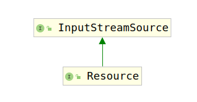

# Resource

Resource是一个接口，用于表示资源描述符，它是从基础资源的实际类型中抽象出来的，例如文件或类路径资源。

对于每个Resource来说，如果它在物理设备上存在，而不是一个URL或者文件句柄，并且以InputStream表示，那么该InputStream能被打开。具体的功能还需要根据具体实现来看。

考察该类的类继承结构图：



首先考虑`Resource`的父接口`InputStreamSource`，该接口是用于获取InputStream的源的简单接口。

该接口是Spring扩展的各类`Resource`接口的根接口。

对于一次性流，InputStreamResource可以用于任何给定的InputStream。Spring的ByteArrayResource或任何基于文件的Resource实现都可以用作具体实例，从而允许其多次读取基础内容流。例如，这使该接口可用作邮件附件的抽象内容源。

该接口只有一个要求实现的方法：

```java
/**
 * Return an {@link InputStream} for the content of an underlying resource.
 * 该方法返回给定资源内容的InputStream。
 * <p>It is expected that each call creates a <i>fresh</i> stream.
 * 每次调用都应该创建一个新的文件流。
 * <p>This requirement is particularly important when you consider an API such
 * as JavaMail, which needs to be able to read the stream multiple times when
 * creating mail attachments.
 * 该需求是非常重要的，因为当你考虑到类似于JavaMail调用该API创建mail附件时，可能需要多次读取这个流
 * For such a use case, it is <i>required</i>
 * that each {@code getInputStream()} call returns a fresh stream.
 * @return the input stream for the underlying resource (must not be {@code null})
 * @throws java.io.FileNotFoundException if the underlying resource doesn't exist
 * @throws IOException if the content stream could not be opened
 */
InputStream getInputStream() throws IOException;
```

接下来考察`Resource`接口要求实现的方法：

1. exists()方法：

    ```java
    /**
    * Determine whether this resource actually exists in physical form.
    * 决定该资源是否在物理设备上真实存在
    * <p>This method performs a definitive existence check, whereas the
    * existence of a {@code Resource} handle only guarantees a valid
    * descriptor handle.
    * 此方法执行确定的存在性检查，而Resource句柄的存在仅保证有效的描述符句柄
    */
    boolean exists();
    ```

2. isReadable()方法：

    ```java
    /**
     * Indicate whether non-empty contents of this resource can be read via
     * {@link #getInputStream()}.
     * 指定是否该非空资源能通过getInputStream()读取。
     * <p>Will be {@code true} for typical resource descriptors that exist
     * since it strictly implies {@link #exists()} semantics as of 5.1.
     * 对于存在的典型资源描述符将是正确的，因为从5.1开始它严格隐含了exist()语义。
     * Note that actual content reading may still fail when attempted.
     * 注意当尝试读取实际内容时可能会失败。
     * However, a value of {@code false} is a definitive indication
     * that the resource content cannot be read.
     * 然而当定义的资源内容不能被读取时则返回false/
     * @see #getInputStream()
     * @see #exists()
     */
    default boolean isReadable() {
        return exists();
    }
    ```

3. isOpen()方法：

    ```java
    /**
    * Indicate whether this resource represents a handle with an open stream.
    * 指示该资源是否表示一个正在打开的stream。
    * If {@code true}, the InputStream cannot be read multiple times,
    * and must be read and closed to avoid resource leaks.
    * 如果是true，这个InputStream不能被读取多次，一定要被读取并且关闭防止资源泄露。
    * <p>Will be {@code false} for typical resource descriptors.
    * 对于典型的资源描述符将为false。
    */
    default boolean isOpen() {
        return false;
    }
    ```

4. isFile()方法

    ```java
    /**
    * Determine whether this resource represents a file in a file system.
    * 表示这些资源是否是文件系统中存在的文件
    * A value of {@code true} strongly suggests (but does not guarantee)
    * that a {@link #getFile()} call will succeed.
    * 如果返回的是true则表示getFile()调用极有可能成功。
    * <p>This is conservatively {@code false} by default.
    * 默认情况下返回false;
    * @since 5.0
    * @see #getFile()
    */
    default boolean isFile() {
        return false;
    }
    ```

5. getURL()方法：

    ```java
    /**
    * Return a URL handle for this resource.
    * 返回资源的URL句柄
    * @throws IOException if the resource cannot be resolved as URL,
    * i.e. if the resource is not available as descriptor
    */
    URL getURL() throws IOException;
    ```

6. getURI()方法：

    ```java
    /**
    * Return a URI handle for this resource.
    * 返回资源的URL句柄
    * @throws IOException if the resource cannot be resolved as URI,
    * i.e. if the resource is not available as descriptor
    * @since 2.5
    */
    URI getURI() throws IOException;
    ```

7. getFile()方法：

    ```java
    /**
    * Return a File handle for this resource.
    * 返回资源的文件句柄
    * @throws java.io.FileNotFoundException if the resource cannot be resolved as
    * absolute file path, i.e. if the resource is not available in a file system
    * @throws IOException in case of general resolution/reading failures
    * @see #getInputStream()
    */
    File getFile() throws IOException;
    ```

8. readableChannel()方法：

    ```java
    /**
    * Return a {@link ReadableByteChannel}.
    * 返回一个可以读取的Channel
    * <p>It is expected that each call creates a <i>fresh</i> channel.
    * 每次调用时都希望创建一个新的Channel
    * <p>The default implementation returns {@link Channels#newChannel(InputStream)}
    * with the result of {@link #getInputStream()}.
    * 默认情况下通过Channels.newChannel(getInputStream());实现
    * @return the byte channel for the underlying resource (must not be {@code null})
    * @throws java.io.FileNotFoundException if the underlying resource doesn't exist
    * @throws IOException if the content channel could not be opened
    * @since 5.0
    * @see #getInputStream()
    */
    default ReadableByteChannel readableChannel() throws IOException {
        return Channels.newChannel(getInputStream());
    }
    ```

9. contentLength()方法：

    ```java
    /**
    * Determine the content length for this resource.
    * 返回资源内容的长度
    * @throws IOException if the resource cannot be resolved
    * (in the file system or as some other known physical resource type)
    */
    long contentLength() throws IOException;
    ```

10. lastModified()方法：

    ```java
    /**
    * Determine the last-modified timestamp for this resource.
    * 返回资源最后一次更改的时间戳
    * @throws IOException if the resource cannot be resolved
    * (in the file system or as some other known physical resource type)
    */
    long lastModified() throws IOException;
    ```

11. createRelative(String relativePath)方法：

    ```java
    /**
    * Create a resource relative to this resource.
    * 创建相对于该资源的资源。
    * @param relativePath the relative path (relative to this resource)
    * @return the resource handle for the relative resource
    * @throws IOException if the relative resource cannot be determined
    */
    Resource createRelative(String relativePath) throws IOException;
    ```

12. getFilename()方法：

    ```java
    /**
    * Determine a filename for this resource, i.e. typically the last
    * part of the path: for example, "myfile.txt".
    * <p>Returns {@code null} if this type of resource does not
    * have a filename.
    */
    @Nullable
    String getFilename();
    ```

13. getDescription()方法：

    ```java
    /**
    * Return a description for this resource,
    * to be used for error output when working with the resource.
    * <p>Implementations are also encouraged to return this value
    * from their {@code toString} method.
    * @see Object#toString()
    */
    String getDescription();
    ```

该接口提供了资源的基本信息，资源的内容由`InputStreamSource`接口提供。
